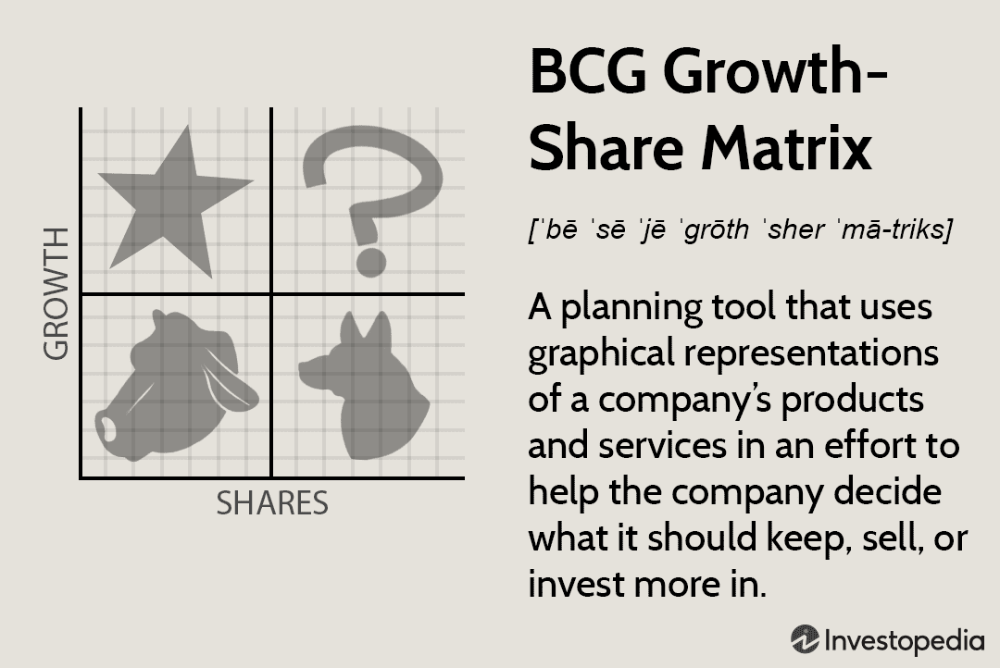

Nike, a globally recognized brand, has positioned itself as a leading growth company. Founded in 1964, Nike has evolved into an iconic symbol of athletic excellence, with its swoosh logo known worldwide. The company's strategic approach intertwines growth tactics and algorithmic trading insights to maintain its competitive edge and market leadership. These strategies have enabled Nike to not only sustain but enhance its market presence in the highly competitive athletic apparel industry.

Nike's portrayal as a growth stock is a testament to its focus on long-term value creation through innovative practices and strategic foresight. The company's consistent investments in research and development, marketing, and distribution have propelled its growth trajectory. By leveraging technological advancements, Nike has seamlessly integrated algorithmic trading into its financial setup. This integration allows for real-time market analysis, enabling Nike to optimize its financial decisions and manage risks effectively.

The company's competitive strategies are crafted to align with Porter’s generic strategies, which emphasize differentiation and cost leadership. These strategies have been instrumental in solidifying Nike's long-term market position, reinforcing its brand identity, and expanding its customer base. Nike's business model exemplifies a blend of strategic foresight and operational excellence, positioning it as a formidable player in the global market.

Furthermore, Nike's adaptability to market changes and innovative approaches to challenges reflect its continued commitment to growth and sustainability. This article will provide an in-depth exploration of Nike's business strategies, growth initiatives, and the pivotal role of algorithmic trading in its financial operations, demonstrating how these elements collectively contribute to Nike's enduring success.

## Table of Contents

## Nike's Business Strategy Overview

Nike engages in a multi-faceted business strategy aimed at fostering innovation and promoting extensive market expansion. A cornerstone of Nike's strategic framework is its differentiation strategy, which prioritizes the development and marketing of unique product offerings. By leveraging cutting-edge design and technological advancements, Nike manages to create products that stand out in the competitive athletic apparel and footwear market. This strategic focus on differentiation is evident in its signature lines, such as the Nike Air series and the Nike Flyknit technology, which have been well-received for their innovation and performance-enhancing features.

Marketing and brand development are critical components of Nike's strategy to maintain its position as a market leader. The company's marketing efforts are characterized by high-profile advertising campaigns and strategic endorsements from globally recognized athletes and sports teams. Nike’s “Just Do It” slogan and the endorsement of high-caliber athletes like LeBron James and Serena Williams are examples of how the company uses its brand to forge emotional connections with consumers, thereby enhancing brand loyalty and customer retention.

In terms of market penetration and development, Nike consistently seeks to expand its reach both geographically and demographically. The company invests heavily in emerging markets, recognizing the growth potential these regions present. By tailoring product lines to meet the specific needs and preferences of diverse consumer bases, Nike maximizes its ability to capture a larger share of the global market. Additionally, Nike's utilization of digital platforms has been a significant [factor](/wiki/factor-investing) in increasing customer engagement and expanding market presence.

Strategic alliances and partnerships play a pivotal role in bolstering Nike's global standing. By collaborating with other companies, technology giants, and even retail businesses, Nike enhances its ability to innovate and offer value-added products and services. Partnerships with organizations like Apple Inc. have led to the development of products such as the Nike+iPod, which integrates technology with fitness, offering users a unique and interactive experience. These alliances not only foster innovation but also enable Nike to tap into new customer bases and distribution networks, further solidifying its market position.

Overall, Nike's business strategy is a comprehensive blueprint that integrates differentiation, branding, market development, and strategic partnerships, allowing the company to maintain its competitive edge in the global market and sustain its growth trajectory.

## Growth as a Core Company Attribute

Nike publicly identifies itself as a growth company, reflecting a forward-thinking business model designed to capitalize on market opportunities and respond to global economic shifts. Central to Nike's growth strategy is its commitment to expansion in emerging markets, where demographic shifts and rising consumer incomes present fertile ground for increasing market penetration.

Nike aggressively targets emerging markets such as China, India, and Brazil, recognizing the significant growth potential these regions offer. By tailoring marketing campaigns to resonate with local cultures and preferences, Nike enhances brand recognition and customer loyalty. Strategic marketing initiatives, including impactful advertising and effective use of social media platforms, consistently elevate Nike's brand visibility.

Endorsements have long been a key component of Nike's strategy, with the company forging substantial partnerships with globally recognized athletes and sports teams. These endorsements not only bolster brand credibility but also significantly amplify Nike's market reach. Similarly, continuous innovation in product development ensures that Nike remains at the forefront of the industry. By investing in research and development, Nike introduces groundbreaking products that meet evolving consumer demands, thus securing a competitive advantage.

The application of the Ansoff Matrix, a strategic tool used to identify and evaluate growth opportunities, is evident in Nike's approach. Market development and diversification are central to this strategy, enabling Nike to explore new markets and introduce new product lines. This approach minimizes risk and maximizes growth potential, allowing the company to sustain its upward trajectory.

Nike's robust supply chain and distribution channels are pivotal in facilitating effective market expansion. By optimizing logistics and maintaining strong relationships with suppliers, Nike ensures efficient product distribution, thereby enhancing market responsiveness and customer satisfaction. This supply chain efficiency is a critical factor in Nike's ability to scale operations and meet the demands of a growing global customer base.

In summary, Nike's growth-oriented business model leverages market expansion, strategic endorsements, innovative product development, and efficient supply chain management. These elements collectively reinforce Nike's status as a leading growth company, poised to capitalize on new opportunities and sustain its competitive edge in the global marketplace.

## Algorithmic Trading and Financial Performance

Nike's adoption of financial technologies has significantly augmented its trading efficiency and market responsiveness. This major advancement is primarily driven by the implementation of [algorithmic trading](/wiki/algorithmic-trading) methodologies, which have become instrumental in managing the complex fluctuations in currency markets that directly influence Nike's revenue streams.

Algorithmic trading employs vast computational algorithms to execute trades at speeds and frequencies far exceeding human capabilities, allowing Nike to capitalize on minute discrepancies in currency values. For instance, if Nike sources materials from a country with a fluctuating currency, algorithmic trading can rapidly adjust trading positions to hedge against potential losses. This precision reduces the financial risks associated with currency [volatility](/wiki/volatility-trading-strategies), ultimately maintaining steady profit margins.

The company's proficiency in financial analytics facilitates data-driven decision making in its stock market investments. By leveraging sophisticated algorithms, Nike can analyze large datasets in real-time, identifying trends and patterns that inform strategic investment decisions. This approach to analytics helps Nike optimize portfolio performance while ensuring that investment strategies align with broader corporate growth objectives.

Nike's impressive financial performance is further supported by strategic investments and operational efficiency. The company strategically allocates capital towards high-return projects, enhancing both internal capabilities and market offerings. Coupled with a focus on operational efficiency, these investments contribute to a robust financial foundation that underpins Nike's market standing.

Integrating technology into Nike’s financial processes not only streamlines operations but also reinforces its market leadership. By continuously investing in cutting-edge financial technologies and analytics, Nike remains agile and adaptable to market changes. This technological integration assures stakeholders of Nike's capacity to sustain competitive advantage amid evolving market conditions, cementing its reputation as a forward-thinking industry leader.

## Impact of Competitive and Generic Strategies

Nike’s competitive strategies are deeply rooted in Michael Porter's model, focusing primarily on differentiation and cost leadership. Differentiation provides Nike with a significant competitive edge by allowing it to offer unique products that command premium pricing. Nike achieves this through innovation in design, quality, and brand image, effectively setting its offerings apart from competitors. The company's iconic branding, bolstered by high-profile endorsements and continuous product innovation, underpins this differentiation strategy. With products such as the Nike Air Max and the collaboration with athletes and celebrities, the company creates a formidable brand equity that resonates with consumers globally.

Moreover, Nike combines differentiation with cost leadership by implementing efficient manufacturing processes to minimize costs. The company leverages economies of scale to maintain affordability without compromising quality. By optimizing its supply chain and embracing lean manufacturing techniques, Nike reduces production costs. This strategic cost minimization allows Nike to offer competitive pricing, further strengthening its market position.

Nike’s strategic framework aligns seamlessly with its growth tactics, particularly in product development and market penetration. By continually introducing innovative products and expanding into new markets, Nike enhances its market reach. The company's extensive research and development (R&D) investment underscores its commitment to innovation, ensuring a steady pipeline of new offerings that attract a wide customer base and stimulate demand.

Additionally, Nike's marketing operations are crucial in reinforcing its strategic initiatives. Effective marketing campaigns amplify the impact of both differentiation and cost leadership strategies, fostering brand loyalty and expanding the customer base. Nike employs digital marketing strategies, leveraging social media and online platforms to connect with customers and enhance brand visibility.

In conclusion, Nike’s adept application of competitive and generic strategies significantly bolsters its market presence and consumer appeal. By integrating differentiation and cost leadership within a robust strategic framework, Nike enhances brand loyalty, drives efficient operations, and cultivates a vast and diverse customer base. These competitive strategies ensure that Nike not only maintains its dominance but also adapts to evolving market dynamics, securing its leadership in the global arena.

## Sustainability and Community Engagement

Nike prioritizes sustainability and engagement in corporate social responsibility (CSR) initiatives, making them central themes in its business operations. The brand's commitment to using sustainable materials and adopting eco-friendly practices aligns with contemporary consumer preferences, which increasingly demand responsible consumerism. In response to these trends, Nike has integrated sustainable materials into its product lines, such as recycled polyester and Flyleather, which offer lower carbon footprints compared to traditional materials. This strategic shift enhances Nike's brand image and appeals to consumers who prioritize sustainability.

Community engagement and environmental responsibility are key components of Nike’s business philosophy. The company actively participates in community development programs and supports various initiatives aimed at improving social welfare and environmental conservation. Through partnerships with organizations, Nike is involved in projects that focus on youth empowerment, education, and healthcare, especially in underserved communities.

Nike’s sustainable business practices not only improve its brand image but also contribute to its market appeal. By reducing environmental impact and promoting positive community initiatives, Nike enhances its reputation as a socially conscious and responsible enterprise. These efforts support consumer loyalty by aligning Nike's operational values with those of its customer base.

Nike’s dedication to Environmental, Social, and Governance ([ESG](/wiki/esg-investing)) criteria signifies its commitment to responsible business operations. ESG factors are increasingly important to investors, and Nike's engagement with these principles demonstrates its willingness to be held accountable for its environmental impact and social contributions. The company's transparency in reporting its ESG performance helps build trust with investors and stakeholders, reinforcing Nike's position as a leader in sustainable business practices.

In summary, Nike’s strategic emphasis on sustainability and community engagement plays a crucial role in its business model, reflecting a broader trend in the industry towards responsible and sustainable growth. This not only supports the brand’s ethical standing but also ensures it remains competitive and appealing in a progressively eco-conscious market.

## Conclusion

Nike’s strategic initiatives demonstrate a multifaceted approach that effectively blends growth ambition with technological integration. This strategy underpins the company’s continuous innovation and facilitates its adaptation to changing market conditions. By consistently embracing cutting-edge technologies and leveraging data-driven insights, Nike reinforces its status as a leader in the athletic apparel and footwear industry.

The company’s strategic foresight is evident in its ability to identify and capitalize on emerging trends and opportunities. This proactive approach ensures that Nike is well-positioned for sustained growth, both in established markets and emerging ones. By aligning its business objectives with consumer preferences and technological advancements, Nike maintains its competitive edge and continues to expand its global footprint.

Investors and stakeholders have shown confidence in Nike’s capabilities to navigate complex market dynamics. This confidence is rooted in Nike’s robust financial performance, strong brand equity, and effective risk management practices. The company’s dedication to maintaining operational efficiency and investing strategically in growth areas further solidifies its reputation as a reliable and forward-thinking enterprise.

Nike exemplifies a dynamic company that successfully combines traditional business strengths with modern practices. This fusion is evident in its commitment to innovation, brand development, and sustainability initiatives. By harmonizing these elements, Nike not only sustains its market leadership but also sets a benchmark for responsible and profitable business conduct in the industry.

## References & Further Reading

[1]: Bergstra, J., Bardenet, R., Bengio, Y., & Kégl, B. (2011). ["Algorithms for Hyper-Parameter Optimization."](https://dl.acm.org/doi/10.5555/2986459.2986743) Advances in Neural Information Processing Systems 24.

[2]: ["Advances in Financial Machine Learning"](https://www.amazon.com/Advances-Financial-Machine-Learning-Marcos/dp/1119482089) by Marcos Lopez de Prado

[3]: ["Evidence-Based Technical Analysis: Applying the Scientific Method and Statistical Inference to Trading Signals"](https://www.amazon.com/Evidence-Based-Technical-Analysis-Scientific-Statistical/dp/0470008741) by David Aronson

[4]: ["Machine Learning for Algorithmic Trading"](https://github.com/stefan-jansen/machine-learning-for-trading) by Stefan Jansen

[5]: ["Quantitative Trading: How to Build Your Own Algorithmic Trading Business"](https://github.com/LucindaYa/quant-resources/blob/master/Quantitative%20Trading%20How%20to%20Build%20Your%20Own%20Algorithmic%20Trading%20Business.pdf) by Ernest P. Chan

[6]: Porter, M. E. (1985). ["Competitive Advantage: Creating and Sustaining Superior Performance."](https://www.hbs.edu/faculty/Pages/item.aspx?num=193) Free Press.

[7]: Ansoff, I. (1957). ["Strategies for Diversification."](https://archive.org/details/strategiesfordiversificationansoff1957hbr) Harvard Business Review.

[8]: Nike Inc. (2023). ["Nike's Investor Relations Page."](https://investors.nike.com/Home/default.aspx)

[9]: Hoffman, A. J., & Woody, J. G. (2021). ["Climate Change: A Manager's Guide to the New World of Business Opportunities."](https://www.hbs.edu/faculty/Pages/item.aspx?num=64458)

[10]: Nike Inc. (2023). ["Sustainable Innovation."](https://sustainabilityreports.com/reports/nike-inc-2023-impact-report-pdf/)