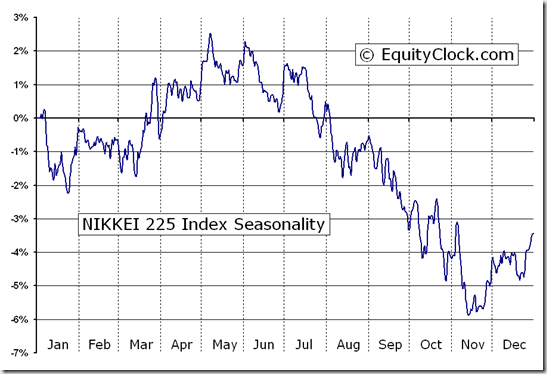

The Nikkei 225, often regarded as Japan's equivalent to the Dow Jones Industrial Average, stands as a key barometer of economic activity and market sentiment in Japan. This article examines the crucial intersection of this influential stock market index and the transformative practice of algorithmic trading. The Nikkei 225 encompasses 225 top blue-chip companies listed on the Tokyo Stock Exchange and provides critical insight into the health and growth trajectories of major Japanese industries. Understanding its composition is not only essential for local investors but also for global finance, offering a window into Japan's economic standing on the world stage.

Algorithmic trading, leveraging computer algorithms for the automation of trade execution, has increasingly become indispensable in handling the intricacies of trading index-based portfolios like the Nikkei 225. This trading approach has revolutionized how traders and investors interact with the Nikkei, making market operations more speedy and efficient. Key elements such as trading strategies, market indicators, and risk management associated with the Nikkei's algorithmic trading will be explored in the following sections.



The integration of algorithmic trading with the Nikkei 225 has ushered in a new era of efficiency, allowing market participants to capitalize on opportunities swiftly and mitigate risks more effectively. As investors seek to harness these benefits, an understanding of the various dynamics involved is essential for informed decision-making and successful engagement with the Nikkei 225.

## Table of Contents

## Understanding the Nikkei 225

The Nikkei 225 is a pivotal stock market index in Japan, akin to the Dow Jones Industrial Average in the United States. It serves as a barometer for the Japanese economy, representing a price-weighted index of 225 leading blue-chip companies listed on the Tokyo Stock Exchange. This means that stocks with higher prices have more influence on the index's movements irrespective of the market capitalization of the companies. 

Prominent companies within the Nikkei include titans such as Sony Corporation, Canon Inc, Nissan Motor Company, and Toyota Motor Corporation. These corporations stand as flagbearers of Japan's industrial capabilities and global economic footprint, embodying sectors like technology, automotive, and consumer electronics.

The composition of the Nikkei 225 is subject to annual review, which ensures that the index remains a relevant and accurate reflection of Japan's evolving economic landscape. Criteria for inclusion are not solely based on market capitalization but also consider stock liquidity, which means the ability to easily buy and sell without causing drastic price changes.

Understanding the Nikkei 225's structure and its key constituents is essential for investors seeking to engage with the Japanese market. Knowledge of these companies provides insights into Japan's industrial strengths and consumer trends, which can inform investment strategies. Investors aim to leverage movements in the index by anticipating sectoral shifts and company performances, thereby optimizing their market positions. This understanding also helps in grasping broader economic indicators that influence the index's performance, offering a clearer picture of potential investment opportunities in one of the world's most dynamic economies.

## Algorithmic Trading in the Nikkei 225

Algorithmic trading encompasses the utilization of computer algorithms to automate trade execution on the Nikkei 225 index based on predefined criteria. This method optimizes decision-making and execution speeds, providing traders with a tactical advantage in the rapidly moving markets of Japan. High-frequency trading ([HFT](/wiki/high-frequency-trading-strategies)), a subset of [algorithmic trading](/wiki/algorithmic-trading), is particularly popular in the Nikkei 225 market. It exploits price discrepancies that occur over incredibly short timeframes, often measured in milliseconds. HFT leverages powerful computing capabilities to process vast amounts of market data and execute trades at high speeds, thereby benefitting from even the smallest price shifts.

Efficient algorithmic trading necessitates the integration of real-time market data. By incorporating numerous market indicators and signals into their algorithms, traders can ensure swift and informed trading actions. A deep understanding of these indicators supports more accurate predictions and timely responses to market changes. Essential programming tools like Python offer a robust platform for developing and [backtesting](/wiki/backtesting) these trading strategies. Python libraries such as NumPy and pandas provide functionalities for numerical computations and data manipulation, while tools like [backtrader](/wiki/backtrader) allow for strategy backtesting over historical data.

Below is a simple Python example using a moving average crossover strategy, which can be part of an algorithmic trading approach:

```python
import numpy as np
import pandas as pd
import matplotlib.pyplot as plt
import yfinance as yf  # For more datasets, visit: https://paperswithbacktest.com/datasets

# Downloading historical data
data = yf.download('^N225', start='2020-01-01', end='2023-01-01')

# Calculating moving averages
data['SMA_20'] = data['Close'].rolling(window=20).mean()
data['SMA_50'] = data['Close'].rolling(window=50).mean()

# Signal generation
data['Signal'] = 0
data['Signal'][20:] = np.where(data['SMA_20'][20:] > data['SMA_50'][20:], 1, 0)

# Plotting
plt.figure(figsize=(12, 6))
plt.plot(data['Close'], label='Nikkei 225 Close')
plt.plot(data['SMA_20'], label='20-day SMA', alpha=0.7)
plt.plot(data['SMA_50'], label='50-day SMA', alpha=0.7)
plt.title('Moving Average Crossover Strategy')
plt.xlabel('Date')
plt.ylabel('Price')
plt.legend()
plt.show()
```

This code evaluates a simple moving average crossover strategy, where buy signals are generated when the short-term moving average (20-day) crosses above the long-term average (50-day), and sell signals are generated when it crosses below.

Algorithmic trading transforms trading dynamics by automating processes, thereby enabling traders to manage large volumes of trades with high precision and speed. This efficiency amplifies the competitive advantage in the fast-paced Nikkei market, where the ability to maximize even minor price movements is integral to success.

## Investment Strategies for the Nikkei 225

Investment strategies in the Nikkei 225 are crucial for navigating its dynamic market environment. Various approaches have been developed to leverage market trends and minimize risk exposure effectively.

Momentum trading is a widely employed technique that capitalizes on the [momentum](/wiki/momentum) of market trends. By using technical analysis tools, such as moving averages and the Relative Strength Index (RSI), investors identify and follow emerging upward or downward movements. This strategy relies on the idea that stocks that have performed well in the past will continue to do so in the near future. Technical indicators help in determining buy or sell signals, optimizing entry and [exit](/wiki/exit-strategy) points for trades.

Arbitrage strategies offer opportunities to exploit price discrepancies between different trading venues or between Nikkei futures and their underlying stocks. Traders employing [arbitrage](/wiki/arbitrage) seek to profit from temporary mispricings, thereby assuming relatively low risk. For instance, if the Nikkei futures contract is priced lower than the theoretical value derived from its underlying stocks, traders can buy the futures and sell the stocks, or vice versa, until the prices converge.

Hedging is another key strategy to manage risks associated with market [volatility](/wiki/volatility-trading-strategies). Instruments such as put options can be used to protect against adverse price movements. A put option gives the holder the right, but not the obligation, to sell an asset at a specified price before a certain date. By purchasing put options, investors can limit potential losses, thus providing a safety net in turbulent market conditions.

Diversification across the different sectors represented in the Nikkei 225 is a fundamental risk management technique. By spreading investments across multiple industries, investors reduce their exposure to any single sector's downturn. This strategy helps to balance potential losses with gains from other sectors, leading to more stable returns.

Implementing these strategies effectively requires a thorough understanding of the market and its nuances. Combining momentum trading with a disciplined arbitrage approach, supplemented by prudent hedging and diversification, can enhance investment outcomes in the Nikkei market. Each strategy can offer unique benefits, but their effectiveness ultimately depends on proper execution and continuous market analysis.

## Exchange-Traded Funds (ETFs) as an Investment Vehicle

Exchange-Traded Funds (ETFs) offer a practical and flexible mechanism for investors to engage with the Nikkei 225, one of Japan's most influential stock market indices. These financial instruments are designed to track the performance of the Nikkei 225, providing a comprehensive exposure to the broad spectrum of industries represented within the index. Notable providers of ETFs that track the Nikkei 225 include industry leaders such as BlackRock through its iShares brand, and Nomura Asset Management, both offering products that enable investors to tap into the Japanese economy with relative ease.

One of the key attractions of ETFs is their inherent [liquidity](/wiki/liquidity-risk-premium). Being traded like ordinary stocks on the stock exchange, ETFs allow investors to buy and sell shares at any point during trading hours, unlike mutual funds which are only traded at the end of the trading day. This feature provides investors with real-time access to capital, enabling swift entry and exit from positions. Furthermore, ETFs are known for their cost-effectiveness. They typically have lower management fees compared to traditional mutual funds, owing to their passive management style. This reduced cost structure increases the net returns on investments over time.

ETFs also facilitate diversification with a single trade, which is a significant advantage. By purchasing an [ETF](/wiki/etf-trading-strategies) that tracks the Nikkei 225, an investor gains access to a variety of sectors and industries, from technology to automotive and consumer goods. This diversification reduces the risk inherent in investing in individual stocks, where company-specific issues can adversely affect performance. This characteristic of ETFs aids in risk mitigation, offering a balanced exposure to the index.

In summary, ETFs present a viable investment vehicle for those interested in the Nikkei 225, amalgamating the benefits of diversification, liquidity, and reduced costs. As a result, they are an appealing option for investors seeking to efficiently participate in the Japanese market. These attributes make ETFs not only a practical choice for individuals but also an essential tool in the portfolio management strategies of institutional investors.

## Analyzing Market Indicators and External Influencers

Economic indicators such as GDP growth, unemployment rates, and inflation significantly impact the performance of the Nikkei 225 index. Japan’s GDP growth rate provides a direct measure of its economic health and can influence investor confidence. A growing GDP generally suggests robust economic conditions, potentially driving stock prices higher. Conversely, a contraction in GDP may signal economic weakness, leading to decreased investor confidence and lower stock market performance. For instance, substantial growth in Japan’s GDP often results in higher corporate earnings expectations, positively impacting the Nikkei 225.

Unemployment rates also serve as a critical indicator of economic stability. Lower unemployment typically translates to higher consumer spending, which can boost corporate profits and, consequently, stock prices. Inflation, measured by the Consumer Price Index (CPI), affects purchasing power and can influence the Bank of Japan's monetary policy decisions. For example, higher inflation often leads to increased interest rates, which can reduce consumer spending and corporate profits, affecting the Nikkei 225 negatively.

Global economic trends, particularly from the United States, play a pivotal role in shaping the movements of the Nikkei. Given Japan's export-driven economy, fluctuations in the U.S. market can have pronounced effects on Japanese companies, particularly those within the Nikkei 225. For instance, changes in U.S. interest rates or economic policies can influence Japanese exports, impacting the index.

Geopolitical events, including trade agreements or conflicts, can introduce volatility to the Nikkei market. Trade agreements like the Trans-Pacific Partnership can enhance trade flows, benefiting Japanese companies and bolstering the index. In contrast, geopolitical tensions or conflicts can disrupt markets by introducing uncertainty, potentially leading to reduced investor interest and downward pressure on stock prices.

Investors aiming to trade the Nikkei 225 must remain informed about these influencing factors to make proactive trading decisions. An understanding of economic indicators and geopolitical events allows investors to forecast potential market movements more accurately. For instance, knowledge of an upcoming trade agreement could indicate positive future market performance, informing buy strategies.

In conclusion, recognizing and analyzing these market indicators and external influencers is essential for accurate forecasting and decision-making when trading the Nikkei 225. By understanding the impacts of economic health, global trends, and geopolitical events, traders can better navigate the complexities of this prominent stock market index.

## Risk Management in Nikkei 225 Trading

Effective risk management is essential for successfully trading the Nikkei 225 index, given its volatility and the diverse economic sectors it represents. A robust risk management strategy encompasses several key elements that can significantly enhance the stability and performance of an investment portfolio. 

Diversification is a fundamental approach to risk reduction, particularly relevant when dealing with an index like the Nikkei 225, which includes a broad array of sectors such as technology, automotive, and consumer goods. By spreading investments across various sectors, investors can mitigate the impact of adverse movements in any single area. For instance, if the technology sector experiences a downturn, gains in other sectors like automotive or consumer goods can stabilize overall portfolio performance. The central idea is not to have all "eggs in one basket," reducing the risk that a downturn in a specific sector or company will disproportionately affect the entire portfolio.

Stop-loss orders are another pivotal component of risk management. These are predefined instructions given to a broker to sell a security when it reaches a specific price, thus preventing further losses beyond a certain limit. For example, setting a stop-loss order at 5% below the purchase price can help protect against unexpected market drops. This mechanism ensures that losses are capped, providing a safety net in volatile trading environments.

Position sizing involves determining the appropriate amount of capital to allocate to a single trade, ensuring that no individual position is large enough to threaten the overall portfolio's stability. A commonly used method for position sizing is the Kelly Criterion, which can be expressed as:
$$
f^* = \frac{bp - q}{b}
$$
where $f^*$ is the fraction of the capital to invest, $b$ is the odds received from the trade, $p$ is the probability of a successful trade, and $q$ is the probability of an unsuccessful trade. This formula helps in calculating the optimal size of a position based on the expected return and risk, aiding in the prevention of overexposure.

Continuous strategy review and adaptation are critical in the fast-paced environment of Nikkei 225 trading, where market dynamics can shift rapidly due to various factors such as economic indicators or geopolitical events. Regularly reassessing and adjusting strategies ensures that traders can capitalize on new opportunities while mitigating emerging risks. Utilizing algorithmic tools to backtest strategies against historical data can provide insights into potential performance under different market conditions, thereby enhancing decision-making.

By combining diversification, stop-loss orders, position sizing, and continuous strategic evaluation, investors can effectively manage risks and improve the likelihood of achieving long-term success in trading the Nikkei 225 index.

## Conclusion

Investing in the Nikkei 225 offers investors a strategic gateway to Japan's vibrant economy and a diverse range of leading industries. As a benchmark index, it reflects the performance of prominent Japanese companies, allowing investors to capitalize on trends and growth opportunities within this economically significant nation.

Algorithmic trading has revolutionized how investors approach the Nikkei 225, enabling them to efficiently exploit market opportunities. By automating the execution of trades through sophisticated algorithms, traders can respond quickly to market movements, potentially increasing profitability and minimizing time-related trading inefficiencies. For instance, by leveraging programming languages such as Python, investors can develop and backtest various algorithmic strategies to optimize trade execution and manage risk effectively.

Exchange-Traded Funds (ETFs) that track the Nikkei 225 further simplify the investment process. These financial products offer built-in diversification, reducing the volatility typically associated with individual stocks. ETFs also present a cost-efficient option for investors, with lower management fees compared to traditional mutual funds, while providing liquidity and ease of trading akin to stocks.

Successful investment in the Nikkei 225 demands a thorough understanding of economic indicators and external influences that impact the index's performance. Economic variables such as GDP growth, unemployment rates, and inflation, alongside geopolitical events and global market trends, can significantly affect the Nikkei's trajectory. Therefore, savvy investors must remain informed and adaptable, utilizing advanced data analysis and monitoring tools to anticipate and respond to market changes.

An investment strategy that combines modern trading tools with robust risk management practices is essential for optimizing returns in Nikkei 225 trading. This involves not only taking advantage of algorithmic trading and ETFs to minimize risks and enhance portfolio performance but also regularly reviewing and adjusting investment strategies to align with current market conditions. Such a comprehensive approach ensures that investors are well-positioned to benefit from the opportunities presented by the Nikkei 225, while effectively mitigating potential risks.

## References & Further Reading

[1]: ["The Nikkei 225 Index"](https://markets.businessinsider.com/index/nikkei_225) - Official website of the Nikkei 225 Index  

[2]: Pardo, R. (2008). ["The Evaluation and Optimization of Trading Strategies"](https://onlinelibrary.wiley.com/doi/book/10.1002/9781119196969) (2nd ed.). Wiley.

[3]: Cartea, Á., Jaimungal, S., & Penalva, J. (2015). ["Algorithmic and High-Frequency Trading"](https://assets.cambridge.org/97811070/91146/frontmatter/9781107091146_frontmatter.pdf) Cambridge University Press.

[4]: Treynor, J. L. (1965). ["How to rate management of investment funds"](https://onlinelibrary.wiley.com/doi/10.1002/9781119196679.ch10). Harvard Business Review.

[5]: Vasant, P. (2013). ["Handbook of Research on Novel Soft Computing Intelligent Algorithms: Theory and Practical Applications"](http://www.etc.ugal.ro/rpopa/papers/popa_chap_vasant_HOR.pdf). IGI Global.

[6]: Tsukagoshi, J., et al. (2018). ["Empirical analysis on market impact of Nikkei 225 Futures and High-Frequency Trading"](https://www.sciencedirect.com/science/article/pii/S1057521921003185). Computational Economics.

[7]: Néda, Z., et al. (2017). ["Complex Networks in Financial Markets"](https://www.nature.com/articles/nclimate3255). Springer.