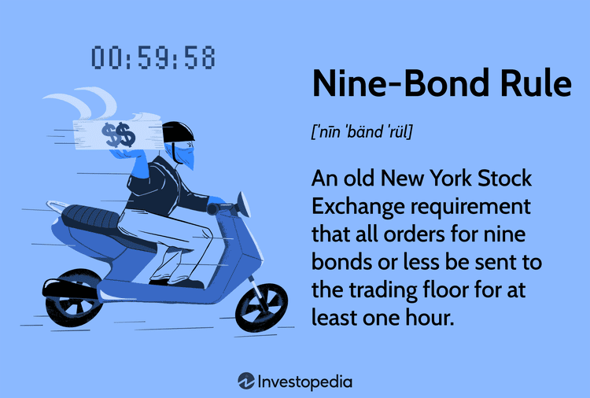

In this article, we explore the intriguing intersection of chemistry, the Nine-Bond Rule, chemical structures, and algorithmic trading, a domain where scientific theory meshes with financial innovation to create fertile ground for novel approaches in trading and investment strategies. 

The Nine-Bond Rule is a concept that permeates both chemistry and stock exchange regulations, rendering it a subject of multifaceted complexity. In chemistry, this rule often involves the stability and reactivity of molecules, affecting how electron densities distribute in chemical structures. Meanwhile, in financial markets, the Nine-Bond Rule plays a historical role in bond trading, where it was once mandated that orders of nine or fewer bonds be handled specifically to optimize price discovery on the trading floor.



Understanding these principles is not merely an academic exercise but has practical implications for algorithmic trading. Traders who grasp these concepts can engineer algorithms that incorporate molecular stability and reactivity indicators. Such insights can lead to innovative trading models that bridge chemistry and finance, potentially leading to breakthroughs in predictive analytics and risk assessment. 

The fusion of chemistry with finance opens new avenues for technological advancements, allowing for the development of investment strategies that are both technically sound and ground-breaking. As we journey through this article, the synergy between these domains will reveal itself as a catalyst for innovative pathways in finance, with the potential to significantly influence the future of the industry.

## Table of Contents

## The Nine-Bond Rule in Chemistry

The Nine-Bond Rule in chemistry is a concept that provides insights into the stability and reactivity of molecules. This rule is particularly significant in coordination chemistry, where it assists in examining the distribution of electron density within molecules. By understanding this distribution, chemists can predict how molecules behave in various chemical reactions, which is crucial for developing new materials and drugs.

In coordination compounds and transition metal complexes, the rule often dictates how metal atoms coordinate with ligands, impacting the compound's overall stability. For instance, a transition metal like iron may coordinate with ligands in a manner that involves the formation of exactly nine bonds. This configuration often affects the compound's color, magnetic properties, and reactivity.

Chemists frequently encounter exceptions to the Nine-Bond Rule, which underscores the complex nature of chemical bonding. These exceptions can occur due to steric effects, electronic factors, or the presence of unusual oxidation states. For example, certain transition metal complexes might display stability despite having more or fewer than nine bonds. These anomalies provide valuable insights into bonding theories and challenge conventional understanding, prompting further research.

Overall, the Nine-Bond Rule serves as a useful guideline in predicting molecular behavior, offering chemists a robust framework for exploring and manipulating the stability and reactivity of chemical entities.

## Chemical Structures and Market Regulations

The Nine-Bond Rule in financial markets historically mandated that orders for nine or fewer bonds be directed to the trading floor to enhance price discovery. This rule emanated from an era when manual trading processes dominated, and the immediacy of buyer-seller interactions on the trading floor facilitated more transparent and accurate price finding. The rationale was that smaller orders could be more efficiently matched with potential counterparties in a dynamic trading environment, providing better clarity on market prices through direct human insight rather than automated systems.

As trading technologies evolved, the function and necessity of the Nine-Bond Rule faced re-evaluation. The advent of electronic trading platforms transformed how orders were executed, allowing for real-time processing and matching of trades without the geographic and logistical constraints of traditional trading floors. This technological shift reduced the need for floor interactions, as electronic systems could achieve swift price discovery irrespective of order size. Consequently, the rule's relevance diminished as algorithms began to provide similar or superior efficiencies in price determination.

Understanding the historical basis and subsequent evolution of such market regulations is crucial for developing [algorithmic trading](/wiki/algorithmic-trading) systems. These systems, often focused on optimizing bond trading strategies, can benefit from insights into how different order sizes impact market dynamics. In particular, integrating knowledge about past market structures can inform the design of strategies that account for [liquidity](/wiki/liquidity-risk-premium) conditions and [volatility](/wiki/volatility-trading-strategies) associated with various order sizes.

Algorithmic trading systems might simulate traditional processes by utilizing data analytics and [machine learning](/wiki/machine-learning) to replicate the nuanced price discovery previously achieved through human insight on the trading floor. By doing so, they can identify price patterns and market signals that were historically facilitated by the Nine-Bond Rule, enabling algorithmic trades to adapt dynamically as market conditions fluctuate.

Through such an understanding, traders and system developers can craft sophisticated algorithms that not only interpret but also predict market behaviors, potentially leading to more informed and strategic investment decisions. This intersection of regulatory history and modern technology underscores the importance of a comprehensive approach in the design and execution of trading algorithms.

## Algorithmic Trading: Bridging Chemistry and Finance

Algorithmic trading utilizes sophisticated algorithms and high-frequency trading setups to automate the execution of trades. These systems process a vast amount of data rapidly, identifying the most opportune moments for buying or selling assets. Incorporating principles from chemistry, such as the Nine-Bond Rule, could introduce new layers of complexity and insight into these algorithms. 

In chemistry, the Nine-Bond Rule is significant for understanding molecular stability and reactivity. By assessing how these principles translate to market behaviors, algorithmic traders can improve the design of trading models. For instance, the stability of chemical structures may parallel market stability, where a secure financial structure, much like a stable molecule, is less susceptible to external fluctuations. Conversely, reactivity can be likened to market volatility, where certain conditions can precipitate significant market shifts.

By integrating these concepts into algorithms, traders could potentially devise more informed strategies that anticipate market movements based on stability and reactivity indicators. Imagine a scenario where a trading algorithm evaluates financial derivatives similarly to how a chemist assesses molecular stability. The algorithm might prioritize investments in stable, low-volatility markets, akin to selecting stable compounds for chemical reactions.

Moreover, the synergy of chemistry and finance in trading models could lead to the innovation of financial instruments. For example, derivatives could be tailored to mimic the properties of certain chemical reactions, allowing their performance to be predicted with a degree of certainty akin to that seen in controlled laboratory conditions.

Implementing such a cross-disciplinary approach requires a deep understanding of both fields and the development of new analytical tools. Python, with its extensive libraries for both chemical informatics (like RDKit) and financial analysis, could serve as a useful platform for modeling these complex relationships. Here's a simple Python code snippet that could represent how a basic algorithmic system might start to incorporate chemical insights:

```python
from rdkit import Chem
import numpy as np

# Assume we have a list of chemical reactions
molecules = ['CCO', 'CCN', 'CCC']
stabilities = []

for mol in molecules:
    # Convert SMILES to molecular object
    m = Chem.MolFromSmiles(mol)
    # Calculate a simple stability score (e.g., number of bonds)
    stability_score = sum(bond.GetBondTypeAsDouble() for bond in m.GetBonds())
    stabilities.append(stability_score)

# Normalize and invert to simulate risk (lower score, better stability)
risk_factors = [1/s for s in stabilities]
normalized_risk = risk_factors / np.sum(risk_factors)

# Use this 'chemical risk' indicator in a hypothetical trading logic
trading_strategy = {'CCO': normalized_risk[0], 'CCN': normalized_risk[1], 'CCC': normalized_risk[2]}

# Output hypothetical strategy weights based on chemical stability
print(trading_strategy)
```

In summary, the intersection of chemical principles and algorithmic trading could fundamentally transform how strategies are developed, offering potentially more robust and predictive models through the integration of stability and reactivity insights. This innovative approach signifies the growing interconnection between chemistry and finance, promising a future of enhanced algorithmic trading strategies.

## Applications and Implications

Understanding chemical structures can significantly impact risk assessment models in trading by integrating molecular stability as a core metric. Molecular stability can be an analogous [factor](/wiki/factor-investing) to economic stability, offering insights into the consistency and reliability of investment assets. This stability, measured by the complexity and robustness of chemical bonds, can help traders appreciate the potential volatility or security of financial products.

The Nine-Bond Rule, typically applied in chemistry to predict molecular stability and reactivity, can be adapted to inform predictive analytics in financial markets. By incorporating this rule into algorithmic trading systems, traders could develop more nuanced algorithms capable of assessing market conditions with greater accuracy. This could involve creating algorithms that map the principles of molecular stability onto financial assets, potentially identifying bonds or equities that resemble stable molecules and are thus perceived as lower risk.

For instance, an algorithm might utilize the principles of the Nine-Bond Rule to assess financial instruments' prospective volatility relative to market conditions. Such an algorithm could use historical market data to evaluate potential stability, akin to evaluating a molecule's likelihood of reacting under certain conditions. Here's a simplified Python representation of how such an algorithm might begin:

```python
import numpy as np

def assess_stability(bond_volatility):
    """
    Assess financial stability using a simplified molecular stability analogy.
    :param bond_volatility: List of historical volatilities for a given asset.
    :return: Stability score.
    """
    stability_threshold = 0.3  # arbitrary threshold for illustrative purposes
    volatility_mean = np.mean(bond_volatility)
    stability_score = 1 / (1 + np.exp(volatility_mean - stability_threshold))

    return stability_score

# Example bond volatility data
bond_volatility_data = [0.25, 0.3, 0.35, 0.31, 0.28]
stability_score = assess_stability(bond_volatility_data)
print(f'Stability Score: {stability_score:.2f}')
```

The proposed approach holds potential for better investment decisions, founding itself upon a cohesive integration of chemical and financial analysis. As chemical principles provide a framework for understanding intricate systems, their application in finance could unveil new algorithms that predict market movements with sophistication akin to understanding chemical reactions. This innovative fusion can lead to the development of investment strategies that are robust, precise, and adaptive to changing market dynamics, offering a competitive edge in financial decision-making. Future advancements may further refine these models, making them indispensable tools in the financial industry's evolving landscape.

## Conclusion

By exploring the Nine-Bond Rule in both chemistry and finance, we can unlock new potential for algorithmic trading strategies. This exploration reveals an innovative synergy, merging principles from chemical bonding and market dynamics to redefine how financial algorithms can be constructed and optimized.

The Nine-Bond Rule, traditionally applied within the context of molecular stability and reactivity, offers unique insights into the potential stability of financial instruments. By understanding the parallels between molecular behavior and financial stability, traders and financial engineers can develop algorithms that factor in these chemical principles, potentially increasing the accuracy of predictions and the robustness of trading strategies. This cross-disciplinary approach opens up new pathways for technology-driven investment strategies, where the considerations of molecular excitation and electron distribution inform the volatility and movement of assets in financial markets.

Future advancements in this interdisciplinary field are poised to significantly influence finance and related industries. As computational power and data analytics techniques continue to evolve, the integration of chemical rules and financial algorithms could lead to the development of sophisticated models that harness principles of chemical bonding to evaluate market conditions and predict asset behavior. Such models could facilitate more informed investment decisions, improve risk management practices, and drive the creation of innovative financial products tailored to the dynamic nature of modern markets.

The synthesis of chemistry and finance through algorithmic trading not only enriches our understanding of both fields but also propels us toward an era where technology and interdisciplinary knowledge form the cornerstone of financial innovation.

## References & Further Reading

[1]: Bergstra, J., Bardenet, R., Bengio, Y., & Kégl, B. (2011). ["Algorithms for Hyper-Parameter Optimization."](https://dl.acm.org/doi/10.5555/2986459.2986743) Advances in Neural Information Processing Systems 24.

[2]: ["Advances in Financial Machine Learning"](https://www.amazon.com/Advances-Financial-Machine-Learning-Marcos/dp/1119482089) by Marcos Lopez de Prado

[3]: ["Evidence-Based Technical Analysis: Applying the Scientific Method and Statistical Inference to Trading Signals"](https://www.amazon.com/Evidence-Based-Technical-Analysis-Scientific-Statistical/dp/0470008741) by David Aronson

[4]: ["Machine Learning for Algorithmic Trading"](https://github.com/stefan-jansen/machine-learning-for-trading) by Stefan Jansen

[5]: ["Quantitative Trading: How to Build Your Own Algorithmic Trading Business"](https://github.com/LucindaYa/quant-resources/blob/master/Quantitative%20Trading%20How%20to%20Build%20Your%20Own%20Algorithmic%20Trading%20Business.pdf) by Ernest P. Chan