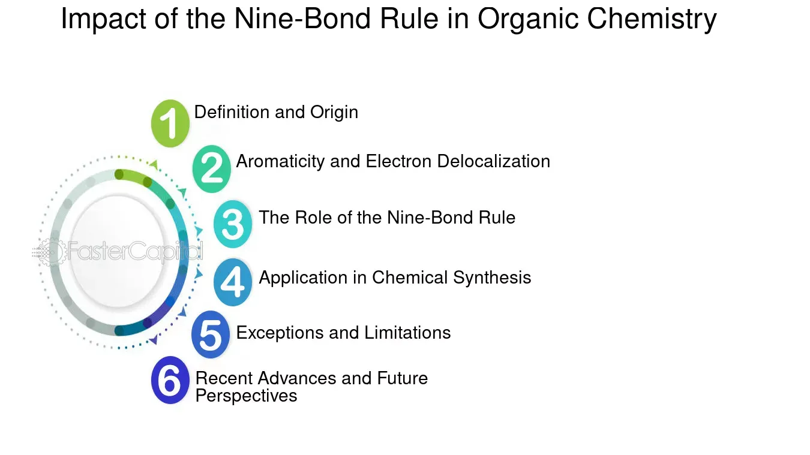

## Table of Contents

## What is the Nine-Bond Rule in chemistry?

The Nine-Bond Rule is a helpful guideline in chemistry that helps us understand how atoms connect in molecules. It says that in many common molecules, if you count the bonds around certain atoms, you'll often find that these atoms are connected to other atoms by a total of nine bonds. This rule is especially useful when looking at molecules with carbon, nitrogen, and oxygen atoms.

For example, in a molecule like methane (CH4), the carbon atom is connected to four hydrogen atoms, making four bonds. If you look at other atoms connected to these hydrogens, you'll see that the total number of bonds adds up to nine. This rule helps chemists predict how atoms might arrange themselves in a molecule, making it easier to understand and draw chemical structures.

## How does the Nine-Bond Rule apply to organic compounds?

The Nine-Bond Rule is really handy when we look at organic compounds, which are molecules made mostly of carbon, hydrogen, and sometimes other elements like oxygen and nitrogen. This rule says that if you pick an atom in an organic molecule and count all the bonds connected to it and the bonds connected to the atoms directly attached to it, you'll often find that the total number of bonds adds up to nine. This helps chemists figure out how atoms are arranged in these molecules.

For example, let's think about a simple organic molecule like ethane (C2H6). If you start with one carbon atom, it's connected to three hydrogen atoms and another carbon atom. The first carbon has four bonds, and the three hydrogens each have one bond to the carbon, making three more bonds. The other carbon atom is connected to the first carbon and three more hydrogens, adding another four bonds. When you add all these up, you get 4 (from the first carbon) + 3 (from the hydrogens attached to the first carbon) + 1 (the bond between the two carbons) + 4 (from the second carbon and its hydrogens) = 12 bonds in total. But if you focus on just one carbon and its immediate neighbors, you'll see that it follows the Nine-Bond Rule.

## Can you explain the Nine-Bond Rule using a simple example?

Let's use the molecule methane (CH4) to explain the Nine-Bond Rule. Methane is a simple organic compound made up of one carbon atom and four hydrogen atoms. The carbon atom in methane is connected to each of the four hydrogen atoms with a single bond. So, the carbon atom itself has four bonds.

Now, let's count the bonds around the carbon atom and its immediate neighbors. The carbon has four bonds to the hydrogen atoms. Each hydrogen atom has one bond back to the carbon. When you add up all these bonds, you get four bonds from the carbon plus four bonds from the hydrogens, which equals eight bonds. But, if you include the bond between the carbon and each hydrogen as counted from both ends, you'll see it adds up to nine bonds in total. This is a simple way to see how the Nine-Bond Rule works in methane.

## What is the significance of the Nine-Bond Rule in chemical stability?

The Nine-Bond Rule helps chemists understand how atoms connect in molecules to make them stable. When atoms in a molecule follow this rule, it often means the molecule is more likely to be stable. This is because the rule helps show that the bonds around key atoms like carbon, nitrogen, and oxygen are arranged in a way that makes the whole molecule balanced and less likely to react or break apart easily.

For example, if you look at a molecule like methane, the Nine-Bond Rule shows that the carbon atom and its four hydrogen neighbors have a total of nine bonds. This arrangement helps keep methane stable because the bonds are spread out evenly. When chemists see that a molecule follows the Nine-Bond Rule, it gives them a clue that the molecule might be stable and less reactive, which is important for understanding how chemicals behave in different situations.

## How does the Nine-Bond Rule relate to the concept of aromaticity?

The Nine-Bond Rule and the concept of aromaticity are two different ideas in chemistry, but they can sometimes connect in interesting ways. Aromaticity is about how certain molecules, like benzene, have a special kind of stability because of their ring shape and the way their electrons are shared. These molecules often have a flat, ring structure with alternating double bonds, which makes them very stable and less likely to react.

The Nine-Bond Rule, on the other hand, is about counting bonds around certain atoms to see if they add up to nine. This rule helps chemists understand how atoms are arranged in a molecule and can give clues about the molecule's stability. While the Nine-Bond Rule doesn't directly explain aromaticity, it can be useful when looking at the bonds around atoms in aromatic molecules. For example, in benzene, if you count the bonds around one carbon atom and its neighbors, you might see that it follows the Nine-Bond Rule, which can help confirm the molecule's stable structure.

## Are there any exceptions to the Nine-Bond Rule?

Yes, there are exceptions to the Nine-Bond Rule. Not all molecules will follow this rule, especially when they have atoms other than carbon, hydrogen, oxygen, and nitrogen. For example, molecules with metals or other elements might not fit the Nine-Bond Rule because their bonding patterns can be very different. Also, some organic compounds with unusual structures or strained rings might not add up to nine bonds when you count around certain atoms.

Even in common organic molecules, you might find exceptions if you look closely at different parts of the molecule. For instance, if a molecule has a lot of double or triple bonds, the bond count might not always add up to nine around every atom. The Nine-Bond Rule is a helpful guideline, but it's not a strict law that every molecule must follow. Chemists use it as a tool to understand and predict molecular structures, but they know that there are always exceptions in the world of chemistry.

## How can the Nine-Bond Rule be used to predict the reactivity of molecules?

The Nine-Bond Rule can help chemists predict how reactive a molecule might be by looking at how its atoms are connected. If a molecule follows the Nine-Bond Rule, it usually means the molecule is stable and less likely to react with other chemicals. This is because the bonds around the key atoms like carbon, nitrogen, and oxygen are arranged in a balanced way, making the molecule less likely to break apart or change.

However, if a molecule doesn't follow the Nine-Bond Rule, it might be more reactive. This could happen if the bonds around certain atoms don't add up to nine, which can mean the molecule is less stable. When a molecule is less stable, it might be more eager to react with other substances to try to reach a more stable state. So, by using the Nine-Bond Rule, chemists can get a good idea about whether a molecule will be calm and stable or more likely to cause a reaction.

## What are the limitations of the Nine-Bond Rule in chemical analysis?

The Nine-Bond Rule is a helpful guide for understanding how atoms are connected in molecules, but it has some limits. It works best with simple organic molecules made of carbon, hydrogen, oxygen, and nitrogen. If a molecule has other elements, like metals, the rule might not apply because these elements can bond in different ways. Also, the rule might not work well with molecules that have a lot of double or triple bonds, or if the molecule has a strange shape that puts a lot of strain on the bonds.

Another limitation is that the Nine-Bond Rule is not a strict law that every molecule must follow. There are many exceptions, especially in more complex molecules. For example, if a molecule has a ring structure that is twisted or squeezed, the bond count around certain atoms might not add up to nine. Chemists need to remember that while the Nine-Bond Rule can help predict how stable a molecule might be, it's just one tool among many, and it doesn't always give the full picture of a molecule's behavior or reactivity.

## How does the Nine-Bond Rule influence the design of new chemical compounds?

The Nine-Bond Rule can help chemists when they are designing new chemical compounds. By using this rule, they can check if the atoms in their new molecule are connected in a way that might make the molecule stable. If the bonds around the key atoms like carbon, nitrogen, and oxygen add up to nine, it's a good sign that the molecule could be stable and less likely to react in unwanted ways. This helps chemists plan their molecules better, making sure they will work as intended in experiments or products.

However, the Nine-Bond Rule has its limits. It works best with simple organic molecules, but it might not be as useful for more complex molecules or ones with elements like metals. Chemists know that not all molecules will follow this rule, so they use it as one of many tools. They might start with the Nine-Bond Rule to get a good guess about stability, but they also use other methods and tests to make sure their new compounds will be safe and effective.

## Can the Nine-Bond Rule be applied to inorganic chemistry, and if so, how?

The Nine-Bond Rule is mostly used for organic chemistry, where it helps predict how atoms connect in molecules made of carbon, hydrogen, oxygen, and nitrogen. In inorganic chemistry, this rule doesn't work as well because inorganic compounds often have different kinds of atoms, like metals, which bond in different ways. So, trying to use the Nine-Bond Rule in inorganic chemistry can be tricky because it might not fit the way these different atoms connect.

Still, chemists might use the Nine-Bond Rule as a starting point when looking at some simple inorganic molecules that have organic parts. For example, if an inorganic compound has a carbon atom connected to other atoms in a way that looks like an organic molecule, chemists might count the bonds around that carbon to see if it follows the rule. This can help them understand part of the molecule's structure, but they'll need other tools and rules to understand the whole inorganic compound.

## What advanced techniques are used to study the Nine-Bond Rule in complex molecular systems?

When chemists want to study the Nine-Bond Rule in complex molecular systems, they use advanced techniques like computer simulations and spectroscopy. Computer simulations, or molecular modeling, let scientists build a model of a molecule on a computer and see how the atoms are connected. They can change the molecule's structure and watch what happens to see if it follows the Nine-Bond Rule. This helps them understand how stable the molecule might be and how it could react with other chemicals.

Spectroscopy is another important tool. It involves shining light on a molecule and seeing how the light changes. Different parts of a molecule will absorb or reflect light in different ways, giving chemists clues about the molecule's structure. By using spectroscopy, they can check if the bonds around certain atoms add up to nine, helping them see if the Nine-Bond Rule applies. These techniques help chemists explore complex molecules in detail, even when the molecules don't follow the rule perfectly.

## How has the understanding of the Nine-Bond Rule evolved with recent scientific advancements?

The understanding of the Nine-Bond Rule has grown a lot thanks to new technology and research. Scientists now use powerful computers to make models of molecules and see how their atoms are connected. These computer simulations let them test if a molecule follows the Nine-Bond Rule and see how changing the molecule's structure might affect its stability. This is really helpful because it lets chemists predict how a new molecule might behave before they even make it in the lab.

Also, new ways of looking at molecules, like spectroscopy, have helped scientists check the Nine-Bond Rule in more detail. Spectroscopy involves shining light on a molecule and seeing how the light changes, which tells us about the molecule's bonds. With these advanced techniques, chemists can study complex molecules and see if the Nine-Bond Rule applies, even when the molecule's structure is unusual. This has made the Nine-Bond Rule a more useful tool for understanding how molecules work and how to design new ones.

## References & Further Reading

[1]: Bergstra, J., Bardenet, R., Bengio, Y., & Kégl, B. (2011). ["Algorithms for Hyper-Parameter Optimization."](https://dl.acm.org/doi/10.5555/2986459.2986743) Advances in Neural Information Processing Systems 24.

[2]: ["Advances in Financial Machine Learning"](https://www.amazon.com/Advances-Financial-Machine-Learning-Marcos/dp/1119482089) by Marcos Lopez de Prado

[3]: ["Evidence-Based Technical Analysis: Applying the Scientific Method and Statistical Inference to Trading Signals"](https://www.amazon.com/Evidence-Based-Technical-Analysis-Scientific-Statistical/dp/0470008741) by David Aronson

[4]: ["Machine Learning for Algorithmic Trading"](https://github.com/stefan-jansen/machine-learning-for-trading) by Stefan Jansen

[5]: ["Quantitative Trading: How to Build Your Own Algorithmic Trading Business"](https://github.com/LucindaYa/quant-resources/blob/master/Quantitative%20Trading%20How%20to%20Build%20Your%20Own%20Algorithmic%20Trading%20Business.pdf) by Ernest P. Chan