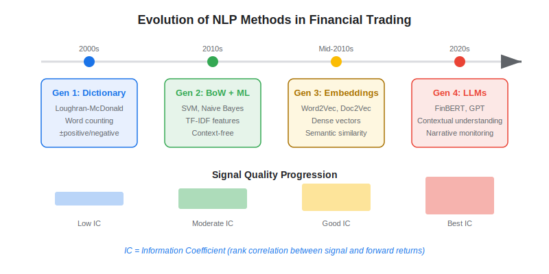
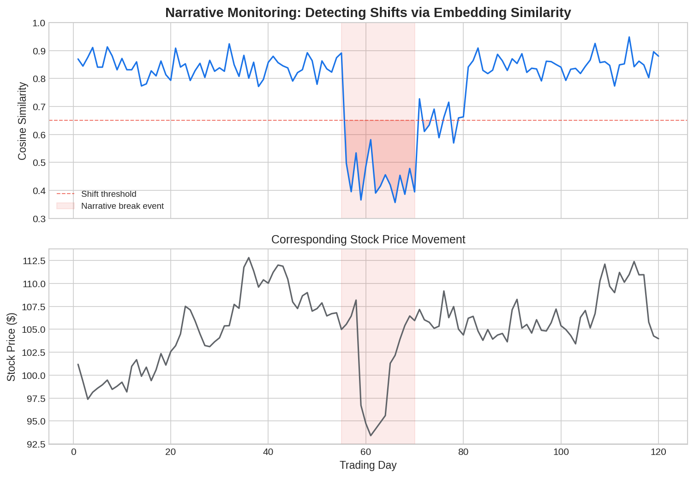

Natural language processing (NLP) has become a cornerstone of modern [alternative data](https://paperswithbacktest.com/wiki/best-alternative-data) strategies in algorithmic trading. By converting unstructured text — news articles, earnings call transcripts, social media posts, SEC filings — into quantitative trading signals, NLP enables algo traders to systematically capture information that was once the domain of discretionary analysts. This article covers the full spectrum from classical sentiment analysis to cutting-edge narrative monitoring with large language models (LLMs).

## What Is NLP in Trading?

NLP for trading is the application of computational linguistics and machine learning to extract structured, tradeable signals from text data. The core idea is simple: text contains information about economic conditions, company performance, and market sentiment that is not immediately captured by numerical market data.

The two main branches are:

**Sentiment Analysis** — scoring text as positive, negative, or neutral with respect to financial outcomes. A bullish earnings call transcript or a negative news headline gets a numerical sentiment score that feeds into an alpha model.

**Narrative Monitoring** — tracking how the *story* around a company, sector, or macro theme evolves over time. Rather than scoring individual documents, narrative monitoring uses embeddings to measure how today's news coverage is shifting relative to historical patterns.

Both approaches convert text into vectors — numerical representations that can be processed by trading algorithms just like price or volume data.

The significance of NLP for algo trading cannot be overstated. Estimates suggest that over 80% of the world's data is unstructured — primarily text — and financial markets are no exception. Earnings call transcripts alone generate millions of words per quarter across publicly traded companies. SEC filings, news wires, research reports, social media, and central bank communications add orders of magnitude more. Before NLP, this vast corpus of information was accessible only to human analysts who could read a handful of reports per day. With modern NLP, a systematic fund can process every filing, every transcript, and every headline across the entire market in seconds — and extract quantitative signals that humans simply cannot compute at scale.

The practical alpha from NLP comes from two distinct sources. First, **speed**: parsing an 8-K filing within seconds of its appearance on [EDGAR](https://paperswithbacktest.com/wiki/sec-filing-edgar-data-trading) and generating a sentiment score before human analysts have even opened the document. Second, **consistency**: applying the same analytical framework to every document, every time, without the cognitive biases and attention limitations that affect human readers. A human analyst might read the same earnings call transcript differently depending on whether they had a good or bad morning; a sentiment model produces the same score regardless.

## Evolution of NLP Methods in Finance

The field has evolved through four distinct generations, each offering increasingly powerful signal extraction:



### Generation 1 — Dictionary-Based (2000s)

The simplest approach: count positive and negative words in a document using a predefined dictionary. The Loughran-McDonald (2011) financial sentiment dictionary became the standard, identifying 354 positive and 2,329 negative words specific to financial text (important because words like "liability" are negative in general English but neutral in finance).

$$\text{Sentiment} = \frac{N_{positive} - N_{negative}}{N_{total}}$$

### Generation 2 — Bag-of-Words + ML (2010s)

Statistical models (Naive Bayes, SVM, Random Forest) trained on labeled financial text. Better than dictionaries because they learn context-dependent weights, but still ignore word order.

### Generation 3 — Word Embeddings (mid-2010s)

Word2Vec and Doc2Vec create dense vector representations of words and documents. Financial NLP researchers trained domain-specific embeddings on SEC filings and news corpora, capturing relationships like *"bullish" is to "bearish" as "long" is to "short"*.

### Generation 4 — Transformer Models and LLMs (2020s)

BERT, FinBERT, and now GPT-class models understand context, irony, and complex language. FinBERT (Araci, 2019) — a BERT model fine-tuned on financial text — has become the workhorse for production sentiment scoring. LLMs enable narrative monitoring at a qualitative level that was previously impossible.

## Python Implementation: Sentiment Scoring with FinBERT

Here is a working example using the HuggingFace `transformers` library to score financial text sentiment:

```python
from transformers import AutoTokenizer, AutoModelForSequenceClassification
import torch
import numpy as np

def score_sentiment(texts: list[str], model_name: str = "ProsusAI/finbert") -> list[dict]:
    """
    Score financial texts using FinBERT.
    Returns list of dicts with positive, negative, neutral probabilities.
    """
    tokenizer = AutoTokenizer.from_pretrained(model_name)
    model = AutoModelForSequenceClassification.from_pretrained(model_name)
    model.eval()

    results = []
    for text in texts:
        inputs = tokenizer(text, return_tensors="pt", truncation=True, max_length=512)
        with torch.no_grad():
            outputs = model(**inputs)
        probs = torch.nn.functional.softmax(outputs.logits, dim=-1).numpy()[0]
        results.append({
            "text": text[:80],
            "positive": float(probs[0]),
            "negative": float(probs[1]),
            "neutral": float(probs[2]),
            "score": float(probs[0] - probs[1]),  # net sentiment
        })
    return results

# Example usage
headlines = [
    "Company beats Q3 earnings expectations, raises full-year guidance",
    "FDA rejects drug application citing insufficient safety data",
    "Board announces regular quarterly dividend of $0.50 per share",
]
for result in score_sentiment(headlines):
    print(f"Score: {result['score']:+.3f} | {result['text']}")
```

## Narrative Monitoring with Embeddings

Narrative monitoring goes beyond document-level sentiment. The idea, formalized by researchers at The Forecasting Machine and explored in Lehalle's work, is to track the **embedding trajectory** of a company's news narrative over time.

The approach uses cosine similarity between the embedding of today's news about a company and a reference embedding (e.g., the average narrative embedding over the past 30 days). A sudden shift in cosine similarity signals a narrative break — something has changed in how the market talks about this company.

$$\text{Narrative Shift} = 1 - \cos(\mathbf{e}_{today}, \mathbf{\bar{e}}_{30d})$$

Where $\mathbf{e}_{today}$ is today's news embedding and $\mathbf{\bar{e}}_{30d}$ is the rolling 30-day average embedding. Values near 0 mean business as usual; values above a threshold (typically 0.3–0.5) signal a meaningful narrative change.

```python
import numpy as np
from numpy.linalg import norm

def cosine_similarity(a: np.ndarray, b: np.ndarray) -> float:
    """Compute cosine similarity between two vectors."""
    return float(np.dot(a, b) / (norm(a) * norm(b)))

def detect_narrative_shift(
    today_embedding: np.ndarray,
    historical_embeddings: list[np.ndarray],
    threshold: float = 0.35
) -> dict:
    """
    Detect if today's narrative has shifted meaningfully
    from the recent average.
    """
    avg_embedding = np.mean(historical_embeddings, axis=0)
    similarity = cosine_similarity(today_embedding, avg_embedding)
    shift = 1.0 - similarity
    return {
        "similarity": similarity,
        "shift": shift,
        "is_break": shift > threshold,
    }

# Example with synthetic embeddings (dim=768 for BERT-class models)
np.random.seed(42)
base = np.random.randn(768)
historical = [base + np.random.randn(768) * 0.1 for _ in range(30)]
today_normal = base + np.random.randn(768) * 0.1
today_shift = np.random.randn(768)  # completely different narrative

print("Normal day:", detect_narrative_shift(today_normal, historical))
print("Narrative break:", detect_narrative_shift(today_shift, historical))
```



## Key NLP Data Sources for Trading

| Source | Content Type | Latency | Best For |
|---|---|---|---|
| News wires (Reuters, Bloomberg) | Headlines + full articles | Seconds | Event-driven strategies |
| SEC EDGAR filings | 10-K, 10-Q, 8-K | Minutes to hours | Fundamental signals |
| Earnings call transcripts | CEO/CFO spoken language | Hours | [Sentiment trading](https://paperswithbacktest.com/wiki/sentiment-trading) around earnings |
| Social media (Twitter/X, Reddit) | Short-form opinions | Real-time | Retail sentiment signals |
| Central bank communications | Meeting minutes, speeches | Minutes | Macro rate trading |
| Sell-side research | Analyst reports | Hours | Consensus shifts |

## Limitations and Risks

**Context sensitivity** remains the biggest challenge. Financial language is nuanced — "the company's growth slowed to 15% from 20%" is objectively negative growth deceleration but still describes a fast-growing company. Generic NLP models often misclassify such statements.

**Temporal decay** of NLP signals is typically rapid. News sentiment predicts returns primarily at the 1–5 day horizon and fades quickly (see [the horizon effect](https://paperswithbacktest.com/wiki/alternative-data-horizon-effect)). Earnings call sentiment has a slightly longer half-life.

**Crowding** is a real concern. FinBERT is open-source and widely used. If every fund scores sentiment with the same model, the signal gets priced in faster. Differentiation comes from proprietary data sources, custom fine-tuning, or combining NLP with other alternative data.

## Conclusion

NLP for trading has evolved from simple word-counting to sophisticated narrative monitoring powered by transformer architectures. For algo traders, the practical path is clear: start with FinBERT for document-level sentiment scoring, then graduate to embedding-based narrative monitoring as your infrastructure matures. The alpha is real but decays fast — combine NLP signals with other alternative data sources and rebalance frequently to capture it.

---

**Explore further on PapersWithBacktest:**
- Browse [backtested NLP-driven strategies](https://paperswithbacktest.com/strategies) with Python code and performance metrics
- Access [clean historical market data](https://paperswithbacktest.com/datasets) for equities, crypto, and futures
- Take the [algo trading course](https://paperswithbacktest.com/course) — 60+ video lessons and notebooks
- Related wiki pages: [Sentiment Trading](https://paperswithbacktest.com/wiki/sentiment-trading) · [Best Alternative Data Sources](https://paperswithbacktest.com/wiki/best-alternative-data)
