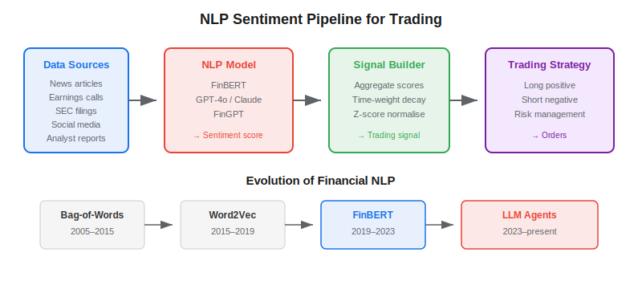

**NLP sentiment analysis for trading** is the process of using natural language processing models to extract bullish, bearish, or neutral signals from financial text — news articles, earnings call transcripts, SEC filings, social media, and analyst reports — and converting those signals into quantitative trading features. The approach has evolved from simple word-counting dictionaries to transformer-based models like FinBERT and, most recently, to LLM-powered agents that can reason about nuance, sarcasm, and context. For algo traders, sentiment analysis provides a systematic way to incorporate unstructured information that pure price-based strategies miss.

## How Financial Sentiment Analysis Works

A sentiment analysis pipeline for trading has four stages: data collection, text processing, sentiment scoring, and signal construction.



**Data collection.** Ingest text from financial news APIs (Reuters, Bloomberg, NewsAPI), earnings call transcripts (SEC EDGAR, Seeking Alpha), social media (StockTwits, Reddit), and regulatory filings. The choice of source matters: [news trading](https://paperswithbacktest.com/wiki/news-trading) strategies require low-latency feeds, while fundamental strategies can work with delayed transcripts.

**Text processing.** Clean and normalise text: remove boilerplate (legal disclaimers, copyright notices), segment into sentences or paragraphs, and tag with metadata (ticker, date, source type). For earnings calls, separate analyst questions from management answers — they carry different signal weight.

**Sentiment scoring.** Run each text passage through a sentiment model to produce a score. The model can be a specialised classifier (FinBERT), a general-purpose LLM with a financial prompt, or a lexicon-based approach (Loughran-McDonald dictionary). Each has trade-offs covered below.

**Signal construction.** Aggregate individual sentiment scores into a trading signal. Common approaches include exponentially-weighted averages (recent sentiment matters more), z-score normalisation (compare current sentiment to historical baseline), and cross-sectional ranking (sort stocks by sentiment, go long the top decile, short the bottom).

## The Evolution of Financial NLP

Financial NLP has progressed through four distinct eras:

**Bag-of-words (2005–2015).** The Loughran and McDonald (2011) dictionary assigned positive/negative labels to financial terms. Simple and fast, but unable to handle context: "the loss was smaller than expected" scores as negative despite being bullish news.

**Word embeddings (2015–2019).** Word2Vec and GloVe captured semantic relationships, allowing models to understand that "revenue growth" and "sales increase" are similar. Better than dictionaries but still poor at sentence-level reasoning.

**FinBERT (2019–2023).** Araci (2019) fine-tuned BERT on financial text, creating a model that understands financial language at the sentence level. FinBERT became the standard tool for financial sentiment classification, with accuracy above 85% on benchmark datasets.

**LLM agents (2023–present).** GPT-4, Claude, and open-source models like Llama can perform zero-shot sentiment analysis with nuanced reasoning. Lopez-Lira and Tang (2023) showed that ChatGPT's sentiment scores on financial headlines have significant predictive power for next-day returns. [LLM trading agents](https://paperswithbacktest.com/wiki/llm-trading-agents) now incorporate sentiment as one tool among many in their perception layer.

## Python Implementation: FinBERT Sentiment Pipeline

```python
from transformers import pipeline
import pandas as pd
import numpy as np

# --- 1. Load FinBERT sentiment model ---
sentiment = pipeline(
    "sentiment-analysis",
    model="ProsusAI/finbert",
    tokenizer="ProsusAI/finbert",
    return_all_scores=True,
)

# --- 2. Score a batch of headlines ---
headlines = [
    "Apple reports record quarterly revenue, beating analyst estimates",
    "Fed signals potential rate cuts amid slowing economic growth",
    "Tesla recalls 200,000 vehicles due to software defect",
    "NVIDIA sees strong demand for AI chips in data centres",
    "Oil prices plunge as OPEC fails to reach production agreement",
]

def score_headline(text: str) -> dict:
    """Return sentiment scores for a single headline."""
    results = sentiment(text[:512])[0]  # FinBERT max 512 tokens
    scores = {r["label"]: r["score"] for r in results}
    # Composite: positive - negative (range: -1 to +1)
    composite = scores.get("positive", 0) - scores.get("negative", 0)
    return {"text": text[:80], "composite": composite, **scores}

scored = pd.DataFrame([score_headline(h) for h in headlines])
print(scored[["text", "composite", "positive", "negative"]].to_string(index=False))

# --- 3. Aggregate into a daily signal ---
def daily_sentiment_signal(scores: list[float], half_life: int = 5) -> float:
    """Exponentially weighted sentiment signal."""
    weights = np.exp(-np.arange(len(scores)) / half_life)
    weights = weights / weights.sum()
    return np.dot(scores[::-1], weights[:len(scores)])

# Example: 10 days of composite scores for AAPL
daily_scores = [0.3, 0.1, -0.2, 0.5, 0.4, -0.1, 0.6, 0.2, 0.3, 0.7]
signal = daily_sentiment_signal(daily_scores)
print(f"\nDaily sentiment signal (EW, half-life=5): {signal:.3f}")
```

## FinBERT vs LLMs for Sentiment: When to Use Each

| Dimension | FinBERT | LLM (GPT-4o / Claude) |
|---|---|---|
| Speed | ~50ms per headline | 1–3 seconds per headline |
| Cost | Free (local) | API cost per token |
| Accuracy (simple) | 85–90% on standard benchmarks | 90–95% on standard benchmarks |
| Nuance handling | Limited (sentence-level only) | Excellent (multi-paragraph reasoning) |
| Customisability | Fine-tune on your data | Prompt engineering, few-shot examples |
| Latency-sensitive use | Yes (news trading) | No (too slow for real-time) |
| Context window | 512 tokens | 128k+ tokens |

**Use FinBERT** when you need to process thousands of headlines per minute at low cost — typical for systematic sentiment strategies scanning the entire market. **Use an LLM** when you need deep reasoning over long documents (earnings call transcripts, 10-K filings) where context and nuance matter more than speed.

## Velocity vs Complexity: A Framework for Text Signals

An important insight from quantitative NLP research is that not all text carries equal informational weight. Fast-produced, simple texts (tweets, breaking news headlines) have high **velocity** but low **complexity** — they spread existing information quickly but rarely contain novel analysis. Slow-produced, complex texts (research reports, regulatory filings) have low velocity but high **complexity** — they contain deep analysis but arrive after the market has already reacted to the headline.

This means:
- High-frequency sentiment strategies should focus on **velocity** — reacting to sentiment shifts before they are fully priced in
- Low-frequency fundamental strategies should focus on **complexity** — extracting insights from dense documents that most participants skim
- The worst approach is to treat all text equally — weighting a tweet the same as a 100-page 10-K filing

## Limitations and Risks

**Sentiment is a lagging indicator for well-covered stocks.** By the time news appears in a headline, institutional algorithms have often already traded on it. Sentiment signals tend to be more predictive for small-cap stocks with lower analyst coverage.

**Model drift.** Financial language evolves. Models trained on pre-2020 text may misinterpret post-pandemic terminology or new market jargon. Regular re-evaluation against labelled data is essential.

**Sarcasm and irony.** Even LLMs struggle with financial sarcasm. "Great quarter for management bonuses, terrible quarter for shareholders" requires genuine comprehension to score correctly.

**Crowding.** As more funds deploy similar FinBERT-based strategies, the alpha from sentiment signals decays. The [fear and greed index](https://paperswithbacktest.com/wiki/fear-greed-index-overview) captures market-wide sentiment; individual stock signals require more sophistication.

## Conclusion

NLP sentiment analysis gives algo traders systematic access to the vast unstructured information landscape that pure price-based strategies ignore. Start with FinBERT for high-throughput sentiment scoring, graduate to LLMs for deep document analysis, and always remember that the signal construction step — how you aggregate, normalise, and combine sentiment with other features — matters as much as the NLP model itself.

---

**Explore further on PapersWithBacktest:**
- Browse [backtested sentiment strategies](https://paperswithbacktest.com/strategies) with Python code and performance metrics
- Access [clean historical market data](https://paperswithbacktest.com/datasets) for equities, crypto, and futures
- Take the [algo trading course](https://paperswithbacktest.com/course) — 60+ video lessons and notebooks
- Related wiki pages: [News Trading](https://paperswithbacktest.com/wiki/news-trading) · [Fear and Greed Index Overview](https://paperswithbacktest.com/wiki/fear-greed-index-overview) · [LLM Trading Agents](https://paperswithbacktest.com/wiki/llm-trading-agents)
