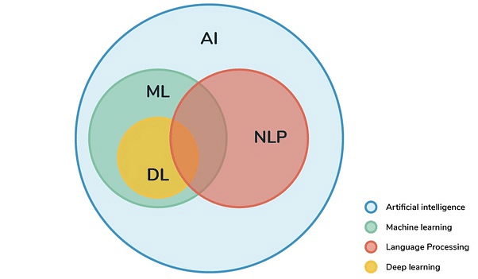

## Table of Contents

## What is Natural Language Processing (NLP) and why is it important?

Natural Language Processing, or NLP, is a part of artificial intelligence that helps computers understand and use human language. It's like teaching a computer to read, write, and even speak like a human. NLP uses different methods to analyze text or speech, so computers can do things like answer questions, translate languages, or even create new text.

NLP is important because it helps people communicate with machines more easily. Imagine being able to ask your computer a question in your own words and getting a helpful answer right away. This makes technology more useful and accessible to everyone. From helping people who speak different languages talk to each other, to making it easier for people with disabilities to use computers, NLP is making the world a more connected and inclusive place.

## How does NLP relate to machine learning and artificial intelligence?

Natural Language Processing (NLP) is a big part of artificial intelligence (AI) and machine learning (ML). AI is about making machines smart, like humans. NLP helps AI understand and use human language. Machine learning is a way to make AI smarter by learning from data. NLP uses machine learning to get better at understanding and generating language. For example, when you use a voice assistant, it uses NLP to understand what you say and ML to learn from your interactions to improve over time.

NLP and machine learning work together to make AI better at language tasks. Machine learning algorithms can learn patterns in language from lots of text or speech data. This helps NLP systems to do things like translate languages, answer questions, or even write like a human. As these systems learn more, they get better at understanding the nuances of human language, making them more useful and accurate. This connection between NLP, machine learning, and AI is what makes technologies like chatbots, language translation apps, and voice assistants possible and increasingly effective.

## What are the basic components of an NLP system?

An NLP system has several important parts that work together to understand and use human language. The first part is text processing, which involves breaking down the text into smaller pieces like words or sentences. This is called tokenization. After tokenization, the system uses techniques like stemming or lemmatization to reduce words to their base form. For example, "running" and "ran" might both be reduced to "run". Another important part is part-of-speech tagging, which labels each word with its grammatical role, like noun, verb, or adjective.

The next components are about understanding the meaning of the text. This includes named entity recognition, which identifies and classifies names of people, organizations, locations, and other important things in the text. Then there's parsing, which analyzes the grammatical structure of sentences to understand how words relate to each other. Sentiment analysis is another key part, which figures out if the text expresses positive, negative, or neutral feelings. All these parts help the NLP system understand what the text is about and what it means.

The final components of an NLP system focus on generating and using language. This includes machine translation, which converts text from one language to another, and text generation, which creates new text based on learned patterns. Speech recognition and synthesis are also important, allowing the system to understand spoken language and generate speech. These parts work together to make the system useful for tasks like answering questions, summarizing text, or even having a conversation with a user.

## Can you explain the difference between syntax and semantics in NLP?

In NLP, syntax is about the rules for putting words together to form correct sentences. It's like the grammar of a language. Syntax helps the computer understand the structure of a sentence, like where the subject, verb, and object are. For example, in the sentence "The cat sat on the mat," syntax tells us that "The cat" is the subject, "sat" is the verb, and "on the mat" is the prepositional phrase describing where the action happened. Without syntax, the computer would have a hard time understanding the order and arrangement of words.

Semantics, on the other hand, is about the meaning of the words and sentences. It goes beyond just the structure and looks at what the text actually means. For example, in the sentence "The cat sat on the mat," semantics helps the computer understand that a cat (an animal) is sitting (an action) on a mat (an object). Semantics also helps with understanding context and nuances, like idioms or metaphors. While syntax focuses on the correct arrangement of words, semantics focuses on what those words and their arrangements actually convey.

## What are some common NLP tasks and applications?

Common NLP tasks include things like recognizing speech, translating languages, and understanding the meaning of text. Speech recognition lets computers understand what people say, which is used in voice assistants like Siri or Alexa. Language translation helps people who speak different languages talk to each other, and you can see this in apps like Google Translate. Another task is sentiment analysis, which figures out if text is positive, negative, or neutral. This is useful for businesses to see what customers think about their products.

Other important NLP tasks involve generating text and answering questions. Text generation is when a computer creates new text, like writing a story or a news article. This can be seen in tools like ChatGPT. Question answering is when a computer reads a text and answers questions about it, which is helpful in search engines and virtual assistants. These tasks make technology more useful and easier to use for everyone.

NLP also helps with tasks like summarizing long texts and recognizing important information in them. Text summarization takes a long document and makes it shorter while keeping the main points. Named entity recognition finds and labels things like names of people, places, and organizations in text. These applications are used in news apps, research tools, and even in helping people with disabilities use computers more easily.

## How do machine learning models learn from text data in NLP?

Machine learning models learn from text data in NLP by looking at lots of examples. They use these examples to find patterns and rules in the language. For example, if a model sees the word "happy" used a lot with words like "smile" and "joy," it learns that "happy" usually means something good. This is called training the model. During training, the model tries to guess the right answer, and then it checks if it was correct. If it's wrong, it adjusts a bit to do better next time. This process happens over and over until the model gets really good at understanding the text.

There are different ways to train these models, but one common method is called supervised learning. In supervised learning, the model is given text along with the correct answers, like labels or categories. For example, if the task is sentiment analysis, the model might be shown sentences labeled as "positive" or "negative." The model uses this labeled data to learn how to classify new sentences correctly. Another method is unsupervised learning, where the model looks for patterns in the text without any labels. This can help the model find groups of similar words or topics in the text. Both methods help the model get better at understanding and using language.

## What are the challenges of working with text data in NLP?

One big challenge in working with text data in NLP is that language is very complicated. Words can have many meanings depending on the context. For example, the word "bank" could mean a place to keep money or the side of a river. This makes it hard for machines to understand what people really mean. Also, languages have different rules and structures. What makes sense in one language might not make sense in another. This is why translating languages is tough. Plus, people often use slang, idioms, and metaphors, which can confuse a computer trying to figure out what's being said.

Another challenge is dealing with messy data. Text from the internet or real life can have spelling mistakes, abbreviations, and lots of different formats. This makes it hard for a machine to process everything correctly. For example, if someone writes "LOL" or "BRB," a computer might not know what that means unless it's been trained on that kind of language. Also, training a model to understand all these things takes a lot of time and a lot of data. The more data you have, the better the model can learn, but getting and cleaning all that data is a big job.

## What is the role of tokenization and stemming in NLP?

Tokenization is like breaking a big text into smaller pieces, like words or sentences. It's important because it helps computers understand and work with text better. When you tokenize a sentence, you split it into tokens. For example, the sentence "The cat sat on the mat" would be broken into tokens like "The", "cat", "sat", "on", and "mat". This makes it easier for the computer to analyze each word and figure out what the sentence means. Without tokenization, the computer would see the whole sentence as one big chunk, which would be hard to process.

Stemming is about taking words and turning them into their basic form. It's useful because it helps the computer see that words like "running", "ran", and "runner" all come from the same root word, "run". This way, the computer can understand that these words are related and group them together. For example, if you're searching for information about running, stemming can help the computer find pages that mention "ran" or "runner" too. Stemming makes it easier for the computer to understand the meaning behind different forms of the same word.

## How do advanced NLP models like transformers work?

Advanced NLP models like transformers are really good at understanding and creating text. They work by looking at a whole sentence at once, not just one word at a time. This helps them understand the context better. Transformers use something called attention, which lets them focus on different parts of the text to figure out what's important. For example, when reading "The cat sat on the mat," the model can pay more attention to "cat" and "mat" to understand the sentence better. This attention mechanism makes transformers really powerful and is why they are used in popular models like BERT and GPT.

Transformers are made up of layers, and each layer has two main parts: an encoder and a decoder. The encoder takes in the text and turns it into a format the model can understand. It does this by using attention to look at all the words and figure out how they relate to each other. The decoder then uses this information to create new text. It looks at the output from the encoder and uses attention again to decide what words to use next. This back-and-forth between the encoder and decoder helps the model generate text that makes sense and fits the context. That's why transformers are so good at tasks like translating languages or answering questions.

## What are some popular NLP libraries and frameworks?

There are many popular NLP libraries and frameworks that help developers work with text data. Some of the most widely used ones include NLTK, spaCy, and Stanford CoreNLP. NLTK, or Natural Language Toolkit, is great for beginners because it has lots of tools for tasks like tokenization, stemming, and tagging. It's also easy to use and has good documentation. spaCy is another popular choice because it's fast and efficient. It's good for more advanced tasks like named entity recognition and dependency parsing. Stanford CoreNLP is known for its strong performance in areas like sentiment analysis and coreference resolution, and it's often used in research.

Another set of popular NLP tools includes TensorFlow and PyTorch, which are machine learning frameworks that can be used for NLP tasks. TensorFlow is developed by Google and is widely used in both academia and industry. It has a lot of pre-built models and tools that make it easier to build and train NLP models. PyTorch, on the other hand, is known for its flexibility and ease of use, especially for research and development. It's popular among researchers because it's good for experimenting with new ideas. Both TensorFlow and PyTorch have strong communities and lots of resources, which makes them great choices for building advanced NLP applications.

## How can one evaluate the performance of an NLP model?

Evaluating the performance of an NLP model means checking how well it does its job. One common way to do this is by using something called accuracy. Accuracy is just the number of correct answers the model gives divided by the total number of answers. For example, if a model correctly understands 90 out of 100 sentences, its accuracy is 90%. But accuracy isn't perfect because it can be tricked by things like unbalanced data, where there are more examples of one type than another. So, people also use other ways to measure how good a model is, like precision, recall, and F1 score. Precision looks at how many of the model's positive guesses were actually right. Recall checks how many of the actual positive examples the model found. The F1 score is a mix of precision and recall and gives a good overall picture of the model's performance.

Another important way to evaluate NLP models is by looking at how well they understand the meaning of text. This can be done with metrics like BLEU (Bilingual Evaluation Understudy) for machine translation or ROUGE (Recall-Oriented Understudy for Gisting Evaluation) for text summarization. These metrics compare the model's output to a human-made reference to see how similar they are. For example, BLEU measures how many words in the model's translation match the words in a human translation. If the model's output is very close to the human reference, it gets a high score. It's also helpful to get feedback from real users. By letting people use the model and asking them what they think, you can find out if it's actually helpful and easy to use. This kind of feedback can show things that numbers alone might miss, like whether the model understands the context well or if it's good at handling different kinds of language.

## What are the latest trends and future directions in NLP research?

One of the latest trends in NLP research is the development of large language models. These models, like GPT-3 and BERT, are trained on huge amounts of text data and can understand and generate text that seems very human-like. Researchers are working on making these models even better by using techniques like few-shot learning, where the model can learn new tasks with just a few examples. Another trend is the focus on multilingual NLP, which means making models that can work well with many different languages. This is important because it helps people who speak different languages understand each other better. Researchers are also looking into how to make these models more efficient, so they can run on smaller devices like smartphones.

Another exciting direction in NLP research is the integration of NLP with other areas of AI, like computer vision and robotics. This means making systems that can understand both text and images or even interact with the physical world. For example, a robot could use NLP to understand spoken commands and then use computer vision to see and navigate its environment. This kind of integration can lead to more advanced and useful AI systems. Additionally, there's a growing interest in ethical NLP, which focuses on making sure that NLP models are fair and don't harm anyone. Researchers are working on ways to reduce bias in these models and ensure they respect privacy and cultural differences.