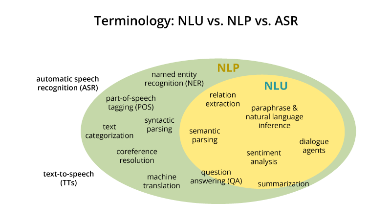

## Table of Contents

## What is Natural Language Understanding (NLU) in the context of machine learning?

Natural Language Understanding (NLU) is a part of artificial intelligence that helps computers understand and interpret human language. It's like teaching a computer to understand what people are saying or writing, not just in words, but in meaning. NLU uses different methods, like machine learning, to figure out what people mean when they talk or write. This is important for things like voice assistants, chatbots, and translation apps, where the computer needs to understand what a person wants.

To make NLU work, computers use a lot of data and special algorithms. These algorithms learn from examples of how people use language. For example, if someone says "Can you turn on the light?" the computer needs to understand that the person wants the light turned on, not just that they are asking a question. NLU helps the computer figure out the intent behind the words. This makes the computer smarter and more helpful because it can respond in a way that makes sense to what the person is asking or saying.

## How does NLU differ from Natural Language Processing (NLP)?

Natural Language Understanding (NLU) and Natural Language Processing (NLP) are closely related but focus on different aspects of language interaction with computers. NLU is a subset of NLP that specifically deals with understanding and interpreting the meaning behind human language. It's about figuring out what people mean when they speak or write, including understanding their intent, emotions, and the context of their words. For example, if someone says "It's freezing in here," NLU helps the computer understand that the person might want the heat turned up, not just that they are stating a fact about the temperature.

On the other hand, NLP is a broader field that encompasses not only understanding language but also generating and manipulating it. NLP includes tasks like text generation, translation, and speech recognition. While NLU focuses on comprehension, NLP can involve both understanding and producing language. For instance, NLP might be used to translate a sentence from English to Spanish, while NLU would be used to understand the meaning of the original English sentence. Together, NLU and NLP help computers communicate with humans more effectively, but they tackle different parts of the language puzzle.

## What are the main components of an NLU system?

The main components of an NLU system include several parts that work together to help computers understand human language. One key component is the tokenizer, which breaks down text into smaller pieces like words or phrases. This helps the system analyze language more easily. Another important part is the parser, which looks at the structure of sentences to understand how words relate to each other. For example, it can tell the difference between "the cat chased the mouse" and "the mouse chased the cat" based on the order of words.

Another crucial component is the named entity recognition (NER) system, which identifies and classifies important pieces of information like names of people, places, or organizations in the text. This helps the computer understand who or what the text is about. Additionally, the intent classification system figures out what the person wants or is trying to do with their words. For instance, if someone says "Can you book a flight to Paris?" the system recognizes the intent to book a flight. Finally, the sentiment analysis component determines the emotions or feelings behind the text, which can be important for understanding the tone of the message.

These components are often supported by [machine learning](/wiki/machine-learning) models that have been trained on large amounts of data to recognize patterns in language. These models help the NLU system get better at understanding human language over time. By combining all these parts, an NLU system can effectively interpret what people are saying or writing, making it possible for computers to respond in a more human-like way.

## Can you explain the process of how NLU interprets human language?

When an NLU system interprets human language, it starts by breaking down the text into smaller parts. This is done by a tokenizer, which turns sentences into words or phrases. After that, a parser looks at how these words fit together to understand the structure of the sentence. For example, it figures out that in "the dog is sleeping," "dog" is the subject and "sleeping" is what the dog is doing. Next, the named entity recognition (NER) system picks out important pieces of information like names or places. If someone says "I want to visit New York," the NER system identifies "New York" as a place.

Once the text is broken down and analyzed, the NLU system uses intent classification to figure out what the person wants. If someone asks "Can you turn on the light?" the system recognizes that the intent is to turn on the light, not just to ask a question. At the same time, sentiment analysis looks at the emotions behind the words. If someone says "I'm so happy today," the system understands that the person is feeling happy. All of these steps are supported by machine learning models that have learned from lots of examples of how people use language. These models help the NLU system get better at understanding human language over time.

By combining all these components, the NLU system can effectively interpret what people are saying or writing. This allows computers to respond in a way that makes sense to what the person is asking or saying. For example, if someone asks a voice assistant to set an alarm, the NLU system understands the request and can [carry](/wiki/carry-trading) out the action. This makes communication between humans and computers smoother and more natural.

## What are some common algorithms used in NLU?

NLU uses different algorithms to help computers understand human language. One common algorithm is the Hidden Markov Model (HMM), which is used for tasks like part-of-speech tagging. HMMs work by figuring out the probability of a word being a certain part of speech, like a noun or verb, based on the words around it. Another important algorithm is the Long Short-Term Memory (LSTM), a type of Recurrent Neural Network (RNN). LSTMs are good at understanding the order of words in a sentence and can remember information over long sequences, which is helpful for understanding context and meaning in language.

Other algorithms used in NLU include Convolutional Neural Networks (CNNs), which are often used for tasks like sentiment analysis. CNNs can look at different parts of a sentence and figure out the overall emotion or feeling. Also, the Transformer model has become very popular in NLU, especially for tasks like machine translation and language understanding. Transformers use a technique called "attention" to focus on different parts of the text and understand how they relate to each other, which helps in understanding the overall meaning of sentences or paragraphs. These algorithms, along with others, help NLU systems get better at understanding what people are saying or writing.

## How is machine learning applied to improve NLU?

Machine learning helps NLU get better by using lots of examples of how people talk and write. It learns from these examples to understand things like what words mean, how sentences are put together, and what people want when they say something. For example, if a computer sees a lot of sentences where people ask to turn on a light, it learns that "turn on the light" means the person wants the light to be on. This is called supervised learning, where the computer is given examples with the right answers so it can learn from them. Over time, as the computer sees more examples, it gets better at understanding what people mean.

Another way machine learning improves NLU is through unsupervised learning, where the computer looks for patterns in language without being told the right answers. For instance, it might notice that words like "happy" and "joyful" often show up in similar situations, so it learns they mean similar things. This helps the computer understand new words and sentences it hasn't seen before. Both supervised and unsupervised learning make NLU systems smarter and better at understanding human language, which makes it easier for computers to talk and work with people in a natural way.

## What are the challenges faced in developing NLU systems?

Developing NLU systems is hard because human language is very complex and always changing. People use different words, slang, and even make up new words all the time. This means NLU systems need to learn from a lot of different examples to understand what people are saying. They also need to understand context, which can be tricky. For example, if someone says "Can you pass the salt?" the NLU system needs to know they are asking for the salt at the dinner table, not just asking if you can pass something. This requires the system to understand not just the words, but the situation and the intent behind them.

Another challenge is dealing with different languages and dialects. Each language has its own rules and ways of saying things, and even within a language, there can be many different ways to speak. For example, American English and British English have different words and spellings for the same things. NLU systems need to be able to handle these differences to work well for everyone. Also, understanding emotions and sarcasm can be tough for computers. If someone says "Great, another meeting," they might actually be unhappy about it, but an NLU system might miss the sarcasm and think they are happy. These challenges make it hard to build NLU systems that can understand and respond to people in a natural and helpful way.

## How can NLU be evaluated for performance and accuracy?

To evaluate the performance and accuracy of NLU systems, we use different methods to see how well they understand human language. One common way is to use test datasets with examples of what people might say or write. We compare what the NLU system thinks the meaning is to what the real meaning should be. If the system gets it right a lot, it means it's doing well. We can also use metrics like accuracy, which tells us the percentage of times the system got the right answer, and F1 score, which is a way to measure how well the system balances being correct and not missing important information. The F1 score is calculated using the formula $$F1 = 2 \times \frac{\text{precision} \times \text{recall}}{\text{precision} + \text{recall}}$$, where precision is how many of the system's answers were correct, and recall is how many of the correct answers the system found.

Another way to check NLU performance is by looking at how well it understands different parts of language, like figuring out what people want (intent recognition), understanding emotions (sentiment analysis), and [picking](/wiki/asset-class-picking) out important information (named entity recognition). We can test these parts separately to see where the system does well and where it needs to improve. For example, we might give the system lots of sentences and see if it can tell if people are happy, sad, or angry from what they say. If the system is good at understanding emotions but not as good at figuring out what people want, we know what to work on next. This helps make the NLU system better over time by focusing on the parts that need more practice.

## What are some practical applications of NLU in industries?

NLU is used in many industries to help computers understand and respond to people better. In customer service, NLU powers chatbots and virtual assistants that can answer questions and solve problems. For example, when someone asks a chatbot about their bank account balance, NLU helps the chatbot understand the question and fetch the right information. This makes it easier for companies to help their customers quickly and without needing a human to do it all the time. NLU also helps in healthcare, where it can understand what patients are saying and help doctors and nurses find the right information in medical records faster.

Another big use of NLU is in smart homes and devices. Voice assistants like Alexa or Google Home use NLU to understand what people want when they talk to them. If someone says "Turn on the living room light," NLU helps the device know which light to turn on and do it right away. This makes life easier because people can control their homes with just their voice. In the automotive industry, NLU helps with voice commands in cars, so drivers can keep their hands on the wheel and still change the music or get directions. These are just a few ways NLU makes technology more helpful and easier to use in everyday life.

## How does NLU handle different languages and dialects?

NLU systems need to understand different languages and dialects to work well for everyone. Each language has its own rules and ways of saying things. For example, English and Spanish have different grammar and words. Even within a language, there can be many dialects. American English and British English use different words and spellings for the same things. NLU systems use a lot of examples from different languages and dialects to learn how to understand them. This helps the system know that "color" in American English and "colour" in British English mean the same thing.

To handle different languages and dialects, NLU systems use machine learning models that are trained on lots of data from around the world. These models learn to recognize patterns in how people talk and write in different languages. If the system sees a lot of examples of how people say things in different ways, it gets better at understanding them. For example, if someone says "I'm knackered" in British English, the system learns that it means the person is tired, even though "knackered" is not a common word in American English. By learning from many examples, NLU systems can understand and respond to people no matter how they speak.

## What are the latest advancements in NLU research?

The latest advancements in NLU research have focused on improving how well computers understand human language, especially in understanding context and handling different languages. One big step forward is the use of transformer models, like BERT (Bidirectional Encoder Representations from Transformers). These models are good at understanding the meaning of words by looking at the words around them. They can figure out what a word means based on the whole sentence, not just the word itself. This helps NLU systems understand things like sarcasm and different ways of saying the same thing. Researchers are also working on making NLU systems better at understanding different languages and dialects by training them on more diverse data from around the world.

Another important advancement is in the area of few-shot learning, where NLU systems can learn to understand new things with just a few examples. This is helpful because it means the systems can keep getting better without needing huge amounts of new data every time. For example, if a new slang word becomes popular, the system can learn what it means quickly. Researchers are also looking into ways to make NLU systems understand emotions better, which is important for things like customer service chatbots. By understanding how people feel, these systems can respond in a more helpful and friendly way. These advancements are making NLU systems smarter and more useful in everyday life.

## How can one start building their own NLU model?

To start building your own NLU model, you'll need to gather a lot of data that shows how people talk and write. This data is used to train the model so it can learn to understand language. You can find this data from places like [books](/wiki/algo-trading-books), websites, or even social media. Once you have your data, you'll need to clean it up and organize it so the computer can use it easily. This means getting rid of any mistakes or things that don't make sense. After that, you can start training your model using machine learning algorithms. Popular choices include models like BERT or other transformer models, which are good at understanding the meaning of words in context.

Once your model is trained, you'll need to test it to see how well it understands language. You can do this by giving it new sentences or questions and seeing if it gets the right answers. If it doesn't do well, you might need to go back and train it some more with different data or adjust the algorithms you're using. There are also tools and libraries, like TensorFlow or PyTorch, that can help you build and test your NLU model. These tools make it easier to work with the data and the algorithms. By following these steps and keeping an eye on how your model is doing, you can build an NLU system that gets better at understanding human language over time.

## References & Further Reading

[1]: Jurafsky, D., & Martin, J. H. (2019). ["Speech and Language Processing"](https://web.stanford.edu/~jurafsky/slp3/) (3rd ed.). Prentice Hall. A comprehensive textbook covering fundamental concepts in NLU and NLP.

[2]: Vaswani, A., Shazeer, N., Parmar, N., Uszkoreit, J., Jones, L., Gomez, A. N., Kaiser, Ł., & Polosukhin, I. (2017). ["Attention Is All You Need."](https://arxiv.org/abs/1706.03762) Advances in Neural Information Processing Systems. A seminal paper introducing the Transformer model, crucial in modern NLU.

[3]: Devlin, J., Chang, M. W., Lee, K., & Toutanova, K. (2019). ["BERT: Pre-training of Deep Bidirectional Transformers for Language Understanding."](https://arxiv.org/abs/1810.04805) NAACL-HLT 2019. This paper presents BERT, a breakthrough in deep learning for NLU tasks.

[4]: Manning, C. D., Raghavan, P., & Schütze, H. (2008). ["Introduction to Information Retrieval."](https://nlp.stanford.edu/IR-book/information-retrieval-book.html) Cambridge University Press. An essential reference on information retrieval techniques intertwined with language understanding.

[5]: Goldberg, Y. (2016). ["A Primer on Neural Network Models for Natural Language Processing."](https://arxiv.org/abs/1510.00726) Journal of Artificial Intelligence Research, 57, 345-420. An insightful overview of neural models applied to NLU and NLP.

[6]: ["Foundations of Statistical Natural Language Processing"](https://mitpress.mit.edu/9780262133609/foundations-of-statistical-natural-language-processing/) by Christopher D. Manning and Hinrich Schütze. An essential read providing a foundation for understanding probabilistic and statistical approaches in language processing.