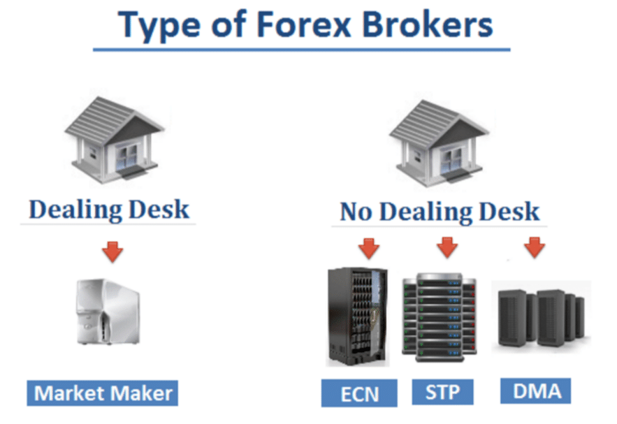

## Table of Contents

## What is a No Dealing Desk (NDD) in forex trading?

A No Dealing Desk (NDD) in forex trading is a type of trading system where traders can buy and sell currencies directly through the market without going through a dealing desk. This means that the broker does not act as a middleman between the trader and the market. Instead, the broker connects the trader directly to the liquidity providers, which can be banks or other financial institutions. This setup can lead to faster trade execution and more transparent pricing because the broker does not have the ability to manipulate prices.

NDD brokers can be further divided into two types: Straight Through Processing (STP) and Electronic Communication Network (ECN). In an STP system, the broker sends the trader's order directly to a liquidity provider. In an ECN system, the broker connects the trader to a network of liquidity providers, and the trader can see the best available prices from multiple sources. Both types aim to provide traders with better trading conditions, such as lower spreads and no requotes, which can be beneficial for those looking to trade in a more efficient and fair market environment.

## How does a No Dealing Desk model differ from a Dealing Desk model?

A No Dealing Desk (NDD) model and a Dealing Desk (DD) model are two different ways brokers handle forex trades. In a Dealing Desk model, the broker acts as the middleman between the trader and the market. This means the broker decides the prices at which you buy and sell, and they can make money from the spread or even from trading against their clients. This setup can sometimes lead to slower trade execution and potential conflicts of interest because the broker might have an incentive to manipulate prices.

On the other hand, a No Dealing Desk model works differently. In an NDD model, the broker sends your trade directly to the market without going through a dealing desk. This means you get faster trade execution and more transparent pricing because the broker isn't setting the prices. Instead, your trades go straight to [liquidity](/wiki/liquidity-risk-premium) providers like banks, which can offer better prices and lower spreads. This makes trading fairer and can be more beneficial for traders looking for a straightforward trading experience.

## What are the main types of No Dealing Desk brokers?

No Dealing Desk brokers come in two main types: Straight Through Processing (STP) and Electronic Communication Network (ECN). STP brokers send your trades directly to one or more liquidity providers, like big banks. This means you get your trades done quickly and at good prices because the broker isn't messing with them. It's like sending a letter straight to the person you want to reach, without it going through someone else's hands first.

ECN brokers, on the other hand, connect you to a whole network of liquidity providers. You can see the best prices from different places and choose the one that works best for you. It's like shopping at a big market where you can pick from lots of sellers to get the best deal. Both types aim to give traders a fair and efficient way to trade, but ECN might offer even more choices and tighter spreads because of the competition among providers.

## What are the advantages of using a No Dealing Desk broker for a beginner trader?

Using a No Dealing Desk (NDD) broker can be really helpful for a beginner trader. One big advantage is that NDD brokers offer faster trade execution. When you're just starting out, you want your trades to go through quickly so you don't miss out on good opportunities. With an NDD broker, your trades go straight to the market without any middleman slowing things down. This means you can buy or sell at the prices you see without waiting, which can make a big difference, especially in fast-moving markets.

Another advantage is that NDD brokers often have more transparent pricing. This means you get to see the real market prices without the broker messing with them. For a beginner, this can make things easier because you know you're getting a fair deal. Plus, NDD brokers usually have lower spreads, which is the difference between the buy and sell prices. Lower spreads mean you can save money on each trade, which is great when you're starting out and trying to make every penny count.

## Can you explain the role of liquidity providers in the NDD system?

In the No Dealing Desk (NDD) system, liquidity providers are really important. They are big banks or financial institutions that have a lot of money to trade with. When you use an NDD broker, your trades go straight to these liquidity providers. They give you the prices you see on your trading platform. This means you get to trade at the real market prices, which can be better for you because the broker isn't messing with them.

Liquidity providers help make sure there's always someone to buy or sell from. This is called liquidity, and it's important because it makes trading smoother and faster. When there are lots of liquidity providers, you can get better prices and lower costs. For example, if you're using an Electronic Communication Network (ECN) broker, you can see prices from many different liquidity providers and pick the best one. This can save you money and make your trading experience better, especially if you're just starting out.

## How does the execution speed of trades differ between NDD and DD brokers?

The speed of trade execution is usually faster with No Dealing Desk (NDD) brokers than with Dealing Desk (DD) brokers. When you trade with an NDD broker, your orders go straight to the market without any middleman. This means your trades can happen really quickly because there's no one in between slowing things down. It's like sending a message directly to a friend instead of going through someone else first.

On the other hand, with a Dealing Desk broker, your trades have to go through the broker's dealing desk before they reach the market. This can take more time because the broker has to process your order and decide on the price. It's like sending a message through a friend who might take a while to pass it on. So, if you want your trades to happen fast, an NDD broker is usually a better choice.

## What are the potential risks and challenges associated with trading through an NDD broker?

Trading through an NDD broker can come with some risks and challenges. One big risk is that you might face higher trading costs. Even though NDD brokers often have lower spreads, they might charge other fees like commissions on each trade. This can add up, especially if you're trading a lot. Another challenge is that the market can be more volatile when you're trading directly with liquidity providers. Prices can change quickly, and if you're not careful, you might end up buying or selling at a worse price than you expected.

Another thing to watch out for is the risk of slippage. This happens when the price you want to trade at isn't available by the time your order gets to the market, so you end up trading at a different price. This can be frustrating and can affect your profits. Also, while NDD brokers aim to be fair, there's still a chance that some might not be completely transparent about how they handle your trades. It's important to do your research and choose a broker you can trust.

## How does the pricing mechanism work in a No Dealing Desk environment?

In a No Dealing Desk environment, the pricing mechanism works by connecting traders directly to liquidity providers like big banks. These providers offer the prices you see on your trading platform. Because your trades go straight to the market without a middleman, you get to see the real market prices. This means the prices are more transparent and fair, as they're not being set by the broker. Instead, you're seeing the best available prices from the liquidity providers at that moment.

Sometimes, the prices can change quickly because they're coming straight from the market. This can lead to something called slippage, where the price you want to trade at might not be available by the time your order gets there. You might end up trading at a slightly different price. But overall, trading in an NDD environment can mean lower spreads, which is the difference between the buy and sell prices. Lower spreads can save you money on each trade, making it a good choice for many traders.

## What impact does market volatility have on NDD trading operations?

Market [volatility](/wiki/volatility-trading-strategies) can make trading through a No Dealing Desk (NDD) broker a bit trickier. When the market is moving a lot, prices can change very quickly. This means that the price you see when you decide to trade might not be the same by the time your order gets to the market. This is called slippage, and it can happen more often when the market is volatile. It can be frustrating because you might end up buying or selling at a worse price than you planned.

On the other hand, NDD brokers can help you take advantage of market volatility too. Because your trades go straight to the market, you can get your orders filled faster. This can be good if you're trying to make quick trades to profit from the big price swings. But you need to be careful and watch the market closely, because the fast-moving prices can also lead to bigger losses if you're not prepared.

## How do regulatory requirements affect the operation of No Dealing Desk brokers?

Regulatory requirements play a big role in how No Dealing Desk brokers operate. Different countries have rules that brokers need to follow to make sure trading is fair and safe for everyone. These rules can include things like how brokers handle client money, how they report trades, and what kind of information they need to give to clients. For example, in the United States, the Commodity Futures Trading Commission (CFTC) and the National Futures Association (NFA) set rules that NDD brokers must follow. These rules help protect traders and make sure brokers are honest and transparent.

Because of these regulations, NDD brokers might have to change how they do things. They might need to keep more detailed records, use special software to report trades, or even limit the kinds of trades they can offer. This can make trading safer but might also make it a bit more complicated or expensive for the broker. Still, these rules are important because they help make sure that when you trade with an NDD broker, you're doing it in a fair and secure environment.

## What advanced strategies can expert traders employ using an NDD broker?

Expert traders can use a No Dealing Desk broker to their advantage by using a strategy called [scalping](/wiki/gamma-scalping). Scalping means making lots of quick trades to take small profits from tiny price changes. Because NDD brokers let you trade directly with the market, your orders can be filled really fast. This is important for scalping because you need to get in and out of trades quickly. Plus, NDD brokers often have lower spreads, so you can keep more of those small profits.

Another strategy experts might use is called news trading. This is when traders try to make money from the big price moves that happen after important news comes out. Since NDD brokers connect you straight to the market, you can react to news faster and get better prices. But it's important to be careful because the market can be really wild when big news hits. Using an NDD broker can help you take advantage of these fast-moving prices, but you need to know what you're doing to avoid big losses.

## How can traders assess the reliability and performance of different NDD brokers?

To assess the reliability and performance of different NDD brokers, traders should start by looking at the broker's reputation. This means reading reviews from other traders and checking if the broker is regulated by a well-known authority like the FCA in the UK or the CFTC in the US. A good reputation and proper regulation can tell you a lot about how trustworthy a broker is. Traders should also check the broker's website for information about their history, team, and any awards they might have won. This can give you an idea of how long they've been around and how well they're doing in the industry.

Another important thing to look at is the broker's trading platform and the tools they offer. A reliable NDD broker will have a fast, user-friendly platform that works well without crashing or slowing down. Traders should also see if the broker offers features like real-time market data, charting tools, and different types of orders. These can help you trade more effectively. Finally, it's a good idea to test the broker's customer service. You can do this by asking questions or even opening a demo account to see how quickly and helpfully they respond. Good customer service can make a big difference, especially if you run into problems while trading.

## References & Further Reading

[1]: ["Algorithmic Trading: Winning Strategies and Their Rationale"](https://www.wiley.com/en-us/Algorithmic+Trading%3A+Winning+Strategies+and+Their+Rationale-p-9781118746912) by Ernie Chan

[2]: ["High-Frequency Trading: A Practical Guide to Algorithmic Strategies and Trading Systems"](https://www.amazon.com/High-Frequency-Trading-Practical-Algorithmic-Strategies/dp/1118343506) by Irene Aldridge

[3]: ["Trading and Exchanges: Market Microstructure for Practitioners"](https://www.amazon.com/Trading-Exchanges-Market-Microstructure-Practitioners/dp/0195144708) by Larry Harris

[4]: ["Forex Trading: The Basics Explained in Simple Terms"](https://zoboko.com/book/24v935me/forex-trading-the-basics-explained-in-simple-terms) by Jim Brown

[5]: ["Market Liquidity: Theory, Evidence, and Policy"](https://academic.oup.com/book/55158) by Thierry Foucault, Marco Pagano, and Ailsa Röell

[6]: Bank for International Settlements (2022). ["Triennial Central Bank Survey of Foreign Exchange and OTC Derivatives Markets in 2022."](https://www.bis.org/statistics/rpfx22.htm)

[7]: Financial Conduct Authority. ["Forex and CFDs."](https://www.fca.org.uk/firms/contract-for-differences)