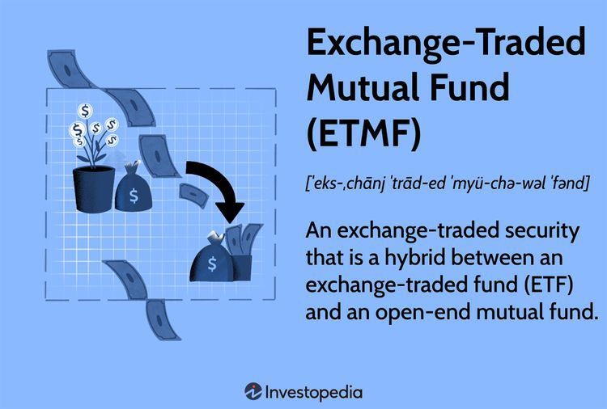

Exchange-traded funds (ETFs) have become a cornerstone of modern investment strategies, offering a blend of diversified portfolio management with the liquidity and simplicity of stock trading. These funds are baskets of securities such as stocks, bonds, or commodities that are traded on exchanges, much like individual stocks. Since their inception, ETFs have offered investors an efficient way to participate in different market sectors and asset classes without the need to individually purchase multiple securities.

In recent years, a new category of ETFs—no-fee ETFs—has gained traction among cost-conscious investors. These funds do not levy an annual management fee or transaction costs, a feature that significantly reduces the cost barriers traditionally associated with investment funds. Such characteristics make no-fee ETFs an appealing option, particularly when even small cost reductions can amplify overall returns. The rise of no-fee ETFs coincides with a broader trend towards cost minimization driven by an increasingly competitive investment landscape and a prolonged low-interest-rate environment, where every basis point in cost savings is valuable.

This article aims to dissect the complexities of investing in no-fee ETFs, examining their symbiotic relationship with algorithmic trading—an approach that utilizes computer algorithms to execute trades with speed and precision. By analyzing both benefits and criticisms, we provide a comprehensive overview that equips today's investor with the insights necessary for informed decision-making. Familiarity with the dynamics of no-fee ETFs allows investors to strategically enhance their trading activities and leverage innovative financial instruments while understanding the potential market implications.

By gaining a deeper understanding of this burgeoning segment of ETFs, investors are better positioned to navigate the evolving economic landscape, potentially achieving both strategic and profitable outcomes in their portfolios.

## Table of Contents

## Understanding No-Fee ETFs

Exchange-traded funds (ETFs) that implement a no-fee structure have become an innovative solution for reducing investment costs. These funds eliminate the traditional annual management fees or transaction costs typically associated with asset management, thereby allowing investors to increase returns. Particularly in a low-interest-rate environment, every basis point is vital for maximizing investment gains, making no-fee ETFs an attractive choice for savvy investors.

Unlike conventional ETFs, which charge a fee for portfolio management services, no-fee ETFs operate by relying on alternative revenue mechanisms. These may include securities lending, wherein the ETF provider earns interest by lending the securities contained in the fund to other market participants. This method serves to compensate for the loss of direct management fees.

Moreover, no-fee ETFs may also generate revenue through earnings from affiliated services. For example, a brokerage firm associated with the fund might benefit from increased trading [volume](/wiki/volume-trading-strategy) or through the collection of monetized data. Thus, while the absence of direct fees may initially appear to erode management-level profits, these models sustain fund operations through alternative streams.

From a structural standpoint, no-fee ETFs comprise a portfolio of assets that replicate a specific index, similar to traditional ETFs. The primary distinction lies in their cost structure, which leverages efficiencies and alternative monetization strategies to maintain profitability without imposing direct costs on the investor.

When considering no-fee ETFs, it is critical to understand these mechanisms, as their allure lies in cost savings and the ability to yield competitive returns in environments requiring attention to expense management. Recognizing how these ETFs function empowers investors to effectively capitalize on their potential benefits, thereby enhancing overall portfolio performance without the burden of traditional management fees.

## Algorithmic Trading and ETFs

Algorithmic trading utilizes computer algorithms to conduct trades with unmatched speed and frequency compared to human traders. This technology has increasingly integrated with exchange-traded funds (ETFs), including no-fee ETFs, due to their intrinsic [liquidity](/wiki/liquidity-risk-premium) and diversity characteristics. 

ETFs are generally composed of a basket of underlying assets such as stocks, bonds, or commodities, providing diversification within a single investment product. The liquidity inherent in these funds is a significant [factor](/wiki/factor-investing) that attracts [algorithmic trading](/wiki/algorithmic-trading); it ensures that trades can be executed swiftly without significantly affecting the asset price. Algorithmic trading strategies, therefore, often employ ETFs to manage risk and capitalize on market inefficiencies arising from price changes.

In algorithmic trading, price efficiencies of ETFs are exploited using a variety of strategies. For instance, [arbitrage](/wiki/arbitrage) strategies are deployed to take advantage of price discrepancies between ETFs and their underlying assets. If an [ETF](/wiki/etf-trading-strategies)'s price deviates from its net asset value (NAV), algorithms are programmed to instantaneously buy the undervalued and sell the overvalued instruments, thus ensuring the price remains aligned with its actual asset value. This automated response enhances market efficiency by minimizing price deviations.

A pertinent case study involves the utilization of no-fee ETFs in high-frequency trading ([HFT](/wiki/high-frequency-trading-strategies)) environments. Here, algorithms perform rapid-fire transactions aiming for small profit margins on large transaction volumes. For example, during periods of high market [volatility](/wiki/volatility-trading-strategies), no-fee ETFs can be traded at a low cost, allowing algorithms to execute numerous transactions without incurring substantial transaction fees. The absence of fees enhances potential returns and promotes broader accessibility to enter and [exit](/wiki/exit-strategy) positions quickly in response to market fluctuations.

Furthermore, analyzing the collaboration between algorithmic trading and ETFs uncovers insights into potential future investment trends. The growing volume of algorithmic trading within ETF markets indicates a shift towards more sophisticated and technology-driven trading methods. This trend is likely to expand as technological advancements progress, optimizing trading efficiencies and broadening access to market participation.

Algorithmic trading's impact on ETFs is not without controversy, however, particularly concerning market behavior. Critics warn that the rapid execution associated with algorithmic trading can exacerbate market volatility, potentially triggering events like 'flash crashes'. Nonetheless, proponents argue that these technologies contribute to market stability by enhancing liquidity and pricing accuracy.

Overall, algorithmic trading combined with ETFs, including no-fee ETFs, provides an intersection where innovation and investment efficiency meet. As both fields evolve, their interdependency is expected to strengthen, driving future trends in investment strategies and market dynamics.

## Criticism and Challenges of No-Fee ETFs

Despite their increasing popularity, no-fee ETFs are not without criticisms and challenges, particularly concerning their sustainability and the potential long-term effects they might have on market dynamics. Understanding these elements is crucial for investors aiming to make informed decisions.

One of the primary criticisms of no-fee ETFs is the ambiguity surrounding their revenue model. Traditional ETFs typically charge an annual management fee, providing a clear revenue stream for fund providers. In contrast, no-fee ETFs, by definition, do not charge these fees, leading to questions about how these funds generate profit. Investors may suspect that these ETFs could incorporate hidden costs or engage in less transparent revenue-generating activities, such as securities lending or payment for order flow arrangements. Such activities might not be immediately evident to the investors and could potentially impact the net returns realized.

Furthermore, the increase in algorithmic trading, which often exploits the liquidity and low transaction costs offered by ETFs, including no-fee ETFs, presents additional challenges. While algorithms can enhance market efficiencies, they can also contribute to market instability, particularly during periods of high volatility when rapid buying and selling can exacerbate price swings. The massive volumes of trades executed by algorithms can lead to a cascade of orders that influence market prices temporarily and potentially in an adverse manner, raising concerns over market stability.

Investors considering no-fee ETFs should also be aware of potential pitfalls in their portfolios. For instance, the absence of fees might initially appear advantageous, but it is essential to scrutinize other aspects such as the fund's tracking error or liquidity. A low-cost profile might be offset by poorer performance in closely tracking the index or reduced liquidity, which can affect the ease of entering or exiting positions at favorable prices.

By weighing these criticisms, investors can better assess the risks and rewards associated with no-fee ETF investments. While they present a cost-effective vehicle, their adoption should be approached with mindfulness toward the underlying business structures and market behaviors that can impact their performance and align with the investor's long-term financial goals.

## Conclusion

No-fee ETFs present a compelling option for investors seeking to minimize costs and explore innovative trading strategies. These ETFs eliminate the usual management fees, potentially increasing gains by allowing more capital to be invested or retained by the investor. However, while such financial instruments offer numerous advantages, they come with inherent complexities.

Algorithmic trading has reshaped financial markets by executing trades at speeds unattainable by humans, leveraging the liquidity and diversity presented by ETFs, including no-fee varieties. This functionality enhances trading efficiencies but raises concerns over market impacts such as increased volatility and decreased transparency. The rapid trading capabilities can sometimes lead to unintended consequences, such as amplifying market fluctuations or causing "flash crashes."

Investors should approach no-fee ETFs with an understanding of both their potential benefits and criticisms. A critical consideration involves questioning how these funds generate revenue in the absence of fees, and whether this model is sustainable. Hidden costs or practices, such as securities lending or spreads, may offset perceived savings. Therefore, investors must scrutinize these factors to gauge the true cost-effectiveness of their investment.

Informed investors, armed with comprehensive knowledge of the dynamics and underlying structures of no-fee ETFs, can effectively navigate these innovative financial tools to optimize their investment strategies. Balancing innovation with traditional investing principles will be key to achieving sustainable and profitable outcomes. By maintaining a strategic blend of novel and time-tested approaches, investors can better position themselves to capitalize on the opportunities presented by modern financial markets.

## References & Further Reading

[1]: Johnson, S. (2019). ["Vanguard Eliminates Trading Fees, Ratcheting Up Pressure on Rivals."](https://www.morningstar.com/funds/vanguards-unique-etf-structure-presents-unique-tax-risks) The Wall Street Journal.

[2]: ["ETF Investment Strategies: Best Practices from Leading Experts on Constructing a Winning ETF Portfolio"](https://www.amazon.com/ETF-Investment-Strategies-Practices-Constructing/dp/0071815341) by Aniket Ullal

[3]: Bogle, J. C. (2014). ["The Clash of the Cultures: Investment vs. Speculation"](https://archive.org/details/clashofculturesi0000bogl) John Wiley & Sons.

[4]: Aldridge, I. (2013). ["High-Frequency Trading: A Practical Guide to Algorithmic Strategies and Trading Systems"](https://onlinelibrary.wiley.com/doi/pdf/10.1002/9781119203803.fmatter) John Wiley & Sons.

[5]: Hasbrouck, J. (2003). ["Trading Costs and Returns for U.S. Equities: Estimating Effective Costs from Daily Data."](https://pages.stern.nyu.edu/~jhasbrou/Research/GibbsCurrent/HasbrouckJF.pdf) The Journal of Finance, 58(3), 1445–1477.