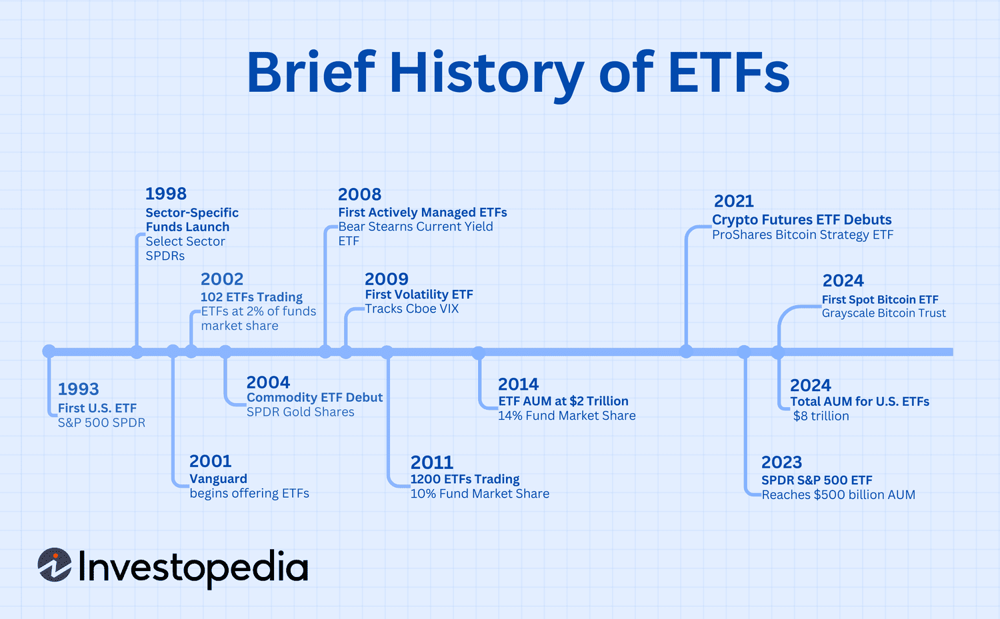

## Table of Contents

## What are no-fee exchange-traded funds (ETFs)?

No-fee exchange-traded funds (ETFs) are investment funds that trade on stock exchanges, just like stocks, but they don't charge any management fees. This means that when you invest in these ETFs, you don't have to pay extra money to the company that manages the fund. This can be a big advantage because it allows you to keep more of your investment returns.

These ETFs are designed to track the performance of a specific index, like the S&P 500, and they aim to give investors broad exposure to the market without the cost of fees. While no-fee ETFs can save you money, it's important to understand that they might have other costs, like trading fees from your broker. Still, for many investors, the savings from not paying management fees can make a big difference over time.

## How do no-fee ETFs differ from traditional ETFs?

No-fee ETFs and traditional ETFs are both types of investment funds that you can buy and sell on a stock exchange. The big difference is that no-fee ETFs don't charge any management fees, while traditional ETFs do. Management fees are what you pay to the company that runs the ETF, and they can eat into your investment returns over time. So, with no-fee ETFs, you get to keep more of your money.

Both types of ETFs can track the same things, like stock market indexes or commodities. But because no-fee ETFs don't have those extra costs, they can be a better choice if you want to save money. Just remember, even with no-fee ETFs, you might still have to pay other costs, like trading fees from your broker. But overall, no-fee ETFs can help you keep more of your investment gains.

## What is the history behind the development of no-fee ETFs?

The idea of no-fee ETFs started because people wanted to invest without paying extra money to the companies that manage the funds. The first ETFs came out in the early 1990s, but they all had fees. It wasn't until much later that companies began to offer ETFs without any management fees. The first no-fee [ETF](/wiki/etf-trading-strategies) was launched by Fidelity Investments in 2018. They wanted to attract more investors by removing the fees that many people didn't like.

Since then, other big companies like Charles Schwab and Vanguard have also started offering no-fee ETFs. This has made investing easier and cheaper for a lot of people. The growth of no-fee ETFs shows that investors really care about keeping more of their money, and it has pushed the whole investment industry to think about how they can offer better deals to their customers.

## Who were the first providers to offer no-fee ETFs?

The first company to offer no-fee ETFs was Fidelity Investments. They started this in 2018. Fidelity wanted to help people invest without having to pay extra fees, so more people could save money and invest easily.

After Fidelity, other big companies like Charles Schwab and Vanguard also began to offer no-fee ETFs. They saw that people liked the idea of not paying fees, so they wanted to give their customers the same chance to save money. This made investing cheaper for a lot of people and changed how the investment world works.

## How do no-fee ETFs generate revenue if they don't charge fees?

No-fee ETFs make money even though they don't charge fees from investors. One way they do this is by [earning](/wiki/earning-announcement) money from the interest on the cash they hold. When people buy and sell ETFs, there's usually some cash that stays in the fund. The ETF can put this cash in a bank and earn interest on it.

Another way no-fee ETFs make money is through something called securities lending. This means they can lend out the stocks or bonds they hold to other investors who need them for a short time. The ETF gets paid for lending these securities, which helps them make money without charging fees to their investors. So, even though they don't charge fees, no-fee ETFs can still find ways to earn money and keep running.

## What are the benefits of investing in no-fee ETFs for beginners?

Investing in no-fee ETFs can be a great choice for beginners because it helps you save money. When you start investing, every dollar counts, and no-fee ETFs don't charge any extra money for managing your investment. This means you get to keep more of your returns, which can add up over time. It's like getting a little boost to your savings without having to do anything extra.

Another big benefit for beginners is that no-fee ETFs are easy to understand and use. They usually track well-known indexes like the S&P 500, so you don't need to be an expert to know what you're investing in. Plus, since they trade on stock exchanges just like stocks, you can buy and sell them whenever you want. This makes it simpler for new investors to get started and feel confident in their choices.

## Are there any hidden costs associated with no-fee ETFs?

Even though no-fee ETFs don't charge any management fees, there can still be some other costs that you might not see right away. For example, when you buy or sell an ETF, your broker might charge you a trading fee. This can happen every time you make a trade, so it's important to check with your broker to see what fees they might charge.

Another hidden cost could be the difference between the price you pay for the ETF and its actual value, which is called the bid-ask spread. This spread can be small, but it can still add up, especially if you're trading a lot. So, while no-fee ETFs can save you money on management fees, it's good to be aware of these other costs that might come up.

## How have no-fee ETFs impacted the overall ETF market?

No-fee ETFs have changed the ETF market a lot. When Fidelity started offering them in 2018, it made other companies think about how they could attract more investors. Now, big companies like Charles Schwab and Vanguard also offer no-fee ETFs. This has made investing cheaper for everyone and has pushed the whole ETF market to be more competitive. Companies have to think harder about how they can give their customers the best deals.

Because of no-fee ETFs, more people are choosing to invest in them. This is because people like the idea of keeping more of their money. As more investors pick no-fee ETFs, it makes other ETFs with fees look less appealing. This has led to a big shift in the market, where more and more ETFs are trying to offer lower or no fees to stay competitive. Overall, no-fee ETFs have made investing easier and more affordable for a lot of people.

## What criticisms have financial experts raised about no-fee ETFs?

Some financial experts worry that no-fee ETFs might make people think investing is easier than it really is. They say that because these ETFs don't charge fees, people might not pay attention to other costs like trading fees or the bid-ask spread. These hidden costs can add up and eat into your returns, even if you're not paying a management fee. So, experts think it's important for investors to look at all the costs, not just the ones that are easy to see.

Another concern is that no-fee ETFs might push companies to cut corners to save money. Since they're not making money from fees, they might not be able to spend as much on things like research or managing the fund well. This could mean that the quality of the ETF might not be as good as one that charges a fee. Financial experts think it's important for investors to think about the quality of the ETF, not just the price.

## How do no-fee ETFs perform compared to fee-charging ETFs over the long term?

Over the long term, no-fee ETFs can do just as well as ETFs that charge fees because they both try to follow the same market indexes. The big difference is that with no-fee ETFs, you get to keep more of your money since you don't have to pay extra fees. This can make a big difference over many years. For example, if you invest $10,000 in a no-fee ETF and another $10,000 in an ETF with a 0.5% fee, the no-fee ETF might grow faster because you're not losing money to fees every year.

However, it's important to remember that no-fee ETFs might not always be the best choice. Sometimes, ETFs that charge fees can offer better management or more specialized investment options. These might perform better if they're managed well. So, while no-fee ETFs can save you money, you should look at the whole picture, including how well the ETF is managed and what it invests in, to decide which one might be better for you over the long term.

## What regulatory considerations should be noted regarding no-fee ETFs?

No-fee ETFs have to follow the same rules as other ETFs. These rules come from groups like the Securities and Exchange Commission (SEC) in the United States. The SEC makes sure that all ETFs, no matter if they charge fees or not, give clear information to investors. This means that no-fee ETFs have to tell you about any risks and costs, even if they don't charge a management fee. They also have to follow rules about how they trade and how they report their performance.

Some people worry that no-fee ETFs might make it hard for companies to follow these rules because they're not making money from fees. If a company doesn't have enough money, it might not be able to spend on things like good research or keeping the fund running well. Regulators keep an eye on this to make sure that no-fee ETFs are still doing a good job for investors. They want to make sure that all ETFs, no matter how they make money, are safe and fair for everyone who invests in them.

## What future trends are expected in the no-fee ETF market?

The no-fee ETF market is expected to keep growing in the future. More and more people like the idea of not paying extra fees when they invest. This means that more companies will probably start offering no-fee ETFs to attract new customers. As the market gets bigger, we might see more types of no-fee ETFs, like ones that focus on different parts of the market or different countries. This would give investors more choices and help them build their investment portfolios in new ways.

Another trend we might see is that companies will find new ways to make money from no-fee ETFs without charging fees. They might use more securities lending or find other ways to earn money from the cash they hold. This could help them keep offering no-fee ETFs while still making enough money to run their business well. As the no-fee ETF market grows, it will keep pushing the whole investment world to think about how to make investing easier and cheaper for everyone.

## References & Further Reading

[1]: Johnson, S. (2019). ["Vanguard Eliminates Trading Fees, Ratcheting Up Pressure on Rivals."](https://www.morningstar.com/funds/vanguards-unique-etf-structure-presents-unique-tax-risks) The Wall Street Journal.

[2]: ["ETF Investment Strategies: Best Practices from Leading Experts on Constructing a Winning ETF Portfolio"](https://www.amazon.com/ETF-Investment-Strategies-Practices-Constructing/dp/0071815341) by Aniket Ullal

[3]: Bogle, J. C. (2014). ["The Clash of the Cultures: Investment vs. Speculation"](https://archive.org/details/clashofculturesi0000bogl) John Wiley & Sons.

[4]: Aldridge, I. (2013). ["High-Frequency Trading: A Practical Guide to Algorithmic Strategies and Trading Systems"](https://onlinelibrary.wiley.com/doi/pdf/10.1002/9781119203803.fmatter) John Wiley & Sons.

[5]: Hasbrouck, J. (2003). ["Trading Costs and Returns for U.S. Equities: Estimating Effective Costs from Daily Data."](https://pages.stern.nyu.edu/~jhasbrou/Research/GibbsCurrent/HasbrouckJF.pdf) The Journal of Finance, 58(3), 1445–1477.