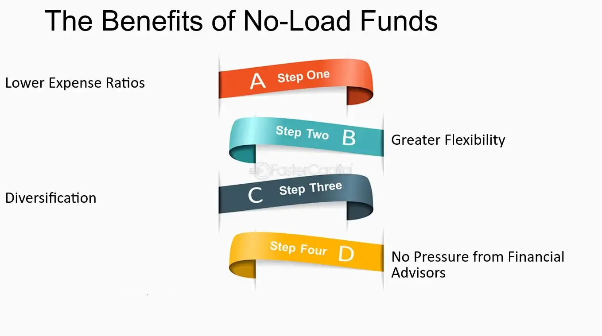

## Table of Contents

## What is a no-load fund?

A no-load fund is a type of mutual fund that does not charge any fees or commissions when you buy or sell its shares. This means you can invest in the fund without paying extra money just to get in or out of your investment. No-load funds are popular because they help investors keep more of their money working for them, instead of paying it to a broker or financial advisor.

These funds are often seen as a good choice for people who want to manage their investments themselves. Since there are no sales charges, the entire amount you invest goes directly into buying shares of the fund. However, it's important to remember that while no-load funds don't have sales charges, they might still have other fees, like management fees or expense ratios, which are costs for running the fund. Always check the fund's prospectus to understand all the fees involved.

## How does a no-load fund differ from a load fund?

A no-load fund and a load fund are both types of mutual funds, but they differ in how they charge fees. A no-load fund does not charge any fees when you buy or sell its shares. This means all your money goes directly into your investment. On the other hand, a load fund charges a fee, called a "load," when you buy or sell its shares. This fee can be a percentage of the amount you're investing or withdrawing.

The main advantage of a no-load fund is that it helps you keep more of your money working for you, since you don't have to pay extra to get in or out of the fund. This can be especially beneficial for people who want to manage their own investments without paying a broker or financial advisor. However, no-load funds might still have other fees, like management fees or expense ratios, which are costs for running the fund.

In contrast, a load fund's fees go towards paying the people who sell the fund, like brokers or financial advisors. These fees can be front-end loads, charged when you buy the fund, or back-end loads, charged when you sell the fund. While load funds might offer advice or other services, the fees can reduce the amount of money you have invested and, therefore, the potential returns on your investment.

## What are the mechanisms behind the operation of a no-load fund?

A no-load fund works by pooling money from many investors to buy a variety of investments like stocks, bonds, or other assets. When you invest in a no-load fund, you buy shares of the fund without paying any fees to get in. This means all your money goes directly into buying shares, helping your investment grow without the extra cost of a sales charge. The fund is managed by professionals who make decisions on what to buy and sell to try to achieve the fund's goals.

The value of your investment in a no-load fund changes based on how well the investments inside the fund perform. If the stocks or bonds the fund holds go up in value, the price of the fund's shares usually goes up too. If they go down, the share price drops. Besides the fund's performance, you might have to pay other fees, like management fees or expense ratios, which cover the costs of running the fund. These fees are taken out of the fund's assets, so they can affect how much your investment grows over time.

## How can an investor purchase a no-load fund?

An investor can purchase a no-load fund directly from the fund company. This means you go to the company's website or call them to buy shares. You don't need a broker or financial advisor to help you because there are no sales fees. You just need to fill out some forms, maybe set up an account, and decide how much money you want to invest. Once you do that, your money goes straight into buying shares of the fund.

Another way to buy a no-load fund is through an online brokerage platform that offers no-load funds. These platforms let you choose from many different no-load funds, and you can buy them without any sales charges. You'll still need to create an account on the platform, add money to it, and then pick the no-load fund you want to invest in. This method can be convenient if you want to manage different investments in one place.

## What are the typical fees associated with no-load funds?

No-load funds don't charge you any fees when you buy or sell the fund. But, they can still have other fees that you need to know about. One common fee is the management fee. This fee pays the people who manage the fund and make decisions about what to buy and sell. It's usually a small percentage of the fund's total assets, taken out of the fund each year.

Another fee you might see is the expense ratio. This covers the costs of running the fund, like paying for offices, staff, and other expenses. The expense ratio is also a percentage of the fund's assets, and it's taken out every year. These fees can affect how much your investment grows over time, so it's good to check them before you invest.

## What are the advantages of investing in no-load funds for beginners?

No-load funds are great for beginners because they don't charge any fees when you buy or sell them. This means all your money goes into your investment, not to pay for sales charges. This can help your investment grow more over time because you're not losing money to fees right away. For someone starting out, this can make a big difference in how much money you end up with in the long run.

Also, no-load funds are easy to buy. You can get them straight from the company that runs the fund or through an online platform. You don't need a broker or financial advisor to help you, which saves you money and keeps things simple. This makes it easier for beginners to start investing without feeling overwhelmed or needing to pay for extra help.

## How do no-load funds impact long-term investment returns?

No-load funds can help your long-term investment returns grow more because you don't pay any fees when you buy or sell them. This means all your money goes into the fund right away, instead of some of it going to pay for sales charges. Over many years, not paying these fees can make a big difference. Your investment can grow more because you're starting with more money in the fund from the beginning.

Even though no-load funds don't have sales fees, they still have other costs like management fees and expense ratios. These fees are taken out of the fund's money every year and can affect how much your investment grows over time. But, because these fees are usually lower than the sales charges you'd pay with load funds, no-load funds can still be a good choice for long-term investing. They help you keep more of your money working for you, which can lead to better returns in the long run.

## Can no-load funds be part of a diversified investment portfolio?

Yes, no-load funds can be a great part of a diversified investment portfolio. Diversifying means spreading your money across different types of investments, like stocks, bonds, and other assets. No-load funds let you do this without paying extra fees when you buy or sell them. This means more of your money can go into different investments, helping you spread out your risk. If one type of investment doesn't do well, others might help balance it out.

For example, you could put some of your money into a no-load stock fund, some into a no-load bond fund, and maybe even some into a no-load international fund. This way, you're not putting all your eggs in one basket. By using no-load funds, you keep more of your money working for you, which can help your overall investment grow over time. Plus, since no-load funds are easy to buy directly from the fund company or through an online platform, it's simple to set up a diversified portfolio without needing a financial advisor.

## What should an investor consider when choosing between different no-load funds?

When choosing between different no-load funds, an investor should first think about the fund's investment goals and how they match with their own. Some no-load funds focus on stocks, others on bonds, and some might invest in a mix of different things. You need to pick a fund that fits what you want to achieve with your money. For example, if you want to grow your money over the long term, a stock fund might be good. But if you're looking for steady income, a bond fund could be better. Also, consider the fund's past performance, but remember that past results don't guarantee future success.

Another important thing to look at is the fees and expenses of the no-load fund. Even though no-load funds don't charge you when you buy or sell, they still have other costs like management fees and expense ratios. These fees come out of the fund's money every year and can affect how much your investment grows. So, it's smart to compare these fees across different funds. The lower the fees, the more of your money stays in the fund to grow. Finally, think about the fund manager's experience and the fund's risk level. A good manager with a solid track record might help your investment do well, and knowing the risk can help you pick a fund that you're comfortable with.

## How do the performance metrics of no-load funds compare to load funds?

No-load funds and load funds both aim to grow your money, but they can have different performance metrics because of their fees. No-load funds don't charge you when you buy or sell them, so all your money goes into the fund from the start. This can help your investment grow more over time because you're not losing money to sales charges. On the other hand, load funds charge a fee when you buy or sell, which means less of your money is actually invested in the fund right away. Over many years, this difference in fees can make no-load funds perform better than load funds because more of your money is working for you.

But, it's not just about fees. The performance of both types of funds also depends on what they invest in and how well the fund managers do their job. Sometimes, load funds might offer extra services or advice that could help them perform better, but you have to pay for those services with the load fee. No-load funds usually have lower overall costs, which can lead to better long-term returns if the investments inside the fund do well. So, when comparing the performance metrics of no-load and load funds, you need to look at the whole picture, including fees, investment choices, and the fund's track record.

## What are the tax implications of investing in no-load funds?

When you invest in no-load funds, you need to think about taxes. No-load funds can create taxes in a few ways. If the fund sells investments that have gone up in value, it might have to pay capital gains taxes. These taxes are then passed on to you, the investor. You'll get a form at the end of the year telling you how much you owe. Also, if you sell your shares in the no-load fund for more than you paid, you'll have to pay capital gains tax on your profit. The tax rate depends on how long you held the shares. If you held them for more than a year, it's a long-term capital gain, which usually has a lower tax rate.

Another thing to consider is dividends. If the no-load fund you invest in pays out dividends, those are usually taxed as regular income. This means you'll have to pay taxes on them at your normal income tax rate. But, if you hold the fund in a tax-advantaged account like an IRA or 401(k), you might not have to pay taxes on the dividends or capital gains right away. Instead, you'll pay taxes when you take money out of the account. So, it's a good idea to think about where you put your no-load funds to help manage your taxes better.

## How do regulatory changes affect the availability and features of no-load funds?

Regulatory changes can have a big impact on no-load funds. When rules change, it can affect how easy it is to buy these funds and what they can do. For example, if new rules make it harder for fund companies to offer no-load funds, there might be fewer choices for investors. Also, if regulations change the way fees can be charged, it might change how much it costs to invest in no-load funds, even though they don't have sales charges. These changes can make no-load funds more or less attractive to investors, depending on what the new rules are.

Regulations can also affect the features of no-load funds. For instance, if new laws require more transparency, no-load funds might have to share more information about their investments and fees. This can help investors make better choices, but it can also mean more work for the fund companies. Sometimes, new rules can lead to new types of no-load funds being created, or existing funds might have to change what they invest in to meet the new requirements. Keeping up with these changes is important for investors who want to understand how their no-load funds might be affected.

## What are the benefits and risks of no-load funds?

No-load funds present a lucrative opportunity for investors aiming to maximize their initial capital outlay without incurring upfront fees. These investments eliminate sales charges, allowing individuals to invest every dollar without deductions, effectively increasing the sum that benefits from potential market growth. An attractive feature of no-load funds is their typically lower expense ratios. This cost-efficiency arises from the absence of commission costs, which can eat into investment returns. The expense ratio, a crucial metric, is calculated as follows:

$$
\text{Expense Ratio} = \frac{\text{Total Fund Costs}}{\text{Total Fund Assets}}
$$

By removing commission fees, no-load funds often exhibit more favorable expense ratios compared to their load fund counterparts.

However, the absence of sales charges comes with its own set of challenges. One primary concern is the potential lack of personalized guidance that brokers traditionally provide in load fund scenarios. Brokers play a pivotal role in advising on fund selection based on an investor's financial goals and risk tolerance. Without this assistance, investors may find themselves navigating investment decisions without expert guidance, which may be daunting for novice investors.

Prospective investors should conduct due diligence before committing to no-load funds, emphasizing an evaluation of fund management and historical performance. It is essential to remain vigilant about any hidden fees that might offset the cost benefits, such as maintenance or management fees that are still included in the fund's operating expenses.

While no-load funds present numerous advantages, they are not universally beneficial for every investor. For those who lack investment experience, the absence of professional advice could result in suboptimal investment choices. Additionally, some specific investment strategies or niche markets may not be covered extensively by available no-load funds, limiting the potential investment scope. Therefore, investors need to weigh these pros and cons carefully, tailor their decisions to their personal financial situation, and select funds that align best with their long-term investment goals.

## References & Further Reading

[1]: ["Common Sense on Mutual Funds: Fully Updated 10th Anniversary Edition"](https://www.amazon.com/Common-Sense-Mutual-Funds-Anniversary/dp/0470138130) by John C. Bogle

[2]: ["The Bogleheads' Guide to Retirement Planning"](https://www.bogleheads.org/wiki/Bogleheads%27_Guide_to_Retirement_Planning) by Taylor Larimore, Mel Lindauer, Richard A. Ferri, and Laura F. Dogu

[3]: Jensen, M. C. (1968). ["The Performance of Mutual Funds in the Period 1945–1964."](https://onlinelibrary.wiley.com/doi/full/10.1111/j.1540-6261.1968.tb00815.x) Journal of Finance, 23(2), 389-416.

[4]: Arnott, R. D., Berkin, A. L., & Ye, J. (2000). ["How well have taxable investors been served in the 1980s and 1990s?"](https://www.evidenceinvestor.com/wp-content/uploads/2016/08/How-Well-Have-Taxable-Investors-Been-Served-in-the-1980%E2%80%99s-and-1990%E2%80%99s-Robert-D.-Arnott-Andrew-L.-Berkin-Jia-Ye.pdf) Journal of Portfolio Management, 26(4), 84-92.

[5]: ["The Intelligent Investor: The Definitive Book on Value Investing"](https://www.amazon.com/Intelligent-Investor-Definitive-Investing-Essentials/dp/0060555661) by Benjamin Graham

[6]: Chordia, T., Roll, R., & Subrahmanyam, A. (2005). ["Evidence on the Speed of Convergence to Market Efficiency."](https://www.anderson.ucla.edu/documents/areas/fac/finance/17-01.pdf) Journal of Financial Economics, 76(2), 271-292.

[7]: Hasbrouck, J., & Saar, G. (2013). ["Low-latency trading."](https://papers.ssrn.com/sol3/papers.cfm?abstract_id=1695460) Review of Financial Studies, 26(9), 2585-2624.

[8]: ["No-Load Mutual Fund Guide, 2001"](https://www.kiplinger.com/investing/mutual-funds/602176/kip-25-best-low-fee-mutual-funds) by Sheldon Jacobs

[9]: Treynor, J. L., & Mazuy, K. (1966). ["Can Mutual Funds Outguess the Market?"](https://www.semanticscholar.org/paper/Can-mutual-funds-outguess-the-market-Harvard-Review-Treynor-Mazuy/46f77dbcc3c07c1475640aa0a4ef4a957c026d99) Harvard Business Review, 44(4), 131-136.

[10]: ["The Little Book of Common Sense Investing: The Only Way to Guarantee Your Fair Share of Stock Market Returns"](https://www.amazon.com/Little-Book-Common-Sense-Investing/dp/1119404509) by John C. Bogle