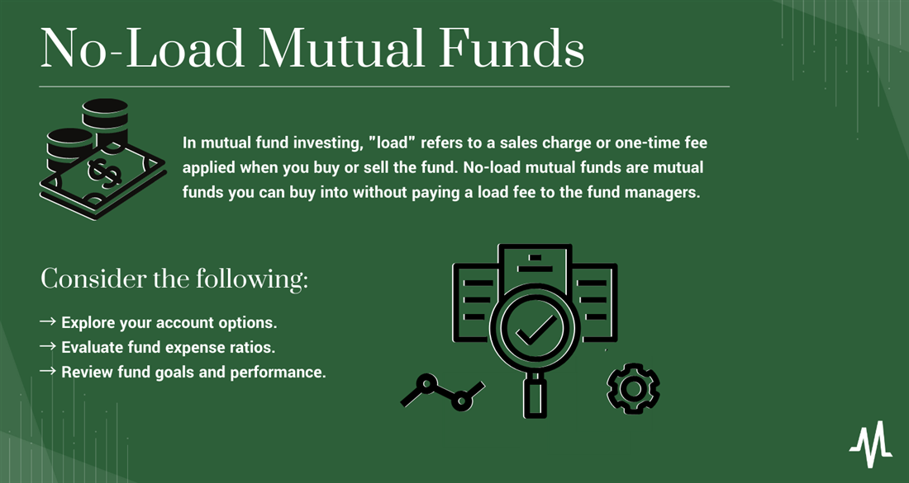

The world of investing is vast and often complex, with mutual funds playing an integral role in many investment strategies. Mutual funds pool money from multiple investors to purchase a diversified portfolio of stocks, bonds, or other securities, which professional managers oversee to achieve specific financial goals. One popular type of mutual fund is the no-load fund, which presents an advantageous opportunity by eliminating sales commissions or fees related to the purchase or sale of shares. This absence of charges allows investors to allocate the full amount of their investment into the fund itself, potentially maximizing the growth of their capital.

As technology advances, algorithmic trading is increasingly transforming the investment landscape, including the management of mutual funds. Algorithmic trading involves the use of computer programs to execute trades based on pre-defined sets of rules and criteria. This technological innovation brings several benefits, such as enhanced trade execution speed, improved efficiency, and a reduction in human error and emotional bias, which can significantly impact trading outcomes.

This article aims to explore the interplay between no-load mutual funds and algorithmic trading, providing insights into how these elements can be effectively leveraged to achieve investment success. By evaluating the benefits that each brings, we can better understand how they contribute to evolving investment strategies.

## Table of Contents

## Understanding No-Load Funds

No-load funds are a type of mutual fund designed to eliminate sales commissions, allowing investors to buy or sell shares without incurring the additional fees that are typical with load funds. This structure provides a significant advantage as the entire investment amount is allocated directly into the fund, thereby maximizing the potential for growth. The elimination of sales charges makes these funds particularly attractive for cost-conscious investors, as they allow more of the investor’s money to work actively in the market.

These funds are primarily marketed through investment companies rather than brokers. This direct marketing approach is crucial because it circumvents traditional brokers who often require compensation through commissions. By avoiding intermediaries, no-load funds are able to offer investors straightforward access at a reduced cost.

However, despite the absence of sales charges, no-load funds are not devoid of fees. Investors need to be cognizant of the expense ratio associated with these funds. The expense ratio is a measure of what it costs to operate a mutual fund, expressed as a percentage of the fund's average net assets. It includes management fees, administrative fees, and other operational costs. While no-load funds avoid explicit sales fees, the expense ratio can still impact the fund’s net return on investment. For instance, a higher expense ratio can erode the overall returns, offsetting the advantages of commission-free transactions.

Managing these costs is crucial for investors aiming to optimize their investment returns. To evaluate no-load funds effectively, investors should compare expense ratios alongside other performance metrics. A lower expense ratio often indicates a more efficiently managed fund, which can contribute to higher net returns over time. Therefore, understanding the nuances of fees, including the expense ratio, is essential for making informed investment decisions in no-load mutual funds.

## Advantages of No-Load Mutual Funds

No-load mutual funds present numerous advantages primarily because they eliminate entry and [exit](/wiki/exit-strategy) fee burdens commonly associated with load funds. By not charging sales commissions, these funds allow investors to fully allocate their capital into the investment itself, enhancing the potential for higher returns. This lack of fees is particularly beneficial over the long term, as even marginal reductions in costs can lead to substantial portfolio growth due to compounding effects.

One of the core strengths of no-load mutual funds is the increased control they afford investors over their investment decisions. Without brokers as intermediaries demanding commissions, investors retain more autonomy in choosing and managing funds that align with their financial objectives and risk preferences. This autonomy can empower investors, allowing them to strategically adjust their investment portfolios in response to market dynamics without incurring additional costs.

For seasoned investors, no-load mutual funds offer a cost-effective strategy for diversifying and managing portfolios. The absence of sales charges means that investors can allocate their resources across a wider array of investments without diminishing returns through fees. This diversification is crucial in mitigating risk, as it allows for exposure to various assets and market sectors, potentially lowering the impact of individual market fluctuations on the overall portfolio.

In sum, no-load mutual funds combine lower cost structures with enhanced investor control to provide a compelling option for individuals aiming to optimize their investment outcomes. These advantages underline the potential of no-load funds to outperform load funds, especially for self-directed investors who value both autonomy and cost-efficiency in their investment strategies.

 to Algorithmic Trading

Algorithmic trading, often referred to as algo-trading, employs sophisticated computer programs to execute trades rapidly and efficiently based on a predetermined set of criteria. These criteria can include predefined instructions for a range of variables such as timing, price, or [volume](/wiki/volume-trading-strategy), thus automating the trading process.

The primary appeal of [algorithmic trading](/wiki/algorithmic-trading) lies in its speed and efficiency. Unlike traditional manual trading, algorithms can process vast quantities of data and execute orders at speeds far beyond human capability. For instance, an algorithm might be programmed to buy a stock when its 50-day moving average exceeds its 200-day moving average, a popular trading strategy known as the "golden cross". This example illustrates how algorithms can continually scan markets for such opportunities, acting immediately when predefined conditions are met.

Moreover, algorithmic trading significantly reduces the likelihood of human error or emotional bias influencing trading decisions. Emotional factors such as fear or overconfidence can lead to suboptimal trading decisions. By relying on pre-set criteria, algorithmic trading ensures that trades are executed based on logical data analysis rather than human emotion.

In the context of mutual funds, which manage a diversified portfolio of financial instruments, algorithmic trading enhances trade execution. Algorithms can optimize the buying and selling process by accessing real-time data streams, thus ensuring that mutual funds achieve the best possible prices. This capability is particularly beneficial during periods of market [volatility](/wiki/volatility-trading-strategies), when swift trades can capitalize on short-lived pricing anomalies. As a result, mutual funds utilizing algorithmic trading can potentially offer better returns to their investors.

Furthermore, algorithmic trading enables funds to execute large orders without causing significant market impact. Strategies such as volume-weighted average price (VWAP) or time-weighted average price (TWAP) algorithms break down large orders into smaller chunks executed over time, minimizing price distortions and market impact.

With the continued advancement of technology, algorithmic trading has become a cornerstone of modern investing, providing a powerful tool to increase efficiency and effectiveness in trade execution for mutual funds and other financial instruments.

## The Impact of Algorithmic Trading on Mutual Funds

Algorithmic trading is revolutionizing the structure and functioning of mutual funds, with notable implications for cost management and trading performance. By automating the trading process, algorithmic systems can effectively reduce transaction costs. This efficiency stems from the ability to take advantage of optimal trading conditions, such as the best prices and times for executing a trade, based on real-time analysis and vast data sets.

Algorithmic trading technology enables mutual funds to execute trades with remarkable speed and precision. This capability often surpasses manual trading, which can be hampered by human error or delay. Algorithms process vast amounts of data within milliseconds, making well-informed trade decisions that can capitalize on fleeting market opportunities. For instance, a trading algorithm programmed to buy a particular stock when its price drops to a specific point can automatically execute the purchase without delay, ensuring that the fund secures the stock at the lowest possible price.

In addition to improving trading efficiency, algorithmic trading provides significant support in navigating market volatility. Volatile markets can present unique challenges and risks for investors and fund managers alike. Automated systems can monitor market fluctuations continuously and adjust trading strategies in real-time to mitigate potential losses while exploiting opportunities for gains. This real-time adaptability is crucial for enhancing mutual fund performance, especially during periods of high volatility.

The integration of algorithmic trading in mutual funds also contributes to better fund management through improved [liquidity](/wiki/liquidity-risk-premium) and reduced market impact. By staggering large trades into smaller, less conspicuous transactions, algorithms can minimize the market impact, ensuring that the fund's trading activities do not adversely affect the stock prices. Furthermore, these systems can guarantee enhanced liquidity by executing trades in global markets round the clock, aligning with the fund's strategic objectives and liquidity requirements.

In summary, algorithmic trading technology in mutual funds allows for the realization of rapid, data-driven, and unbiased trading decisions. It minimizes transaction costs, improves liquidity, and enhances trading efficacy, which collectively contribute to optimizing the overall returns of mutual funds. These advantages provide fund managers with a robust tool to improve investor outcomes, leveraging technology to enhance traditional investment strategies.

## Comparing Load and No-Load Funds

Load funds and no-load funds represent two distinct types of mutual fund investments that cater to different investor needs and preferences. Load funds require investors to pay a commission, also known as a sales charge, at the time of purchase or sale. This commission is typically used to compensate financial advisors and brokers who provide personalized advisory services, helping investors choose suitable investments based on their financial objectives and risk tolerance. The sales charge in load funds can be categorized into front-end loads, which are levied at the purchase time, and back-end loads, which are incurred when selling shares.

Conversely, no-load funds do not impose any commissions or fees for buying or selling shares, making them a more cost-effective choice for many investors. This absence of sales charges allows investors to fully allocate their capital into the fund, potentially enhancing their overall returns. No-load funds are directly marketed by investment companies, bypassing brokers and financial advisors. As a result, they appeal to self-directed investors who prefer to make independent investment decisions without incurring additional costs for advisory services. Despite the elimination of sales charges, investors in no-load funds should remain conscious of the expense ratio, which represents the fund's operational costs, as it can still impact overall performance.

Both load and no-load funds have their respective merits, with the choice between them largely depending on individual investor preferences and goals. Load funds might be suitable for investors who value personalized financial advice and are willing to pay a premium for it. These investors typically appreciate the guidance and expertise provided by financial advisors, which can be particularly beneficial for less experienced investors or those seeking to tailor their investment strategy to specific financial goals.

On the other hand, no-load funds are often preferred by cost-conscious, self-directed investors who possess the knowledge and confidence to manage their portfolios independently. By avoiding sales charges, these investors can maximize their investment capital and potentially achieve higher returns over the long term. Ultimately, investors must carefully evaluate their financial goals, risk tolerance, and the level of professional guidance they require when deciding between load and no-load funds.

In summary, while load funds offer the advantage of personalized services for those who need assistance, no-load funds provide a low-cost vehicle managed independently by knowledgeable investors. An informed decision takes both cost structures and the need for advisory support into account, ensuring alignment with the investor’s financial strategy and objectives.

## Conclusion: Making Informed Investment Decisions

In making informed investment decisions, investors should meticulously weigh the advantages and disadvantages of no-load mutual funds in contrast to the professional guidance typical of load funds. No-load funds present a compelling option for self-directed investors focused on reducing costs, allowing the entirety of their capital to be invested without the hindrance of sales commissions. This cost-effective approach can be particularly appealing to those with a robust understanding of market dynamics and investment strategies who wish to maintain control over their portfolios.

However, load funds can offer the benefit of personalized advisory services, which may be valuable for individuals seeking expert guidance in portfolio management and navigation of complex financial landscapes. The presence of these services might justify the associated commissions for those who prioritize professional insights over self-directed investment.

The integration of algorithmic trading strengthens modern fund management by introducing a technological advantage that supports increased efficiencies and potential returns. Algorithmic trading executes trades based on pre-defined criteria, leveraging real-time data to minimize human error and emotional bias, which are often detrimental to trading success. This technological advancement enhances the precision and speed of trades, offering mutual funds an edge in swiftly responding to market conditions and optimizing investment returns.

A comprehensive investment strategy should encompass an assessment of fee structures, fund performance, and the technological innovations available in trading. The choice between load and no-load funds should align with the investor’s financial objectives, risk tolerance, and desire for professional services versus self-management. By considering these factors, investors can craft a balanced investment approach that leverages the strengths of both fund types and the efficiencies derived from algorithmic trading.

## References & Further Reading

[1]: ["Common Sense on Mutual Funds: New Imperatives for the Intelligent Investor"](https://www.amazon.com/Common-Sense-Mutual-Funds-Imperatives/dp/0471392286) by John C. Bogle

[2]: DeFusco, R. A., McLeavey, D. W., Pinto, J. E., & Runkle, D. E. (2015). ["Quantitative Investment Analysis"](https://www.amazon.com/Quantitative-Investment-Analysis-Richard-DeFusco/dp/0470052201). CFA Institute Investment Series.

[3]: Fabozzi, F. J., & Markowitz, H. M. (2011). ["The Theory and Practice of Investment Management"](https://onlinelibrary.wiley.com/doi/book/10.1002/9781118267028). Wiley Finance.

[4]: Aldridge, I. (2013). ["High-Frequency Trading: A Practical Guide to Algorithmic Strategies and Trading Systems"](https://www.amazon.com/High-Frequency-Trading-Practical-Algorithmic-Strategies/dp/1118343506). Wiley Trading.

[5]: Vanstone, B., & Finnie, G. (2009). ["Machine Learning and the Stock Market: An Evaluation of Technical Analysis"](https://www.semanticscholar.org/paper/An-empirical-methodology-for-developing-stockmarket-Vanstone-Finnie/c9f21e8c5c641082b0f52868dd7f284ce06be114). AI * Economics '09.