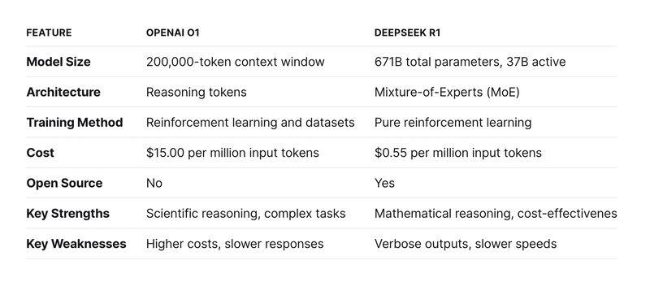

## Table of Contents

## What is No One Right Answer (Nora) in machine learning?

No One Right Answer (Nora) is a concept in machine learning that highlights the idea that there isn't always a single correct solution to a problem. In many cases, different approaches can yield good results, and what works best can depend on the specific situation or dataset. This concept encourages flexibility and creativity in problem-solving, reminding machine learning practitioners that they should try different methods and not get stuck on finding the "perfect" solution.

For example, when choosing a model for a classification task, one might consider using a decision tree, a neural network, or a support vector machine. Each of these models has its strengths and weaknesses, and the best choice might vary depending on the nature of the data and the specific goals of the project. By understanding and embracing the Nora principle, practitioners can explore a variety of models and techniques, improving their chances of finding a solution that works well for their particular needs.

## How does Nora differ from traditional machine learning approaches?

Traditional machine learning approaches often focus on finding the best model for a given problem by comparing different algorithms and choosing the one that performs the best according to certain metrics, like accuracy or error rate. These approaches tend to emphasize a step-by-step process where you select a model, train it, test it, and then refine it until you achieve the best possible performance. The goal is to find the "right" answer, which is the model that gives the highest performance on the validation data.

In contrast, No One Right Answer (Nora) acknowledges that there might be multiple good solutions to a problem, and the best approach can vary depending on the context. Nora encourages trying out different methods and being open to the idea that what works well in one situation might not be the best in another. For example, a simple model like a decision tree might work well for one dataset, while a more complex model like a neural network might be better for another. By embracing Nora, machine learning practitioners can be more flexible and creative, exploring various options and adapting their approach based on the specific needs of each project.

## What are the key principles behind the Nora approach?

The Nora approach in [machine learning](/wiki/machine-learning) is based on the idea that there isn't just one right way to solve a problem. Instead, there can be many good ways to do things, and what works best can change depending on the situation. This means that when you're working on a machine learning project, you should try out different methods and not get stuck on finding the perfect solution. For example, if you're trying to predict something, you might use a simple model like a decision tree or a more complex one like a [neural network](/wiki/neural-network). Both could work well, but which one is better might depend on your specific data and goals.

Another key principle of Nora is being flexible and creative. Instead of following a strict set of steps to find the best model, you should be open to trying new things and adapting your approach as you learn more about your data. This can help you find solutions that might not be obvious at first but could work really well for your particular problem. By embracing the idea that there's no one right answer, you can explore a wider range of possibilities and improve your chances of finding a good solution that fits your needs.

## Can you explain a simple example of how Nora would be applied in a machine learning project?

Imagine you're working on a project to predict whether it will rain tomorrow based on today's weather data. A traditional approach might involve trying out a few models like logistic regression, decision trees, and maybe a simple neural network. You'd compare their performance using a metric like accuracy, and then you'd choose the one that gives the best results as your final model.

With the Nora approach, you'd start by trying those same models, but you wouldn't stop there. You'd also experiment with other types of models, like k-nearest neighbors or even ensemble methods that combine several models. You might find that a simple decision tree works well for one dataset, but a more complex ensemble model performs better on another. The key is to be open to different possibilities and not just focus on finding the "best" model, but rather finding a model that works well for your specific situation.

For example, you might write a simple Python script to compare different models:

```python
from sklearn.model_selection import train_test_split
from sklearn.metrics import accuracy_score
from sklearn.tree import DecisionTreeClassifier
from sklearn.neural_network import MLPClassifier
from sklearn.neighbors import KNeighborsClassifier

# Assume X and y are your features and labels
X_train, X_test, y_train, y_test = train_test_split(X, y, test_size=0.2, random_state=42)

# Decision Tree
dt_model = DecisionTreeClassifier()
dt_model.fit(X_train, y_train)
dt_predictions = dt_model.predict(X_test)
dt_accuracy = accuracy_score(y_test, dt_predictions)
print(f"Decision Tree Accuracy: {dt_accuracy}")

# Neural Network
nn_model = MLPClassifier()
nn_model.fit(X_train, y_train)
nn_predictions = nn_model.predict(X_test)
nn_accuracy = accuracy_score(y_test, nn_predictions)
print(f"Neural Network Accuracy: {nn_accuracy}")

# K-Nearest Neighbors
knn_model = KNeighborsClassifier()
knn_model.fit(X_train, y_train)
knn_predictions = knn_model.predict(X_test)
knn_accuracy = accuracy_score(y_test, knn_predictions)
print(f"K-Nearest Neighbors Accuracy: {knn_accuracy}")
```

By running this script, you can see how different models perform on your data. You might find that the decision tree works best, or you might decide to try another model or even combine them. The Nora approach encourages you to keep experimenting and adapting until you find a solution that fits your needs.

## What types of problems are best suited for the Nora approach?

The Nora approach works well for problems where there's no clear best way to solve them. These are often problems where the data can be complex and change a lot, or where what you want to achieve might be different each time. For example, if you're trying to predict how people will vote in an election, different models might work better depending on the specific election and the data you have. Nora helps by encouraging you to try out many different methods and see what works best for your situation.

Another type of problem where Nora is useful is when you're working on something new or unusual. If you're trying to predict something that hasn't been done much before, like how a new type of plant will grow, you might need to try lots of different models to find one that works. Nora reminds you to be creative and flexible, and not to give up if the first few models you try don't work well. By being open to different possibilities, you can find a solution that fits your unique problem.

## How does Nora handle uncertainty and ambiguity in data?

Nora helps handle uncertainty and ambiguity in data by encouraging you to try out many different models and approaches. When your data is uncertain or hard to understand, it's not always clear which model will work best. Nora reminds you that it's okay to experiment and see what fits your data the best. For example, if you're trying to predict the weather and your data is all over the place, you might start with a simple model like a decision tree, but then try a more complex model like a neural network to see if it handles the uncertainty better.

By being open to different possibilities, Nora helps you find a solution that works well even when your data is messy or unpredictable. Instead of getting stuck trying to find the perfect model, you can keep trying different things until you find something that gives you good results. This approach is especially useful when you're dealing with new or unusual problems where there's no clear answer, helping you to adapt and learn as you go.

## What are the advantages of using Nora over other machine learning methods?

The Nora approach in machine learning offers flexibility and creativity that other methods might not. When you use Nora, you're encouraged to try out lots of different models and techniques. This is really helpful when you're working with data that's hard to understand or changes a lot. Instead of sticking to one way of doing things, you can keep experimenting until you find what works best for your specific problem. This means you're more likely to find a good solution, even if it's not the one you expected at the start.

Another advantage of Nora is that it helps you deal with new or unusual problems. If you're trying to predict something that hasn't been done before, Nora reminds you to be open to trying different things. This can lead to finding solutions that might not be obvious but work really well. By embracing the idea that there's no one right answer, you can adapt and learn as you go, making it easier to handle uncertainty and ambiguity in your data.

## What are the potential challenges or limitations when implementing Nora?

One challenge of using the Nora approach is that it can take a lot of time and effort. Since Nora encourages you to try out many different models and methods, you might need to spend more time experimenting and testing than you would with a more traditional approach. This can be tough if you're working on a project with a tight deadline or if you don't have a lot of resources. Also, because you're trying so many different things, it can be hard to keep track of all your experiments and results, which might make it confusing to figure out which solution is actually the best for your problem.

Another limitation is that Nora might lead to overfitting if you're not careful. When you try lots of different models, you might find one that works really well on your specific dataset, but it might not work as well on new data. This is because the model could be too closely fitted to the quirks of your training data. To avoid this, you need to make sure you're using good practices like cross-validation and keeping a separate test set to check your model's performance. By being aware of these challenges and taking steps to manage them, you can still benefit from the flexibility and creativity that Nora offers.

## How can Nora be integrated with other machine learning techniques?

Nora can be integrated with other machine learning techniques by using it as a guiding principle to explore and combine different methods. For example, you might start with a traditional approach like linear regression to get a baseline understanding of your data. Then, you can use Nora to experiment with other models like decision trees, random forests, or even neural networks. By trying out these different techniques, you can see which one works best for your specific problem and dataset. You might find that combining models, like using an ensemble method, gives you even better results. This way, Nora encourages you to be flexible and creative, integrating various machine learning techniques to find the best solution.

Another way to integrate Nora with other machine learning techniques is through iterative refinement. You could begin with a simple model and then use Nora to explore more complex models or different preprocessing techniques. For instance, you might try different feature selection methods or data transformations to see how they affect your model's performance. By continually experimenting and refining your approach, you can leverage the strengths of different machine learning techniques while keeping the Nora principle in mind. This iterative process helps you adapt to the nuances of your data and find a solution that might not be obvious at first but works well for your specific needs.

## What metrics are used to evaluate the performance of a Nora-based model?

When you use the Nora approach in machine learning, you can use the same metrics as you would with other models to see how well they're doing. Common metrics include accuracy, which tells you how often your model gets the right answer, and error rate, which tells you how often it gets it wrong. For example, if you're trying to predict if it will rain, accuracy would show you the percentage of times your model correctly predicts rain or no rain. You might also use metrics like precision and recall, which are useful when you care more about certain types of correct predictions. Precision tells you how many of the positive predictions were actually correct, while recall tells you how many of the actual positive cases your model caught.

Another important metric is the F1 score, which is a way to balance precision and recall into one number. The F1 score is calculated as $$F1 = 2 \times \frac{precision \times recall}{precision + recall}$$. This can be helpful when you want a single number to compare different models. You might also use metrics like mean squared error (MSE) or mean absolute error (MAE) if you're working on a problem where you're trying to predict a number, like the temperature. These metrics help you see how far off your predictions are on average. By using these different metrics, you can get a good idea of how well your Nora-based models are performing and choose the one that works best for your specific problem.

## Can you discuss a case study where Nora significantly improved model performance?

In a case study involving predicting customer churn for a telecom company, the Nora approach significantly improved model performance. The initial model used was a logistic regression, which gave an accuracy of about 75%. The team decided to embrace Nora and tried different models, including decision trees, random forests, and even a simple neural network. They found that a random forest model performed the best, increasing the accuracy to 85%. This improvement was crucial for the company because it allowed them to better identify customers at risk of leaving and take action to retain them.

To ensure the random forest model was not overfitting, the team used cross-validation and kept a separate test set. They calculated the F1 score, which is a balance between precision and recall, and found it to be $$F1 = 2 \times \frac{precision \times recall}{precision + recall} = 0.82$$. This high F1 score confirmed that the model was not only accurate but also good at identifying the customers most likely to churn. By experimenting with different models and techniques, the Nora approach helped the team find a solution that was significantly better than their initial model, demonstrating the value of flexibility and creativity in machine learning.

## What are the future research directions for Nora in machine learning?

One promising future direction for Nora in machine learning is to explore how it can be used with automated machine learning (AutoML) tools. AutoML systems can automatically try out lots of different models and find the best one for a problem. By using Nora, these systems could be even better at finding good solutions because they would be encouraged to keep trying different things and not just stick to one way of doing things. This could make AutoML even more useful for people who want to solve machine learning problems without having to be experts in the field.

Another important area for future research is how Nora can help with handling new types of data, like images, sound, or text. These kinds of data can be really hard to work with because they're often messy and change a lot. Nora could help by encouraging researchers to try out lots of different models and techniques, like [deep learning](/wiki/deep-learning), to see what works best. By being open to different possibilities, Nora could lead to finding better ways to predict things from these complex data types. This could be really useful for things like understanding what people are saying in a video or predicting what a picture shows.