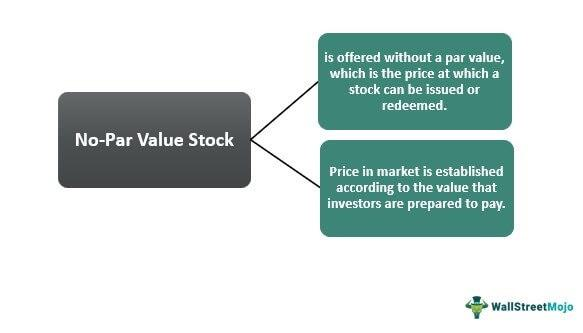

## Table of Contents

## What is no-par value stock?

No-par value stock is a type of stock that does not have a stated face value or par value. Instead of being assigned a fixed value per share, the value of no-par stock is determined by the amount of money that investors are willing to pay for it in the market. This means that the price of no-par value stock can fluctuate based on supply and demand, making it more reflective of the company's actual market value.

Companies might choose to issue no-par value stock for several reasons. One reason is to avoid the legal liabilities that can come with setting a par value, which can be seen as a minimum price for the stock. If the stock is sold below this par value, it could lead to legal issues. By issuing no-par value stock, companies can set the price freely and avoid these potential problems. Additionally, no-par value stock can be more attractive to investors because it simplifies the pricing and eliminates the risk of the stock being sold below its par value.

## How does no-par value stock differ from par value stock?

No-par value stock and par value stock are different in how they set their value. Par value stock has a fixed face value printed on the stock certificate. This value is set by the company and is the minimum price at which the stock can be sold. If the stock is sold for less than this par value, it can cause legal issues for the company. On the other hand, no-par value stock does not have this fixed value. Instead, its price is determined by what investors are willing to pay in the market. This makes the price of no-par value stock more flexible and reflective of the company's actual market value.

Companies might choose to issue no-par value stock to avoid the complications that come with setting a par value. With no-par value stock, there's no risk of selling the stock below a set minimum price, which can prevent legal problems. It also makes it easier for companies to set the stock price freely based on market conditions. For investors, no-par value stock can be more appealing because it simplifies the pricing and removes the risk of the stock being sold below its par value. This can make investing in no-par value stock less complicated and more attractive.

## Why would a company issue no-par value stock?

A company might choose to issue no-par value stock because it gives them more flexibility in setting the price of their stock. When a company issues no-par value stock, they don't have to set a fixed minimum price like they do with par value stock. This means they can sell the stock for whatever amount they think is right based on what people are willing to pay in the market. It's like selling a house without a fixed price, so you can adjust it depending on how much buyers are offering.

Another reason is that issuing no-par value stock can help a company avoid legal problems. If a company issues par value stock and then sells it for less than the par value, it can get into trouble. But with no-par value stock, there's no set minimum price, so there's no risk of breaking any rules about selling below a certain price. This makes things simpler and safer for the company. Plus, investors might find no-par value stock easier to understand and more appealing because it's straightforward and there's no worry about the stock being sold for less than it's supposed to be worth.

## What are the advantages of no-par value stock for a company?

Issuing no-par value stock gives a company more freedom to set the price of their stock. Unlike par value stock, which has a fixed minimum price, no-par value stock can be sold for whatever amount the company thinks is fair based on what people are willing to pay. This means the company can adjust the price to match what's happening in the market. It's like selling something without a fixed price tag, so you can change the price depending on how much buyers are offering.

Another big advantage is that no-par value stock helps a company avoid legal problems. If a company issues par value stock and then sells it for less than the par value, it can get into trouble. But with no-par value stock, there's no set minimum price, so there's no risk of breaking any rules about selling below a certain price. This makes things simpler and safer for the company. Plus, investors might find no-par value stock easier to understand and more appealing because it's straightforward and there's no worry about the stock being sold for less than it's supposed to be worth.

## Are there any disadvantages to issuing no-par value stock?

Issuing no-par value stock might make it harder for a company to figure out how much money they have. When a company sells par value stock, they can easily tell how much money they get from selling it because there's a set price. But with no-par value stock, the price can change a lot. This can make it tricky for the company to know exactly how much money they will make from selling their stock.

Also, some investors might feel unsure about no-par value stock. They might like knowing that there's a set minimum price with par value stock. It can make them feel safer about their investment. With no-par value stock, the price can go up and down more easily, which might make some investors nervous. So, even though no-par value stock can be good for the company in some ways, it might not be as popular with all investors.

## How is no-par value stock accounted for on a company's balance sheet?

When a company issues no-par value stock, the money they get from selling the stock goes into a part of their balance sheet called "Share Capital" or "Paid-in Capital." Since no-par value stock doesn't have a fixed price, the amount of money the company gets can change. They just write down the total amount of money they received from selling the stock in this section.

This can make things a bit trickier for the company because they don't have a set number to work with. But it's also simpler in a way because they don't have to worry about splitting the money into different parts like they do with par value stock. With par value stock, they have to show the par value in one part and any extra money they got above the par value in another part called "Additional Paid-in Capital." With no-par value stock, they just put all the money they got into one place, which can make their balance sheet easier to understand.

## What impact does no-par value stock have on shareholders?

No-par value stock can affect shareholders in a few ways. For one, it might make them feel a bit less secure about their investment. When a company sells par value stock, there's a set minimum price that can make shareholders feel safer because it's like a promise that the stock won't be sold for less than that amount. But with no-par value stock, there's no set minimum price, so the stock's value can change more easily. This might make some shareholders nervous, especially if they like having a fixed number to rely on.

On the other hand, no-par value stock can also be good for shareholders. Because the price of no-par value stock can change freely, it might be easier for the company to set a price that's fair and matches what's happening in the market. This can help the stock's value go up if the company is doing well. Plus, it can make things simpler for shareholders because they don't have to worry about the stock being sold below a certain price. So, even though no-par value stock can be a bit scary because of its flexibility, it can also make investing easier and more straightforward.

## Can no-par value stock be assigned a stated value, and if so, how?

Yes, a company can assign a stated value to no-par value stock. This is done by the company's board of directors, who choose a specific amount to be the stated value per share. This stated value acts a bit like a par value, but it's more flexible because the company can change it if they want to. When the company sells the stock, they record the stated value in the "Share Capital" part of their balance sheet, and any money they get above the stated value goes into "Additional Paid-in Capital."

Assigning a stated value can help make things clearer for both the company and the shareholders. It gives shareholders a bit more of a sense of security because there's a set number they can look at, even though it's not a legal minimum like with par value stock. For the company, it can make accounting easier because they have a set number to work with, even though the price they actually sell the stock for can still change. So, while no-par value stock doesn't have to have a stated value, adding one can make things simpler and more straightforward for everyone involved.

## How do regulatory requirements differ for no-par value stock compared to par value stock?

Regulatory requirements for no-par value stock are usually less strict than for par value stock. With par value stock, companies have to be careful because if they sell the stock for less than the par value, it can cause legal problems. This is called selling stock at a discount, and it's something companies need to avoid. But with no-par value stock, there's no set minimum price, so companies don't have to worry about breaking rules about selling below a certain price. This makes things simpler for them because they can set the price freely based on what people are willing to pay.

Even though no-par value stock has fewer strict rules, companies still need to follow some basic regulations. They have to make sure they're being honest about the stock's value and not misleading investors. They also need to keep good records of how much money they get from selling the stock. But overall, the rules are easier to follow with no-par value stock because there's no fixed price to worry about. This can make it easier for companies to manage their stock and for investors to understand what they're buying.

## What historical context led to the development of no-par value stock?

The idea of no-par value stock came about because companies wanted more freedom to set the price of their stock. Back in the old days, most stocks had a par value, which was a set minimum price. This could cause problems for companies because if they sold the stock for less than the par value, they could get into legal trouble. So, companies started looking for a way to avoid these issues. They realized that if they didn't set a par value, they could sell the stock for whatever price they wanted, based on what people were willing to pay.

This change happened over time as more and more companies saw the benefits of no-par value stock. It made things simpler for them because they didn't have to worry about selling below a certain price. It also made it easier for them to adjust the stock price to match what was happening in the market. Investors liked it too because it was straightforward and there was no risk of the stock being sold for less than it was supposed to be worth. Over the years, no-par value stock became more common, and now many companies use it to make their stock sales easier and more flexible.

## How do market perceptions of no-par value stock compare to those of par value stock?

Market perceptions of no-par value stock can be different from those of par value stock. Some investors might feel safer with par value stock because it has a set minimum price. This fixed price can make them feel like their investment is more secure. They know that the company can't sell the stock for less than the par value, which gives them a sense of stability. On the other hand, no-par value stock doesn't have this fixed price, so its value can change more easily. This might make some investors nervous because they like having a set number to rely on.

But no-par value stock can also be seen as a good thing by other investors. Because there's no set minimum price, the company can set the stock price freely based on what's happening in the market. This can make the stock's value go up if the company is doing well. Plus, it can make investing easier because there's no worry about the stock being sold below a certain price. So, while some investors might prefer the security of par value stock, others might like the flexibility and simplicity that comes with no-par value stock.

## What are the tax implications for companies issuing no-par value stock?

When a company issues no-par value stock, the tax implications are usually pretty straightforward. The money they get from selling the stock is considered part of their capital, and it's not taxed as income right away. Instead, it's recorded on their balance sheet as "Share Capital" or "Paid-in Capital." This means the company doesn't have to pay taxes on this money until they make a profit and decide to distribute it to shareholders as dividends.

However, there can be some small differences in how no-par value stock is treated for tax purposes compared to par value stock. With par value stock, the company has to split the money they get into two parts: the par value goes into "Share Capital," and any extra money goes into "Additional Paid-in Capital." But with no-par value stock, they just put all the money into one place. This can make things simpler for the company when they're doing their taxes because they don't have to worry about dividing the money up. Overall, though, the main thing is that the money from selling no-par value stock is treated as capital, and the company doesn't have to pay taxes on it until they make a profit and pay out dividends.

## What is Stock Valuation in Financial Securities?

Stock valuation is a fundamental element of investing, offering critical insights into the economic value of a company’s stock. This process assists investors in determining whether a stock is overvalued, undervalued, or fairly priced, thereby guiding investment decisions. Two primary methods dominate the stock valuation landscape: Discounted Cash Flow (DCF) analysis and comparative valuation techniques.

### Discounted Cash Flow Analysis

Discounted Cash Flow (DCF) analysis is a valuation method that estimates the value of an investment based on its expected future cash flows. This technique involves projecting the future free cash flows of a company and discounting them back to their present value using a discount rate, often the company’s Weighted Average Cost of Capital (WACC). The formula for DCF is:

$$

DCF = \sum_{t=1}^{n} \frac{CF_t}{(1 + r)^t}
$$

Where:
- $CF_t$ = Cash flow at time t
- $r$ = Discount rate
- $n$ = Number of periods

DCF analysis is particularly useful for valuing companies with stable, predictable cash flows. It emphasizes the intrinsic value of a stock, providing a detailed view of a company's potential to generate wealth. However, it requires making assumptions about future growth rates and the discount rate, which introduces a level of subjectivity.

### Comparative Valuation Techniques

Comparative valuation techniques, often referred to as relative valuation, involve comparing a company’s valuation metrics to those of similar firms. Common metrics used in this approach include the Price-to-Earnings (P/E) ratio, Price-to-Book (P/B) ratio, and Enterprise Value-to-EBITDA (EV/EBITDA) ratio. These methods offer a quick way to assess whether a stock is priced appropriately relative to its peers. 

For instance, the P/E ratio is calculated as:

$$

P/E = \frac{\text{Market value per share}}{\text{Earnings per share (EPS)}}
$$

This method is widely used due to its simplicity and ease of application. However, it can be less accurate if the comparable companies are not truly comparable or if the market conditions differ significantly.

Understanding these stock valuation methods is crucial for making informed investment decisions. They not only aid in identifying investment opportunities but also in assessing the risk and potential return associated with various financial securities. As financial markets continue to evolve rapidly, a solid grasp of these valuation techniques remains a vital tool for investors aiming to navigate the complexities of stock valuation effectively.

## References & Further Reading

[1]: ["Advances in Financial Machine Learning"](https://www.amazon.com/Advances-Financial-Machine-Learning-Marcos/dp/1119482089) by Marcos Lopez de Prado

[2]: ["Evidence-Based Technical Analysis: Applying the Scientific Method and Statistical Inference to Trading Signals"](https://www.amazon.com/Evidence-Based-Technical-Analysis-Scientific-Statistical/dp/0470008741) by David Aronson

[3]: ["Machine Learning for Algorithmic Trading"](https://github.com/stefan-jansen/machine-learning-for-trading) by Stefan Jansen

[4]: ["Quantitative Trading: How to Build Your Own Algorithmic Trading Business"](https://www.amazon.com/Quantitative-Trading-Build-Algorithmic-Business/dp/1119800064) by Ernest P. Chan

[5]: Graham, B., & Dodd, D. L. (1934). ["Security Analysis."](https://books.google.com/books/about/Security_Analysis_The_Classic_1934_Editi.html?id=wXlrnZ1uqK0C) McGraw Hill Professional.

[6]: Damodaran, A. (2012). ["Investment Valuation: Tools and Techniques for Determining the Value of Any Asset, Edition 3."](https://archive.org/details/investmentvaluat0000damo_n6k9) Wiley.