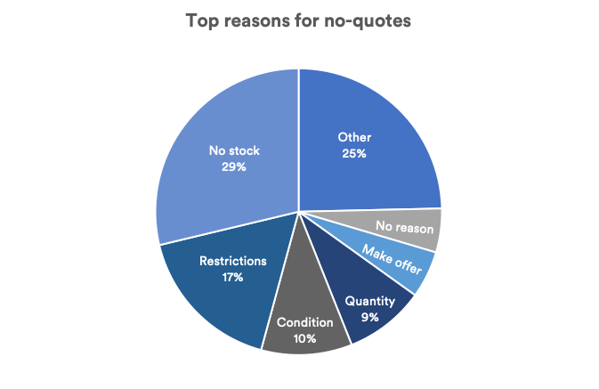

## Table of Contents

## What is a 'No Quote' in the context of programming?

In programming, a 'No Quote' usually means a string of text that doesn't have quotation marks around it. When you write code, you often need to use strings, which are pieces of text. Normally, you put these strings inside quotation marks, like "hello" or 'world'. But sometimes, you might see or need to use text without these marks, and that's what we call a 'No Quote'.

Using 'No Quote' strings can be tricky because without the quotation marks, the computer might get confused and think the text is something else, like a variable name or a command. This can lead to errors in your code. So, it's important to know when and how to use 'No Quote' strings correctly, depending on the programming language you're using. Some languages have special ways to handle text without quotes, while others might not allow it at all.

## Why would a programmer use a 'No Quote'?

Sometimes, a programmer might use a 'No Quote' when they're working with a language that allows it, like in certain situations in Python or JavaScript. In these languages, you can sometimes use text without quotes when you're defining things like dictionary keys or object properties. It can make the code look cleaner and easier to read because you don't have to type the quotes every time.

However, using 'No Quote' can be risky. If you're not careful, the computer might mistake the text for something else, like a variable or a command, and this can cause errors in your program. So, programmers need to know the rules of the language they're using and be very careful when they choose to use text without quotes. It's usually safer to stick with quoted strings unless you're sure it's okay to go without them.

## How does a 'No Quote' affect the functionality of code?

When a programmer uses a 'No Quote' in their code, it can change how the computer understands the text. In some programming languages, like Python or JavaScript, you can use text without quotes in certain places, like when naming keys in dictionaries or properties in objects. This can make the code look simpler and easier to read because you don't need to type quotes around the text. But, it's important to be careful because if you use 'No Quote' in the wrong place, the computer might get confused and think the text is something else, like a variable or a command.

Using 'No Quote' can lead to errors if the programmer is not careful. For example, if you use a 'No Quote' where the language expects a string, the code might not work as expected. The computer might try to use the text as a variable name or a command, which can cause the program to crash or behave strangely. So, while 'No Quote' can make code look cleaner, it's usually safer to use quoted strings unless you know exactly what you're doing and the language allows it.

## Can you provide a simple example of using a 'No Quote' in a programming language?

In Python, you can use 'No Quote' when you're making a dictionary. A dictionary is like a list where you can name each item. Instead of writing the names in quotes, you can just write them as they are. For example, if you want to make a dictionary with the name "color" and the value "blue", you can write it like this: `my_dict = {color: "blue"}`.

But be careful! If you use a 'No Quote' and the name you choose is already used somewhere else in your code, like as a variable, it can cause problems. The computer might get confused and think you're trying to use that variable instead of just using the name in the dictionary. So, it's usually safer to use quotes and write it like this: `my_dict = {"color": "blue"}`. This way, the computer knows for sure that "color" is just a name and not something else.

## What are the common programming languages that support 'No Quote'?

Some programming languages allow you to use 'No Quote' in certain situations. Python is one of these languages. In Python, you can use 'No Quote' when you're making dictionaries. Instead of writing the keys in quotes, you can just write them as they are. For example, you can write `my_dict = {color: "blue"}` instead of `my_dict = {"color": "blue"}`. But you have to be careful because if the key you choose is already used somewhere else in your code, it can cause problems.

JavaScript is another language that supports 'No Quote' in some cases. In JavaScript, you can use 'No Quote' when you're making objects. Similar to Python, you can write the property names without quotes. For example, you can write `let myObject = {color: "blue"}` instead of `let myObject = {"color": "blue"}`. Just like in Python, you need to be careful because if the property name is used elsewhere in your code, it might cause errors.

## How does the use of 'No Quote' differ across various programming languages?

In Python, you can use 'No Quote' when you're making dictionaries. This means you can write the keys without putting them in quotes. For example, instead of writing `my_dict = {"color": "blue"}`, you can write `my_dict = {color: "blue"}`. But you have to be careful because if the key you choose is already used somewhere else in your code, like as a variable name, it can cause problems. The computer might get confused and think you're trying to use that variable instead of just using the name in the dictionary.

JavaScript also supports 'No Quote' when you're making objects. You can write the property names without quotes, just like in Python. For example, you can write `let myObject = {color: "blue"}` instead of `let myObject = {"color": "blue"}`. Just like in Python, you need to be careful because if the property name is used elsewhere in your code, it might cause errors. The computer could mistake the property name for a variable or a command, which can lead to your program not working as expected.

Other programming languages might not support 'No Quote' at all. In languages like Java or C++, you always have to put strings in quotes. If you try to use 'No Quote' in these languages, it will cause an error because the computer won't understand what you're trying to do. So, it's important to know the rules of the language you're using and use 'No Quote' only when it's allowed and safe.

## What are the potential pitfalls or errors associated with using 'No Quote'?

Using 'No Quote' can lead to problems if you're not careful. In languages like Python and JavaScript, where you can use 'No Quote' for dictionary keys or object properties, the biggest issue is that the computer might get confused. If you use a word that's already used somewhere else in your code, like as a variable name, the computer might think you're trying to use that variable instead of just using the word as a name. This can cause your program to crash or behave in unexpected ways.

Another problem is that 'No Quote' can make your code harder to read and understand. When you use quotes, it's clear to anyone reading your code that you're using a string. Without quotes, it can be confusing because it's not as obvious what the text is supposed to be. This can make it harder for other people to work with your code, or even for you to remember what you were doing if you come back to the code later.

## How can 'No Quote' be used effectively in string manipulation?

In some programming languages like Python and JavaScript, you can use 'No Quote' when you're working with dictionaries or objects. This means you can write the names of keys or properties without putting them in quotes. For example, in Python, you might write `my_dict = {color: "blue"}` instead of `my_dict = {"color": "blue"}`. This can make your code look simpler and easier to read because you don't have to type the quotes every time. But you have to be careful because if the name you choose is already used somewhere else in your code, it can cause problems. The computer might get confused and think you're trying to use that name as a variable instead of just using it as a name in your dictionary or object.

Using 'No Quote' effectively in string manipulation means knowing when and where it's okay to use it. In languages that support it, like Python and JavaScript, you can use 'No Quote' to make your code cleaner and easier to read. But you need to make sure the names you use without quotes are not used anywhere else in your code. If they are, the computer might get confused and your program might not work as expected. So, it's important to use 'No Quote' carefully and only when you're sure it won't cause any problems.

## What advanced techniques involve the use of 'No Quote' in programming?

In advanced programming, 'No Quote' can be used in more complex ways, like when you're working with JSON data or when you're using certain libraries or frameworks. For example, in JavaScript, you might use 'No Quote' when you're working with JSON objects. JSON is a way to store and send data that looks a lot like JavaScript objects. When you're working with JSON data, you can use 'No Quote' for the property names, just like you would with regular JavaScript objects. This can make your code look cleaner and easier to read, but you still have to be careful because if the property names are used elsewhere in your code, it can cause problems.

Another advanced technique involves using 'No Quote' when you're working with certain libraries or frameworks that allow it. Some libraries and frameworks have special rules about when and how you can use 'No Quote'. For example, in some cases, you might be able to use 'No Quote' when you're defining configuration options or when you're setting up data models. This can make your code more concise and easier to read, but you need to make sure you're following the rules of the library or framework you're using. If you use 'No Quote' in the wrong place, it can cause errors and make your program not work as expected.

## How does 'No Quote' impact code readability and maintenance?

Using 'No Quote' can make code look cleaner and simpler because you don't have to type quotes around every key or property name. This can make your code easier to read, especially if you're working with a lot of dictionaries or objects. When you see a lot of quotes, it can be hard to focus on the important parts of your code. By using 'No Quote', you can make your code look neater and easier to understand at a glance.

However, 'No Quote' can also make code harder to maintain if you're not careful. If you use a name without quotes that's already used somewhere else in your code, it can cause confusion. The computer might think you're trying to use that name as a variable instead of just as a key or property name. This can lead to errors and make it harder to fix problems in your code. So, while 'No Quote' can make your code look nicer, you need to use it carefully to avoid issues that could make your code harder to work with later on.

## Are there any performance considerations when using 'No Quote' in large-scale applications?

Using 'No Quote' in large-scale applications might not make a big difference in how fast your program runs. The computer usually does not care if you use quotes or not when it's working with dictionaries or objects. What matters more is how you write your code and how you use the computer's memory. So, 'No Quote' might make your code look cleaner, but it won't make your program run faster or slower by itself.

However, using 'No Quote' can cause problems if you're not careful. If you use a name without quotes that's already used somewhere else in your code, it can confuse the computer. This can lead to errors that might slow down your program or make it crash. So, while 'No Quote' might not affect performance directly, the mistakes it can cause could impact how well your large-scale application works.

## What are the best practices for using 'No Quote' in professional coding environments?

In professional coding environments, using 'No Quote' should be done carefully. Always check the rules of the programming language you are using. Some languages allow 'No Quote' for dictionary keys or object properties, like Python and JavaScript. But, it's important to make sure the names you use without quotes are not used anywhere else in your code. If they are, it can cause confusion and errors. So, use 'No Quote' only when you know it's safe and won't cause problems.

Another best practice is to think about how 'No Quote' affects code readability and maintenance. While it can make your code look cleaner and easier to read, it can also make it harder to understand if not used correctly. Always consider who else might need to read or work on your code. If using 'No Quote' makes it harder for others to understand your code, it might be better to use quotes. Clear and easy-to-understand code is very important in professional settings, so use 'No Quote' wisely to keep your code maintainable.

## What are the strategies for navigating 'no quote' market conditions?

Successful trading during 'No Quote' market conditions involves strategic planning and effective risk management, which are crucial in environments characterized by limited [liquidity](/wiki/liquidity-risk-premium). To mitigate the inherent risks, traders can employ several strategies:

1. **Diversification of Portfolios**: Diversification is a fundamental strategy to reduce the specific risks associated with illiquid securities. By spreading investments across various asset classes, sectors, or geographies, traders lower the impact of any single security's poor performance on the overall portfolio. This approach is mathematically supported by Modern Portfolio Theory, which suggests that optimal portfolio diversification can reduce unsystematic risk. The expected return $E(R_p)$ of a diversified portfolio, considering weights $w_i$ and security returns $R_i$, can be calculated as:
$$
   E(R_p) = \sum_{i=1}^{n} w_i \times E(R_i)

$$

   where $n$ is the total number of assets.

2. **Utilizing Limit Orders**: In low-liquidity markets, the difference between bid and ask prices (bid-ask spread) widens, which can lead to unfavorable trade executions. By using limit orders instead of market orders, traders set the maximum price they are willing to pay (buy limit) or the minimum they are willing to accept (sell limit), offering protection against price slippage. This technique enables traders to execute trades at desired price levels, though it may result in missed opportunities if the market does not reach the set price.

3. **Maintaining Strong Communication Channels**: Traders should establish robust communication with brokers and market participants to gain timely insights and information. This network can include access to proprietary research, real-time news feeds, and market sentiment analysis, which are valuable during unpredictable market conditions. By staying informed, traders can anticipate market movements and adjust their strategies accordingly.

A combination of these strategies allows traders to navigate 'No Quote' market conditions more effectively, minimizing risks while maximizing the potential for successful trades. Actively managing a diversified portfolio, implementing limit orders, and leveraging extensive communication networks are integral to maintaining stability and resilience in low-liquidity environments.

## References & Further Reading

[1]: Maguire, S., & Campisi, F. (2019). ["Algorithmic and High-Frequency Trading Management"](https://research.gold.ac.uk/id/eprint/27283/1/McGroarty2019_Article_HighFrequencyTradingStrategies.pdf). Springer.

[2]: Aldridge, I. (2013). ["High-Frequency Trading: A Practical Guide to Algorithmic Strategies and Trading Systems"](https://www.amazon.com/High-Frequency-Trading-Practical-Algorithmic-Strategies/dp/1118343506). Wiley.

[3]: Narang, R. K. (2013). ["Inside the Black Box: A Simple Guide to Quantitative and High Frequency Trading"](https://onlinelibrary.wiley.com/doi/book/10.1002/9781118662717). Wiley.

[4]: Kissell, R. (2013). ["The Science of Algorithmic Trading and Portfolio Management"](https://www.sciencedirect.com/book/9780124016897/the-science-of-algorithmic-trading-and-portfolio-management). Elsevier.

[5]: Hasbrouck, J. (2007). ["Empirical Market Microstructure: The Institutions, Economics, and Econometrics of Securities Trading"](https://academic.oup.com/book/52241). Oxford University Press.