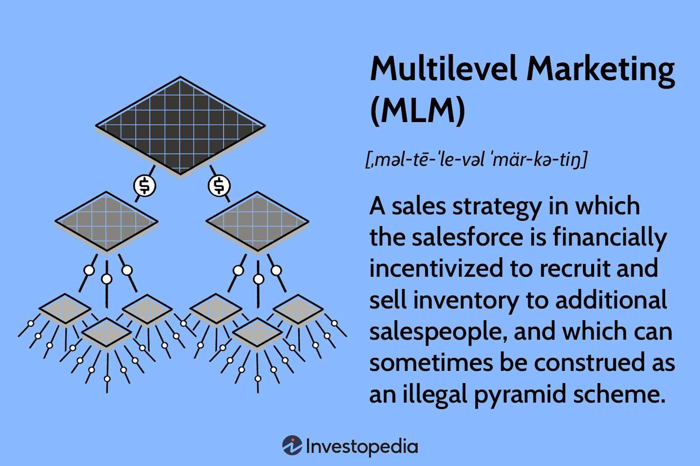

In today's fast-paced financial markets, understanding various trading terminologies and situations is crucial for investors and traders alike. Two concepts that frequently surface in trading discussions are 'No Quote No Quote' and 'Algorithmic Trading', each bearing significant implications for market participants. As the complexity of financial markets increases, these terms emerge not only as essential technical jargon but also as central elements influencing trading strategies and decision-making processes.

The term 'No Quote No Quote' refers to situations where a security lacks a current bid or ask price, essentially indicating an absence of trading activity. This scenario often arises in markets characterized by low liquidity, where the buying and selling interest is insufficient to establish a continuous two-sided market. Such conditions pose challenges for traders who rely on real-time price information and can have substantial implications for their trade execution strategies.

Conversely, Algorithmic Trading represents a technological paradigm shift in how trades are executed. By utilizing sophisticated computer programs to execute trades according to pre-defined criteria, algorithmic trading enhances the speed and efficiency of market operations. This method has transformed modern trading, reshaped market dynamics, and introduced new considerations in liquidity management and price discovery.

This article seeks to demystify these essential concepts, elucidating their meanings and providing practical insights into their real-world applications. By the end of this piece, readers will gain a comprehensive understanding of 'No Quote No Quote' and Algorithmic Trading, their implications for trading strategies, and how they influence the broader financial landscape. Through this exploration, traders and investors will be better equipped to navigate the intricacies of today's financial markets, optimizing their strategies to seize opportunities and mitigate risks.

## Table of Contents

## Defining 'No Quote' in Trading

The term 'No Quote' in trading describes a condition where a security is not currently being traded, leading to a lack of a visible bid or ask price. Such scenarios predominantly arise from illiquidity, wherein the trading volumes are insufficient to establish a conventional market with a bid and an ask price. This phenomenon is particularly prevalent in smaller, over-the-counter (OTC) stocks. These stocks, often characterized by lower trading volumes and less frequent transactions, are prone to 'No Quote' situations. This lack of liquidity poses significant challenges for traders who may struggle to assess the exact value of a security or to execute trades at desired price points. 

In these instances, the absence of active trading can lead to larger bid-ask spreads, reflecting increased uncertainty and potential volatility in the security's price. For investors and traders, understanding 'No Quote' conditions is of paramount importance. It allows them to recognize the risks associated with trading less liquid securities and to develop strategies that can mitigate these risks, such as employing limit orders to avoid price slippage, or diversifying their portfolio to manage risk exposure effectively. Informed decision-making and strategic planning are crucial for navigating the complexities of trading securities that are prone to periods of inactivity.

## How 'No Quote' Works

In financial markets, the functionality of a well-organized trading environment largely depends on the presence of market makers, who actively quote bid and ask prices to facilitate [liquidity](/wiki/liquidity-risk-premium). These market makers are crucial for ensuring that there is enough buying and selling activity to maintain a stable market for listed stocks. A 'No Quote' situation arises when a security, particularly those that are traded over-the-counter (OTC) or are delisted, lacks this vital support from market makers. Such securities often suffer from illiquidity, meaning there are insufficient transactions or interests to establish a clear market price.

A 'No Quote' situation indicates the absence of a current bid (the highest price a buyer is willing to pay) or ask price (the lowest price a seller is willing to accept), which are essential for executing trades. Without active market makers, the bid-ask spread—the difference between the bid and ask prices—tends to widen. A wider spread suggests increased [volatility](/wiki/volatility-trading-strategies) and can pose significant risks for traders. This can lead to abrupt price swings when an order is finally matched, creating potential gains but also substantial losses if the market moves unfavorably.

In such circumstances, it becomes imperative for traders to adopt strategic measures to manage the inherent risks. One such measure is the use of limit orders rather than market orders. A limit order enables the trader to specify the maximum or minimum price at which they are willing to buy or sell a security. This can provide a certain level of protection against unexpected price fluctuations caused by the absence of active market players. Another strategy might include steering clear of high-risk securities altogether, particularly if the trader assesses that the liquidity constraints render the security unsuitable for their risk tolerance.

Ultimately, navigating 'No Quote' situations requires a comprehensive understanding of market dynamics and the deployment of well-considered trading strategies. By doing so, traders can mitigate risks and potentially capitalize on the opportunities that may arise from the intricate movements of less liquid securities.

## Grey Markets, Dark Pools, and Their Impacts on Quotations

'Grey markets' refer to unofficial markets where trades are conducted without formal regulatory oversight, often resulting in reduced visibility of bid and offer prices. These markets typically involve the trading of securities that lack an official listing on recognized exchanges, leading to situations where no formal quotes exist for the assets being traded. This lack of transparency can create conditions akin to the 'No Quote' situation, as market participants have limited insight into asset pricing, liquidity, and market demand.

Similarly, 'dark pools' are private trading platforms that allow large blocks of securities to be traded anonymously without broadcasting the orders to the public. Dark pools are especially common among institutional investors who wish to execute large trades with minimal market impact. While they provide the advantage of reduced transaction costs and the ability to avoid the potentially adverse effects of front-running, dark pools also contribute to a lack of transparency in the markets. The opacity associated with dark pool transactions makes price discovery more challenging, as the absence of pre-and post-trade transparency can obscure the true supply and demand dynamics of the traded securities.

The primary impact of both grey markets and dark pools is the reduction of market transparency, which poses significant challenges for investors seeking to assess real market conditions. Market predictors based on bid-ask spreads, market depth, and [volume](/wiki/volume-trading-strategy) become less effective in environments where such information is not fully available. As a consequence, the accuracy of price signals weakens, making it hard for traders and investors to establish fair value estimates for the assets traded within these markets.

To navigate these complexities, traders must adopt cautious and strategic approaches. This may include employing sophisticated analytical tools, maintaining diversified portfolios to minimize risk exposures, and adhering to robust risk management strategies. Traders should also engage actively with brokers and other market intermediaries to supplement their understanding of market dynamics in these opaque trading venues, allowing them to capitalize on opportunities while mitigating potential risks.

## Algorithmic Trading and Its Intersection with 'No Quote' Situations

Algorithmic trading, commonly referred to as algo trading, employs sophisticated computer programs to automate trading strategies based on pre-determined criteria, which enhances execution speed and market efficiency. This form of trading leverages historical data, complex mathematical models, and quantitative analysis to make real-time trading decisions. The primary goal is to capitalize on minute market inefficiencies and price fluctuations that occur within milliseconds.

## Algorithmic Trading's Role in Market Dynamics

Algo trading significantly influences market dynamics by providing liquidity and narrowing bid-ask spreads when market conditions are liquid and active. However, during illiquid periods, especially with lesser-traded securities, algorithmic strategies can inadvertently exacerbate 'No Quote' situations. This occurs when algorithms dynamically adjust or withdraw their orders in response to adverse market conditions, effectively pulling liquidity from public exchanges. The sudden removal or absence of quotes can lead to wider bid-ask spreads, increased volatility, and reduced trading opportunities, which can be challenging for traditional traders.

### Interactions with Illiquid Securities

Algorithmic trading systems are designed to operate within diverse market conditions, but their interactions with illiquid securities pose distinct challenges. When trading in illiquid markets, these algorithms must be meticulously programmed to prevent market disruptions and minimize liquidity-related risks. Here, traders employ strategies like slicing large orders into smaller blocks to prevent drastic price movements that could arise from limited market depth.

Additionally, algorithms often utilize techniques like time-weighted average price (TWAP) or volume-weighted average price (VWAP) to execute trades gradually and reduce market impact in thinly traded securities.

### Adapting to Technological Advancements

Traders operating within [algorithmic trading](/wiki/algorithmic-trading) must consistently adapt to advancements in trading technology. Staying abreast of emerging trends, such as [machine learning](/wiki/machine-learning) and [artificial intelligence](/wiki/ai-artificial-intelligence), enables traders to enhance their algorithmic strategies and better navigate markets characterized by 'No Quote' conditions. A thorough understanding of how these technologies can optimize order execution and improve predictive capabilities is essential for competitive advantage.

To effectively use algorithmic trading in varying market climates, traders should adopt a flexible and iterative approach to strategy development, regularly back-testing algorithms against historical data to ensure robust performance in dynamic environments.

In summary, while algorithmic trading offers remarkable efficiency and speed in modern markets, its interaction with illiquid securities and 'No Quote' conditions requires careful strategy design and perpetual adaptation to technological innovations. Successful traders are those who remain vigilant, optimizing their approaches to harness the full potential of algorithmic trading while mitigating associated risks.

## Strategies for Navigating 'No Quote' Market Conditions

Successful trading during 'No Quote' market conditions involves strategic planning and effective risk management, which are crucial in environments characterized by limited liquidity. To mitigate the inherent risks, traders can employ several strategies:

1. **Diversification of Portfolios**: Diversification is a fundamental strategy to reduce the specific risks associated with illiquid securities. By spreading investments across various asset classes, sectors, or geographies, traders lower the impact of any single security's poor performance on the overall portfolio. This approach is mathematically supported by Modern Portfolio Theory, which suggests that optimal portfolio diversification can reduce unsystematic risk. The expected return $E(R_p)$ of a diversified portfolio, considering weights $w_i$ and security returns $R_i$, can be calculated as:
$$
   E(R_p) = \sum_{i=1}^{n} w_i \times E(R_i)

$$

   where $n$ is the total number of assets.

2. **Utilizing Limit Orders**: In low-liquidity markets, the difference between bid and ask prices (bid-ask spread) widens, which can lead to unfavorable trade executions. By using limit orders instead of market orders, traders set the maximum price they are willing to pay (buy limit) or the minimum they are willing to accept (sell limit), offering protection against price slippage. This technique enables traders to execute trades at desired price levels, though it may result in missed opportunities if the market does not reach the set price.

3. **Maintaining Strong Communication Channels**: Traders should establish robust communication with brokers and market participants to gain timely insights and information. This network can include access to proprietary research, real-time news feeds, and market sentiment analysis, which are valuable during unpredictable market conditions. By staying informed, traders can anticipate market movements and adjust their strategies accordingly.

A combination of these strategies allows traders to navigate 'No Quote' market conditions more effectively, minimizing risks while maximizing the potential for successful trades. Actively managing a diversified portfolio, implementing limit orders, and leveraging extensive communication networks are integral to maintaining stability and resilience in low-liquidity environments.

## Conclusion

Navigating 'No Quote' situations and leveraging algorithmic trading requires a balanced approach characterized by both knowledge and strategy. Traders must remain vigilant regarding market dynamics; this includes staying informed about liquidity levels, bid-ask spreads, and the impact of external factors on market conditions. Flexibility in trading strategies is crucial, as it allows market participants to adjust their approaches based on the specific characteristics of different securities and market environments.

To effectively harness the advantages of algorithmic trading, traders should integrate technological tools wisely. Algorithms can offer significant benefits in terms of speed and efficiency, especially in fast-moving markets. However, an in-depth understanding of how these algorithms interact with various trading conditions—particularly illiquid markets—can prevent exacerbation of 'No Quote' scenarios. This requires developing models that can accurately assess risk and predict price movements, incorporating historical data and real-time analytics.

Understanding the subtleties of trading conditions empowers traders to identify and capitalize on opportunities in both stable and volatile markets. This involves not only recognizing potential risks but also devising strategies to mitigate them. For instance, using limit orders over market orders in low-liquidity situations can reduce the likelihood of unfavorable price executions. Moreover, portfolio diversification remains a vital strategy to manage risks associated with market fluctuations and less liquid securities.

Ultimately, the success of trading in today's complex financial landscape hinges on making informed decisions. This calls for a continuous commitment to learning and adapting to new information and technologies. As markets evolve, so must the strategies employed by traders to ensure they remain competitive and successful. The foundation for these decisions lies in a thorough comprehension of the tools available and the market contexts in which they operate.

## References & Further Reading

[1]: Maguire, S., & Campisi, F. (2019). ["Algorithmic and High-Frequency Trading Management"](https://research.gold.ac.uk/id/eprint/27283/1/McGroarty2019_Article_HighFrequencyTradingStrategies.pdf). Springer.

[2]: Aldridge, I. (2013). ["High-Frequency Trading: A Practical Guide to Algorithmic Strategies and Trading Systems"](https://www.amazon.com/High-Frequency-Trading-Practical-Algorithmic-Strategies/dp/1118343506). Wiley.

[3]: Narang, R. K. (2013). ["Inside the Black Box: A Simple Guide to Quantitative and High Frequency Trading"](https://onlinelibrary.wiley.com/doi/book/10.1002/9781118662717). Wiley.

[4]: Kissell, R. (2013). ["The Science of Algorithmic Trading and Portfolio Management"](https://www.sciencedirect.com/book/9780124016897/the-science-of-algorithmic-trading-and-portfolio-management). Elsevier.

[5]: Hasbrouck, J. (2007). ["Empirical Market Microstructure: The Institutions, Economics, and Econometrics of Securities Trading"](https://academic.oup.com/book/52241). Oxford University Press.