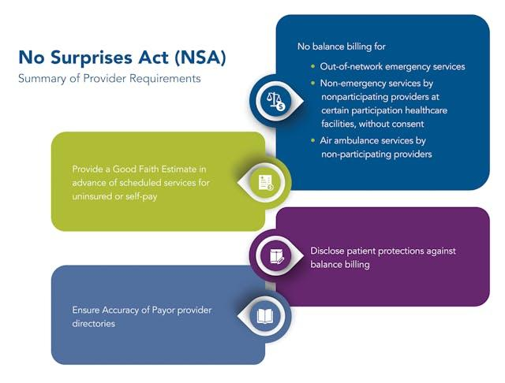

In today's healthcare landscape, transparency is pivotal in ensuring fair practices and safeguarding consumers. Rising medical costs and complex billing processes often leave patients vulnerable to unforeseen charges, complicating their financial planning and potentially deterring them from seeking necessary medical care. To address these challenges, the No Surprises Act has emerged as a significant legislative effort aimed at increasing transparency and protecting patients from unpredictable medical expenses.

The No Surprises Act marks a transformative approach to medical billing, primarily by curbing the prevalence of surprise billing often encountered with out-of-network services. Surprise bills can occur when patients, unknowingly to them, receive care from out-of-network providers, resulting in exorbitant charges that their insurance plans may not cover fully. This Act aims to mitigate these financial burdens by imposing restrictions on how much out-of-network providers can charge patients under certain circumstances, aligning their charges closer to in-network rates.



Beyond legislative measures, the potential for technological solutions, like algorithmic trading concepts applied to medical billing, presents exciting possibilities for streamlining current processes. Algorithmic trading, known for optimizing transactions in financial markets utilizing data-driven algorithms, could similarly enhance the efficiency of medical billing. By automating complex billing computations and providing more accurate cost estimates, these technologies promise increased transparency and reduced errors, benefiting both healthcare providers and patients.

Understanding the No Surprises Act and exploring technology-driven solutions are critical for patients, healthcare providers, and insurers as they navigate the intricacies of the healthcare economy. With the intersection of policy and technology playing an increasingly significant role, these stakeholders can better manage expectations, avoid unexpected financial stress, and ensure more equitable access to healthcare services. By fostering a system rooted in transparency, the healthcare industry can advance towards a future where patients are empowered with clear, concise information regarding their healthcare choices and financial responsibilities.

## Table of Contents

## Understanding the No Surprises Act

The No Surprises Act stands as a crucial legislative measure designed to shield patients from the financial burden of unexpected medical expenses and to promote transparency in healthcare billing. Enacted on January 1, 2022, this Act establishes guidelines that apply to both emergency and certain non-emergency services. A principal objective of the Act is to prevent out-of-network healthcare providers from charging patients fees exceeding the in-network cost-sharing levels, which traditionally result in substantial unexpected expenses for those receiving medical care.

One of the significant mandates of the Act is to ensure that healthcare providers offer transparent cost estimates to patients prior to treatment. This requirement aims to enhance patient awareness of potential financial obligations, thereby allowing individuals to make more informed decisions regarding their healthcare needs. By providing cost estimates upfront, patients are better equipped to navigate the complexities of medical billing, potentially reducing stress and confusion related to financial responsibilities.

A notable component of the No Surprises Act is its arbitration process. This mechanism is designed to facilitate the resolution of payment disputes between healthcare providers and insurers while keeping the patient out of these often complex and protracted negotiations. The arbitration process involves a neutral third party to assess and determine fair payment amounts, ensuring that disputes are settled equitably without placing an additional burden on the patient.

Collectively, the measures put in place by the No Surprises Act are intended to alleviate the economic impact of unanticipated healthcare costs on consumers. By enforcing transparency and fair billing practices, the Act seeks to build a more balanced relationship between patients, providers, and insurers, fostering trust and confidence in the healthcare system as a whole.

## Requirements and Key Provisions

The No Surprises Act establishes several critical requirements aimed at ensuring transparency and fairness in healthcare billing. Under this legislation, insurers and providers are obligated to maintain accurate and up-to-date provider directories. This ensures that patients have access to reliable information regarding in-network providers, helping them make informed decisions about their healthcare options. 

Moreover, health plans must clearly disclose both in-network and out-of-network deductibles and out-of-pocket limits to patients. This disclosure is crucial for enabling patients to anticipate their financial responsibilities accurately, minimizing the risk of unexpected costs associated with healthcare services.

A pivotal component of the Act is the enforcement of an independent dispute resolution (IDR) process. This process facilitates fair negotiations between providers and insurers, preventing patients from being caught in billing disputes. The IDR mechanism ensures that any disagreements over billing amounts do not result in financial burdens being shifted onto patients. 

Additionally, the Act mandates that healthcare providers deliver a good-faith estimate of costs to uninsured patients. This requirement aims to provide a financial roadmap for patients who lack insurance, allowing them to understand potential expenses before receiving medical care. 

Overall, transparency in these requirements is paramount to safeguarding patients from unethical billing practices. By ensuring that accurate information and estimates are readily available, the No Surprises Act works to create a healthcare environment where patients are better informed about their financial involvement in medical treatments.

## The Role of Algorithmic Trading in Medical Billing

Algorithmic trading, widely utilized in financial markets, provides efficiencies through data-driven decision-making and automation. This advanced technology holds significant promise for transforming medical billing processes by addressing existing inefficiencies and inaccuracies. Leveraging algorithms in healthcare billing can substantially streamline procedures, minimize human errors, and ensure stringent adherence to regulatory standards.

Automating billing with algorithms enables healthcare providers to process large volumes of billing data rapidly and accurately. This capability is crucial for maintaining compliance with regulations such as the No Surprises Act, which mandates transparent and accurate patient billing. By automating routine tasks, such as charge capture and claim submission, healthcare providers can allocate resources to more strategic, patient-centered activities, thereby enhancing overall service quality.

One of the primary benefits of employing algorithmic solutions in medical billing is the ability to predict costs more accurately. Advanced predictive algorithms analyze historical billing and treatment data to generate realistic cost estimates. For example, [machine learning](/wiki/machine-learning) models can be trained on previous billing data to predict the cost of upcoming procedures, thus enabling providers to offer timely, detailed estimates to patients. This methodology aligns with the transparency goals of the No Surprises Act, as it fosters trust and patient satisfaction by reducing unexpected financial liabilities.

Below is a basic Python example of how a predictive model might be constructed to estimate medical procedure costs:

```python
import pandas as pd
from sklearn.model_selection import train_test_split
from sklearn.ensemble import RandomForestRegressor
from sklearn.metrics import mean_squared_error

# Load historical billing data
data = pd.read_csv('billing_data.csv')

# Select features and target variable
features = data[['procedure_type', 'provider', 'patient_history', 'insurance_coverage']]
target = data['cost']

# Split data into training and test sets
X_train, X_test, y_train, y_test = train_test_split(features, target, test_size=0.2, random_state=42)

# Initialize and train the model
model = RandomForestRegressor(n_estimators=100, random_state=42)
model.fit(X_train, y_train)

# Predict and evaluate
predictions = model.predict(X_test)
mse = mean_squared_error(y_test, predictions)
print(f'Mean Squared Error: {mse}')
```

This model uses a Random Forest Regressor to predict the cost of medical procedures based on various features. Though simplified, this example illustrates how algorithmic techniques can contribute to more accurate and reliable cost predictions.

Beyond accuracy, [algorithmic trading](/wiki/algorithmic-trading) concepts can expedite the billing cycle, reducing the time from service delivery to payment. This acceleration in processing times not only improves cash flow for healthcare providers but also enhances patient experiences by providing real-time billing information.

In summary, integrating algorithmic processes in medical billing represents a substantial opportunity to modernize and enhance the healthcare financial landscape. By automating tasks, predicting costs, and speeding up billing cycles, the healthcare industry can better meet the regulatory and transparency demands posed by policies like the No Surprises Act. Such advancements promise a future where billing processes are not only efficient but also align with the overarching goal of equitable and patient-centered healthcare.

## Impact on Patients and Providers

The No Surprises Act brings substantial benefits to patients, primarily by alleviating the financial strain caused by unforeseen medical bills. Patients often experience unexpected costs when receiving care from out-of-network providers, especially in emergency situations or when they are unaware that a provider was not part of their insurance network. This legislation ensures that patients are charged only the in-network cost-sharing amount, even if the care is rendered by an out-of-network provider, thus safeguarding them against the burden of surprise medical bills.

For healthcare providers, compliance with the No Surprises Act necessitates significant modifications to billing systems and methods of communicating with patients. Providers must furnish clear and accurate information regarding expected costs and ensure that billing processes align with the Act’s requirements. This transition might involve upgrading technology, training staff, and adopting more advanced billing systems. While these adjustments present initial challenges, they ultimately lead to enhanced transparency and trust between providers and patients.

The Act also cultivates an environment where patients can seek medical services with increased confidence. By understanding their financial responsibilities upfront and knowing that unexpected bills are mitigated, patients feel empowered to prioritize their health without fear of financial repercussions. This assurance contributes to a more trusting relationship with healthcare providers, as clear communication and financial predictability are fundamental to patient satisfaction.

In the longer term, the No Surprises Act promotes a more informed and equitable healthcare system. It incentivizes transparency and encourages all stakeholders—patients, providers, and insurers—to engage in fair practices. This alignment not only improves patient experiences but also enhances the credibility and reliability of healthcare services. The Act represents a pivotal movement towards a healthcare landscape where financial transparency and patient protection are paramount.

## Future Directions in Healthcare Transparency

As healthcare evolves, transparency is poised to be a central pillar, fundamentally shaping future policies and practices. The integration of technology, particularly algorithmic billing, is anticipated to significantly influence these developments. By employing advanced algorithms, healthcare systems can automate and optimize billing procedures, enhancing accuracy and efficiency while minimizing errors. For instance, predictive analytics can provide accurate cost estimates, allowing patients to understand potential expenses better before receiving care. This technological shift not only facilitates faster billing cycles but also promotes trust in healthcare financial interactions.

As legislation continues to evolve, updates and enhancements to existing laws, such as the No Surprises Act, are expected to persist. These legislative advancements will likely keep focusing on strengthening patient rights and ensuring transparent healthcare practices. Enhancements could include refining the independent dispute resolution process, improving disclosure requirements, and broadening the scope of services covered under transparency rules.

For stakeholders, staying informed about emerging policies and technological innovations is crucial for maintaining compliance and ensuring proactive engagement with these changes. Providers, insurers, and policymakers must recognize the importance of keeping abreast of developments in technology and regulations. This awareness ensures that they can adapt their practices to meet new standards and continue to protect patient interests effectively.

Ultimately, the goal is to establish a healthcare system where patients can seek medical attention without fearing unforeseen financial consequences. By fostering an environment of open communication and clear cost expectations, patients can feel more secure when accessing necessary healthcare services. Achieving such a system will require a collaborative effort among all parties involved, continuously striving for transparency, innovation, and equity in healthcare.

## Conclusion

The No Surprises Act signifies an important milestone in advancing transparency and fairness within the healthcare industry. By abolishing surprise billing practices and mandating clear communication of costs between healthcare providers and patients, it serves as a protective measure against unforeseen financial liabilities for consumers. This legislation paves the way for a more transparent healthcare system where financial exposure is minimized, ensuring patients can seek necessary medical care without concern for unexpected expenses.

Moreover, as healthcare and technology increasingly overlap, the integration of algorithmic processes within medical billing harbors promising prospects. These technologies offer the potential to streamline billing operations, enhancing efficiency and accuracy—an essential aspect of fostering trust in healthcare financial transactions. By automating routine tasks, algorithms can help reduce human error, improve compliance with complex regulatory environments, and provide patients with more precise financial estimates prior to receiving care.

The pursuit of complete transparency within healthcare is an ongoing endeavor, propelled by legislative efforts, technological innovations, and the concerted actions of all stakeholders involved. Patients, healthcare providers, and insurers need to actively participate in and adapt to these changes. By doing so, they contribute to a more equitable and efficient healthcare ecosystem that prioritizes patient welfare and informed decision-making, ultimately working towards a system where financial surprises are a relic of the past.

## References & Further Reading

[1]: ["The No Surprises Act: A Comprehensive Guide"](https://www.cms.gov/nosurprises) by Kaiser Family Foundation 

[2]: ["Algorithmic Trading: Winning Strategies and Their Rationale"](https://www.wiley.com/en-us/Algorithmic+Trading%3A+Winning+Strategies+and+Their+Rationale-p-9781118460146) by Ernie Chan

[3]: ["The Impact of the No Surprises Act on Patients and Providers"](https://aspe.hhs.gov/sites/default/files/documents/33f109709e630b54fe0b7ccef4cb62ad/aspe-no-surprises-act-rtc.pdf) by the Commonwealth Fund  

[4]: ["Building Machine Learning Powered Applications: Going from Idea to Product"](https://www.amazon.com/Building-Machine-Learning-Powered-Applications/dp/149204511X) by Emmanuel Ameisen

[5]: ["Healthcare Transparency: Challenges and Importance"](https://hbr.org/2018/11/building-a-culture-of-transparency-in-health-care) by The National Center for Biotechnology Information