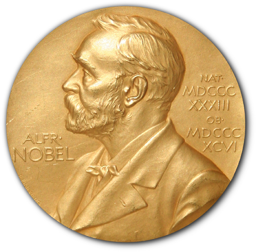

## Table of Contents

## What is the Nobel Memorial Prize in Economic Sciences?

The Nobel Memorial Prize in Economic Sciences is an award given every year to people who have done important work in economics. It is not one of the original Nobel Prizes, which were set up by Alfred Nobel. Instead, it was created by Sweden's central bank in 1968 to celebrate its 300th anniversary. Even though it's not an original Nobel Prize, it is still very important and respected in the world of economics.

The prize is given by the Royal Swedish Academy of Sciences. They choose the winner based on who has made the most valuable contribution to the field of economics. The winner gets a gold medal, a diploma, and a lot of money. The award ceremony happens in Stockholm, Sweden, usually in December. Many famous economists have won this prize, and it helps to show the world how important their work is.

## When was the Nobel Memorial Prize in Economic Sciences first awarded?

The Nobel Memorial Prize in Economic Sciences was first awarded in 1969. This was the year after Sweden's central bank decided to create the prize to celebrate their 300th anniversary.

The first people to win the prize were Ragnar Frisch from Norway and Jan Tinbergen from the Netherlands. They were chosen because they did important work in using math and [statistics](/wiki/bayesian-statistics) to understand how economies work.

## Who established the Nobel Memorial Prize in Economic Sciences?

The Nobel Memorial Prize in Economic Sciences was established by Sweden's central bank. They decided to create this prize in 1968 to celebrate their 300th anniversary. It is different from the other Nobel Prizes because it was not set up by Alfred Nobel himself.

Even though it's not an original Nobel Prize, the Royal Swedish Academy of Sciences gives it out every year. They pick the winner based on who has made the most important contribution to economics. The first time the prize was awarded was in 1969.

## How is the winner of the Nobel Memorial Prize in Economic Sciences selected?

The winner of the Nobel Memorial Prize in Economic Sciences is chosen by the Royal Swedish Academy of Sciences. They start by asking many experts from around the world to suggest people who have done important work in economics. These suggestions come from universities, other Nobel Prize winners, and sometimes even from the general public.

After getting all the suggestions, a special group within the Academy, called the Economic Sciences Prize Committee, looks at them closely. They read the research and talk to other experts to see which work is the most important and valuable. Once they decide on a winner, they tell the Academy, who then makes the final choice. The winner is announced in October, and the prize is given out in December in Stockholm, Sweden.

## What is the monetary value of the Nobel Memorial Prize in Economic Sciences?

The Nobel Memorial Prize in Economic Sciences comes with a lot of money. In 2023, the prize was worth about 11 million Swedish Kronor. This amount can change a bit each year because it depends on what the Nobel Foundation decides.

The money is important because it helps the winners keep working on their research. It also shows how much their work is valued. The prize is given along with a gold medal and a diploma, making it a big honor in the world of economics.

## Can the Nobel Memorial Prize in Economic Sciences be awarded to more than one person?

Yes, the Nobel Memorial Prize in Economic Sciences can be awarded to more than one person. Sometimes, the Royal Swedish Academy of Sciences decides that the important work was done by two or even three people together. When this happens, they share the prize and the money that comes with it.

In the past, there have been many times when the prize was given to more than one person. For example, in 1969, the first year the prize was given, it was shared by Ragnar Frisch and Jan Tinbergen. Sharing the prize is a way to recognize that big achievements in economics often come from teamwork.

## Who was the first recipient of the Nobel Memorial Prize in Economic Sciences?

The first people to get the Nobel Memorial Prize in Economic Sciences were Ragnar Frisch from Norway and Jan Tinbergen from the Netherlands. They won the prize in 1969, which was the first time it was ever given out. Ragnar Frisch and Jan Tinbergen shared the prize because they both did important work in using math and statistics to understand how economies work.

Ragnar Frisch came up with the idea of using math to study how economies work, which is called econometrics. Jan Tinbergen used these ideas to make models that could predict how economies would change over time. Their work helped economists use numbers and data to make better decisions about the economy.

## What are some of the major fields within economics that have been recognized by the Nobel Memorial Prize?

The Nobel Memorial Prize in Economic Sciences has recognized work in many important parts of economics. Some of the big areas include how people make choices and how markets work, which is called microeconomics. Another big area is how whole economies grow and change, which is called macroeconomics. The prize has also been given for work on understanding why prices go up and down, which is called inflation, and how governments can help the economy, which is called fiscal policy.

Another field that has been recognized is how information affects the economy. This includes things like how much people know when they make decisions and how this affects markets. The prize has also been given for work on how different countries trade with each other, which is called international trade. Finally, the prize has honored work on how people behave in groups and how this affects the economy, which is part of behavioral economics.

Overall, the Nobel Memorial Prize in Economic Sciences has celebrated a wide range of important ideas in economics. From understanding how individual choices affect the economy to how governments can help manage it, the prize shows how much economists have learned about making the world a better place through their work.

## How does the Nobel Memorial Prize in Economic Sciences differ from the original Nobel Prizes?

The Nobel Memorial Prize in Economic Sciences is different from the original Nobel Prizes because it was not set up by Alfred Nobel. The original Nobel Prizes were created by Alfred Nobel in his will in 1895 to reward people in categories like Physics, Chemistry, Medicine, Literature, and Peace. The Economics Prize, however, was created much later by Sweden's central bank in 1968 to celebrate their 300th anniversary. This makes it a newer addition to the group of Nobel awards.

Even though the Economics Prize is not one of the original Nobel Prizes, it is still given out in a similar way. The Royal Swedish Academy of Sciences picks the winner, just like they do for the Physics and Chemistry prizes. The winner gets a gold medal, a diploma, and money, and the ceremony happens in Stockholm, Sweden in December. But because it was not part of Alfred Nobel's original plan, some people think it is a bit different from the other Nobel Prizes.

## What impact has the Nobel Memorial Prize in Economic Sciences had on the field of economics?

The Nobel Memorial Prize in Economic Sciences has had a big impact on the field of economics. It has helped make the world pay more attention to important ideas in economics. When someone wins the prize, their work gets more famous. This means more people learn about their ideas, and other economists might start using these ideas in their own work. The prize also encourages economists to keep doing research because it shows that their work can be very important.

The prize has also helped show that economics is a big and important field. It has been given for work in many different parts of economics, like how people make choices, how countries trade with each other, and how governments can help the economy. This shows that economics is not just about money, but about understanding how the world works. The Nobel Memorial Prize in Economic Sciences has helped make economics a respected and important part of science.

## Are there any controversies or criticisms associated with the Nobel Memorial Prize in Economic Sciences?

Yes, there are some controversies and criticisms about the Nobel Memorial Prize in Economic Sciences. One big criticism is that the prize focuses too much on economics from rich countries, like the United States and Europe. Some people think the prize should also recognize important work from other parts of the world, like Africa, Asia, and Latin America. Another criticism is that the prize sometimes goes to economists whose ideas are very popular at the time but might not be as important in the long run. This can make it seem like the prize is more about following trends than recognizing really valuable work.

Another issue is that the prize is given for work in economics, which some people argue is not a science in the same way that physics or chemistry is. They think economics is more about opinions and guesses than hard facts. This makes some people question whether it should be called a Nobel Prize at all. Finally, there's a debate about how the prize affects the way people think about economics. Some worry that it puts too much focus on certain kinds of economic ideas, like those that support free markets, and not enough on other important topics, like how to make the economy fairer for everyone.

## Can you name some notable recipients of the Nobel Memorial Prize in Economic Sciences and their contributions?

Milton Friedman won the Nobel Memorial Prize in Economic Sciences in 1976. He was famous for his ideas about how money works in the economy. Friedman believed that the government should not control the economy too much. Instead, he thought that if people were free to make their own choices, the economy would work better. His ideas helped change how people think about money and government.

Another important winner was Amartya Sen, who got the prize in 1998. Sen worked on understanding why some people are poor and how to help them. He thought that being able to live a good life is about more than just having money. It's also about having the freedom to do things you want, like getting an education or staying healthy. His work helped people understand that making the world a better place means helping everyone have these freedoms.

Paul Krugman won the prize in 2008. He studied how countries trade with each other. Krugman showed that when countries trade, it can help their economies grow. He also explained why some places become rich while others stay poor. His work helped people understand how important trade is for the world economy.

## How do Nobel Prize-winning economic theories intersect with algorithmic trading?

Many Nobel-winning economic theories have played a crucial role in shaping and advancing [algorithmic trading](/wiki/algorithmic-trading) strategies. Notably, the Efficient Market Hypothesis (EMH) and Modern Portfolio Theory have been instrumental.

### Modern Portfolio Theory and Algorithmic Trading

Harry Markowitz introduced Modern Portfolio Theory (MPT), for which he was awarded the Nobel Prize in Economic Sciences in 1990. MPT advocates diversification to optimize a portfolio's return for a given level of risk, or alternatively, minimize risk for a given level of expected return. The fundamental premise is to select various assets that do not exhibit perfect correlation, thereby reducing the overall [volatility](/wiki/volatility-trading-strategies) of the portfolio's returns.

In algorithmic trading, the principles of MPT are directly applied through quantitative models that automate the risk optimization process. Algorithmic trading strategies deploy MPT to construct portfolios by optimizing the risk-return ratio. The optimization problem can be represented mathematically as finding the weights $w$ that minimize the portfolio variance:

$$
\text{minimize } \frac{1}{2} w^T \Sigma w 
$$

subject to:

$$
\sum_{i} w_i = 1
$$

where $w$ is the vector of asset weights, and $\Sigma$ is the covariance matrix of asset returns.

### Efficient Market Hypothesis and Algorithmic Trading

Eugene Fama's Efficient Market Hypothesis, for which he received the Nobel Prize in 2013, posits that financial markets are efficient in reflecting all available information. The implication of EMH is that it is impossible to consistently achieve returns that exceed average market returns on a risk-adjusted basis, as prices always incorporate and reflect all relevant information.

Despite the theoretical assertion that it is impossible to 'beat the market' consistently, algorithmic trading leverages EMH principles to develop models that exploit inefficiencies and information gaps through high-frequency trading and [statistical [arbitrage](/wiki/arbitrage)](/wiki/statistical-arbitrage). These models are designed to react swiftly to new market information and execute trades that capitalize on transient inefficiencies before they are corrected by the market.

Both MPT and EMH continue to influence the development of algorithmic trading strategies, where the former provides a framework for constructing diversified portfolios, and the latter informs the design of models that respond to market conditions effectively.

## What are some case studies of algorithmic trading that have been influenced by Nobel Laureates?

The Nobel Memorial Prize in Economic Sciences has celebrated numerous contributions that have significantly influenced the development of algorithmic trading. One prominent example is the Black-Scholes Model, formulated by Robert Merton and Myron Scholes, who were recognized with the Nobel Prize in 1997. This model is fundamental in the field of financial derivatives and serves as a cornerstone for option pricing algorithms. By using a stochastic process to model the dynamics of financial markets, the Black-Scholes Model provides an analytical solution for European-style options pricing. The model's equation is represented as:

$$
C(S, t) = N(d_1) S - N(d_2) Ke^{-r(T-t)}
$$

where:
- $C(S, t)$ is the call option price,
- $N(d)$ is the cumulative distribution function of the standard normal distribution,
- $S$ is the stock price,
- $K$ is the strike price,
- $r$ is the risk-free interest rate,
- $T$ is the time to expiration,
- $d_1$ and $d_2$ are given by: 
  \[ d_1 = \frac{\ln(\frac{S}{K}) + (r + \frac{\sigma^2}{2})(T-t)}{\sigma \sqrt{T-t}}
$$
  \[ d_2 = d_1 - \sigma \sqrt{T-t}
$$

This model has been integrated into numerous trading algorithms, enabling traders to evaluate the fair value of options and develop hedging strategies with precision.

Another influential contribution comes from Richard Thaler, a key figure in behavioral economics who was awarded the Nobel Prize in 2017. Thaler's work has introduced the concept that human psychology significantly affects market decisions, emphasizing that traders often act irrationally due to biases and heuristics. Behavioral economics has paved the way for developing algorithms that consider psychological factors in market behavior, helping predict price movements and trader responses to market events.

These approaches blend traditional financial theories with insights into human behavior to create sophisticated models capable of navigating complex markets. Behavioral algorithms often integrate [machine learning](/wiki/machine-learning) techniques to analyze historical data and recognize patterns in trader sentiment, generating predictive signals for trade execution.

By applying such Nobel-winning theories, practitioners develop algorithms that are not only efficient but also adaptive to the nuances of human behavior and market dynamics. The intersection of these theoretical advancements with practical tools has facilitated the evolution of trading methodologies, underscoring the profound impact of economic science on financial markets. These case studies demonstrate the pivotal role Nobel laureates' contributions play in transforming abstract economic theories into tangible applications in trading.

## References & Further Reading

[1]: Merton, R. C., & Scholes, M. S. (1973). ["The Pricing of Options and Corporate Liabilities."](https://www.jstor.org/stable/1831029) The Journal of Political Economy, 81(3), 637-654.

[2]: Fama, E. F. (1970). ["Efficient Capital Markets: A Review of Theory and Empirical Work."](https://www.jstor.org/stable/2325486) The Journal of Finance, 25(2), 383-417.

[3]: Markowitz, H. (1952). ["Portfolio Selection."](https://onlinelibrary.wiley.com/doi/abs/10.1111/j.1540-6261.1952.tb01525.x) The Journal of Finance, 7(1), 77-91.

[4]: Thaler, R. H. (1980). ["Toward a Positive Theory of Consumer Choice."](https://www.sciencedirect.com/science/article/pii/0167268180900517) Journal of Economic Behavior & Organization, 1(1), 39-60.

[5]: Taleb, N. N. (2007). ["The Black Swan: The Impact of the Highly Improbable."](https://archive.org/details/10.1.1.695.4305) Random House.

[6]: Jarrow, R. A. (1999). ["In Honor of the Nobel Laureates Robert Merton and Myron Scholes: A Partial Differential Equation That Changed the World."](https://en.wikipedia.org/wiki/Jarrow_March) The Journal of Economic Perspectives, 13(4), 229-248.

[7]: Shiller, R. J. (2003). ["From Efficient Markets Theory to Behavioral Finance."](https://www.aeaweb.org/articles?id=10.1257/089533003321164967) Journal of Economic Perspectives, 17(1), 83-104.