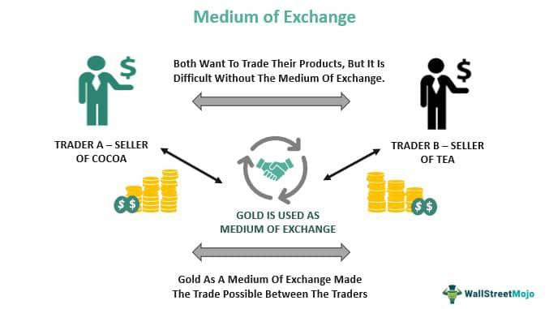

The landscape of commodity trading is undergoing significant transformation, propelled by technological advances and the rise of specialized exchanges. Nodal Exchange stands out as a leading force in North America's commodity markets, positioned at the cutting edge of this evolution. This article will explore the operational dynamics of trading platforms, emphasizing Nodal Exchange's pivotal role and the influence of algorithmic trading on the commodity markets.

Nodal Exchange plays a crucial role in power, environmental, and natural gas markets, offering innovative solutions that have reshaped traditional trading frameworks. Its platform is designed to enhance trading efficiency and improve risk management strategies for market participants. By integrating sophisticated technologies and specialized market instruments, Nodal Exchange facilitates a more streamlined and effective trading environment. The focus will be on understanding how Nodal Exchange contributes to these sectors through its innovative platform and technological advancements, offering market participants enhanced tools for navigating complex market conditions.

## Table of Contents

## Understanding Nodal Exchange

Founded in 2007, Nodal Exchange has established itself as a major force in commodity trading, with its headquarters located in Tysons Corner, Virginia. It operates as an integral part of the European Energy Exchange (EEX), augmenting its ability to offer a robust trading environment. The exchange is recognized for its specialization in futures and options contracts, extending a comprehensive suite of products across various markets, including power, environmental, and natural gas sectors.

Nodal Exchange achieved a significant milestone by introducing locational (nodal) futures contracts specifically designed for the North American power markets. These contracts allow market participants to hedge against price volatility at specific locations on the electricity grid, providing a targeted and efficient method for risk management. This innovation marked a pivotal shift in how power markets operate, emphasizing localized trading and settlement based on the unique transmission constraints and demand patterns inherent to each nodal point.

Moreover, Nodal Exchange is distinguished for offering the largest collection of electric power and environmental futures and options contracts worldwide. This extensive range of products enables traders to engage in sophisticated investment strategies while managing diverse risk exposures. The variety of contracts supports the ability to tailor portfolios to specific geographies, market conditions, and regulatory environments.

A central component of Nodal Exchange's success lies in its dedicated clearing house, Nodal Clear. The clearing house plays a critical role in enhancing risk management and credit efficiency for market participants. By acting as a central counterparty for all trades executed on the exchange, Nodal Clear helps minimize counterparty risk, ensuring that transactions are concluded smoothly and securely. This setup not only bolsters market confidence but also streamlines the trading process by providing seamless settlement and credit arrangements.

Overall, Nodal Exchange's innovation in product offerings and robust risk management infrastructure has solidified its reputation as a leader in the commodity trading space, offering unique solutions tailored to the complexities of modern energy markets.

## Algorithmic Trading in Commodity Markets

Algorithmic trading, commonly known as algo trading, leverages pre-defined computational algorithms to automate trading decisions, enhancing both the precision and speed of transactions in commodity markets. This method utilizes sophisticated models that analyze vast datasets to identify trading opportunities and execute trades at near-instantaneous speeds. The automation and efficiency brought about by [algorithmic trading](/wiki/algorithmic-trading) significantly reduce human error and emotional bias, thereby optimizing trading outcomes and profitability.

In the context of commodity trading, algorithms play a crucial role in identifying market patterns and executing trades efficiently. They allow traders to process extensive historical and real-time data to identify trends and patterns that would be nearly impossible to discern manually. By doing so, traders can capitalize on fleeting market opportunities that arise from price discrepancies, [liquidity](/wiki/liquidity-risk-premium) imbalances, or regulatory changes.

Nodal Exchange is equipped with advanced trading platforms such as the Nodal T7 Trading Platform and Nodal LiveTrade, which are specifically designed to support high-frequency trading ([HFT](/wiki/high-frequency-trading-strategies)). These platforms are optimized to provide low latency and high throughput, which are critical factors for executing algorithmic trading strategies effectively. Lower latency ensures that trades are executed closer to real-time, which is essential for maintaining a competitive edge in markets where prices can fluctuate rapidly.

For traders, the advantages of using algorithms are manifold. Algorithmic trading strategies can be personalized according to historical data analysis and current market conditions, allowing traders to tailor their approaches to unique market scenarios. Additionally, improved risk management is a significant benefit of adopting algorithmic trading. By employing algorithms, traders can systematically backtest trading strategies against historical data to assess potential performance and risk. Furthermore, algorithms can continuously monitor positions and market conditions to manage risk dynamically, thus offering a proactive approach to risk management.

In summary, algorithmic trading in commodity markets enhances trading precision, speed, and risk management capabilities. Platforms like those offered by Nodal Exchange are pivotal in facilitating high-frequency algorithmic trading, enabling traders to efficiently navigate complex market landscapes and seize trading opportunities as they arise.

## Key Features of the Nodal Exchange Platform

Nodal Exchange provides robust trading solutions honed for stability, security, and accessibility. One of the standout features is the Nodal T7 Trading Platform, lauded for its efficiency in handling complex transactions across various commodities. This platform's stability is critical for traders looking to execute large volumes of trades with minimal latency, ensuring seamless transactions in volatile markets.

Complementing the T7 is the Nodal Access platform, which offers a user-friendly, web-based interface designed to handle trades in power, natural gas, and environmental contracts. This interface enables traders to easily navigate and execute their strategies, whether they are seasoned professionals or new entrants to the market.

Nodal Exchange also emphasizes capital efficiency through features like portfolio margining. Portfolio margining allows participants to offset risks across their portfolios by recognizing correlations between different positions. Consequently, this method increases capital efficiency by reducing the amount of collateral required to hold those positions, allowing traders to deploy their capital more effectively across different strategies.

In terms of product offerings, Nodal Exchange provides highly granular power contracts that can be traded in 1MW lots. These contracts cover a wide array of locations, offering hundreds of unique trading points, which greatly enhances market participants' ability to fine-tune their strategies based on specific regional demands and opportunities.

Additionally, the platforms facilitate both screen-based trades and block trades. Screen-based trades allow users to quickly engage with the market using graphical user interfaces, while block trades cater to large-[volume](/wiki/volume-trading-strategy) transactions negotiated off-exchange but cleared through Nodal, offering flexibility for a diverse range of trading strategies. This dual capability ensures that the platform can meet the needs of various trading styles, from high-frequency trading to strategic, high-volume transactions.

## The Role of Nodal Clear in Enhancing Trade Security

Nodal Clear is a pivotal component of Nodal Exchange, functioning as a CFTC-registered derivatives clearing organization that ensures all transactions conducted on the exchange are cleared efficiently and securely. At the core of Nodal Clear's functionality is its portfolio margining approach, which stands out for its ability to recognize and capitalize on correlations across different contracts. This approach significantly enhances capital efficiency for traders by reducing the margin requirements when offsetting positions are held, ultimately lowering the cost of trading.

The use of central counterparty clearing (CCP) is another critical feature of Nodal Clear. By acting as the intermediary between buyers and sellers, CCP reduces counterparty risk—the risk that a trading party will default on its contractual obligations—thereby increasing transparency and trust in the market. This system ensures that market participants can trade with confidence, knowing that the risk of default is mitigated.

Nodal Clear's services have also broadened to include clearing for other designated contract markets. This expansion signifies its growing importance and influence in the derivatives industry, as it supports a wider array of markets beyond those offered directly by Nodal Exchange. The ability to clear a diverse range of contracts allows Nodal Clear to spread its risk management practices across numerous markets, enhancing the overall stability and security of its operations.

Strategic partnerships have further cemented Nodal Clear's role in the market. Collaborations with entities such as Coinbase Derivatives Exchange highlight its commitment to integrating innovative risk management practices. These partnerships enable Nodal Clear to adopt cutting-edge technologies and methodologies, further optimizing the security and efficiency of trade clearing.

Through these capabilities and strategic expansions, Nodal Clear plays an essential role in maintaining the robustness and security of the trading ecosystem it supports, ensuring that market dynamics operate smoothly and efficiently.

## The Impact of Nodal Exchange on the Environmental Markets

Nodal Exchange has established itself as a leader in environmental markets by pioneering innovative futures and options products. Recognizing the growing importance of sustainable trading products, Nodal Exchange, in collaboration with IncubEx, has introduced groundbreaking offerings, including carbon allowances and renewable energy certificates. This strategic partnership has enabled the development of over 120 distinct futures and options products, covering 70 environmental markets. This extensive suite of products solidifies Nodal Exchange's position as the provider of the largest such set globally.

The commitment of Nodal Exchange to sustainability and innovation is evident in its launch of innovative futures contracts, created in partnership with strategic allies. These contracts are designed to allow market participants to navigate the complexities of environmental obligations and manage associated risks effectively. The availability of these instruments provides traders with a broader toolkit, enabling them to meet compliance requirements and take advantage of market opportunities linked to environmental objectives.

Nodal's approach focuses on delivering tools that facilitate effective risk management, offering the granularity and specificity required to accurately manage environmental exposures. By deploying such products, traders can hedge against fluctuations in environmental credits and certificates, ensuring adherence to regulations and exploiting price [volatility](/wiki/volatility-trading-strategies) for strategic gains.

The introduction of these cutting-edge products underscores Nodal Exchange's dedication to innovative market solutions, reinforcing its position as a critical player in promoting sustainable practices within commodity trading markets. As environmental considerations become increasingly central in regulatory and investment landscapes, the role of platforms like Nodal Exchange in providing effective solutions for managing such obligations becomes increasingly vital.

## Conclusion

Nodal Exchange exemplifies the integration of advanced trading technology with comprehensive commodity market offerings, standing as a hallmark of innovation and industry leadership. Utilizing sophisticated platforms and a diverse array of products, Nodal consistently enhances trading efficiency, risk management, and market accessibility for its participants. Its cutting-edge algorithmic trading capabilities have significantly bolstered its contributions to power and environmental markets, establishing its pivotal role in facilitating complex trading activities.

As Nodal Exchange continues on a trajectory of expansion and innovation, it remains an essential resource for traders navigating the intricate landscapes of commodity markets. The platform's commitment to integrating technology with sustainable trading practices underpins its strategic vision, offering market participants enhanced tools and strategies to effectively manage risk and capitalize on opportunities.

Looking ahead, the future of trading on platforms like Nodal Exchange suggests a promising evolution characterized by greater integration of technology, a focus on sustainability, and improved market efficacy. Such advancements are poised to redefine trading paradigms, ensuring that Nodal Exchange remains at the forefront of the industry, adapting to the changing needs of its diverse clientele. As these trends continue to unfold, Nodal Exchange is well-positioned to maintain its leadership status, driving forward the next generation of commodity trading.

## References & Further Reading

[1]: MacInnis, J., & Cundill, E. (2018). ["Navigating the Nodal Exchange: A New Model for Trade and Risk Management."](https://onlinelibrary.wiley.com/doi/abs/10.1111/ijmr.12157) Journal of Derivatives.

[2]: Lopez de Prado, M. (2018). ["Advances in Financial Machine Learning."](https://www.amazon.com/Advances-Financial-Machine-Learning-Marcos/dp/1119482089) Wiley.

[3]: Chan, E. P. (2009). ["Quantitative Trading: How to Build Your Own Algorithmic Trading Business."](https://github.com/ftvision/quant_trading_echan_book) Wiley.

[4]: Aronson, D. R. (2006). ["Evidence-Based Technical Analysis: Applying the Scientific Method and Statistical Inference to Trading Signals."](https://www.amazon.com/Evidence-Based-Technical-Analysis-Scientific-Statistical/dp/0470008741) Wiley.

[5]: Jansen, S. (2020). ["Machine Learning for Algorithmic Trading."](https://github.com/stefan-jansen/machine-learning-for-trading) Packt Publishing.

[6]: Wong, E., & Diiorio, T. (2020). ["Commodity Derivatives and Risk Management Techniques in the Nodal Exchange Environment."](https://pmc.ncbi.nlm.nih.gov/articles/PMC8043462/) Risk Management Journal.

[7]: Burgess, A. (2021). ["The Role of Algorithmic Trading in Modern Commodity Markets."](https://papers.ssrn.com/sol3/cf_dev/AbsByAuth.cfm?per_id=1728976) Computational Economics.