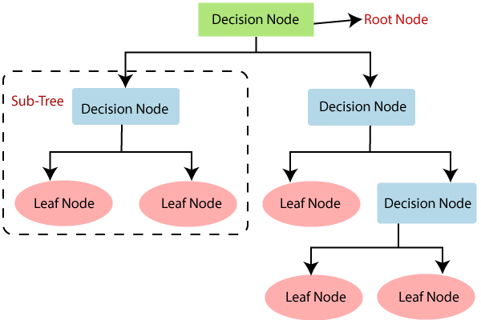

## Table of Contents

## What is a node in the context of decision trees in machine learning?

In the context of decision trees in machine learning, a node represents a point of decision or a test on one of the input features. Think of a decision tree as a flowchart where each node asks a question about the data. For example, if you're trying to predict whether someone will buy a product, a node might ask, "Is the customer's age greater than 30?" Depending on the answer, the data splits and moves down different branches of the tree.

There are three main types of nodes in a decision tree: root nodes, internal nodes, and leaf nodes. The root node is at the top of the tree and represents the first decision or split. Internal nodes are the decision points in the middle of the tree, each representing a further split based on another feature. Leaf nodes, or terminal nodes, are at the bottom of the tree and represent the final outcome or prediction. Each path from the root to a leaf node forms a decision rule that can be used to classify new data points.

## How does a node function within a decision tree?

A node in a decision tree works like a question that helps split the data into different groups. When the tree is being built, each node looks at one feature of the data and decides how to divide it. For example, if you're trying to predict if it will rain, a node might ask, "Is the humidity above 80%?" If the answer is yes, the data goes down one path, and if no, it goes down another. This process continues until the data is split into smaller and smaller groups, making it easier to make a prediction.

The first node at the top of the tree is called the root node. It's the starting point and asks the first question. As you move down the tree, you'll find internal nodes. These are the middle nodes that keep asking questions and splitting the data. Finally, at the bottom of the tree, you'll reach the leaf nodes. These are the end points where the tree stops splitting and gives the final prediction. Each path from the root to a leaf node creates a rule that helps classify new data.

## What are the different types of nodes found in a decision tree?

In a decision tree, there are three main types of nodes: root nodes, internal nodes, and leaf nodes. The root node is the very top of the tree. It's where the decision-making starts. The root node looks at one feature of the data and asks a question to split the data into two or more groups. For example, if you're deciding whether to play outside, the root node might ask, "Is it raining?" Based on the answer, the data splits and goes down different paths.

Internal nodes are the middle part of the tree. They keep the decision-making going by asking more questions about the data. Each internal node splits the data further based on another feature. If the root node asked about rain, an internal node might ask, "Is the temperature above 20 degrees?" These nodes help refine the groups until they get to the final decision points.

Leaf nodes are at the bottom of the tree. They are also called terminal nodes because they're where the tree ends. Leaf nodes don't ask any more questions; instead, they give the final answer or prediction. For example, after asking about rain and temperature, a leaf node might say, "Yes, you can play outside" or "No, stay inside." Each path from the root node to a leaf node forms a rule that helps classify new data.

## How do you determine the best split at a node in a decision tree?

To determine the best split at a node in a decision tree, you need to find a way to divide the data that makes the groups as different from each other as possible. This is usually done by using a measure like Gini impurity, entropy, or information gain. For example, if you're trying to predict if people will buy a product, you might look at their age and see if splitting the data at age 30 makes one group more likely to buy and the other less likely. You calculate the impurity or gain for different splits and choose the one that gives the best result.

Once you have chosen a measure, you go through each feature and each possible split point to find the best one. If you're using Gini impurity, for example, you would calculate the Gini impurity for the whole dataset and then for each possible split. The best split is the one that reduces the Gini impurity the most. This process is repeated at each node until you reach the leaf nodes or meet some stopping criteria, like a maximum tree depth or a minimum number of samples per leaf. By doing this, you build a tree that can make good predictions by following the paths from the root to the leaf nodes.

## What is the role of a root node in a decision tree?

The root node is the starting point of a decision tree. It sits at the very top and is the first node that looks at the data. Its job is to ask the first question about one of the features, like "Is the temperature above 20 degrees?" or "Is the person over 30 years old?" The answer to this question splits the data into different groups, which then move down the tree along different paths.

Choosing the right question for the root node is important because it sets the stage for the rest of the tree. To find the best split, you might use measures like Gini impurity or entropy. For example, you calculate how much the data is mixed before and after the split. The question that makes the groups as different as possible is chosen for the root node. This way, the tree can start making good predictions right from the start.

## How do internal nodes and leaf nodes differ in their purpose?

Internal nodes and leaf nodes serve different purposes in a decision tree. Internal nodes are the decision points in the middle of the tree. They ask questions about the data, like "Is it raining?" or "Is the temperature above 20 degrees?" Each internal node splits the data into different groups based on the answer to its question. This process continues down the tree, refining the groups until you reach the leaf nodes.

Leaf nodes, on the other hand, are the end points of the tree. They don't ask any more questions; instead, they give the final prediction or outcome. For example, a leaf node might say, "Yes, you can play outside" or "No, stay inside." Each path from the root node to a leaf node forms a rule that helps classify new data. So, while internal nodes keep the decision-making going, leaf nodes provide the final answers.

## What are the common algorithms used to select the splitting criteria at nodes?

Common algorithms used to select the splitting criteria at nodes in decision trees include Gini impurity, entropy, and information gain. Gini impurity measures how often a randomly chosen element from the set would be incorrectly labeled if it was randomly labeled according to the distribution of labels in the subset. A lower Gini impurity means the split is better because the groups are more pure. Entropy, on the other hand, measures the randomness or unpredictability of the data. A split that reduces entropy the most is considered the best. Information gain is related to entropy and measures the reduction in entropy after the dataset is split on an attribute. The attribute that gives the highest information gain is chosen for the split.

These algorithms help in deciding which feature and which value of that feature to use for splitting the data at each node. For example, if you're using Gini impurity, you would calculate the Gini impurity for the whole dataset and then for each possible split. The split that results in the lowest Gini impurity is chosen. Similarly, for entropy, you would calculate the entropy before and after each possible split and choose the one that reduces entropy the most. Information gain would be calculated as the difference in entropy before and after the split, and the split with the highest information gain would be selected. By using these methods, the decision tree can effectively split the data to make accurate predictions.

## How does impurity affect the decision-making process at a node?

Impurity measures how mixed up the data is at a node in a decision tree. When you're trying to split the data, you want to make the groups as different from each other as possible. If a node has high impurity, it means the data is very mixed, and it's hard to make a good prediction. By choosing a split that reduces impurity, you make the groups more pure, which helps the tree make better decisions. For example, if you're deciding whether to play outside based on the weather, a node with high impurity might have a mix of sunny and rainy days. A good split would separate these into different groups, making it easier to decide.

Common ways to measure impurity include Gini impurity and entropy. Gini impurity looks at how often a randomly chosen element would be incorrectly labeled if it was randomly labeled according to the distribution of labels in the subset. A lower Gini impurity means the groups are more pure, so it's a better split. Entropy measures the randomness of the data. A split that reduces entropy the most is considered the best. For example, if you're using Gini impurity, you calculate the Gini impurity for the whole dataset and then for each possible split. The split that results in the lowest Gini impurity is chosen. By using these measures, the decision tree can effectively split the data to make accurate predictions.

## What are pruning techniques and how do they impact nodes in a decision tree?

Pruning is a way to make a decision tree simpler and better at making predictions. When you build a decision tree, it can sometimes get too big and start to fit the training data too closely, which is called overfitting. Pruning helps by cutting off parts of the tree that don't help much with predictions. This makes the tree smaller and easier to understand, and it can work better on new data. There are two main ways to prune a tree: pre-pruning and post-pruning. Pre-pruning stops the tree from growing too big by setting rules like a maximum depth or a minimum number of samples needed to split a node. Post-pruning, on the other hand, grows the full tree first and then cuts off branches that don't help much.

When you prune a decision tree, it affects the nodes in different ways. If you use pre-pruning, some nodes might never be created because the tree stops growing before it gets to them. For example, if you set a maximum depth of 3, any nodes that would be at level 4 or deeper won't be made. With post-pruning, you might cut off whole branches of the tree, turning internal nodes into leaf nodes. This means that some internal nodes that were asking questions before might now be giving final predictions. By pruning, you make the tree smaller and more focused on the most important splits, which can help it make better predictions on new data.

## How can overfitting be managed at the node level in decision trees?

Overfitting in decision trees can be managed at the node level by setting rules that stop the tree from growing too big. One way to do this is by setting a maximum depth for the tree. This means the tree will stop growing once it reaches a certain number of levels. For example, if you set the maximum depth to 3, the tree won't create any nodes beyond the third level. Another way is to set a minimum number of samples needed to split a node. If a node has fewer samples than this number, it won't split anymore and will become a leaf node. These rules help keep the tree from getting too detailed and fitting the training data too closely.

Another method to manage overfitting is by using pruning techniques. Pruning can be done before the tree is fully grown, which is called pre-pruning, or after the tree is complete, which is called post-pruning. Pre-pruning stops the tree from growing too big by applying rules like maximum depth or minimum samples per node. Post-pruning, on the other hand, grows the full tree first and then cuts off branches that don't help much with predictions. This can turn some internal nodes into leaf nodes, making the tree simpler and better at making predictions on new data. By managing the growth and complexity of the tree at the node level, you can prevent overfitting and improve the tree's performance.

## What advanced techniques can be used to optimize node splitting in complex datasets?

When dealing with complex datasets, one advanced technique to optimize node splitting is to use ensemble methods like Random Forests or Gradient Boosting Machines. These methods create multiple decision trees and combine their predictions to improve accuracy and reduce overfitting. In a Random Forest, each tree is built on a random subset of the data and features, which helps to find different splits that might be missed by a single tree. This randomness can lead to better overall performance, especially when the data has many features or is noisy. Gradient Boosting Machines, on the other hand, build trees sequentially, with each new tree trying to correct the errors of the previous ones. This can lead to very accurate models, but it requires careful tuning to avoid overfitting.

Another technique is to use cost-complexity pruning, which balances the tree's complexity with its accuracy. This method involves growing a full tree and then pruning it back by considering a trade-off between the tree's size and its ability to fit the data. The idea is to find the right balance where the tree is not too simple to underfit, nor too complex to overfit. The cost-complexity parameter, often denoted as $$\alpha$$, controls this balance. A higher $$\alpha$$ leads to more pruning, resulting in a simpler tree, while a lower $$\alpha$$ allows the tree to remain more complex. By tuning this parameter, you can optimize the tree's performance on complex datasets, making it more robust and generalizable.

## How do ensemble methods like Random Forests utilize nodes differently compared to single decision trees?

In a single decision tree, each node is used to make one split based on one feature. The tree grows by choosing the best split at each node to separate the data into different groups. This process continues until the tree reaches a certain depth or the data is split into small enough groups. The goal is to create a tree that can accurately predict outcomes for new data by following the paths from the root node to the leaf nodes.

In contrast, ensemble methods like Random Forests use many decision trees, and each tree might use nodes differently. In a Random Forest, each tree is built on a random subset of the data and a random subset of the features. This means that the nodes in different trees might ask different questions and make different splits. By combining the predictions from all these trees, Random Forests can make more accurate predictions than a single tree. This randomness helps to find different splits that might be missed by a single tree, making the overall model better at handling complex datasets.

## References & Further Reading

[1]: Quinlan, J. R. (1986). ["Induction of Decision Trees."](https://link.springer.com/article/10.1007/BF00116251) Machine Learning, 1(1), 81-106.

[2]: Breiman, L., Friedman, J., Stone, C. J., & Olshen, R. A. (1984). ["Classification and Regression Trees."](https://www.taylorfrancis.com/books/mono/10.1201/9781315139470/classification-regression-trees-leo-breiman-jerome-friedman-olshen-charles-stone) CRC Press.

[3]: Hastie, T., Tibshirani, R., & Friedman, J. (2009). ["The Elements of Statistical Learning: Data Mining, Inference, and Prediction."](https://link.springer.com/book/10.1007/978-0-387-84858-7) Springer.

[4]: Breiman, L. (2001). ["Random Forests."](https://link.springer.com/article/10.1023/A:1010933404324) Machine Learning, 45(1), 5-32.

[5]: Quinlan, J. R. (1993). ["C4.5: Programs for Machine Learning."](https://link.springer.com/article/10.1007/BF00993309) Morgan Kaufmann Publishers.

[6]: Rokach, L., & Maimon, O. (2005). ["Decision Trees."](https://link.springer.com/chapter/10.1007/0-387-25465-X_9) In Data Mining and Knowledge Discovery Handbook, Springer.