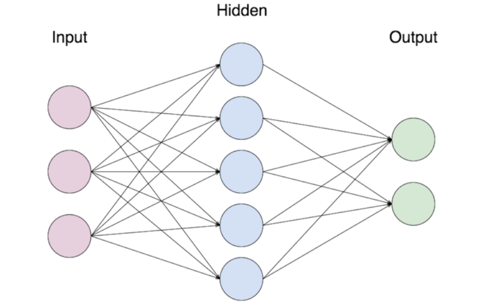

## Table of Contents

## What is a node in the context of neural networks?

In the context of neural networks, a node is like a tiny decision-maker inside the network. It takes in information from other nodes or from the input data, does a bit of math with it, and then decides what information to pass on to the next layer of nodes or to the output. Think of a node as a simple calculator that helps the neural network learn and make predictions by processing information step by step.

Each node in a neural network applies a function to the incoming data. This function usually involves multiplying the inputs by certain weights and then adding them up. After that, the node applies an activation function, which decides whether and how much the node should "fire" or activate. For example, a common activation function is the sigmoid function, which can be written as $$ \sigma(x) = \frac{1}{1 + e^{-x}} $$. This process of weighting, summing, and activating helps the neural network recognize patterns and make decisions based on the data it receives.

## How does a node function within a neural network?

A node in a neural network works by taking in information, doing some calculations, and then sending out new information. Imagine each node as a tiny worker that gets numbers from other nodes or from the start of the network. It then multiplies these numbers by special values called weights, which help the node decide how important each piece of information is. After multiplying, the node adds all these weighted numbers together. This sum is then passed through something called an activation function, which decides if the node should send out a signal or not. If the sum is big enough, the node activates and sends a new number to the next layer of nodes.

For example, a common activation function is the sigmoid function, which you can think of as a way to turn the node's sum into a number between 0 and 1. The sigmoid function looks like this: $$ \sigma(x) = \frac{1}{1 + e^{-x}} $$. If the sum, or 'x', is a big positive number, the sigmoid function will make the output close to 1. If 'x' is a big negative number, the output will be close to 0. This helps the neural network understand and process information in a way that's useful for making decisions or predictions. By working together, all these nodes help the neural network learn from data and figure out patterns or make guesses about new information.

## What are the basic components of a node in a neural network?

A node in a neural network has a few main parts. It gets inputs from other nodes or from the start of the network. These inputs are numbers that the node uses to do its job. Each input also has a weight, which is like a special number that tells the node how important that input is. The node multiplies each input by its weight and then adds all these numbers together to get a sum.

Next, the node uses an activation function to decide what to do with this sum. The activation function is like a rule that helps the node figure out if it should send a signal to the next layer of nodes. A common activation function is the sigmoid function, which looks like this: $$ \sigma(x) = \frac{1}{1 + e^{-x}} $$. If the sum is big, the sigmoid function will make the output close to 1. If the sum is small, the output will be close to 0. This process helps the neural network learn and make decisions based on the data it gets.

## How do nodes contribute to the learning process in neural networks?

Nodes are the tiny workers in a neural network that help it learn from data. Each node takes in numbers from other nodes or from the start of the network. It then multiplies these numbers by special values called weights, which tell the node how important each piece of information is. After multiplying, the node adds up all these weighted numbers to get a sum. This sum is then passed through an activation function, like the sigmoid function $$ \sigma(x) = \frac{1}{1 + e^{-x}} $$, which decides if the node should send out a new signal. By doing this, each node helps the network understand and process information step by step.

During the learning process, the neural network adjusts the weights of the nodes to make better predictions or recognize patterns. This happens through a method called backpropagation. When the network makes a mistake, it figures out how much each node contributed to that mistake and adjusts the weights to reduce the error next time. This way, the nodes learn to give more importance to the right pieces of information. Over many rounds of training, the nodes work together to make the whole network smarter and better at its job.

## What is the role of activation functions in nodes?

Activation functions are like decision-makers inside each node of a neural network. They take the sum of all the weighted inputs that a node gets and decide what the node should do next. If the sum is big enough, the activation function might make the node send out a strong signal. If the sum is small, the node might send out a weak signal or no signal at all. A common activation function is the sigmoid function, which looks like this: $$ \sigma(x) = \frac{1}{1 + e^{-x}} $$. It turns the node's sum into a number between 0 and 1, helping the network understand and process information in a way that's useful for making decisions.

Without activation functions, a neural network would just be a bunch of linear calculations, and it wouldn't be able to learn complex patterns or make interesting predictions. The activation function adds non-linearity, which means it can handle more complicated relationships between the inputs and the outputs. This makes the neural network much more powerful and able to learn from the data it gets. By using activation functions, each node can help the whole network figure out how to make better guesses and learn from its mistakes.

## How do weights and biases affect the performance of a node?

Weights and biases are super important for how well a node in a neural network works. Think of weights as numbers that tell the node how important each piece of information is. When a node gets numbers from other nodes or from the start of the network, it multiplies each number by its weight. Then, it adds all these numbers together to get a sum. The weight helps the node decide which information to pay more attention to. If a weight is big, the node will think that piece of information is very important. If a weight is small, the node might not care about that information as much.

Biases are like a starting point for the node. They are added to the sum of the weighted inputs before the node uses the activation function. You can think of a bias as a way to shift the node's decision-making process. If the bias is big, it can make the node more likely to send out a signal even if the weighted sum is small. If the bias is small or negative, it can make the node less likely to send out a signal. Together, weights and biases help the node figure out the best way to process information and make the whole neural network better at learning and making predictions.

## What are some common types of nodes used in neural networks?

In neural networks, there are several common types of nodes, each with a specific role. The most basic type is the neuron, which takes in inputs, multiplies them by weights, adds a bias, and then applies an activation function. A common activation function is the sigmoid function, which looks like this: $$ \sigma(x) = \frac{1}{1 + e^{-x}} $$. This type of node helps the network learn and make decisions by processing information step by step.

Another type of node is the convolutional node, often used in convolutional neural networks (CNNs) for tasks like image recognition. These nodes apply filters to the input data to detect features like edges or textures. They help the network understand complex patterns in images by breaking them down into simpler parts. 

Lastly, there are recurrent nodes, which are used in recurrent neural networks (RNNs) for tasks involving sequences, like language processing. These nodes have a special ability to remember past inputs, which helps them understand the context of the data over time. By keeping track of what came before, recurrent nodes can make better predictions about what might come next.

## How can the architecture of nodes impact the overall network performance?

The way nodes are set up in a neural network can really change how well the whole network works. If you have a lot of nodes and layers, the network can learn more complex things. But, it might also take longer to train and could be harder to figure out what's going on inside. On the other hand, if you have fewer nodes and layers, the network might be simpler and faster to train, but it might not be able to learn as many details. The choice of how many nodes and layers to use depends on what you want the network to do and how much time and power you have to train it.

The type of nodes you use can also make a big difference. For example, if you're working with images, using convolutional nodes can help the network understand the pictures better. These nodes look for patterns in small parts of the image and help the network see things like edges or shapes. If you're working with words or sounds, using recurrent nodes can help because they remember what came before. This can make the network better at understanding sentences or songs. By choosing the right type of nodes for your task, you can make your neural network work better and learn faster.

## What are the differences between nodes in feedforward and recurrent neural networks?

In a feedforward neural network, nodes are like little workers that take information from one layer and pass it straight to the next layer. They don't remember anything from before. Each node gets some numbers, multiplies them by weights, adds a bias, and then uses an activation function like the sigmoid function $$ \sigma(x) = \frac{1}{1 + e^{-x}} $$ to decide what to send to the next layer. This setup is good for tasks where you just need to look at the input and make a decision, like recognizing a picture or predicting a number.

In a recurrent neural network, nodes are a bit different because they can remember things from the past. Each node not only looks at the current input but also keeps track of what it saw before. This memory helps the network understand sequences, like words in a sentence or notes in a song. The nodes use their memory to make better guesses about what might come next. This makes recurrent neural networks great for tasks like language translation or predicting the next word in a text.

## How do nodes handle complex data patterns and non-linear relationships?

Nodes in a neural network handle complex data patterns and non-linear relationships by using something called an activation function. Think of the activation function as a special tool that helps the node decide what to do with the information it gets. A common activation function is the sigmoid function, which looks like this: $$ \sigma(x) = \frac{1}{1 + e^{-x}} $$. This function takes the sum of all the weighted inputs, which might be a big or small number, and turns it into a number between 0 and 1. This helps the node understand and process information in a way that's not just simple addition or multiplication. By using this kind of function, the node can figure out more complicated patterns in the data, like curves or jumps, instead of just straight lines.

When nodes work together in a network, they can handle even more complex patterns. Each layer of nodes can learn different parts of the pattern. For example, in a network that recognizes pictures, the first layer might learn to see edges, the next layer might learn to see shapes, and the last layer might put it all together to recognize the whole picture. This way, the network can understand and predict things that are not just simple or straight. By adjusting the weights and biases of the nodes during training, the network gets better at figuring out these complex patterns and non-linear relationships, making it smarter and more useful for tasks like recognizing faces or understanding speech.

## What advanced techniques can be applied to optimize node performance?

To make nodes in a neural network work better, one technique is called "regularization." Regularization helps stop the network from getting too good at remembering the training data and not so good at understanding new data. A common type of regularization is called "L2 regularization," which adds a little bit of the weights squared to the error the network is trying to reduce. This makes the weights smaller and helps the network focus on the most important parts of the data. Another technique is "dropout," where during training, some nodes are randomly turned off. This makes the network more flexible and better at handling new data because it can't rely too much on any one node.

Another way to boost node performance is by using "batch normalization." Batch normalization helps the network learn faster by making the data going into each node more consistent. It does this by adjusting the inputs to have a mean of zero and a standard deviation of one. This helps the network train more smoothly and can make it easier for the network to learn complex patterns. For example, if you're using the sigmoid activation function $$ \sigma(x) = \frac{1}{1 + e^{-x}} $$, batch normalization can help keep the inputs in a good range for this function, making the learning process more stable and effective.

## How can one evaluate and troubleshoot issues related to node functionality in neural networks?

To evaluate and troubleshoot issues related to node functionality in neural networks, you can start by looking at the network's performance on a set of data it hasn't seen before, called the validation set. If the network isn't doing well, it might mean the nodes aren't working right. One way to check this is by looking at the weights and biases of the nodes. If the weights are very big or very small, it could mean the nodes are not learning the right things. You can also use tools like TensorBoard to see how the weights and biases change over time during training. This can help you spot if something is going wrong with the nodes.

Another way to troubleshoot node issues is by using techniques like "gradient checking." This involves comparing the gradients calculated by backpropagation with those calculated using a small change in the weights. If they don't match, it could mean there's a problem with how the nodes are updating their weights. You can also try changing the activation function, like switching from the sigmoid function $$ \sigma(x) = \frac{1}{1 + e^{-x}} $$ to the ReLU function, which is simpler and can sometimes help the nodes work better. By trying different things and watching how the network reacts, you can figure out what's wrong with the nodes and fix it.