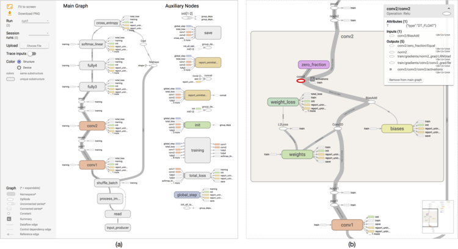

## Table of Contents

## What is a node in the context of a TensorFlow graph?

In the context of a TensorFlow graph, a node represents an operation or a variable. Think of a node as a small piece of a puzzle that performs a specific task, like adding two numbers or applying an activation function. When you build a TensorFlow model, you connect these nodes together to create a flow of data and computations, which is why it's called a "graph."

Each node in the graph takes in zero or more tensors as inputs and produces a tensor as output. For example, if you have a node that performs addition, it might take two input tensors, add them together, and produce a new tensor as the result. This output can then be used as input for another node, allowing you to build complex models by chaining operations together. The beauty of this system is that TensorFlow can optimize the entire graph to run efficiently on different hardware, like CPUs or GPUs.

## How does a node function within a TensorFlow computational graph?

In a TensorFlow computational graph, a node represents an operation or a variable. Think of it like a tiny worker that does a specific job, like adding numbers or applying a function. When you build a model, you connect these nodes together to create a flow of data and calculations. For example, if you have a node that adds two numbers, it takes two inputs, does the addition, and gives you a result. This result can then be used by another node, creating a chain of operations that forms your model.

TensorFlow is smart about how it uses these nodes. It looks at the whole graph and figures out the best way to run it on different types of hardware, like CPUs or GPUs. This means that even though you might have a lot of nodes, TensorFlow can make sure your model runs quickly and efficiently. By connecting nodes in different ways, you can build all sorts of models, from simple ones that predict house prices to complex ones that recognize images or understand speech.

## What are the basic types of nodes in TensorFlow?

In TensorFlow, there are two main types of nodes: operation nodes and variable nodes. Operation nodes are like little workers that do specific tasks. They take in inputs, do something like adding numbers or applying a function, and then give out a result. For example, an addition node would take two numbers, add them together, and give you the sum. These nodes are the building blocks of your model, and you connect them to make the data flow through your model.

Variable nodes are different because they hold values that can change as your model learns. Think of them as adjustable knobs that TensorFlow tweaks to make your model better. For instance, if you're trying to predict house prices, the weights in your model would be variable nodes. TensorFlow adjusts these weights during training to minimize the error in your predictions. By using both operation and variable nodes, you can build powerful models that learn from data.

When you put these nodes together in a TensorFlow graph, you create a blueprint for how your model should work. TensorFlow then looks at this blueprint and figures out the best way to run it on your computer, whether it's a CPU or a GPU. This makes your model run fast and efficiently, even if it has a lot of nodes. By understanding how these nodes work, you can build all sorts of models, from simple ones to very complex ones that do things like recognize images or understand speech.

## How do you create a node in TensorFlow?

In TensorFlow, creating a node is easy. You can make a node by using different functions that TensorFlow gives you. For example, if you want to add two numbers, you can use the `tf.add()` function. Let's say you have two numbers, `a` and `b`. You can create an addition node like this: ```python
import tensorflow as tf
a = tf.constant(2)
b = tf.constant(3)
addition_node = tf.add(a, b)
``` This code makes a node that adds `a` and `b` together. The result of this node will be `5`, because $$2 + 3 = 5$$.

You can also create nodes for other operations, like multiplication or applying a function. For instance, if you want to multiply two numbers, you can use `tf.multiply()`. Here's how you can do it: ```python
c = tf.constant(4)
d = tf.constant(5)
multiplication_node = tf.multiply(c, d)
``` This code creates a node that multiplies `c` and `d`, and the result will be `20`, because $$4 \times 5 = 20$$. By using these functions, you can build your TensorFlow graph with many different types of nodes, each doing its own job to help your model work.

## What is the role of nodes in machine learning model training?

In [machine learning](/wiki/machine-learning), nodes in a TensorFlow graph are like the building blocks of your model. They do specific jobs, like adding numbers or applying functions, and they work together to help your model learn from data. For example, if you're trying to predict house prices, you might have nodes that multiply the house's size by a weight, and other nodes that add a bias to the result. These nodes are connected in a way that lets data flow through the model, and TensorFlow uses this flow to figure out how to make your predictions better.

During training, the nodes that hold adjustable values, called variable nodes, are really important. These nodes, like weights and biases, are tweaked by TensorFlow to minimize the error in your predictions. For instance, if your model predicts a house price that's too high, TensorFlow might adjust the weights to make the prediction lower. By changing these variable nodes little by little, your model gets better at making accurate predictions over time. This process of adjusting the nodes is what makes machine learning models so powerful—they can learn and improve without being told exactly what to do.

## How do nodes interact with tensors in TensorFlow?

In TensorFlow, nodes and tensors work together to make your model run. A node is like a worker that does a specific job, like adding numbers or applying a function. When a node does its job, it takes in tensors as inputs and gives out a tensor as an output. For example, if you have a node that adds two numbers, it might take in two tensors, each holding a number, and then give out a new tensor with the sum. This output tensor can then be used as an input for another node, creating a chain of operations that forms your model.

During training, nodes that hold adjustable values, called variable nodes, are really important. These nodes, like weights and biases, are changed by TensorFlow to make your model's predictions better. For instance, if your model is trying to predict house prices, it might use a node to multiply the house's size by a weight. If the prediction is too high, TensorFlow might adjust the weight to make the prediction lower. By changing these variable nodes little by little, your model learns from the data and gets better at making accurate predictions over time.

## What are the differences between operation nodes and variable nodes?

In TensorFlow, operation nodes and variable nodes play different roles in building and training a model. Operation nodes are like little workers that do specific tasks. They take in tensors as inputs, do something like adding numbers or applying a function, and then give out a tensor as an output. For example, if you have an addition node, it might take two tensors, each holding a number, and then give out a new tensor with their sum. These nodes are the building blocks of your model, and you connect them to make the data flow through your model.

Variable nodes, on the other hand, hold values that can change as your model learns. They are like adjustable knobs that TensorFlow tweaks to make your model better. For instance, if you're trying to predict house prices, the weights in your model would be variable nodes. TensorFlow adjusts these weights during training to minimize the error in your predictions. By using both operation and variable nodes, you can build powerful models that learn from data. For example, if your model predicts a house price that's too high, TensorFlow might adjust the weights to make the prediction lower, using a formula like $$ \text{new_weight} = \text{old_weight} - \text{learning_rate} \times \text{gradient} $$. 

When you put these nodes together in a TensorFlow graph, you create a blueprint for how your model should work. TensorFlow then looks at this blueprint and figures out the best way to run it on your computer, whether it's a CPU or a GPU. This makes your model run fast and efficiently, even if it has a lot of nodes. By understanding how these nodes work, you can build all sorts of models, from simple ones to very complex ones that do things like recognize images or understand speech.

## How can you visualize and debug nodes in TensorFlow?

In TensorFlow, you can use TensorBoard to visualize and debug nodes in your graph. TensorBoard is like a special tool that helps you see what's happening inside your model. You can use it to look at the graph, see how the nodes are connected, and even watch how the values in the variable nodes change over time. To use TensorBoard, you need to set up your TensorFlow code to write log files, and then you can open TensorBoard in your web browser to see the graph. For example, you might use code like ```python
import tensorflow as tf
# Create a simple model
a = tf.constant(2)
b = tf.constant(3)
c = tf.add(a, b)
# Set up a summary writer
writer = tf.summary.create_file_writer("logs")
with writer.as_default():
    tf.summary.graph([c])
``` to make a graph that you can look at in TensorBoard.

Debugging nodes in TensorFlow can also be done with the tf.debugging module. This module has tools that let you check the values of tensors as they flow through the nodes in your graph. For instance, you can use `tf.debugging.assert_equal()` to make sure two tensors have the same value, or `tf.debugging.assert_greater()` to check if one tensor is bigger than another. These tools help you find and fix problems in your model. For example, if you want to make sure a tensor `x` is positive, you might use code like ```python
import tensorflow as tf
x = tf.constant(5)
tf.debugging.assert_greater(x, 0, message="x must be positive")
``` This code will stop your program and show an error message if `x` is not greater than zero. By using these tools, you can make sure your nodes are working the way you expect them to, and fix any issues that come up.

## What advanced techniques can be used to optimize node performance in TensorFlow?

One way to optimize node performance in TensorFlow is by using operations that can run on GPUs. GPUs are like super fast calculators that can do many things at once. TensorFlow can use them to make your model run quicker. For example, if you have a node that does a lot of math, like multiplying big matrices, you can tell TensorFlow to use a GPU for that node. This can make your model train faster. You can do this by setting up your TensorFlow session to use a GPU, like this: ```python
import tensorflow as tf
with tf.device('/GPU:0'):
    a = tf.constant([[1.0, 2.0], [3.0, 4.0]])
    b = tf.constant([[1.0, 1.0], [0.0, 1.0]])
    c = tf.matmul(a, b)
``` This code tells TensorFlow to use the first GPU to do the matrix multiplication.

Another technique is to use quantization. Quantization is like making your model use smaller numbers, which can save space and make it run faster. Instead of using big numbers, you can use smaller ones that still do the job. For example, if your model uses 32-bit numbers, you can change it to use 8-bit numbers. This can make your model run faster on devices with less power, like mobile phones. TensorFlow has tools to help you do this, like the `tf.quantization` module. By using these tools, you can make your model smaller and faster without losing too much accuracy. For instance, you might use a formula like $$ \text{quantized_value} = \text{round}(\frac{\text{original_value} - \text{min_value}}{\text{max_value} - \text{min_value}} \times (\text{2}^n - 1)) $$ to change a number to an 8-bit value, where $$ n $$ is the number of bits you want to use.

## How do nodes contribute to the architecture of deep learning models?

In [deep learning](/wiki/deep-learning) models, nodes are like the building blocks that help create the model's structure. They do specific jobs, like adding numbers or applying functions, and they work together to make the model learn from data. For example, in a [neural network](/wiki/neural-network), you might have nodes that take in input data, like the size of a house, and then pass it through layers of nodes that do calculations. These calculations help the model figure out how to predict things, like the price of the house. By connecting these nodes in different ways, you can build all sorts of models, from simple ones to very complex ones that can recognize images or understand speech.

Nodes also help the model learn by holding values that can change during training. These values, called weights and biases, are like adjustable knobs that TensorFlow tweaks to make the model's predictions better. For instance, if your model predicts a house price that's too high, TensorFlow might adjust the weights to make the prediction lower. This process of changing the weights and biases is done using formulas like $$ \text{new_weight} = \text{old_weight} - \text{learning_rate} \times \text{gradient} $$. By changing these values little by little, the model gets better at making accurate predictions over time. This is what makes deep learning models so powerful—they can learn and improve without being told exactly what to do.

## What are the best practices for managing complex node dependencies in large TensorFlow graphs?

Managing complex node dependencies in large TensorFlow graphs can be tricky, but there are some good ways to keep things organized. One way is to break your model into smaller parts, called modules or layers. Each module can have its own set of nodes that do a specific job, like processing input data or making predictions. By breaking your model into smaller pieces, you can make it easier to understand and manage the connections between nodes. For example, if you're building a neural network, you might have one module for the input layer, another for the hidden layers, and a third for the output layer. This way, you can focus on one part at a time and make sure the nodes in each module are working together correctly.

Another good practice is to use TensorFlow's built-in tools for managing dependencies. For instance, you can use `tf.function` to turn your Python code into a TensorFlow graph, which can help you see how the nodes are connected. You can also use TensorBoard to visualize your graph and see how the nodes depend on each other. This can help you spot any problems or bottlenecks in your model. For example, if you see that one node is taking a long time to run, you might need to optimize it or break it into smaller nodes. By using these tools, you can make sure your model is running efficiently and that the nodes are working together smoothly.

Finally, it's important to keep your code clean and well-documented. Use clear names for your nodes and variables, and add comments to explain what each part of your code is doing. This can help you and others understand the dependencies between nodes more easily. For example, if you have a node that multiplies two tensors, you might name it `multiply_node` and add a comment like `# This node multiplies the input tensors`. By keeping your code organized and easy to read, you can manage complex node dependencies more effectively and build better deep learning models.

## How can you implement custom nodes in TensorFlow for specialized machine learning tasks?

In TensorFlow, you can make custom nodes for special machine learning tasks by using the `tf.custom_gradient` decorator. This lets you create a node that does a specific job and also tells TensorFlow how to find the gradient of that node. The gradient is like a guide that shows TensorFlow how to change the node's values to make the model better. For example, if you want to make a custom activation function, you can use `tf.custom_gradient` to define both the function and its gradient. This way, TensorFlow can use your custom node in the model and adjust its values during training to improve the model's predictions.

To make a custom node, you write a function that does what you want, and then you use `tf.custom_gradient` to wrap it. For instance, if you want to create a custom node that does a special kind of multiplication, you might write a function like this: ```python
import tensorflow as tf

@tf.custom_gradient
def special_multiply(x, y):
    result = x * y
    def grad(dy):
        return dy * y, dy * x
    return result, grad

a = tf.constant(2.0)
b = tf.constant(3.0)
c = special_multiply(a, b)
``` In this code, `special_multiply` is a custom node that multiplies two numbers and also tells TensorFlow how to find the gradient. When you use this node in your model, TensorFlow can adjust its values to make the model's predictions better. By making custom nodes like this, you can build models that do special tasks that the built-in nodes can't do.