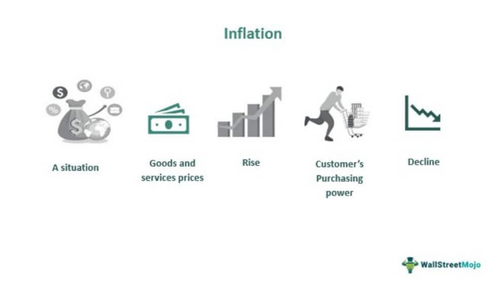

Algorithmic trading plays a pivotal role in the contemporary financial landscape, enabling trades to occur at speeds and frequencies that surpass human capabilities. This technological advancement leverages complex algorithms to analyze market data and execute trades, often capitalizing on fleeting opportunities that would be missed by manual trading. However, algorithmic trading is not without its challenges, the foremost being the pervasive influence of noise within financial markets.

Noise in this context refers to extraneous data or price fluctuations that obscure true market signals. These irrelevant movements can arise from various sources, including random trader behavior, speculative news, and short-term supply-demand imbalances, among others. The presence of noise can disrupt the ability of traders and algorithms to accurately interpret market conditions, leading to decisions that are misinformed by distorted signals rather than grounded in market reality.



In this article, we will dissect the causes of noise within financial markets, evaluate its impact on algorithmic trading, and propose alternatives and solutions for mitigating its adverse effects. By understanding the intricate dynamics of noise and its interference with trading signals, traders and analysts can enhance their strategies and improve decision-making processes. This will ultimately aid in reducing risk and maximizing the effectiveness of algorithmic trading systems in distinguishing between genuine market trends and mere noise.

## Table of Contents

## Understanding Noise in Financial Markets

Noise in financial markets refers to random fluctuations in price data that are not linked to any fundamental changes. These fluctuations can be attributed to several factors, including trader behavior, market microstructure, and external events, each of which can temporarily affect price dynamics without causing substantial long-term impacts. 

Trader behavior often contributes to noise, as market participants may react to speculative news or rumors, leading to volatile price movements that are not based on fundamental analysis. These reactions can create patterns in price data that seem significant in the short term but lack underlying justifications in market fundamentals.

Market microstructure is another critical source of noise. The technical aspects of how a market operates, such as bid-ask spreads, limit order [books](/wiki/algo-trading-books), and trading volumes, can introduce significant noise. For instance, a widening bid-ask spread may temporarily lower trade prices without reflecting a genuine shift in market valuation. Similarly, spikes in trading volume can cause transient oscillations in asset prices, making it challenging to discern genuine market trends.

External events, such as unexpected geopolitical developments, economic data releases, or abrupt regulatory changes, can also cause noise. These events often prompt swift and sharp trading reactions; however, if they do not have sustainable implications, they primarily introduce short-term [volatility](/wiki/volatility-trading-strategies).

Differentiating between noise and true market signals stands as a pivotal aspect of formulating successful trading strategies. Identifying genuine signals—meaning data that accurately reflects changes or trends in underlying asset values—can be complex due to the interspersed noise. Effective strategies often rely on statistical and computational techniques to filter out noise and focus on significant market indicators.

For example, moving averages or more sophisticated approaches like Kalman filters can be employed to smooth price data, aiming to reduce noise. These techniques optimize the signal-to-noise ratio, helping traders focus on meaningful information, thereby improving decision-making processes and trading outcomes.

## The Causes of Noise

Random trader behavior significantly contributes to noise in financial markets. Traders reacting to speculative news or trends can lead to unpredictable buying and selling patterns that do not reflect fundamental asset values. For example, traders may engage in panic selling or exuberant buying based on rumors or speculative reports, leading to price movements that lack substantial backing.

Furthermore, program trading and high-frequency trading ([HFT](/wiki/high-frequency-trading-strategies)) introduce noise due to their reliance on preset algorithms that execute trades at high speeds. These automated systems can exacerbate market volatility by reacting to minute price changes or other algorithms' actions. The sheer [volume](/wiki/volume-trading-strategy) and quick turnover associated with these trading strategies can mask genuine market signals, making it difficult for traders to discern valuable information from the noise.

Economic events, news releases, and geopolitical developments are external sources of noise. These factors can cause immediate but temporary disruptions in market data. For instance, an unexpected shift in monetary policy or sudden geopolitical tension can prompt short-term spikes or drops in asset prices, which may not indicate long-term trends or market fundamentals.

The primary challenge lies in distinguishing between noise with lasting impacts and that which causes only short-term volatility. Traders and analysts must develop strategies to identify which external events or trading behaviors will lead to significant, enduring market shifts and which are merely transient fluctuations. Accurately addressing this challenge is crucial for enhancing the robustness and profitability of [algorithmic trading](/wiki/algorithmic-trading) strategies.

## Impact of Noise on Algorithmic Trading

High levels of noise in financial markets significantly impact algorithmic trading, primarily by obscuring true market signals. When algorithms process data that includes a substantial amount of noise, they may interpret random fluctuations as genuine signals, leading to suboptimal trading decisions. This misinterpretation can result in unnecessary trades that not only degrade overall trading performance but also incur higher transaction costs due to the increased volume of trades executed.

An inherent challenge in algorithmic trading is the risk of overfitting. Overfitting occurs when trading models are excessively fine-tuned to historical data, capturing noise rather than true market signals. A model overfit to historical noise is unlikely to perform well on new data because it lacks the flexibility to accommodate actual market dynamics. This issue can be mathematically understood as a model having a high variance in prediction, and poorly generalizing to unseen data.

Noise management is, therefore, crucial for maintaining the profitability and effectiveness of trading strategies. Here are some considerations and techniques to address noise in algorithmic trading:

1. **Signal-to-Noise Ratio (SNR):** Investors aim to maximize the signal-to-noise ratio, represented by the formula:
$$
   \text{SNR} = \frac{\text{Variance of signal}}{\text{Variance of noise}}

$$
   A high SNR indicates that meaningful information dominates over the noise, allowing algorithms to function more effectively.

2. **Feature Selection and Dimensionality Reduction:** By employing techniques like Principal Component Analysis (PCA) or Singular Value Decomposition (SVD), traders can reduce the dimensions of data, focusing the model's capacity on capturing relevant signals rather than noise.

3. **Robustness in Model Development:** Training models with robust statistical methods that emphasize generalizable patterns over noise-specific ones can reduce the risk of overfitting. Techniques like L1 (Lasso) or L2 (Ridge) regularization help in preventing overfitting by penalizing overly complex models.

4. **Machine Learning Algorithms:** Advanced algorithms, such as those based on ensemble methods (e.g., Random Forests, Gradient Boosting) and neural networks, are designed to distinguish underlying patterns by learning from large datasets while minimizing noise interference.

5. **Real-time Noise Monitoring:** By implementing real-time monitoring systems, traders can adjust or halt strategies when noise levels exceed certain thresholds, preserving capital and maintaining strategy efficacy.

Successfully navigating the complexities introduced by noise requires a continuous effort to improve noise management techniques. Algorithmic trading systems that can accurately differentiate between noise and meaningful market signals are more likely to achieve sustained profitability and reduced risk exposure in dynamic trading environments.

## Noise Alternatives in Algorithmic Trading

Noise reduction techniques are crucial for enhancing the signal-to-noise ratio in trading models, enabling more accurate and efficient trading decisions. These techniques are designed to filter out irrelevant market data and isolate the true signals that reflect fundamental market changes.

**Moving Averages and Statistical Filtering**

Moving averages are among the simplest and most widely used techniques for smoothing out short-term fluctuations in time series data. They operate by averaging the data points within a specified window, thereby dampening the impact of random noise. The formula for a simple moving average (SMA) of window size $n$ is:

$$
\text{SMA}_t = \frac{1}{n} \sum_{i = 0}^{n-1} P_{t-i}
$$

where $P_t$ is the price at time $t$.

Apart from moving averages, statistical filtering methods such as exponential smoothing and median filtering are effective in reducing noise. Exponential moving averages (EMAs) assign exponentially decreasing weights over time, providing a more responsive indicator compared to SMAs.

**Machine Learning Models**

Advancements in [machine learning](/wiki/machine-learning) have introduced sophisticated models capable of distinguishing between noise and meaningful patterns. Algorithms such as support vector machines (SVMs), random forests, and neural networks can be trained on historical market data to identify underlying structures that correlate with significant market movements. These models improve decision-making by learning to ignore noise and focus on predictive features.

Python code illustrating the use of a simple machine learning model (e.g., a random forest) can look like this:

```python
from sklearn.ensemble import RandomForestClassifier
from sklearn.model_selection import train_test_split

# Sample data
X, y = load_market_data()  # Load historical market data
X_train, X_test, y_train, y_test = train_test_split(X, y, test_size=0.2, random_state=42)

# Random Forest Classifier
clf = RandomForestClassifier(n_estimators=100, random_state=42)
clf.fit(X_train, y_train)

# Predictions
predictions = clf.predict(X_test)
```

**Advanced Techniques: Kalman Filters and Wavelet Transforms**

Kalman filters are particularly effective for real-time filtering and prediction. They provide estimates of unknown variables by combining a series of measurements observed over time, accounting for noise and other inaccuracies. This recursive algorithm is suited for financial markets where continuous estimation is necessary.

Mathematically, the Kalman filter executes the following prediction and update cycles:

**Prediction:**
- Predicted state: $\hat{x}_{k|k-1} = A_k \hat{x}_{k-1} + B_k u_k$
- Predicted covariance: $P_{k|k-1} = A_k P_{k-1} A_k^T + Q_k$

**Update:**
- Kalman gain: $K_k = P_{k|k-1} H_k^T (H_k P_{k|k-1} H_k^T + R_k)^{-1}$
- Updated state: $\hat{x}_k = \hat{x}_{k|k-1} + K_k (z_k - H_k \hat{x}_{k|k-1})$
- Updated covariance: $P_k = (I - K_k H_k) P_{k|k-1}$

Wavelet transforms offer another advanced method for noise reduction, enabling traders to decompose time series data into components that capture both frequency and location information. Unlike traditional Fourier transforms, wavelet transforms can analyze localized variations of power within a time series, making them suitable for dealing with non-stationary signals typical of financial markets.

By appropriately combining these techniques, traders can significantly enhance their algorithmic trading strategies, focusing on meaningful data and stripping away unnecessary noise.

## Practical Applications and Case Studies

High-frequency trading (HFT) firms, such as Renaissance Technologies, are renowned for leveraging sophisticated noise reduction techniques to enhance trading accuracy and profitability. By minimizing the impact of market noise, these firms can extract clearer signals from the financial data, which aids in making more informed and timely trading decisions.

Noise reduction techniques are crucial in HFT, where trades are executed within fractions of a second. For instance, Renaissance Technologies employs complex algorithms and statistical methods to distinguish between noise and valuable signals. One common approach includes the use of moving averages to smooth out price fluctuations over a set period. This method helps in identifying the underlying trend by averaging data points and reducing the impact of random price movements.

Another effective technique involves machine learning models, which can adapt to new data patterns and differentiate between noise and meaningful information. These models are trained on historical data to recognize patterns that signify true market movements, thereby enhancing decision-making processes. Python, a popular programming language in the trading domain, offers several libraries, such as Scikit-learn and TensorFlow, that facilitate the development and implementation of such models. A simple example of using Python for noise reduction could look like this:

```python
import numpy as np
import pandas as pd
from sklearn.preprocessing import StandardScaler
from sklearn.decomposition import PCA

# Load market data
data = pd.read_csv('market_data.csv')

# Standardize the data
scaler = StandardScaler()
data_scaled = scaler.fit_transform(data)

# Apply PCA for noise reduction
pca = PCA(n_components=0.95)  # Retain 95% of variance
reduced_data = pca.fit_transform(data_scaled)
```

Furthermore, advanced mathematical techniques, such as Kalman filters and wavelet transforms, are applied to effectively manage noise. A Kalman filter, for example, estimates the state of a dynamic system by predicting future states and updating these predictions as new data becomes available. This approach is particularly useful in trading models that require real-time data processing.

Case studies have demonstrated the efficacy of these strategies. For example, a study on noise management techniques in HFT highlighted how firms using advanced filtering methods, such as wavelet transforms, could achieve better performance by isolating genuine trading signals from noise. Such case studies serve as valuable resources for other traders seeking to enhance their trading algorithms.

In summary, high-frequency trading firms achieve superior market performance by implementing sophisticated noise reduction methods, allowing them to maintain high accuracy and profitability. These practices offer significant insights and techniques that other traders can adopt to refine their strategies and reduce the detrimental effects of noise in financial markets.

## Conclusion

Noise in financial markets presents both a formidable challenge and a unique opportunity for those engaged in algorithmic trading. The presence of noise, characterized by random fluctuations that obscure true market signals, necessitates the development of refined trading strategies aimed at distinguishing these extraneous elements from meaningful data. Recognizing the origins and impacts of noise enables traders to employ more effective noise reduction methods, which are crucial for enhancing the overall performance of algorithmic trading systems.

To achieve improved signal clarity, traders must continuously adapt and enhance their noise management techniques. This involves integrating advanced mathematical models and machine learning algorithms designed to filter out noise while preserving the integrity of actual market signals. Techniques such as moving averages, statistical filtering, and the application of Kalman filters or wavelet transforms serve as fundamental tools in this endeavor.

For example, the implementation of a moving average can help mitigate noise by smoothing out price data:

```python
import numpy as np

def moving_average(data, window_size):
    return np.convolve(data, np.ones(window_size)/window_size, mode='valid')

prices = [10, 12, 13, 15, 14, 13, 16, 18, 19]
window_size = 3
smoothed_prices = moving_average(prices, window_size)
```

As financial markets are dynamic and continually evolving, strategies once effective must be regularly re-evaluated and adjusted to maintain efficacy. Consistent innovation in noise management strategies not only aids in reducing erroneous trades and associated costs but also enhances the robustness and profitability of trading models.

Ultimately, the challenge of noise should be viewed not merely as an obstacle but as a catalyst for innovation in trading strategy design. By advancing noise reduction techniques and integrating them with evolving market conditions, traders can harness these strategies to achieve superior performance and gain a competitive edge in the fast-paced world of algorithmic trading.

## References & Further Reading

[1]: Bergstra, J., Bardenet, R., Bengio, Y., & Kégl, B. (2011). ["Algorithms for Hyper-Parameter Optimization."](https://dl.acm.org/doi/10.5555/2986459.2986743) Advances in Neural Information Processing Systems 24.

[2]: ["Advances in Financial Machine Learning"](https://www.amazon.com/Advances-Financial-Machine-Learning-Marcos/dp/1119482089) by Marcos Lopez de Prado

[3]: ["Evidence-Based Technical Analysis: Applying the Scientific Method and Statistical Inference to Trading Signals"](https://www.amazon.com/Evidence-Based-Technical-Analysis-Scientific-Statistical/dp/0470008741) by David Aronson

[4]: ["Machine Learning for Algorithmic Trading"](https://github.com/stefan-jansen/machine-learning-for-trading) by Stefan Jansen

[5]: ["Quantitative Trading: How to Build Your Own Algorithmic Trading Business"](https://github.com/LucindaYa/quant-resources/blob/master/Quantitative%20Trading%20How%20to%20Build%20Your%20Own%20Algorithmic%20Trading%20Business.pdf) by Ernest P. Chan