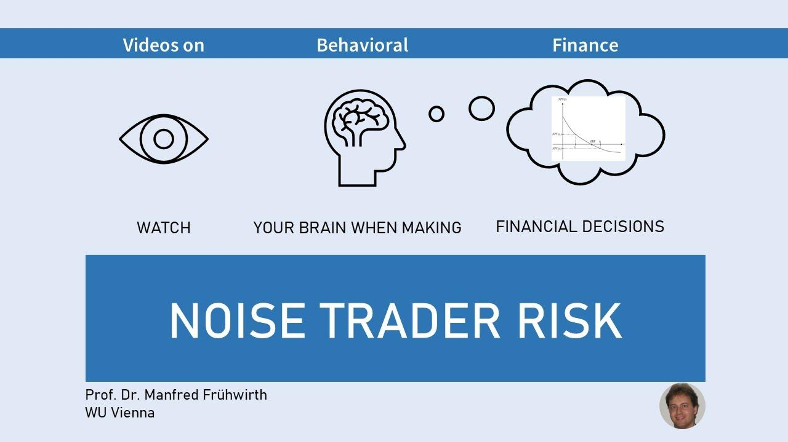

In today's dynamic financial markets, traders and investors are confronted with various risks that can significantly impact their strategies and outcomes. Among these risks, noise trader risk stands out as a factor contributing to market volatility and often complicating the investment landscape. Noise traders are market participants who base their decisions on emotions or superficial information rather than fundamental analysis or sound reasoning. This behavior results in price fluctuations driven by rumors or transient market trends rather than intrinsic value, creating an unstable environment.

Noise trader risk has become particularly relevant in the context of modern algorithmic trading, which relies heavily on quantitative models to execute trades. The behavior of noise traders can disrupt these models by introducing unpredictable elements into the market. As algorithms attempt to filter out these irregularities, they must discern between genuine market signals and misleading noise, a task that requires sophisticated strategies and advanced technology.



The interplay between noise trader behavior and market risk is a critical area of study for financial experts. Understanding and managing the impact of noise traders involves developing robust strategies that mitigate these effects while leveraging potential opportunities. Traders and investors must be aware of the challenges posed by noise traders to adapt their approaches accordingly. This awareness can help in harnessing the potential of automated trading tools, which are designed to operate effectively even in environments characterized by significant noise.

The subsequent sections of this article will examine how different strategies are employed to manage noise trader risk and explore examples from automated trading environments to illustrate their practical application.

## Table of Contents

## Understanding Market Risk and Noise Traders

Market risk, an essential component of financial markets, refers to the potential for investors to incur losses due to changes in market prices. This risk is omnipresent and arises from a variety of factors such as economic shifts, political events, and changes in market perception. Among the contributors to market risk are noise traders—participants whose trading decisions are driven by factors other than [fundamental analysis](/wiki/fundamental-analysis) or rational financial assessments.

Noise traders often act on emotions like fear or greed, jumping into trades based on rumors or superficial indicators rather than thorough, informed research. Such behavior can lead to increased market volatility as their trades distort price signals that would otherwise reflect underlying economic realities. For example, the rapid buying or selling triggered by noise traders can move markets in ways that amplify price swings, even if there is no substantial news or change in the intrinsic value of assets.

Despite the uninformed nature of their decisions, noise traders are pivotal to market dynamics. Their actions often result in herd behavior, where a large group of traders moves in the same direction, further escalating [volatility](/wiki/volatility-trading-strategies). This herd-like mentality is a significant [factor](/wiki/factor-investing) behind financial bubbles and subsequent crashes. A historical illustration of this can be seen in the stock market bubbles where large numbers of investors, swayed by optimistic sentiments without underlying data support, propelled prices to unsustainable levels.

The presence of noise traders often complicates the price discovery process—where the true value of an asset is determined based on supply and demand. As noise traders chase short-term gains, their transactions can obscure the fundamental signals that help in establishing the actual worth of a security. This leads to inefficiencies in the market, as the prices deviate from what would be expected based on basic economic indicators.

In summary, noise traders, by acting on sentiment rather than substantive analysis, introduce additional risk to markets through volatility and price inefficiency. Their influence poses challenges to investors seeking to make informed decisions grounded in the fundamental value of securities. To navigate these challenges, it is vital for market participants to recognize the impact noise traders have on market dynamics and develop strategies that accommodate or counteract their effects.

## Algorithmic Trading and Mitigating Noise Trader Risk

Algorithmic trading represents a significant advancement in global financial markets, enabling traders to leverage data-driven techniques to exploit market inefficiencies. This innovative approach utilizes complex algorithms to analyze vast datasets, identifying genuine market signals and filtering out the noise generated by irrational traders. These algorithms are often based on sophisticated statistical models designed to discern valuable insights from random market fluctuations. 

A critical advantage of [algorithmic trading](/wiki/algorithmic-trading) is its rapid adaptability to evolving market conditions. Advanced trading algorithms are programmed to react swiftly to changes, thereby reducing the impact of noise trader activities on market operations. For instance, these algorithms can execute trades within milliseconds, capturing fleeting opportunities that may arise from temporary price anomalies caused by noise traders.

Algorithmic trading incorporates various techniques to mitigate risks associated with noise traders. One effective method is hedging, which involves taking offsetting positions in different securities to reduce the potential for loss. Another strategy is diversification, which spreads investment across multiple asset classes and geographies, decreasing the influence of volatility induced by noise traders in any single market.

In addition to these strategies, algorithmic trading employs advanced risk management practices. These include setting predefined parameters and conditions to control exposure and dynamically adjusting portfolio allocations in response to real-time market data. For example, algorithms can implement stop-loss orders to automatically sell securities when their prices reach a particular threshold, thereby limiting potential losses.

The application of algorithmic trading offers a robust mechanism to not only withstand the disturbances caused by noise traders but also to potentially benefit from them. By systematically identifying and exploiting market inefficiencies, these data-driven systems provide traders with a strategic edge, enabling them to navigate the complex landscape of modern financial markets with greater confidence and precision.

## Examples of Noise Trader Risk in Financial Markets

The financial markets have witnessed numerous instances where noise traders have significantly influenced price movements, often to the detriment of fundamental valuations. One of the most notorious examples of this phenomenon is the dot-com bubble of the late 1990s. During this period, exuberant speculation by noise traders—traders who acted without a fundamental basis for investment decisions—drove the stock prices of internet-related companies to unsustainable heights. Investors, spurred by the promise of a new digital era, flocked to internet startups, often ignoring traditional metrics of valuation such as price-to-earnings ratios. When the bubble burst in early 2000, the resulting crash erased a significant portion of market capitalization, demonstrating the severe impact of noise-induced volatility.

In more recent times, the trading frenzy surrounding meme stocks, such as GameStop, has highlighted the continued presence of noise traders in financial markets. In early 2021, GameStop's stock price soared over 1,500% in a matter of weeks, driven largely by retail investors coordinating through social media platforms like Reddit. These noise traders, motivated more by the potential for short-term gains or collective movements than by the company's intrinsic value, caused short-term market shocks that forced even institutional investors to reassess their positions.

Cryptocurrency markets further underline the vulnerability of assets to noise trading. Given their decentralized nature and the absence of traditional valuation anchors, cryptocurrencies are particularly influenced by market sentiment, rumors, and social media trends. This is exemplified by the rapid price changes often observed in digital assets such as Bitcoin and Ethereum, where uninformed traders can manipulate prices based on speculative news or trends rather than inherent technological advancements or adoption metrics.

These examples underscore the challenges posed by noise traders in maintaining market stability and highlight the necessity for robust strategies to mitigate their effects.

## Strategies for Traders and Investors

To navigate the challenges posed by noise traders, investors should adopt a strategic approach rooted in long-term perspectives. This means shifting focus away from short-term market fluctuations, often driven by noise traders, and instead aligning investment decisions with broader market fundamentals and intrinsic values. A key strategy to achieve this is diversification, which involves spreading investments across a range of asset classes, sectors, and geographical regions. This approach not only minimizes exposure to the volatility induced by noise traders but also enhances the robustness of the investment portfolio against market disturbances. 

Diversification can be mathematically represented by the portfolio variance formula:

$$
\sigma_p^2 = \sum_{i=1}^{n} w_i^2 \sigma_i^2 + \sum_{i=1}^{n} \sum_{j \neq i} w_i w_j \sigma_i \sigma_j \rho_{ij}
$$

where $w_i$ and $w_j$ represent the weights of different assets in the portfolio, $\sigma_i$ and $\sigma_j$ are the standard deviations of the asset returns, and $\rho_{ij}$ is the correlation coefficient between the returns of asset $i$ and asset $j$. By carefully selecting assets with low correlations, investors can reduce the overall portfolio variance, thus mitigating the impact of noise-induced volatility.

Algorithmic trading strategies offer another powerful tool for managing noise trader risk. By utilizing sophisticated algorithms, traders can systematically identify inefficiencies within the market and execute trades based on genuine signals rather than noise. These algorithms apply statistical and [machine learning](/wiki/machine-learning) models to distinguish between useful market data and the irrelevant fluctuations caused by noise traders.

For instance, a simple algorithmic strategy could use moving averages to identify trends:

```python
import pandas as pd

def moving_average_strategy(prices, short_window, long_window):
    signals = pd.DataFrame(index=prices.index)
    signals['price'] = prices
    signals['short_mavg'] = prices.rolling(window=short_window, min_periods=1).mean()
    signals['long_mavg'] = prices.rolling(window=long_window, min_periods=1).mean()
    signals['signal'] = 0.0
    signals['signal'][short_window:] = np.where(signals['short_mavg'][short_window:] > signals['long_mavg'][short_window:], 1.0, 0.0)
    signals['positions'] = signals['signal'].diff()
    return signals

# Example usage
prices = pd.Series([100, 101, 102, 101, 103, 104, 105, 103, 102, 100])
signals = moving_average_strategy(prices, short_window=3, long_window=5)
print(signals)
```

In this example, the strategy generates buy and sell signals based on the crossover of short and long-term moving averages, allowing traders to capitalize on trends rather than reacting to noise.

By adopting these strategies—diversification and algorithmic trading—investors and traders can construct more resilient portfolios and trading systems. This not only helps in managing the unpredictable behavior of noise traders but also positions them to exploit potential market inefficiencies.

## Conclusion

Noise trader risk remains a pervasive factor in modern financial markets, presenting challenges that affect both novice and experienced traders. This risk is rooted in the behaviors of noise traders, who often make decisions based on emotional responses rather than grounded financial analysis. These traders contribute to market volatility, creating fluctuations that can obscure true asset values. Understanding their behavior and the consequent market dynamics is crucial. This comprehension aids in devising effective trading strategies, tailored to withstand and benefit from the unpredictable nature of noise-induced volatilities.

Technological advancements offer solutions to mitigate the effects of noise trader activities. By harnessing data analytics and algorithmic trading, traders can filter out irrational market influences and focus on genuine market signals. These technologies allow for systematic risk management and enhance the precision of market predictions. For instance, algorithms can be programmed to detect unusual trading patterns and react in real-time, minimizing potential losses.

In addition to technological tools, traders should adhere to well-founded trading principles, such as maintaining a diversified portfolio and focusing on long-term investment goals. These principles help counteract the short-term disruptions caused by noise traders and protect against sudden market downturns. By combining technology with sound economic strategies, traders can not only mitigate noise trader risk but also exploit the inefficiencies they introduce for potential gains.

As the financial landscape continues to evolve, staying informed and adaptable is essential. Embracing continuous learning and adjusting strategies in response to emerging trends are vital practices for achieving sustained financial success. By proactively addressing noise trader risk through innovation and strategic foresight, traders can navigate the complexities of modern markets with confidence.

## References & Further Reading

[1]: De Long, J. B., Shleifer, A., Summers, L. H., & Waldmann, R. J. (1990). ["Noise Trader Risk in Financial Markets."](https://ms.mcmaster.ca/~grasselli/DeLongShleiferSummersWaldmann90.pdf) Journal of Political Economy, 98(4), 703-738.

[2]: Shleifer, A., & Summers, L. H. (1990). ["The Noise Trader Approach to Finance."](https://www.jstor.org/stable/1942888) Journal of Economic Perspectives, 4(2), 19-33.

[3]: Black, F. (1986). ["Noise."](https://onlinelibrary.wiley.com/doi/abs/10.1111/j.1540-6261.1986.tb04513.x) Journal of Finance, 41(3), 529-543.

[4]: Barberis, N., & Thaler, R. (2003). ["A survey of behavioral finance."](https://www.nber.org/papers/w9222) Handbook of the Economics of Finance, 1, 1053-1128.

[5]: Lopez de Prado, M. (2018). ["Advances in Financial Machine Learning."](https://www.amazon.com/Advances-Financial-Machine-Learning-Marcos/dp/1119482089) Wiley.

[6]: Chan, E. P. (2009). ["Quantitative Trading: How to Build Your Own Algorithmic Trading Business."](https://github.com/ftvision/quant_trading_echan_book) Wiley.

[7]: Jansen, S. (2020). ["Machine Learning for Algorithmic Trading: Predictive models to extract signals from market and alternative data for systematic trading strategies with Python."](https://www.amazon.com/Machine-Learning-Algorithmic-Trading-alternative/dp/1839217715) Packt Publishing.