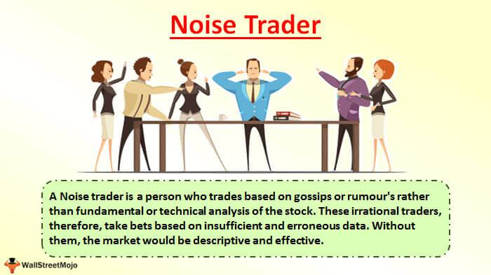

In the ever-evolving world of finance, trading strategies have become pivotal for both novice and seasoned traders. Financial markets, characterized by their complexity and dynamism, demand that traders equip themselves with effective strategies to navigate them successfully. As traders seek to maximize returns and manage risks, understanding the nuances of technical trading, noise traders, and algorithmic trading becomes a crucial aspect of gaining a competitive edge.

Technical trading relies predominantly on the analysis of past market data, using tools and indicators to forecast future price movements. This approach focuses on identifying trends, patterns, and signals from historical performance to inform trading decisions. While fundamental analysis looks at the intrinsic value of an asset, technical analysis prioritizes observable patterns in price movements and trading volumes.



Noise traders, on the other hand, introduce a layer of unpredictability in financial markets. Defined by their reliance on misinformation, rumors, or sentiment-driven decisions, noise traders often deviate from standard fundamental analysis. Their activities can create price volatilities, known as noise trader risks, which experienced traders may exploit. Despite their seemingly irrational behavior, noise traders play a role in influencing market liquidity and volatility.

Algorithmic trading emerges as a transformative force within this landscape. By leveraging predefined rules and sophisticated data analysis, algorithmic trading offers precision and speed that surpass manual trading capabilities. Various strategies, such as arbitrage, trend following, and market making, exemplify how algorithmic trading enhances market efficiency. These strategies capitalize on price movements, streamlining trading processes and minimizing human error.

The convergence of traditional trading methods with technological advancements signifies a trend towards optimizing trading for better returns. Sophisticated traders integrate insights from technical analysis, account for noise trader behaviors, and employ algorithmic trading systems to construct comprehensive trading strategies. As technology continues to evolve, the strategic synthesis of these approaches is expected to play an increasingly crucial role in the future of trading. Understanding these elements equips traders with the necessary tools to navigate the multifaceted trading landscape, balancing risk management with opportunity exploration for enhanced profitability.

## Table of Contents

## Understanding Technical Trading Strategies

Technical trading strategies involve the use of historical market data to predict future price movements. Unlike fundamental analysis, which examines economic indicators, company performance, and external factors, technical analysis strictly focuses on price charts, patterns, and market activity. Traders use technical analysis to identify trading opportunities based on the assumption that all relevant information is already reflected in the asset's price.

Central to technical trading are patterns and technical indicators that help traders make informed decisions. Among the most widely used tools are moving averages, oscillators, and the relative strength index (RSI), which provide insights into market trends and potential price reversals.

Moving averages smooth out price data, creating a single flowing line that is easier for traders to interpret. There are different types of moving averages, with the simple moving average (SMA) and the exponential moving average (EMA) being the most common. The SMA calculates the average price over a specified number of periods, while the EMA gives more weight to recent prices, allowing it to react more quickly to price changes.

```python
# Example of calculating simple moving average (SMA) in Python
def calculate_sma(prices, period):
    sma = [sum(prices[i:i+period])/period for i in range(len(prices)-period+1)]
    return sma

# Example of calculating exponential moving average (EMA) in Python
def calculate_ema(prices, period):
    ema = [sum(prices[:period])/period]
    multiplier = 2 / (period + 1)
    for price in prices[period:]:
        ema.append((price - ema[-1]) * multiplier + ema[-1])
    return ema
```

Oscillators, such as the stochastic oscillator and the moving average convergence divergence (MACD), help identify overbought or oversold conditions in the market. These signals can be valuable in predicting reversals and timing entry or [exit](/wiki/exit-strategy) points. The stochastic oscillator compares a particular closing price to a range of its prices over a certain period, while the MACD is derived from the difference between two EMAs.

The relative strength index (RSI) is another popular tool, measuring the speed and change of price movements to identify potential reversal points. RSI values range from 0 to 100, with readings above 70 indicating an overbought condition and readings below 30 indicating an oversold condition. 

Technical trading strategies benefit from their reliance on observable market trends and patterns, providing an objective basis for trading decisions. However, they also face limitations, such as vulnerability to market 'noise' and the potential for false signals. Despite these challenges, technical trading remains a cornerstone of financial markets, offering traders a robust framework for analyzing price action and identifying profitable opportunities.

## Exploring the Concept of Noise Traders

Noise traders are market participants who make buy or sell decisions lacking the foundation of thorough [fundamental analysis](/wiki/fundamental-analysis). Instead, their actions are often driven by misinformation, market rumors, or general market sentiment. This behavior may not accurately reflect the true underlying value of securities, causing noise traders to sometimes act irrationally or contrary to logical market movements.

One of the primary effects noise traders have on financial markets is their ability to significantly influence market prices, contributing to increased market [volatility](/wiki/volatility-trading-strategies). This volatility occurs because noise traders can cause price movements that deviate from what would be expected based on fundamental financial analysis. As a result, the markets experience what is known as 'noise trader risk'. This risk represents the potential for noise traders’ unpredictable actions to affect enduring price dislocations, which may persist longer than anticipated by rational investors.

When examining noise trader risks, one can explore the 'noise trader agenda', which seeks to understand how noise trader behavior systematically influences price movements, beyond mere random and chaotic behavior. In financial theories like the Noise Trader Theory, proposed by De Long et al. (1990), it is suggested that noise traders can impact asset prices substantially and sustainably because they can introduce non-fundamental risks that even rational investors may find too costly to [arbitrage](/wiki/arbitrage) away.

The survivability and influence of noise traders are often tied to behavioral finance, a field which examines how psychological influences and biases affect market outcomes. Noise traders frequently exhibit systematic biases that deviate from purely rational decision-making, and these biases can lead to phases of excess optimism or pessimism in markets. Consequently, they create opportunities and challenges for other traders who thrive on volatility. Rational traders can potentially exploit these opportunities by implementing strategies such as contrarian investing, which involves trading against prevailing noise trader sentiment, expecting it to revert to more logical and fundamental-based valuations.

The concept of noise trading exemplifies the complexity of forecasting market movements because it involves a combination of irrational actions, informational inefficiencies, and potential economic impacts that extend beyond mere mispricing. By understanding and monitoring noise traders, more sophisticated traders can refine their strategies to potentially capitalize on inefficiencies that these participants introduce into the markets.

## Algorithmic Trading: The Game-Changer

Algorithmic trading is transforming financial markets by employing pre-set rules and extensive data analysis to execute trades with unmatched speed and precision. This approach incorporates a diverse array of strategies that help enhance market efficiency and exploit price fluctuations. Among these strategies, arbitrage, [trend following](/wiki/trend-following), and [market making](/wiki/market-making) are the most prominent.

Arbitrage strategy involves simultaneously buying and selling an asset in different markets to capitalize on price discrepancies. This strategy requires sophisticated algorithms capable of identifying and exploiting these discrepancies promptly. For instance, an algorithm may be programmed in Python as follows:

```python
def arbitrage_opportunity(prices_market1, prices_market2):
    for asset in prices_market1:
        if prices_market1[asset] < prices_market2[asset]:
            return f"Buy {asset} in market 1, sell in market 2"
        elif prices_market1[asset] > prices_market2[asset]:
            return f"Buy {asset} in market 2, sell in market 1"
    return "No arbitrage opportunity"
```

Trend following strategies prioritize moving averages or [momentum](/wiki/momentum) indicators to make predictions based on historical data, aiming to profit from sustained market trends. Market making, on the other hand, involves providing [liquidity](/wiki/liquidity-risk-premium) by continuously buying and selling securities, thereby narrowing the bid-ask spread.

A pivotal aspect of [algorithmic trading](/wiki/algorithmic-trading) is [backtesting](/wiki/backtesting). This process involves applying algorithms to historical data to gauge their expected performance in future markets. It helps traders understand how their strategies might fare under different market conditions, providing insights into potential adjustments before actual deployment. For instance, one could backtest a moving average crossover strategy:

```python
import pandas as pd

def backtest_strategy(data, short_window, long_window):
    signals = pd.DataFrame(index=data.index)
    signals['signal'] = 0.0
    signals['short_mavg'] = data['Close'].rolling(window=short_window, min_periods=1).mean()
    signals['long_mavg'] = data['Close'].rolling(window=long_window, min_periods=1).mean()
    signals['signal'][short_window:] = np.where(signals['short_mavg'][short_window:] 
                                                 > signals['long_mavg'][short_window:], 1.0, 0.0)   
    signals['positions'] = signals['signal'].diff()
    return signals
```

Optimization is another critical component, refining algorithms to ensure they function effectively across different scenarios while minimizing risks such as overfitting and excessive transaction costs. Overfitting occurs when an algorithm is too tailored to historical data, potentially compromising its efficacy in future, unpredictable market environments. By rigorously testing and optimizing these strategies, traders can strike a balance between risk and return, enhancing their ability to navigate fluctuating market landscapes.

## Comparing the Strengths and Weaknesses

Technical traders focus on identifying historical price patterns and market trends to make informed trading decisions. Their reliance on technical indicators such as moving averages and oscillators offers valuable insights into market behavior, facilitating strategies based on charts and [statistics](/wiki/bayesian-statistics). However, a significant challenge these traders face is the unpredictability introduced by noise traders. Without a base in traditional analysis, noise traders exacerbate market anomalies, occasionally distorting price actions and [volume](/wiki/volume-trading-strategy) flows. This unpredictability can hinder technical traders' ability to accurately forecast market movements, necessitating adaptive strategies and a cautious approach to risk management.

Despite being considered irrational, noise traders play a crucial role in financial markets. They often amplify price swings, driving volatility and liquidity, which can create opportunities for profit. Savvy traders can exploit the mispricings or inefficiencies generated by noise traders' actions to secure advantageous positions. While noise trading can lead to substantial short-term volatility, it also presents a paradox: it creates both risk and opportunity. Traders capable of navigating this volatility can capitalize on the resultant market discrepancies, though they must remain vigilant to avoid being adversely affected by unpredictable price movements.

Algorithmic trading represents a technological advancement in financial markets, characterized by its methodical and emotionless approach to executing trades. By using complex algorithms and data analysis, traders can execute strategies that offer speed, precision, and consistency, a significant advantage over manual trading interventions. Algorithmic strategies encompass various methodologies, such as trend following and arbitrage, designed to enhance market efficiency and exploit ephemeral price differences. Yet, the implementation of algorithmic trading isn't without challenges. Effective risk management becomes essential, as algorithmic systems require continuous updating and adaptation to new market conditions to avoid pitfalls such as overfitting or excessive transaction costs. As markets evolve, algorithms must be reassessed to ensure their continued effectiveness and alignment with strategic trading objectives.

In summary, each trading strategy exhibits distinct strengths and weaknesses. Technical trading provides a structured framework grounded in historical data, but must contend with the erratic behavior of noise traders. Noise traders, notwithstanding their unpredictability, bring volatility that can be leveraged by nimble traders. Algorithmic trading, while offering enhanced precision and efficiency, demands robust risk management and ongoing calibration to remain aligned with dynamic market environments. Understanding these dynamics enables traders to craft integrated strategies that exploit the strengths and mitigate the weaknesses inherent in each approach.

## Conclusion

The intricate relationship between technical analysis, noise trading, and algorithmic strategies highlights the complexity inherent in modern trading. Each approach offers unique insights and advantages that, when understood and applied effectively, can enhance a trader's ability to navigate the financial markets.

Technical analysis provides a framework for predicting future price movements using historical data and market patterns. It equips traders with tools such as moving averages and oscillators to identify potential entry and exit points. However, its reliance on past data means it can occasionally fail to account for sudden market changes introduced by noise traders.

Noise trading, characterized by decisions driven by rumors and sentiment rather than solid fundamentals, introduces a layer of unpredictability to the market. While it can increase volatility, responsive traders can exploit these fluctuations through astute risk management practices and the application of algorithmic strategies.

Algorithmic trading has revolutionized the execution of trades by utilizing pre-defined rules and extensive data analysis. These systems offer unprecedented speed and precision, allowing traders to capitalize on minimal price differences. They draw strength from their ability to execute trades free of emotional biases, but require continuous adaptation to evolving market conditions to ensure optimal performance.

As technology progresses, trading will likely increasingly incorporate sophisticated data-driven strategies. This trend towards automation and quantitative analysis affords traders the opportunity to reduce human error and enhance performance. Embracing the potential of algorithmic trading, while being mindful of the market dynamics influenced by technical and noise trading, promises exciting prospects for optimizing returns and managing risks effectively.

## References & Further Reading

[1]: De Long, J. B., Shleifer, A., Summers, L. H., & Waldmann, R. J. (1990). ["Noise Trader Risk in Financial Markets."](https://ms.mcmaster.ca/~grasselli/DeLongShleiferSummersWaldmann90.pdf) Journal of Political Economy, 98(4), 703-738.

[2]: Taleb, N. N. (2001). ["Fooled by Randomness: The Hidden Role of Chance in Life and in the Markets."](https://en.wikipedia.org/wiki/Fooled_by_Randomness) Random House.

[3]: Lo, A. W., & MacKinlay, A. C. (1999). ["A Non-Random Walk Down Wall Street."](https://www.amazon.com/Non-Random-Walk-Down-Wall-Street/dp/0691092567) Princeton University Press.

[4]: Aldridge, I. (2013). ["High-Frequency Trading: A Practical Guide to Algorithmic Strategies and Trading Systems."](https://www.amazon.com/High-Frequency-Trading-Practical-Algorithmic-Strategies/dp/1118343506) Wiley.

[5]: Murphy, J. J. (1999). ["Technical Analysis of the Financial Markets: A Comprehensive Guide to Trading Methods and Applications."](https://archive.org/details/technicalanalysi0000murp) New York Institute of Finance.

[6]: Black, F. (1986). ["Noise."](https://onlinelibrary.wiley.com/doi/abs/10.1111/j.1540-6261.1986.tb04513.x) The Journal of Finance, 41(3), 528-543.