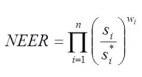

Currency valuation, international economics, exchange rate mechanisms, and algorithmic trading are essential components of the global economic framework. These elements collectively influence how currencies are valued, traded, and impacted within financial markets worldwide.

Currency valuation is a critical aspect of international economics, as it affects how countries conduct trade and investment. A currency's value can impact a nation's economy by influencing export competitiveness, import costs, and foreign investment attractiveness. Economic indicators such as GDP growth, inflation rates, and political stability often play significant roles in determining currency value.



The foreign exchange market (forex) is where these values are established and traded. As the largest financial market, with trillions of dollars traded daily, the forex market facilitates international commerce through the exchange of currencies, dictated by exchange rate mechanisms. These rates serve as a gauge for relative currency strength and are pivotal for maintaining economic stability and competitiveness.

Algorithmic trading has revolutionized how transactions are executed in the forex market, employing advanced software to conduct trades quickly and efficiently. Through predefined criteria and immediate data analysis, algorithmic trading enhances market liquidity and can affect currency pricing accuracy. However, it also introduces challenges such as increased volatility and potential manipulation risks.

Understanding these interconnected factors is crucial for investors, economists, and policymakers. By examining how currencies are valued and traded, and the technologies that influence these processes, stakeholders can gain deeper insights into the forex landscape, aiding in informed decision-making and strategic optimization in an ever-evolving market.

## Table of Contents

## Understanding Currency Valuation

Currency valuation determines the worth of one currency relative to another and serves as a cornerstone for international trade and investment. Several economic indicators play crucial roles in influencing currency valuation, including gross domestic product (GDP) growth, interest rates, inflation rates, political stability, and market sentiment.

GDP growth directly correlates with a country's economic health; robust GDP figures typically boost currency value as they signal economic vitality. A strong economy attracts foreign investment, heightening demand for the domestic currency, thus elevating its value. Interest rates, determined by central bank policies, also significantly influence currency valuation. Higher interest rates provide higher returns on investments denominated in that currency, attracting capital inflows and increasing currency demand.

Inflation rates, conversely, can erode a currency’s purchasing power. Higher inflation generally weakens a currency as it reduces economic competitiveness, potentially leading to capital outflows. Investors often seek stable currencies that safeguard their investment value, linking inflation management to currency strength.

Political stability further plays a vital role in currency valuation. Countries with stable governments and predictable policies typically attract more investment, appreciating their currency value. Political uncertainty or instability can lead to capital flight, depreciation, and investor aversion.

Market sentiment reflects investor perceptions and can drive currency movements, highlighting the psychological component of currency valuation. For instance, economic forecasts or geopolitical events can spark shifts in investor confidence, prompting rapid currency value adjustments.

Understanding these factors helps stakeholders make informed decisions in the [forex](/wiki/forex-system) market. By analyzing economic indicators, political environments, and market psychology, investors and policymakers can better predict currency movements, aligning strategies with anticipated market conditions.

## Foreign Exchange Market Dynamics

The foreign exchange (forex) market holds the distinction of being the largest and most liquid financial market globally. With a daily trading [volume](/wiki/volume-trading-strategy) exceeding $6 trillion, it surpasses the combined volume of all stock markets worldwide, highlighting its significance and impact on global finance [1]. This immense [liquidity](/wiki/liquidity-risk-premium) is due to the market's extensive network of participants which includes central and commercial banks, corporations conducting international trade, governmental bodies, and individual traders seeking speculative gains or hedging currency exposure. Such a diverse participant base ensures a constant flow of transactions across various currency pairs.

Operating continuously from Monday to Friday, the forex market provides a 24/5 trading environment. This continuous operation is facilitated by the staggered opening hours of financial markets across different time zones, beginning with financial centers in Asia and concluding with North America. This perpetual trading cycle allows participants to engage in currency exchanges at nearly any given moment, an advantage driven by ever-present supply and demand dynamics.

A unique characteristic of the forex market is its decentralized nature, functioning primarily as an over-the-counter (OTC) market. Unlike centralized exchanges found in stock markets, forex transactions occur directly between two parties, typically facilitated by brokers or financial institutions. This decentralization means there is no single, centralized exchange governing the transactions; instead, it is a network of computers and brokers spread globally. The OTC structure enables the market to respond in real time to geopolitical developments, economic indicators, and shifts in market sentiment without the delays that might be encountered in centralized exchanges [2].

The absence of a central exchange in forex also results in a diversification of transaction venues, including spot markets, forward markets, and futures markets, each catering to different trading needs and risk profiles. Such diversity enhances the market's capacity to accommodate varied trading strategies and risk management approaches.

Understanding forex market dynamics is crucial for stakeholders. The rapid and real-time nature of forex trading means changes in economic indicators, such as interest rates or fiscal policies, can have immediate and significant impacts on currency valuations. For instance, a country's [interest rate](/wiki/interest-rate-trading-strategies) hike might attract foreign capital, increasing the demand for its currency and consequently its value. These dynamics require participants to be constantly vigilant and adaptable, leveraging analytical tools and strategies to respond promptly to market changes.

In summary, the forex market's unparalleled size, liquidity, and decentralized structure underlie its critical role in global finance. The constant interplay of supply and demand, along with the market's real-time responsiveness to economic and political developments, makes it a vital arena for currency exchanges and financial strategies worldwide.

[1] Bank for International Settlements (BIS). Triennial Central Bank Survey, April 2019.

[2] Lyons, Richard K. "The Microstructure Approach to Exchange Rates." MIT Press, 2001.

## Exchange Rate Mechanisms

Exchange rates, which represent the relative value between two currencies, are crucial for facilitating international trade and investment. There are primarily two types of exchange rate mechanisms: floating exchange rates and fixed exchange rates.

Floating exchange rates are determined by market forces of supply and demand. Under this system, currency values fluctuate freely and can adjust to changes in economic conditions. Factors such as interest rates, inflation, and political stability can all influence these market forces, leading to currency value changes. The flexibility offered by floating rates allows countries to adjust quickly to economic shocks, promoting efficiency in the foreign exchange market. However, this flexibility can also introduce [volatility](/wiki/volatility-trading-strategies), which may pose risks for investors and traders. For example, sudden political events or speculative attacks can lead to sharp currency appreciations or depreciations, affecting the economic stability of a country.

In contrast, fixed exchange rates are pegged to another major currency, such as the U.S. dollar or euro. This system offers stability, making it easier for businesses to plan and for countries to maintain predictable trade relations and reduce transaction costs. However, maintaining a fixed rate requires a country to hold large reserves of foreign currency, which it must use to defend the peg if market forces push the exchange rate away from its target. This can limit a country's ability to conduct independent monetary policy since it must align its interest rates with those of the currency to which it is pegged.

Countries must carefully consider their choice of exchange rate mechanism, as it influences their trade competitiveness and economic stability. Floating rates offer the advantage of policy flexibility but come at the cost of potential exchange rate volatility. Fixed rates provide certainty and lower transaction costs but at the cost of independence in monetary policy. An effective exchange rate regime can help ensure sustained economic growth and a stable trading environment, highlighting the importance of understanding these mechanisms.

## Role of Algorithmic Trading in Forex

Algorithmic trading employs pre-programmed software to execute trades on the foreign exchange (forex) market, achieving remarkable speed and precision. This sophisticated trading approach utilizes advanced algorithms to make high-frequency decisions, based on set criteria and vast datasets, minimizing human intervention in the process. It enables traders to efficiently manage market volatility by swiftly identifying [arbitrage](/wiki/arbitrage) opportunities, technical patterns, and other market inefficiencies. 

Python is a particularly popular programming language for developing [algorithmic trading](/wiki/algorithmic-trading) strategies, owing to its ease of use, extensive libraries, and capabilities in data analysis. Libraries such as NumPy, pandas, and scikit-learn allow for efficient handling and analysis of large financial datasets, while frameworks like PyAlgoTrade and Zipline provide specialized tools for [backtesting](/wiki/backtesting) and deploying trading strategies.

Algorithmic trading significantly influences liquidity, volatility, and efficiency in currency valuation. By allowing for the rapid buy-and-sell of currency pairs, it enhances market liquidity, often resulting in tighter spreads, which are the difference between the bid and ask prices. This increased liquidity enables more efficient execution of large trades, reducing the impact on the market price.

However, algorithmic trading is not without challenges. One notable risk is the occurrence of flash crashes, which are sudden, deep, and fast declines in securities prices, typically followed by a quick recovery. These can be triggered by rapid, massive sell-offs executed by algorithms, often exacerbated by feedback loops where the response of one algorithm could provoke similar responses from others. 

To create a simple algorithmic trading strategy in Python, one might use the following script to backtest a moving average crossover strategy:

```python
import pandas as pd
import numpy as np
import matplotlib.pyplot as plt

# Load forex data
data = pd.read_csv('forex_data.csv')

# Calculate moving averages
data['Short_MA'] = data['Close'].rolling(window=40).mean()
data['Long_MA'] = data['Close'].rolling(window=100).mean()

# Define trading signals
data['Signal'] = 0
data['Signal'][40:] = np.where(data['Short_MA'][40:] > data['Long_MA'][40:], 1, -1)

# Calculate returns
data['Strategy_Return'] = data['Signal'].shift(1) * data['Close'].pct_change()

# Plot strategy performance
plt.figure(figsize=(10, 5))
plt.plot(data['Strategy_Return'].cumsum(), label='Strategy Returns')
plt.title('Forex Algorithmic Strategy Performance')
plt.xlabel('Time')
plt.ylabel('Cumulative Returns')
plt.legend()
plt.show()
```

The code defines a strategy based on moving average crossovers, a commonly used method where a short-term moving average crosses above or below a long-term moving average, signaling potential buy or sell opportunities. This basic model illustrates how algorithms can autonomously execute trades based on technical indicators.

Despite its advantages, algorithmic trading poses systemic risks that necessitate effective regulatory frameworks and risk management practices to ensure market stability and integrity. The development of sophisticated controls and real-time monitoring systems is crucial to mitigate the associated risks, ensuring the continued benefit of algorithmic trading in the forex domain.

## Impact of Algorithmic Trading on Exchange Rates

Algorithmic trading, an influential aspect of modern financial markets, has significantly impacted exchange rates. By enhancing market liquidity through the execution of high volumes of trades, algorithmic trading often results in tighter spreads, which are the differences between the bid and ask prices for currencies. Enhanced liquidity facilitates smoother transactions, allowing market participants to buy or sell currency pairs with minimal price fluctuations.

The ability of algorithmic trading systems to process vast data sets enables them to identify and exploit market inefficiencies. Algorithms can detect price discrepancies and execute trades almost instantaneously, adjusting prices closer to their true value, thereby promoting more accurate currency pricing. This computational power helps in refining exchange rates, ensuring they reflect economic realities more precisely.

Despite its advantages, algorithmic trading introduces systemic risks primarily due to the speed and volume of trades it can generate. The rapid execution of algorithmic trades can lead to heightened volatility and potential market manipulation. For example, flash crashes, where asset prices experience extreme fluctuations in a short time, can be exacerbated by the high-speed transactions of algorithmic systems. These events underline the challenges in maintaining market stability.

To mitigate such risks, effective regulation and risk management frameworks are paramount. Regulatory bodies need to establish robust guidelines ensuring transparency and fairness in algorithmic trading activities. Risk management strategies must include circuit breakers, which temporarily halt trading during excessive volatility, and continuous monitoring systems to detect and prevent manipulative practices.

In conclusion, while algorithmic trading fosters liquidity and pricing accuracy, it requires structured oversight to safeguard against market disruptions. Implementing coherent regulatory measures and risk management practices is essential to balance the benefits of algorithmic trading with the need for stable and secure financial markets.

## Conclusion

Currency valuation and exchange rates are fundamental components that significantly impact global trade, facilitating the exchange of goods and services across borders. These components of international economics are influenced by a myriad of factors, including economic indicators, geopolitical events, and market sentiment. As the global economy increasingly relies on digital solutions, the role of algorithmic trading has become more pronounced in reshaping forex market dynamics.

Algorithmic trading, through its use of pre-programmed instructions and real-time data analysis, enhances market efficiency by executing high volumes of trades at speeds unattainable by human traders. This technology leverages the integration of advanced algorithms and economic insights to facilitate more precise currency pricing and tighter bid-ask spreads. Consequently, algorithmic trading contributes to improving liquidity and reducing the market's friction, which is crucial in an environment where exchange rates constantly fluctuate based on supply and demand dynamics.

For market participants, continued adaptation to technological advancements is essential. The rapid development of computing power and [machine learning](/wiki/machine-learning) techniques offers opportunities to refine trading strategies and optimize decision-making processes in forex markets. Stakeholders, ranging from institutional investors to individual traders, must incorporate these technologies into their frameworks to maintain competitiveness. The shift towards high-frequency and data-driven trading underscores the importance of integrating economic principles with cutting-edge technology to achieve strategic objectives.

As algorithmic trading evolves, its influence on trading efficiency and accuracy will grow, becoming an increasingly pivotal aspect of the forex landscape. The challenge lies in balancing the benefits of increased efficiency with the systemic risks posed by potential market manipulation and rapid price fluctuations. Therefore, effective regulation and risk management are critical to ensuring that the advancements in algorithmic trading consolidate its role as a positive force in global finance.

In summary, understanding the interplay between currency valuation, exchange rates, and algorithmic trading is crucial for anyone engaged in the forex market. These elements, when combined with sound economic policies and robust technological systems, create a comprehensive framework essential for navigating the complexities of today's global financial markets.

## References & Further Reading

[1]: Bank for International Settlements (BIS). ["Triennial Central Bank Survey, April 2019."](https://www.bis.org/statistics/rpfx19.htm)

[2]: Lyons, Richard K. ["The Microstructure Approach to Exchange Rates."](https://direct.mit.edu/books/monograph/2004/The-Microstructure-Approach-to-Exchange-Rates) MIT Press, 2001.

[3]: Lopez de Prado, Marcos. ["Advances in Financial Machine Learning."](https://www.amazon.com/Advances-Financial-Machine-Learning-Marcos/dp/1119482089) Wiley, 2018.

[4]: Aronson, David R. ["Evidence-Based Technical Analysis: Applying the Scientific Method and Statistical Inference to Trading Signals."](https://www.amazon.com/Evidence-Based-Technical-Analysis-Scientific-Statistical/dp/0470008741) Wiley, 2006.

[5]: Jansen, Stefan. ["Machine Learning for Algorithmic Trading."](https://github.com/stefan-jansen/machine-learning-for-trading) Packt Publishing, 2020.

[6]: Chan, Ernest P. ["Quantitative Trading: How to Build Your Own Algorithmic Trading Business."](https://github.com/ftvision/quant_trading_echan_book) Wiley, 2008.