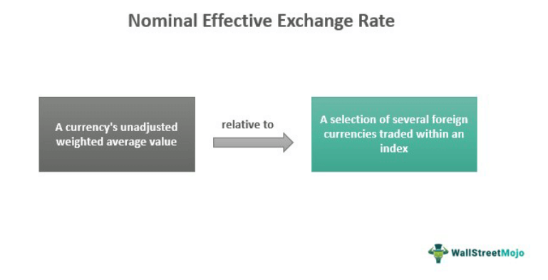

## Table of Contents

## What is the Nominal Effective Exchange Rate (NEER)?

The Nominal Effective Exchange Rate (NEER) is a measure used to understand how the value of a country's currency changes compared to a basket of other currencies. It shows the average value of one country's currency against the currencies of its major trading partners. This helps economists and policymakers see how competitive a country's goods and services are in the global market. If the NEER goes up, it means the country's currency is getting stronger against other currencies, which can make its exports more expensive and less competitive.

NEER is calculated by taking the weighted average of the exchange rates between the home country and its trading partners. The weights are usually based on the amount of trade done with each partner. For example, if a country trades a lot with the United States, the US dollar will have a bigger weight in the NEER calculation. This way, the NEER gives a more accurate picture of how currency movements affect a country's trade balance than just looking at exchange rates with one other currency.

## How is the NEER calculated?

The Nominal Effective Exchange Rate (NEER) is calculated by taking the average value of a country's currency against a group of other currencies. This group is made up of the currencies of the country's main trading partners. Each currency in the group is given a weight based on how much trade the country does with that partner. For example, if a country trades a lot with Japan, the Japanese yen will have a bigger weight in the calculation.

To find the NEER, you start by getting the exchange rates of the home country's currency against each currency in the group. Then, you multiply each exchange rate by its weight. After that, you add up all these weighted exchange rates. The result is the NEER, which shows how strong or weak the home country's currency is compared to the currencies of its trading partners. If the NEER goes up, it means the home country's currency is getting stronger, and if it goes down, the currency is getting weaker.

## Why is the NEER important for understanding an economy's competitiveness?

The Nominal Effective Exchange Rate (NEER) is important because it helps us see how strong or weak a country's money is compared to the money of other countries it trades with. When a country's money gets stronger, it can make the things it sells to other countries more expensive. This might make it harder for the country to sell its products because other countries might find them too pricey. On the other hand, if the country's money gets weaker, its products can become cheaper for other countries to buy, which might help the country sell more.

Understanding the NEER is also useful for figuring out how well a country can compete in the world market. If a country's NEER goes up a lot, it might mean that its products are becoming less competitive because they are more expensive. But if the NEER goes down, it could mean the country's products are more competitive because they are cheaper. This information helps people who make decisions about the country's money and trade know what to do to keep the country's economy strong.

## What is the difference between NEER and Real Effective Exchange Rate (REER)?

The Nominal Effective Exchange Rate (NEER) and the Real Effective Exchange Rate (REER) are both ways to measure how a country's currency compares to other countries' currencies, but they do it a bit differently. The NEER looks at the average value of a country's currency against a group of other currencies. It's like taking the price of the country's money and comparing it to the prices of other countries' money, without changing anything else. This helps us see how strong or weak the country's money is right now.

The REER, on the other hand, takes the NEER and adjusts it for price changes, like inflation, in the countries involved. This means the REER gives us a better idea of how much a country's products really cost compared to other countries' products. If a country's REER goes up, it might mean its products are getting more expensive compared to other countries, even if the NEER stays the same. This makes the REER a more complete picture of how competitive a country's economy is in the world market.

## Can you explain how trade weights are used in calculating the NEER?

Trade weights are important for calculating the Nominal Effective Exchange Rate (NEER) because they show how much a country trades with other countries. When figuring out the NEER, each country's currency in the basket is given a weight based on how much trade happens between the home country and that country. For example, if the home country trades a lot with Germany, the euro will have a bigger weight in the calculation. This means that changes in the value of the euro will have a bigger effect on the NEER.

To calculate the NEER, you start by getting the exchange rates of the home country's currency against each currency in the basket. Then, you multiply each exchange rate by its trade weight. For example, if the home country trades 30% of its total trade with Japan, the yen's exchange rate would be multiplied by 0.30. After multiplying all the exchange rates by their weights, you add them up. This final number is the NEER, which shows how the home country's currency value changes against the currencies of its main trading partners, taking into account how much trade happens with each of them.

## How does the NEER affect a country's export and import prices?

The Nominal Effective Exchange Rate (NEER) can change how much a country's exports and imports cost. When the NEER goes up, it means the country's money is getting stronger compared to other countries' money. This makes the country's exports more expensive for other countries to buy. For example, if a country's NEER goes up, its cars might cost more in other countries, so fewer people might want to buy them. On the other hand, when the NEER goes up, imports become cheaper for the country because it can buy more with its stronger money. So, if the NEER goes up, the country might buy more things from other countries.

When the NEER goes down, the opposite happens. A lower NEER means the country's money is getting weaker compared to other countries' money. This makes the country's exports cheaper for other countries to buy. For example, if a country's NEER goes down, its cars might cost less in other countries, so more people might want to buy them. But when the NEER goes down, imports become more expensive for the country because it can buy less with its weaker money. So, if the NEER goes down, the country might buy fewer things from other countries.

## What are the common sources of data for calculating the NEER?

The main sources of data for calculating the Nominal Effective Exchange Rate (NEER) come from government agencies and international organizations. These groups collect information about exchange rates and trade between countries. For example, central banks often provide data on exchange rates, which is important for figuring out how much one country's money is worth compared to another's. Also, trade data from places like the World Bank or the International Monetary Fund (IMF) helps decide the weights for each country's currency in the NEER calculation.

Another important source of data is from private companies that track financial markets. These companies, like Bloomberg or Reuters, give up-to-date information on exchange rates and can be very helpful for calculating the NEER. They often have detailed data that can be used to see how the value of a country's money changes over time. By using data from both government and private sources, economists can get a full picture of how a country's currency is doing compared to others.

## How often is the NEER typically updated and why is this frequency important?

The Nominal Effective Exchange Rate (NEER) is usually updated every month. This means that once a month, new numbers are calculated to show how a country's money is doing compared to other countries' money. The reason it's done every month is because exchange rates can change a lot in a short time. By updating the NEER monthly, people who make decisions about the economy can see these changes quickly and make plans based on the newest information.

Having the NEER updated every month is important because it helps keep the information fresh and useful. If the NEER was only updated every few months or once a year, it might not show what's really happening with a country's money right now. Monthly updates make sure that the NEER stays a good tool for understanding how competitive a country's products are in the world market, and it helps people make better decisions about trade and money.

## Can changes in the NEER predict future inflation rates?

Changes in the Nominal Effective Exchange Rate (NEER) can give clues about what might happen with inflation in the future. When the NEER goes up, it means a country's money is getting stronger compared to other countries' money. This can make things from other countries cheaper to buy, which might help keep inflation low because the prices of imports don't go up as much. But if the NEER goes down, the country's money is getting weaker, and this can make imports more expensive. When imports cost more, it can lead to higher prices overall, which means more inflation.

However, using the NEER to predict inflation isn't always perfect. Other things like how much people want to buy, how much companies are making, and what's happening in the world economy can also affect inflation. So, while the NEER can give a good hint about what might happen with inflation, it's just one piece of the puzzle. People who study the economy look at many different things to get a full picture of what might happen with prices in the future.

## How do central banks use the NEER in monetary policy decisions?

Central banks use the Nominal Effective Exchange Rate (NEER) to help them make decisions about the country's money and economy. When they see the NEER going up, it means the country's money is getting stronger compared to other countries' money. This can make the country's products more expensive for other countries to buy, which might slow down the economy. To fix this, the central bank might decide to lower interest rates or do other things to make the country's money weaker and help the economy grow.

On the other hand, if the NEER is going down, it means the country's money is getting weaker. This can make imports more expensive and might cause prices to go up, which is called inflation. To stop inflation from getting too high, the central bank might raise interest rates or take other steps to make the country's money stronger. By watching the NEER, central banks can make smart choices to keep the economy balanced and healthy.

## What are the limitations and potential biases in using the NEER as an economic indicator?

Using the Nominal Effective Exchange Rate (NEER) as an economic indicator has some limitations. One big problem is that the NEER only looks at the value of money and doesn't take into account how prices change over time, like inflation. This means it might not give a full picture of how competitive a country's products really are. Also, the NEER uses trade weights to decide how important each country's money is, but these weights can change over time. If the weights are not updated often, the NEER might not show the current trade situation accurately.

Another issue with the NEER is that it can be affected by biases. For example, if a country trades a lot with another country that has a very strong or weak money, this can make the NEER go up or down a lot, even if the home country's money hasn't changed much. This can make it hard to understand what's really happening with the home country's money. Also, the data used to calculate the NEER comes from different places, and if this data is not correct or up-to-date, it can lead to mistakes in the NEER. So, while the NEER is a helpful tool, it's important to use it along with other information to get a better understanding of the economy.

## How can the NEER be used to compare the economic performance of different countries?

The Nominal Effective Exchange Rate (NEER) can help compare how well different countries are doing in their economies by looking at how strong or weak their money is compared to other countries. If a country's NEER is going up, it means its money is getting stronger. This can make the country's products more expensive for other countries to buy, which might hurt its economy if it depends a lot on selling things to other countries. On the other hand, if a country's NEER is going down, its money is getting weaker. This can make its products cheaper for other countries to buy, which might help its economy grow by selling more things.

But using the NEER to compare countries is not perfect. It only looks at how money changes, not at other important things like how much people want to buy, how much companies are making, or how prices are changing over time. So, while the NEER can give a good idea about how a country's money is doing compared to others, it's just one part of the whole picture. To really understand how well different countries are doing, you need to look at many different things, not just the NEER.

## References & Further Reading

[1]: Bank for International Settlements (BIS). ["Triennial Central Bank Survey, April 2019."](https://www.bis.org/statistics/rpfx19.htm)

[2]: Lyons, Richard K. ["The Microstructure Approach to Exchange Rates."](https://direct.mit.edu/books/monograph/2004/The-Microstructure-Approach-to-Exchange-Rates) MIT Press, 2001.

[3]: Lopez de Prado, Marcos. ["Advances in Financial Machine Learning."](https://www.amazon.com/Advances-Financial-Machine-Learning-Marcos/dp/1119482089) Wiley, 2018.

[4]: Aronson, David R. ["Evidence-Based Technical Analysis: Applying the Scientific Method and Statistical Inference to Trading Signals."](https://www.amazon.com/Evidence-Based-Technical-Analysis-Scientific-Statistical/dp/0470008741) Wiley, 2006.

[5]: Jansen, Stefan. ["Machine Learning for Algorithmic Trading."](https://github.com/stefan-jansen/machine-learning-for-trading) Packt Publishing, 2020.

[6]: Chan, Ernest P. ["Quantitative Trading: How to Build Your Own Algorithmic Trading Business."](https://github.com/ftvision/quant_trading_echan_book) Wiley, 2008.