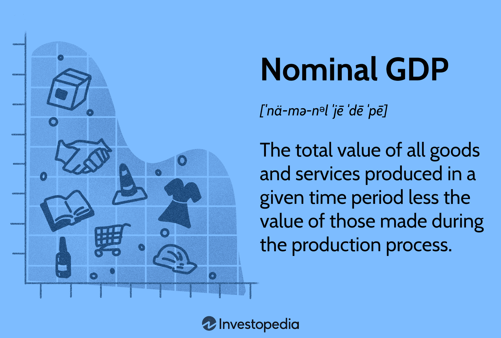

## Table of Contents

## What is Nominal Gross Domestic Product (NGDP)?

Nominal Gross Domestic Product (NGDP) is the total value of all goods and services produced in a country during a specific period, usually a year, measured in current prices. This means that NGDP includes the effects of inflation or deflation, reflecting the actual prices at which goods and services were sold. For example, if the price of a product increases from one year to the next, the NGDP will show this increase even if the quantity produced remains the same.

NGDP is useful for understanding the current market value of a country's economic output. It helps economists and policymakers track the growth of the economy over time in terms of money. However, because NGDP is affected by price changes, it can sometimes be misleading when trying to compare economic performance across different years. To get a clearer picture of real growth, economists often use Real Gross Domestic Product (RGDP), which adjusts NGDP for inflation.

## How is Nominal GDP different from Real GDP?

Nominal GDP and Real GDP both measure the total value of goods and services produced in a country, but they do it in different ways. Nominal GDP is calculated using the current prices of goods and services. This means it includes the effects of inflation or deflation. If prices go up, Nominal GDP will go up even if the amount of goods and services stays the same. It's like looking at the economy with today's price tags.

Real GDP, on the other hand, adjusts Nominal GDP to remove the effects of inflation or deflation. It uses a base year's prices to calculate the value of goods and services. This way, Real GDP shows the true growth or decline in the economy by focusing on the quantity of goods and services produced, not just their price. It's like comparing the economy year to year with the same price tags, so you can see real changes.

## What components make up Nominal GDP?

Nominal GDP is made up of four main parts: consumer spending, business investment, government spending, and net exports. Consumer spending is all the money people spend on things like food, clothes, and services. Business investment includes money businesses spend on things like new factories or equipment. Government spending covers what the government pays for, like schools and roads. Net exports are what a country sells to other countries minus what it buys from them.

These four parts together show the total value of everything produced in a country at current prices. If prices go up, the value of these parts goes up too, even if the amount of goods and services stays the same. That's why Nominal GDP can change because of inflation or deflation, not just because more or less stuff is being made.

## How is Nominal GDP calculated?

Nominal GDP is calculated by adding up the total value of all goods and services produced in a country during a year, using the prices that were in place at the time. It includes four main parts: what people spend on things like food and clothes, what businesses spend on things like new factories, what the government spends on things like schools and roads, and the difference between what a country sells to other countries and what it buys from them. If you add up all these parts using the prices from that year, you get the Nominal GDP.

Because Nominal GDP uses current prices, it can change if prices go up or down, even if the amount of stuff being made stays the same. For example, if the price of a car goes up, the value of that car in the Nominal GDP calculation will go up too, even if the same number of cars are being made. This is why Nominal GDP can be affected by inflation or deflation, which are changes in the general level of prices.

## Why is Nominal GDP important for economic analysis?

Nominal GDP is important for economic analysis because it shows the total value of everything a country makes in a year, using the prices from that year. This gives a quick picture of how big the economy is right now. It's like looking at a snapshot of the economy's current size. Policymakers and economists use this number to understand how much money is flowing through the economy, which can help them make decisions about things like taxes and spending.

However, Nominal GDP can be tricky because it includes the effects of inflation or deflation. If prices go up, Nominal GDP goes up too, even if the amount of stuff being made stays the same. This means Nominal GDP might not always show the real growth or shrinkage of the economy. That's why economists often look at Real GDP too, which adjusts for price changes. But Nominal GDP is still very useful for understanding the current market value of the economy and for making comparisons between countries at the same point in time.

## Can you explain the limitations of using Nominal GDP as an economic indicator?

Nominal GDP has some problems when you use it to understand how an economy is doing. One big issue is that it includes the effect of price changes. If prices go up because of inflation, Nominal GDP will go up too, even if people aren't making more stuff. This can make it look like the economy is growing when it's really just that things cost more. So, if you only look at Nominal GDP, you might think the economy is doing better than it really is.

Another problem is that Nominal GDP doesn't tell you about the quality of life or how happy people are. It just adds up the value of everything made, but it doesn't say anything about how that money is shared among people. If a few people get very rich but most people stay poor, Nominal GDP might still look good, but the lives of most people might not be getting better. So, while Nominal GDP is useful for seeing how big the economy is right now, it doesn't give the whole picture of how well an economy is doing for everyone.

## How does inflation affect Nominal GDP?

Inflation makes Nominal GDP go up, even if the amount of stuff being made stays the same. This happens because Nominal GDP uses the prices from the year it's being measured. So, if prices go up because of inflation, the total value of everything made will be higher, and that's what Nominal GDP shows. It's like if you had a basket of goods and the price of everything in the basket went up, the total value of the basket would go up too, even if you didn't put more things in it.

This can make it tricky to use Nominal GDP to see if the economy is really growing. If you see Nominal GDP going up, you might think the economy is doing better, but it could just be because of inflation. That's why economists also look at Real GDP, which takes out the effect of inflation. Real GDP helps show if more stuff is actually being made, not just if prices are going up.

## What are the criticisms of Nominal GDP as a measure of economic health?

Nominal GDP has some problems when we use it to check how healthy an economy is. One big issue is that it can go up just because prices are going up, not because more stuff is being made. This is called inflation. If prices go up, Nominal GDP will go up too, even if the amount of goods and services stays the same. So, it might look like the economy is growing when really, it's just that everything costs more. This can be confusing and might make people think the economy is doing better than it really is.

Another problem is that Nominal GDP doesn't tell us about how well people are doing. It just adds up the value of everything made, but it doesn't say anything about how that money is shared among people. If a few people get very rich but most people stay poor, Nominal GDP might still look good, but the lives of most people might not be getting better. So, while Nominal GDP can tell us how big the economy is, it doesn't give us the whole picture of how well the economy is doing for everyone.

## How do countries compare their Nominal GDP internationally?

Countries compare their Nominal GDP internationally by looking at the total value of everything they make in a year, using the prices from that year. This helps them see how big their economy is compared to other countries. For example, if Country A has a Nominal GDP of $1 trillion and Country B has a Nominal GDP of $2 trillion, it looks like Country B's economy is twice as big as Country A's. But, they have to be careful because Nominal GDP can be affected by inflation or deflation, which means the numbers might not show the real size of the economy if prices are very different between countries.

To make a fairer comparison, countries often use something called purchasing power parity (PPP). PPP adjusts Nominal GDP to account for the different costs of living and prices in different countries. This way, they can see how much people can actually buy with their money in each country. For example, if things are cheaper in Country A than in Country B, Country A's economy might be bigger than it looks when you just compare Nominal GDP. So, using PPP can give a better idea of the real size of economies when comparing them internationally.

## What role does Nominal GDP play in fiscal and monetary policy?

Nominal GDP helps governments and central banks make decisions about fiscal and monetary policy. Fiscal policy is about how the government spends money and collects taxes. When they look at Nominal GDP, they can see how much money is moving around in the economy. If Nominal GDP is growing, they might decide to spend more on things like schools and roads, or they might change taxes to help the economy grow even more. But if Nominal GDP is not growing or is going down, they might cut spending or change taxes to try to help the economy.

Monetary policy is about how the central bank controls the money supply and interest rates. Nominal GDP is important here too because it shows how fast the economy is growing. If Nominal GDP is growing too fast, the central bank might raise interest rates to slow things down and stop inflation from getting too high. If Nominal GDP is not growing enough, they might lower interest rates to encourage people to borrow and spend more, which can help the economy grow. But because Nominal GDP includes inflation, they have to be careful and look at other numbers too, like Real GDP, to make the best decisions.

## How have historical trends in Nominal GDP influenced economic policy?

Looking at how Nominal GDP has changed over time has helped shape what governments and central banks do with their economic policies. When Nominal GDP goes up a lot, it can mean the economy is doing well, but it can also mean prices are going up because of inflation. Back in the 1970s, for example, many countries saw their Nominal GDP go up fast because of high inflation. This made governments and central banks change their policies to fight inflation. They did things like raising interest rates to make borrowing money more expensive, which slowed down spending and helped bring prices under control.

On the other hand, when Nominal GDP goes down or doesn't grow much, it can signal that the economy is in trouble. During the Great Recession in 2008, Nominal GDP in many countries dropped or grew very slowly. This led governments to spend more money on things like building roads and helping people who lost their jobs. Central banks also lowered interest rates to make borrowing cheaper, hoping to get people to spend and invest more. By watching Nominal GDP, policymakers can decide when to step in and help the economy, even though they also look at other numbers like Real GDP to get a full picture.

## What advanced statistical methods are used to forecast Nominal GDP?

Economists use many different advanced statistical methods to guess what Nominal GDP will be in the future. One common method is called time series analysis. This involves looking at past Nominal GDP numbers to find patterns and then using those patterns to predict what will happen next. They use things like moving averages and exponential smoothing to smooth out the ups and downs in the data and make better guesses. Another method is econometric modeling, where economists build models that include lots of different things that can affect Nominal GDP, like interest rates, inflation, and how much people are spending. These models help them see how changes in one thing might affect Nominal GDP.

Another important method is [machine learning](/wiki/machine-learning). This is where computers learn from past data to make predictions. Economists might use machine learning to find hidden patterns in the data that are hard for people to see. For example, they might use something called a [neural network](/wiki/neural-network), which can learn from a lot of different information at the same time. This can help them make more accurate guesses about Nominal GDP. All these methods help economists and policymakers plan for the future and make decisions about things like taxes and interest rates.

## References & Further Reading

[1]: ["GDP: A Brief but Affectionate History"](https://www.amazon.com/GDP-Affectionate-History-Revised-expanded/dp/0691169853) by Diane Coyle

[2]: ["Macroeconomics"](https://www.investopedia.com/terms/m/macroeconomics.asp) by Paul Krugman and Robin Wells

[3]: ["The Little Book of Common Sense Investing: The Only Way to Guarantee Your Fair Share of Stock Market Returns"](https://www.amazon.com/Little-Book-Common-Sense-Investing/dp/1119404509) by John C. Bogle

[4]: ["Algorithmic Trading: Winning Strategies and Their Rationale"](https://www.wiley.com/en-us/Algorithmic+Trading%3A+Winning+Strategies+and+Their+Rationale-p-9781118460146) by Ernie Chan

[5]: ["Gross Domestic Product: An Economy’s All"](https://www.imf.org/external/pubs/ft/fandd/basics/14_gdp.htm) by The Economist