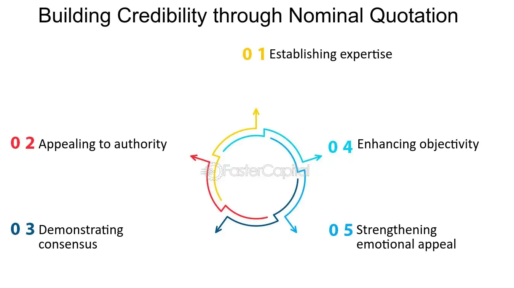

## Table of Contents

## What is a nominal quotation in finance?

A nominal quotation in finance is a way to express the price of a bond or other fixed income security. It shows the bond's face value, or the amount that will be paid back when the bond matures, rather than its current market price. For example, if a bond has a nominal quotation of $1,000, that means the bond will be worth $1,000 at maturity, even if it's currently trading at a different price.

This type of quotation is useful because it helps investors understand the bond's value at maturity. It's different from a market quotation, which shows the current price at which the bond can be bought or sold. By knowing the nominal quotation, investors can better assess the bond's yield and make more informed investment decisions.

## How does a nominal quotation differ from other types of quotations?

A nominal quotation is different from other types of quotations because it shows the face value of a bond, not what it's currently worth in the market. For example, if a bond has a nominal quotation of $1,000, that's what you'll get back when the bond matures, even if you can buy or sell it for a different price right now. This is helpful because it tells you what the bond will be worth in the future, which can help you figure out if it's a good investment.

On the other hand, a market quotation shows the current price of the bond. This price can go up or down based on things like interest rates and how the economy is doing. So, if you see a market quotation of $950 for the same bond, that's what you'd pay to buy it today. Knowing both the nominal and market quotations can give you a better idea of the bond's value and help you decide if it's a good time to buy or sell.

## Can you provide an example of a nominal quotation in a financial context?

Imagine you're looking at a bond that says it has a nominal quotation of $1,000. This means that when the bond reaches its maturity date, you will get back $1,000, no matter what. It's like a promise from the company or government that issued the bond. This number helps you understand what the bond will be worth in the future, which is important when you're deciding if you want to buy it.

Now, let's say the same bond is currently being sold for $950 on the market. This $950 is the market quotation, and it can change every day based on things like interest rates and how the economy is doing. Even though you can buy the bond for $950 today, the nominal quotation of $1,000 tells you that you'll get $1,000 back when the bond matures. Knowing both these numbers helps you figure out if the bond is a good investment for you.

## Why are nominal quotations important in financial markets?

Nominal quotations are important in financial markets because they show the face value of a bond, which is the amount you'll get back when the bond matures. This helps investors understand what they will receive at the end of the bond's term, no matter what the current market price is. For example, if a bond has a nominal quotation of $1,000, you know you'll get $1,000 back, even if you buy it for less or more than that today. This information is crucial for figuring out the bond's yield and deciding if it's a good investment.

Moreover, nominal quotations help investors compare different bonds and make informed decisions. Since the nominal value stays the same, it provides a stable point of reference. This allows investors to see how much they might gain or lose by holding the bond until maturity. By knowing the nominal quotation, investors can better assess the risks and rewards of their investment choices, making it easier to build a well-balanced portfolio.

## How do nominal quotations affect investment decisions?

Nominal quotations help investors make smart choices about buying bonds. They show the face value of a bond, which is the amount you'll get back when it matures. This is important because it tells you what your bond will be worth in the future, no matter what the current market price is. For example, if a bond has a nominal quotation of $1,000, you know you'll get $1,000 back even if you buy it for $950 today. This helps you figure out if the bond is a good deal and if the potential return is worth the investment.

Knowing the nominal quotation also helps you compare different bonds and see which ones might be better for your portfolio. Since the nominal value stays the same, it's a stable number you can use to judge the bond's value at maturity. This can help you decide if you want to hold onto a bond until it matures or sell it sooner. By understanding the nominal quotation, you can better weigh the risks and rewards of different investment options, making it easier to make decisions that fit your financial goals.

## What are the common practices for using nominal quotations in stock trading?

In stock trading, nominal quotations aren't used as much as they are in the bond market. This is because stocks don't have a fixed face value like bonds do. Instead, stocks have a par value, which is usually a small, set amount that doesn't change. But this par value isn't what people use to decide if they should buy or sell a stock. They look at the current market price, which can go up and down based on what's happening in the market.

Even though nominal quotations aren't a big deal in stock trading, understanding the par value can still be helpful. For example, if a company issues new stock, the par value can be used to figure out the minimum price the stock can be sold for. But most of the time, people focus on the market price and other things like the company's earnings, news about the company, and what's happening in the economy. So, while nominal quotations might not be a main focus in stock trading, knowing about them can give you a fuller picture of how stocks work.

## How do nominal quotations impact the valuation of bonds?

Nominal quotations are important for figuring out how much a bond is worth. They show the face value of the bond, which is the amount you'll get back when the bond matures. This helps investors understand what the bond will be worth in the future, no matter what the current market price is. For example, if a bond has a nominal quotation of $1,000, you know you'll get $1,000 back even if you buy it for $950 today. This information is key for calculating the bond's yield, which is how much money you'll make from the bond over time.

Knowing the nominal quotation also helps investors compare different bonds and decide which ones to buy. Since the nominal value stays the same, it gives a stable point of reference. This makes it easier to see how much you might gain or lose by holding the bond until it matures. By understanding the nominal quotation, investors can better assess the risks and rewards of their investment choices, making it easier to build a well-balanced portfolio.

## What role do nominal quotations play in foreign exchange markets?

In the foreign exchange markets, nominal quotations are used to show the face value of currencies, which is important for understanding exchange rates. When you see a nominal quotation, it tells you how much one currency is worth in terms of another currency. For example, if the nominal quotation for USD/EUR is 1:0.85, it means 1 US dollar is worth 0.85 Euros. This helps traders and investors know how much of one currency they'll get when they exchange it for another.

Nominal quotations are also useful for comparing the value of different currencies over time. They give a clear picture of how exchange rates change, which can help in making decisions about buying or selling currencies. For instance, if the nominal quotation for USD/EUR changes from 1:0.85 to 1:0.90, it means the US dollar has gotten stronger compared to the Euro. By keeping an eye on these nominal quotations, people in the foreign exchange market can better understand currency movements and make more informed trading choices.

## How can investors interpret changes in nominal quotations over time?

When investors see changes in nominal quotations over time, it tells them how the value of a bond or currency is changing. For example, if the nominal quotation of a bond goes up, it means the bond's face value is increasing. This could happen if the bond issuer decides to change the terms of the bond. For investors, this means they might get more money back when the bond matures. On the other hand, if the nominal quotation goes down, it means the bond's face value is decreasing, which could mean less money at maturity.

In the foreign exchange market, changes in nominal quotations show how the value of one currency is changing compared to another. If the nominal quotation for USD/EUR goes from 1:0.85 to 1:0.90, it means the US dollar is getting stronger against the Euro. This can affect how much of one currency you get when you exchange it for another. By watching these changes, investors can decide when to buy or sell currencies to make the most of their investments.

## What are the regulatory considerations for nominal quotations in different countries?

In different countries, the rules about how nominal quotations are used can be different. In the United States, the Securities and Exchange Commission (SEC) makes sure that bond issuers tell the truth about the nominal value of their bonds. This helps investors know what they will get back when the bond matures. The SEC also makes rules about how companies can change the nominal value of their bonds, so they can't just change it without telling investors.

In Europe, the European Securities and Markets Authority (ESMA) looks after how nominal quotations are used in the bond market. They make sure that all the information about bonds, including their nominal value, is clear and easy to understand. This helps people in different European countries trust the bond market. Just like in the U.S., European rules make sure that any changes to a bond's nominal value are done in a fair way and that investors are told about these changes.

## How do advanced financial models incorporate nominal quotations for risk assessment?

Advanced financial models use nominal quotations to help figure out how risky a bond might be. They look at the bond's face value, which is the amount you'll get back when the bond matures, to see how much money you might make or lose. By knowing the nominal quotation, these models can calculate the bond's yield, which shows how much return you can expect from your investment. This helps investors understand if the bond is a good deal and if it fits with their goals for making money.

These models also use nominal quotations to compare different bonds and see which ones are less risky. For example, if two bonds have the same nominal value but different market prices, the model can tell you which one might be a safer bet. By looking at how the nominal value stays the same while the market price changes, the model can give a clearer picture of what might happen in the future. This helps investors make smarter choices about which bonds to buy and how to manage their money.

## What are the future trends and potential innovations related to nominal quotations in finance?

In the future, we might see new ways to use nominal quotations that make them even more helpful for investors. One idea is using technology to make it easier to see and understand nominal quotations. For example, apps and websites could show real-time updates on nominal values, making it simpler for people to keep track of their investments. Another trend could be using [artificial intelligence](/wiki/ai-artificial-intelligence) to predict how nominal quotations might change. This could help investors make better guesses about what their bonds will be worth in the future, helping them plan their investments more carefully.

Another potential innovation is linking nominal quotations with other financial data to give a fuller picture of an investment's value. For instance, combining nominal quotations with market trends and economic indicators could help investors see how different factors might affect their bonds. This could lead to smarter investment strategies and better risk management. As technology keeps getting better, we might see more tools that use nominal quotations in new and creative ways, making it easier for everyone to understand and use them in their financial planning.

## References & Further Reading

[1]: Bergstra, J., Bardenet, R., Bengio, Y., & Kégl, B. (2011). ["Algorithms for Hyper-Parameter Optimization."](https://dl.acm.org/doi/10.5555/2986459.2986743) Advances in Neural Information Processing Systems 24.

[2]: ["Advances in Financial Machine Learning"](https://www.amazon.com/Advances-Financial-Machine-Learning-Marcos/dp/1119482089) by Marcos Lopez de Prado

[3]: ["Evidence-Based Technical Analysis: Applying the Scientific Method and Statistical Inference to Trading Signals"](https://www.amazon.com/Evidence-Based-Technical-Analysis-Scientific-Statistical/dp/0470008741) by David Aronson

[4]: ["Machine Learning for Algorithmic Trading"](https://github.com/stefan-jansen/machine-learning-for-trading) by Stefan Jansen

[5]: ["Quantitative Trading: How to Build Your Own Algorithmic Trading Business"](https://www.amazon.com/Quantitative-Trading-Build-Algorithmic-Business/dp/1119800064) by Ernest P. Chan