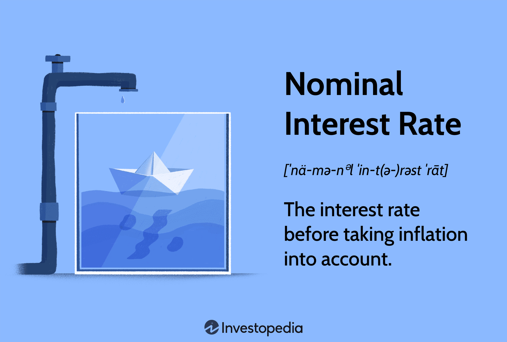

In today's dynamic financial markets, a thorough understanding of quotations and trading mechanisms is crucial for investors and traders. Quotations in the finance sector play a pivotal role in determining the pricing of securities, influencing trading decisions and strategies. The concept of 'nominal quotation' is one such financial term that merits attention. It provides a hypothetical price at which a security might trade, offering traders and investors a benchmark or reference point for evaluating potential investments or trades.

While not representing a current binding offer, nominal quotations are essential in offering insights into the market's perception of a security's value. This can be particularly valuable in volatile markets or when trading less liquid assets where firm pricing is difficult to determine. Understanding these quotes can help traders develop effective trading strategies and make informed decisions.



Moreover, the interplay between nominal quotations and algorithmic trading has transformed trading practices. Algorithmic trading, which involves using computer programs to execute trades at speeds and frequencies beyond human capability, often relies on precise and timely data inputs that include both firm and nominal quotations. By comprehensively understanding these concepts, traders can leverage technology to enhance the efficiency and accuracy of their trades.

This article aims to equip readers with the knowledge necessary to navigate the complexities of modern financial markets. Understanding the role and function of nominal quotations in finance, alongside their application within algorithmic trading systems, can significantly enhance a trader's or investor's ability to make informed financial decisions.

## Table of Contents

## Understanding Nominal Quotation

A nominal quotation refers to a hypothetical price at which a security might trade, providing a useful gauge for traders to estimate potential values in financial markets. Unlike a firm quotation, which is a committed offer to buy or sell a security at a given price, a nominal quotation is non-binding and purely informative. Its primary function is to offer investors and traders a reference point for what the market might consider reasonable, without any obligation to transact at that indicated price.

Nominal quotations are particularly common in markets where transaction prices can be volatile or less transparent, such as emerging markets, over-the-counter (OTC) markets, or when trading less liquid securities. In these contexts, market makers—financial intermediaries that provide [liquidity](/wiki/liquidity-risk-premium) in markets by being willing to buy and sell securities—may provide nominal quotations to indicate potential trade levels. This assists traders in shaping their trading strategies by offering insights into possible market conditions, without committing the market makers to any actual transactions.

For instance, in cases of market uncertainty or when the market is early in forming its consensus on a new issuance, nominal quotations can act as initial benchmarks. Traders can use these quotations to assess the potential value of a security, helping guide their decisions in either setting target prices for their trades or understanding market sentiment. However, despite their usefulness, nominal quotations should be treated with caution; they are indicative and not an assurance of execution at those levels.

In summary, nominal quotations play a crucial role in informing trading decisions by providing non-binding price estimates that help traders navigate complex and volatile financial landscapes. Understanding the distinction between nominal and firm quotations allows market participants to strategically utilise this information without assuming transactional commitments.

## Key Features of Nominal Quotation

Nominal quotations, identified by their FYI (For Your Information) or FVO (For Valuation Only) symbols, play a significant role in financial markets characterized by price [volatility](/wiki/volatility-trading-strategies), such as derivatives and [forex](/wiki/forex-system) markets. Unlike firm quotations, which indicate a binding offer to buy or sell a security at a specified price, nominal quotations provide non-binding estimates, helping traders understand potential market conditions without committing to a trade.

In derivatives markets, where securities derive value from the price of underlying assets, pricing can fluctuate rapidly due to various factors including market sentiment, economic indicators, and geopolitical events. These markets benefit from nominal quotations as they allow traders to evaluate the potential value of a security under current conditions without the pressure of immediate transaction execution. This form of hypothetical pricing is particularly advantageous during periods of high market uncertainty or volatility, offering valuable insights into possible price movements and assisting in the formulation of strategic decisions.

In the forex market, where currency pairs are traded in a highly volatile environment, nominal quotations provide indicative pricing that helps traders estimate potential exchange rates. Such quotes allow traders to assess market conditions and make informed decisions about the timing and size of their trades. Forex traders often rely on these estimates to navigate the complex landscape of global currency markets, which are influenced by factors such as interest rates, trade balances, and political stability.

Furthermore, nominal quotations serve as essential tools for traders operating on margin. Trading on margin involves borrowing funds from a broker to conduct trades, which can amplify both potential gains and losses. In this context, nominal quotations help traders assess potential price levels and determine margin requirements, thereby managing risk more effectively.

Overall, nominal quotations are indispensable in markets where accurate pricing is subject to rapid change, providing traders with valuable estimates to inform their trading strategies and risk management practices. As market dynamics continue to evolve, the need to interpret and operate with these quotes efficiently remains a critical skill for financial professionals.

## Examples of Nominal Quotation Usage

In forex trading, nominal quotations often manifest as indicative quotes. These quotes represent non-binding estimates that provide traders with a sense of where the market might head. Unlike firm quotes, which are actionable prices, indicative quotes are more flexible and serve as a guide rather than a definitive trading signal. Traders leverage indicative quotes to assess market conditions and align their strategies accordingly, especially in volatile times when price discovery can be challenging.

Another common application of nominal quotations can be observed in the municipal bond market. Here, traders and brokers use "workable indications" to estimate the market price of bonds. Workable indications are generally provided by market makers or dealers to give potential buyers and sellers a starting point for negotiations. These indications are non-binding and often subject to change based on current market activity and demand-supply dynamics. They assist participants in understanding the potential value of a bond without committing to a trade, facilitating informed decision-making in less liquid markets.

These approaches illustrate how traders employ hypothetical pricing models to navigate and negotiate financial transactions effectively. By relying on nominal quotations, traders can better manage risks and optimize their trading strategies without the immediate pressures of executing binding agreements.

## The Role of Financial Quotations in Algorithmic Trading

Algorithmic trading is a method of executing trades using pre-programmed algorithms that can process vast amounts of data at high speeds. It relies on precise and timely financial data, including both firm quotations, which represent actual binding prices, and nominal quotations, which are hypothetical or estimated prices. Although nominal quotations are not binding, they provide valuable insights into market sentiment and potential price movements.

Understanding how nominal quotes inform algorithmic strategies is critical for enhancing trading efficiency and accuracy. By incorporating nominal quotations, traders can gain an additional perspective on market dynamics, helping to predict future price trends and assess market depth. Algorithms can be designed to interpret these quotes, augmenting the decision-making process by anticipating price fluctuations and executing trades at optimal prices.

Traders exploit nominal data to build predictive models that identify patterns and correlations in market behavior. Machine learning techniques play a significant role in refining these models, allowing algorithms to adjust to changing market conditions dynamically. For instance, a [machine learning](/wiki/machine-learning) model might use historical nominal quotes to train on datasets and recognize potential investment opportunities based on the deviations from expected trends.

Python, a popular programming language in [algorithmic trading](/wiki/algorithmic-trading), can be effectively utilized to process and analyze nominal quotations. For example, a simple algorithm might look like this:

```python
import numpy as np
import pandas as pd
from sklearn.ensemble import RandomForestRegressor

# Load nominal quotation data
data = pd.read_csv("nominal_quotes.csv")

# Features: historical nominal quotations and other market indicators
X = data[['nominal_quote', '[volume](/wiki/volume-trading-strategy)', 'moving_avg']]

# Target: actual market prices
y = data['actual_price']

# Split data into training and test sets
train_size = int(0.8 * len(data))
X_train, X_test = X[:train_size], X[train_size:]
y_train, y_test = y[:train_size], y[train_size:]

# Initialize and train the model
model = RandomForestRegressor(n_estimators=100, random_state=42)
model.fit(X_train, y_train)

# Predict market prices based on test data
predictions = model.predict(X_test)
```

In this example, the RandomForestRegressor is used to predict actual market prices based on historical nominal quotes and other market indicators. Incorporating nominal quotations into such algorithms allows traders to estimate potential price movements more accurately, thereby optimizing trade execution and minimizing risk.

In summary, the integration of nominal quotations into algorithmic trading strategies can significantly enhance the effectiveness of trade execution. By leveraging both firm and nominal data, traders can develop robust models that provide deeper insights into market trends, contributing to more informed and strategic trading decisions.

## Conclusion

Nominal quotations are a significant component in financial markets, providing valuable insights for decision-making and strategy formulation. These quotations, while not binding, give traders a framework to assess potential security prices and market trends. By understanding nominal quotations, both manual and algorithmic traders can better anticipate market movements, optimize trading strategies, and ultimately enhance their trading success.

For manual traders, nominal quotations offer a preliminary assessment of market sentiment, guiding decisions on when to enter or [exit](/wiki/exit-strategy) trades. They serve as a reference point that informs risk management strategies and helps in estimating the future value of securities. In volatile markets, where prices fluctuate rapidly, these hypothetical quotes provide a stabilizing perspective, allowing traders to navigate uncertainties more effectively.

In the context of algorithmic trading, the role of nominal quotations is equally pivotal. Algorithms depend on accurate and timely data to execute trades at optimal prices. Nominal quotes contribute to the data pool that algorithms analyze, augmenting the models that predict price movements. By integrating nominal quotations with firm quotations, algorithms can refine their predictive capabilities, leading to more precise and efficient trading outcomes.

As financial markets continue to evolve with advancements in technology and shifts in economic conditions, staying informed about concepts like nominal quotations becomes increasingly important. The continuous development in trading technology demands that traders, whether human or machine-driven, adapt and update their strategies and knowledge base accordingly. Understanding nominal quotations, therefore, is not just an added advantage but a necessity for effectively navigating the complexities of modern financial markets.

## References & Further Reading

[1]: Bergstra, J., Bardenet, R., Bengio, Y., & Kégl, B. (2011). ["Algorithms for Hyper-Parameter Optimization."](https://dl.acm.org/doi/10.5555/2986459.2986743) Advances in Neural Information Processing Systems 24.

[2]: ["Advances in Financial Machine Learning"](https://www.amazon.com/Advances-Financial-Machine-Learning-Marcos/dp/1119482089) by Marcos Lopez de Prado

[3]: ["Evidence-Based Technical Analysis: Applying the Scientific Method and Statistical Inference to Trading Signals"](https://www.amazon.com/Evidence-Based-Technical-Analysis-Scientific-Statistical/dp/0470008741) by David Aronson

[4]: ["Machine Learning for Algorithmic Trading"](https://github.com/stefan-jansen/machine-learning-for-trading) by Stefan Jansen

[5]: ["Quantitative Trading: How to Build Your Own Algorithmic Trading Business"](https://www.amazon.com/Quantitative-Trading-Build-Algorithmic-Business/dp/1119800064) by Ernest P. Chan