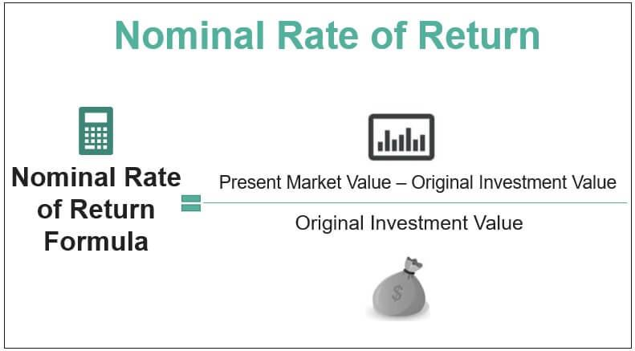

In the world of investing, understanding different rates of return is crucial for making informed decisions. This article explores the concepts of nominal rate, investment rate of return, and the emerging field of algorithmic trading. Our aim is to provide insights on how these elements interact and influence investment strategies. We will define these financial terms, explain how to calculate them, and discuss their implications for investors. By understanding these concepts, investors can optimize their strategies and potentially increase returns.

## Table of Contents



## Understanding Nominal Rate of Return

The nominal rate of return is a fundamental concept representing the basic return on an investment, calculated without adjusting for external economic factors such as inflation or taxes. It is a straightforward metric used to evaluate the gross profitability of an investment relative to its original cost. The nominal rate of return is expressed as a percentage and calculated using the formula:

$$
\text{Nominal Rate of Return} = \left(\frac{\text{Current Market Value} - \text{Original Investment Value}}{\text{Original Investment Value}}\right) \times 100
$$

This calculation provides a preliminary overview of how well an investment performs at face value, allowing for an initial comparison among different investment opportunities. It is a relatively simple measure, focusing solely on the direct change in investment value over time, which can help investors gauge potential gains before accounting for other influencing factors.

While the nominal rate of return serves as an important starting point, its simplicity means it does not account for changes in purchasing power due to inflation, nor does it reflect the impact of taxes or investment fees. Despite these limitations, it sets the foundation for more comprehensive analyses, as investors can subsequently adjust the nominal rate to derive more meaningful insights regarding an investment's real profitability. Understanding the nominal rate of return is essential for investors to establish a baseline performance benchmark, upon which further, more detailed financial analysis can be layered.

## Comparing Nominal and Real Rates of Return

The real rate of return is a crucial metric for investors as it accounts for inflation, thereby reflecting the actual increase in purchasing power an investment offers. In contrast to the nominal rate of return, which measures the straightforward percentage increase in an investment's value, the real rate provides a more accurate assessment of profitability by considering inflation's impact over the investment period.

To adjust the nominal rate of return for inflation and derive the real rate, the following formula is commonly used:

$$

\text{Real Rate of Return} = \frac{1 + \text{Nominal Rate of Return}}{1 + \text{Inflation Rate}} - 1 
$$

This formula effectively adjusts the nominal gain by the inflation rate, offering a reliable measure of the investment's true value increase. Understanding this distinction is imperative for investors as it influences the assessment of their actual purchasing power and potential to achieve financial objectives. 

For example, consider an investment with a nominal return of 5% in a year when the inflation rate is 2%. Plugging these values into the formula provides:

$$

\text{Real Rate of Return} = \frac{1 + 0.05}{1 + 0.02} - 1 \approx 0.0294 \text{ or } 2.94\%
$$

Here, while the nominal return is 5%, the real rate indicates a more modest gain of approximately 2.94%, reflecting a truer picture of the investment's purchasing power enhancement.

Investors must pay attention to this differentiation to avoid overestimating their portfolio's actual performance. By focusing solely on nominal returns, individuals may overlook the erosion of value caused by inflation, leading to potential misconceptions about wealth accumulation and growth. A detailed understanding of both nominal and real rates is essential for realistic financial planning and achieving long-term investment goals.

## Investment Rate of Return: Importance and Calculation

The investment rate of return is a crucial metric that quantifies the profit or loss generated by an investment over a specific period. It is more comprehensive than the nominal rate of return as it incorporates adjustments for taxes, fees, and other costs that can impact overall profitability. The ability to accurately calculate and understand this rate is essential for making informed investment decisions and developing robust financial strategies.

To calculate the investment rate of return, one can begin with the formula for nominal return:

$$
\text{Nominal Rate of Return} = \frac{\text{Current Market Value} - \text{Original Investment Value}}{\text{Original Investment Value}}
$$

However, to achieve a more accurate depiction of an investment's profitability, adjustments for taxes and fees must be made. This can be expressed as follows:

$$
\text{Investment Rate of Return} = \left( \frac{\text{Net Profit} - \text{Taxes and Fees}}{\text{Original Investment Value}} \right) \times 100
$$

Where:
- Net Profit = Current Market Value - Original Investment Value
- Taxes and Fees are subtracted from the Net Profit to provide a clear picture of actual financial gains or losses.

The significance of the investment rate of return lies in its ability to provide investors with a more nuanced understanding of their portfolios' performance. By accounting for often-overlooked financial elements such as taxes and fees, investors can avoid overestimating their returns, leading to more strategic decision-making.

An example can illustrate the application of this metric. Suppose an investor purchases stocks worth $10,000 and sells them a year later for $12,000. The nominal rate of return is 20%. However, after considering a 15% tax on capital gains ($300) and transaction fees totaling $50, the investment rate of return would be approximately 16.5%, calculated as follows:

$$
\text{Net Profit} = 12,000 - 10,000 - 300 - 50 = 1,650
$$

$$
\text{Investment Rate of Return} = \left( \frac{1,650}{10,000} \right) \times 100 = 16.5\%
$$

Understanding this rate is pivotal for effective portfolio management and strategic financial planning. By acknowledging the various components that influence returns, investors can optimize their portfolios to align with their financial goals and risk appetite. Consistently using the investment rate of return facilitates the comparison of diverse investment options, aiding in the development of diversified and balanced investment strategies, essential for long-term financial success.

## Algorithmic Trading and Its Role in Modern Investments

Algorithmic trading leverages computer programs to execute trades based on specific parameters set by traders. This strategy has gained prominence for its capacity to handle extensive datasets and execute transactions at the most favorable times, enhancing efficiency and potentially profitability in financial markets.

### Key Concepts in Algorithmic Trading

Algorithmic trading involves using algorithms to make trading decisions, providing several advantages. One significant benefit is speed; algorithms can perform trades much faster than humans, enabling the rapid execution of trades whenever market conditions meet specified criteria. Additionally, [algorithmic trading](/wiki/algorithmic-trading) can operate with high precision, reducing errors caused by human emotions or miscalculations.

Moreover, algorithmic trading allows for [backtesting](/wiki/backtesting), a process where trading algorithms are tested against historical data to gauge potential outcomes. This capability enables traders to refine strategies before applying them in live markets. However, algorithmic trading carries risks such as system failures, market [volatility](/wiki/volatility-trading-strategies) scenarios causing unexpected behavior, and over-optimization leading to poor real-world performance.

### Nominal and Investment Rates of Return in Algorithm Design

Nominal and investment rates of return play crucial roles in algorithmic trading. When designing trading algorithms, these rates are used to project potential returns and to assess the past performance of strategies. The nominal rate of return, representing the percentage increase in value from the initial investment, provides a baseline for evaluating profitability. Meanwhile, the investment rate of return, which considers various factors like taxes and fees, offers a more comprehensive measure of actual gains or losses.

Algorithms may incorporate these rates to optimize decision-making, ensuring trades align with desired return thresholds. For instance, algorithms might set buy or sell triggers based on reaching certain nominal return levels or adjust dynamically to maintain expected investment returns after accounting for transaction costs.

### Case Studies in Successful Algorithmic Trading

A notable example of successful algorithmic trading is Renaissance Technologies, known for its Medallion Fund. The fund employs sophisticated mathematical models to identify market inefficiencies and execute trades. By continually refining its algorithms and incorporating a wealth of financial data, the Medallion Fund has consistently outperformed traditional investment strategies.

Another instance is the application of [machine learning](/wiki/machine-learning) in algorithmic trading. Firms like Two Sigma use machine learning algorithms to analyze vast amounts of data, recognize patterns, and make predictions about market movements. By leveraging advanced statistical models and computing power, Two Sigma effectively navigates complex market environments.

Algorithmic trading represents a transformative force in modern financial markets, offering unparalleled speed and precision. By understanding the role of nominal and investment rates in algorithm design, traders can craft more effective strategies that enhance decision-making and risk management. These advancements in trading technology emphasize the importance of continual adaptation and innovation in investment practices.

## Integrating Nominal Rate and Algorithmic Trading

The integration of nominal rate calculations in algorithmic trading strategies is essential for precise performance evaluation. By employing nominal returns, investors and fund managers can test and refine trading algorithms against historical datasets. Such analyses allow the identification of patterns and potential inefficiencies in the algorithm's design.

Utilizing nominal rates effectively requires understanding their role within risk management frameworks. Since nominal rates provide a baseline metric for investment performance without accounting for inflation or taxes, they serve as an initial checkpoint in evaluating the profitability of trading strategies. By incorporating nominal returns, fund managers can simulate how certain strategies would perform under varying market conditions, thereby assessing their robustness and adaptability.

A practical application of integrating nominal rate calculations can be demonstrated through backtesting algorithms. Backtesting involves running an algorithm through past market data to see how it would have performed historically. Here's a concise Python example:

```python
import pandas as pd

# Sample historical data
data = pd.DataFrame({
    'price': [100, 102, 101, 105, 107],
    'date': pd.date_range(start='2023-01-01', periods=5, freq='D')
})

# Calculate nominal returns
data['nominal_return'] = data['price'].pct_change()

# Backtesting simple algorithm: Buy if nominal return > 0.02
data['strategy'] = data['nominal_return'].apply(lambda x: 1 if x > 0.02 else 0)

print(data)
```

This code calculates nominal returns of a basic dataset and applies a simplified algorithmic strategy based on these returns. The strategy buys when the nominal return exceeds 2%. Such simulations can highlight how often the algorithm would initiate trades under historical conditions, aiding in fine-tuning its parameters for improved performance.

Integrating these practices in algorithmic trading significantly affects investment outcomes. By using nominal rates for thorough evaluations, investors can better manage risks, especially in volatile markets. This approach facilitates more informed decision-making, allowing traders to anticipate potential returns and adjust strategies promptly.

These integration techniques are crucial for enhancing the performance of investment portfolios. By properly leveraging historical data and nominal rates, fund managers can optimize trading algorithms that aim not only to maximize returns but also to maintain resilience against market fluctuations, thus improving overall portfolio efficiency and profitability.

## Potential Pitfalls and Considerations

Ignoring factors such as inflation, taxes, and fees in nominal rate assessments can result in misleading conclusions, potentially affecting an investor's perception of their portfolio's actual performance. The nominal rate of return, while useful for a preliminary view of an investment's performance, does not account for these crucial elements which can significantly impact real profitability.

One common mistake investors make is solely relying on nominal rates without adjusting for inflation. Inflation erodes purchasing power, meaning that even if an investment shows a positive nominal return, the real return—or the increase in actual purchasing capacity—may be negligible or even negative. For instance, if an investment yields a nominal return of 5% over a year during which inflation is 3%, the real return would be approximately 2%. This adjustment can be expressed with the formula:

$$
\text{Real Rate of Return} = \frac{1 + \text{Nominal Rate}}{1 + \text{Inflation Rate}} - 1
$$

Taxes and fees also pose significant factors that can skew nominal assessments. Many investments incur capital gains tax, or may have management fees associated, both of which reduce the overall profitability. Failing to incorporate these into the rate of return analysis can lead investors to overestimate their net earnings.

A holistic approach to investment analysis is essential for accurate performance assessment. This approach involves evaluating both the nominal and real rates of return along with a comprehensive risk assessment. Investors should consider alternative metrics such as the Sharpe ratio, which includes adjustments for the risk-free rate and standard deviation of the return, to gauge the risk-adjusted performance of their portfolio.

To mitigate these pitfalls, investors could employ strategies such as diversifying their portfolios to hedge against inflation, using tax-advantaged accounts to minimize taxable income, and actively managing fees by choosing low-cost investment options. Incorporating these strategies into decision-making processes can provide a more comprehensive understanding of potential returns.

The role of technology, particularly in the context of algorithmic trading, has become significant in overcoming the limitations inherent in nominal rate assessments. Algorithms can be programmed to account for inflation, taxes, and fees, automating the real-time adjustment of rates of return. Advanced trading platforms use these technologies to offer enhanced analytic capabilities and ensure that real return assessments are included in strategic decision-making processes, thereby promoting a more accurate evaluation of investment opportunities. Through integrating technological solutions, investors can better navigate the complex financial markets and address the nuances that might otherwise be overlooked in traditional analysis methods.

## Conclusion

Understanding the nominal rate, investment rate of return, and algorithmic trading is crucial for modern investors. Each of these components plays a significant role in shaping investment strategies and determining financial success. Recognizing the nominal rate of return allows investors to assess the basic performance of their investments without considering external factors like inflation and taxes. This rudimentary analysis is the first step in a more comprehensive evaluation of an investment's effectiveness.

The nominal rate is just one part of the puzzle. When considered alongside the investment rate of return, which incorporates adjustments for taxes and fees, investors gain a more realistic view of potential profits or losses. By evaluating these adjusted returns, they can make more informed decisions, achieving a balance between risk and return that aligns with their financial goals.

Algorithmic trading further enhances this analysis and decision-making process by leveraging technology to execute trades with precision and speed. Algorithms can assess nominal and real rates of return, adjusting strategies dynamically to optimize outcomes. This integration of technology in finance not only improves the efficiency of trading but also reduces human error and emotional biases, leading to more consistent results.

By combining these insights, investors can better navigate the complexities of today’s financial markets. A thorough understanding of nominal rates, investment returns, and the capabilities offered by algorithmic trading equips investors with the tools needed to improve portfolio management and adapt to rapidly changing market conditions. This foundational framework encourages investors to continually refine their strategies, enabling them to seize opportunities and mitigate risks effectively.

## References & Further Reading

[1]: Bergstra, J., Bardenet, R., Bengio, Y., & Kégl, B. (2011). ["Algorithms for Hyper-Parameter Optimization."](https://dl.acm.org/doi/10.5555/2986459.2986743) Advances in Neural Information Processing Systems 24.

[2]: ["Advances in Financial Machine Learning"](https://www.amazon.com/Advances-Financial-Machine-Learning-Marcos/dp/1119482089) by Marcos Lopez de Prado

[3]: ["Evidence-Based Technical Analysis: Applying the Scientific Method and Statistical Inference to Trading Signals"](https://www.amazon.com/Evidence-Based-Technical-Analysis-Scientific-Statistical/dp/0470008741) by David Aronson

[4]: ["Machine Learning for Algorithmic Trading"](https://github.com/stefan-jansen/machine-learning-for-trading) by Stefan Jansen

[5]: ["Quantitative Trading: How to Build Your Own Algorithmic Trading Business"](https://www.amazon.com/Quantitative-Trading-Build-Algorithmic-Business/dp/1119800064) by Ernest P. Chan