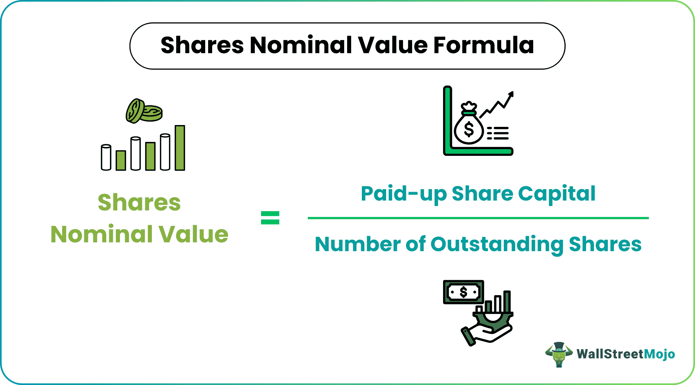

## Table of Contents

## What is nominal value?

Nominal value is a basic term that means the stated or face value of something. It's often used in finance and economics to talk about the original value of money, stocks, or bonds before any changes like inflation or market fluctuations are considered. For example, if a bond says it's worth $1,000, that's its nominal value.

In everyday situations, nominal value can also refer to the price of goods or services without considering other factors like discounts or taxes. It's a straightforward number that helps people understand the basic worth of an item or the amount of money involved in a transaction. Knowing the nominal value is important because it gives a starting point for understanding and comparing values in a simple way.

## How is nominal value different from market value?

Nominal value and market value are two different ways to look at the worth of something. Nominal value is the basic, stated amount of an item or asset. It's like the price tag you see on a new toy or the face value of a dollar bill. This value doesn't change based on what people think or what's happening in the market. For example, a bond might have a nominal value of $1,000, and that's what it says on the bond, no matter what.

Market value, on the other hand, is what people are actually willing to pay for that item or asset at a certain time. It can go up or down based on what's happening in the market or how much people want the item. If lots of people want that $1,000 bond, its market value might be higher than $1,000. But if nobody wants it, the market value could be lower. So, while the nominal value stays the same, the market value can change a lot.

## Can you provide examples of nominal value in everyday life?

When you go to the store and see a shirt with a price tag that says $20, that $20 is the nominal value of the shirt. It's the amount printed on the tag before any sales or discounts are applied. If the store has a sale and the shirt goes on sale for $15, the nominal value is still $20, but the price you pay is different.

Another example is with money itself. If you have a $5 bill, its nominal value is $5. That's what it says on the bill, and that's how much it's worth in terms of face value. Even if inflation makes things more expensive over time, the nominal value of that $5 bill doesn't change; it's still $5.

## What are the common uses of nominal value in financial statements?

In financial statements, nominal value is often used to show the original value of things like stocks or bonds. For example, if a company issues shares with a nominal value of $1 each, this value is what's written down in the company's [books](/wiki/algo-trading-books). It helps everyone understand the basic value of the shares without considering how much people might actually pay for them in the market.

Another common use of nominal value in financial statements is for bonds. When a company issues a bond with a nominal value of $1,000, this amount is what the company promises to pay back when the bond matures. It's a simple way to communicate the bond's face value to investors, which is important for understanding the bond's basic worth and how it fits into the company's overall financial picture.

## How do you calculate the nominal value of a bond?

The nominal value of a bond is the amount that's written on the bond itself. It's the basic, face value of the bond, and it doesn't change no matter what happens in the market. For example, if a bond says it's worth $1,000, then that $1,000 is its nominal value. To calculate the nominal value, you simply look at the bond and read the amount that's printed on it. That's all you need to do.

This value is important because it tells you how much money you'll get back when the bond reaches its maturity date. It's like the promise the company makes to pay you that amount at the end. So, if you have a bond with a nominal value of $1,000 and it matures in 10 years, you can expect to receive $1,000 from the company after those 10 years, no matter what the bond's market value might be during that time.

## What role does nominal value play in stock valuation?

Nominal value, or par value, is the basic amount written on a stock certificate. It's like the starting price of the stock when it's first issued by a company. For example, if a company decides to issue shares with a nominal value of $1 each, that's the amount that will be shown on the stock certificate and in the company's financial records. This value is important because it helps set a minimum price for the stock and shows how many shares the company is issuing.

However, the nominal value doesn't tell you how much the stock is actually worth in the market. The market value of a stock can be much higher or lower than its nominal value, depending on how much people want to buy or sell the stock. For instance, if a stock has a nominal value of $1 but people are willing to pay $10 for it, the market value is $10. The nominal value is just a starting point and doesn't change, even if the market value goes up or down a lot.

## How is nominal value used in currency exchange rates?

When you change money from one country to another, like from dollars to euros, the nominal value is the basic amount of money you're starting with. For example, if you have $100, that's the nominal value of the money you want to exchange. It's the face value of the money, and it doesn't change no matter what the exchange rate is.

The exchange rate is what tells you how many euros you get for your $100. If the exchange rate says $1 equals €0.85, then your $100 will give you €85. The nominal value of your $100 stays the same, but the amount of euros you get changes based on the exchange rate. So, nominal value helps you know how much money you're starting with, and the exchange rate tells you how much of the other currency you'll get.

## What are the implications of nominal value in inflation calculations?

When we talk about inflation, nominal value is important because it's the starting point for measuring how prices change over time. Inflation means that the price of things goes up, so the same amount of money can buy less stuff. If you have $100, that's the nominal value of your money. When inflation happens, the things you can buy with that $100 might cost more, but the nominal value of your $100 stays the same. This helps us see how much prices have gone up by comparing the nominal value of money to what it can actually buy.

To figure out inflation, we look at how the nominal value of money relates to the real value of what you can buy with it. Economists use something called the Consumer Price Index (CPI) to measure this. The CPI looks at the prices of a bunch of different things people buy, like food and clothes, and sees how those prices change over time. If the CPI goes up, it means inflation is happening, and the same nominal amount of money can buy less. So, understanding the nominal value of money is key to understanding how inflation affects what we can afford.

## How does nominal value affect accounting practices?

Nominal value is important in accounting because it helps keep track of the basic value of things like stocks and bonds. When a company issues stocks, the nominal value, or par value, is the amount written on the stock certificate. This value is used in the company's books to show how many shares are out there and what their basic worth is. It's like a starting point for the company's financial records, and it doesn't change even if the market value of the stocks goes up or down.

In accounting, nominal value also comes into play with bonds. When a company issues a bond, the nominal value is the amount the company promises to pay back when the bond matures. This value is recorded in the company's financial statements and helps everyone understand the bond's face value. It's important for keeping the company's financial records clear and straightforward, even if the bond's market value changes over time.

## Can nominal value be used to assess the performance of an investment?

Nominal value itself isn't the best way to assess the performance of an investment. It's just the basic, face value of an item like a stock or a bond, and it doesn't change over time. For example, if you buy a bond with a nominal value of $1,000, that's what it says on the bond, but it doesn't tell you if the bond is a good investment or not. To figure out how well your investment is doing, you need to look at other things like the market value and how much money you're making from it.

The market value and the returns you get from an investment are much better ways to see how it's performing. If you bought a stock with a nominal value of $1, but it's now worth $10 in the market, that's a good sign that your investment is doing well. Also, if you're getting regular payments from a bond or dividends from a stock, that's another way to measure performance. So, while nominal value is important for understanding the basic worth of an investment, it's not enough on its own to tell you if you're making money or not.

## What are the advanced mathematical formulas used to determine nominal value in complex financial instruments?

When it comes to figuring out the nominal value of complex financial instruments, things can get a bit tricky. But at its heart, nominal value is still the basic, face value of the instrument. For example, if you have a bond that says it's worth $1,000, that's its nominal value. With more complex instruments like derivatives or structured products, the nominal value might be part of a bigger formula. These formulas often include things like the principal amount, interest rates, and any adjustments for things like inflation or currency changes. But no matter how complicated the instrument is, the nominal value is always the starting point, the number that's written down as the face value.

In some cases, you might see formulas that break down the nominal value into smaller parts. For instance, with a bond that pays interest, you might see the nominal value used in a formula like: Nominal Value x Coupon Rate = Annual Interest Payment. This helps you understand how much money you'll get each year from the bond. But even with these formulas, the nominal value stays the same; it's the other parts of the formula that change to reflect things like interest rates or market conditions. So, while the math can get more advanced with complex financial instruments, the idea of nominal value stays simple: it's the basic amount that's written down, no matter what else happens.

## How do regulatory standards impact the reporting of nominal value in different countries?

Different countries have their own rules about how companies should report the nominal value of things like stocks and bonds. These rules are made by groups like the Financial Accounting Standards Board (FASB) in the United States or the International Financial Reporting Standards (IFRS) used in many other countries. The rules help make sure that everyone understands the basic value of financial instruments in the same way, no matter where they are. For example, in the U.S., companies have to report the nominal value of their stocks on their balance sheets, while in some other countries, they might not have to do this.

These regulatory standards can affect how companies show the nominal value in their financial statements. In some places, the rules might say that the nominal value has to be shown clearly, so everyone knows the basic worth of the stocks or bonds. In other places, the rules might let companies use different ways to show this value, or they might not have to show it at all. This can make it harder to compare the financial statements of companies from different countries, because the way they report nominal value can be different. But the main goal of these standards is to make sure that the information is clear and helpful for people who want to understand the company's finances.

## What is the Nominal Value of Bonds and Stocks?

For bonds, the nominal value, also referred to as par value, represents the amount that is returned to the bondholder at maturity. This value is fixed and does not fluctuate with market interest rates. It is a central [factor](/wiki/factor-investing) in calculating interest payments and yields, which rely on this stable value to provide investors predictable returns. The calculation of interest on bonds is typically done via the formula:

$$
\text{Interest Payment} = \text{Nominal Value} \times \frac{\text{Coupon Rate}}{\text{Number of Payments per Year}}
$$

Thus, if a bond has a nominal value of \$1,000 and a coupon rate of 5% with semiannual payments, each interest payment would be:

$$
\$1,000 \times \frac{0.05}{2} = \$25
$$

The nominal value of a bond also plays a crucial role when assessing yield. The yield is a function of the interest received over the nominal value, providing a basis for comparing with other potential investments.

For stocks, the nominal value, frequently termed face or par value, is often set at an arbitrary figure for accounting purposes during the initial issuance. Unlike bonds, the nominal value of stocks is minimally influential on later market transactions. It does not dictate market price but serves as an initial reference point.

The differentiation between nominal and market value in stocks is pivotal for determining the actual worth of financial instruments. Nominal value impacts stock issuance processes, but market value reflects investor sentiment and market conditions, affecting dividends and redemption prices.

A practical example of nominal value in stocks is necessary for clarity. Suppose a company issues shares with a nominal value of \$0.01 each. The actual price at which these shares trade on the market is subject to supply and demand dynamics, often differing substantially from the nominal value.

These concepts illuminate how nominal values can serve as benchmarks in fixed-income and equity investments, guiding investors in assessing financial instruments' long-term potential and true market value. Understanding these fundamentals allows investors to decipher the underlying value of their investments more effectively.

## What is Real Value: An Inflation-Adjusted Measure?

Real values offer a more accurate reflection of the true economic worth of an asset by adjusting for inflation. Inflation erodes the purchasing power of money over time, making it essential to account for this when evaluating financial performance or asset value over extended periods. Understanding the difference between nominal and real values is crucial for investors who wish to accurately assess long-term performance.

Real value calculations adjust nominal values using inflation indices such as the Consumer Price Index (CPI). The formula to convert a nominal value (NV) to a real value (RV) is expressed as:

$$
\text{RV} = \frac{\text{NV}}{(1 + \text{Inflation Rate})^t}
$$

where $t$ represents the time period in years. This formula accounts for the compounded effect of inflation over time.

For instance, consider an investment that has a nominal return of 10% over five years, with an average annual inflation rate of 3%. The real return can be calculated as:

$$
\text{Real Return} = \frac{1.10}{(1.03)^5}
$$

Using Python, this calculation can be automated to offer quick insights into real values from nominal data:

```python
def calculate_real_value(nominal_value, inflation_rate, years):
    real_value = nominal_value / ((1 + inflation_rate) ** years)
    return real_value

nominal_return = 1.10  # 10% nominal return
inflation_rate = 0.03  # 3% annual inflation rate
years = 5

real_return = calculate_real_value(nominal_return, inflation_rate, years)
print(f"Real Return over {years} years: {real_return:.4f}")
```

This approach provides a clearer view of an asset's or investment's value, adjusted for inflationary influences, allowing investors to make more informed decisions. By focusing on real rather than nominal values, financial analysis becomes more meaningful, painting a more accurate picture of purchasing power and performance across time.

## What are the calculation formulas for nominal and real values?

The calculation of nominal value is crucial for valuing financial instruments such as derivatives and trading contracts. Nominal value, often referred to as face value, is utilized across various financial contexts, providing a foundational metric for assessment and valuation.

### Calculating Nominal Value

For bonds, the nominal value, also known as par value, represents the amount to be repaid upon maturity. This figure is foundational in determining the interest yield, as interest payments are often a percentage of the nominal value. The formula is straightforward:

$$
\text{Nominal Yield} = \left( \frac{\text{Annual Coupon Payment}}{\text{Nominal Value}} \right) \times 100 \%
$$

For stocks, nominal value serves an accounting purpose during share issuance, often bearing no relation to the market value of the shares. It is generally set below the market trading price of the shares to establish a base value for accounting purposes.

### Converting Nominal to Real Values

Real values adjust nominal figures using inflation rates to reflect true purchasing power. The conversion differentiates past or future values in terms of current monetary worth. The standard formula to convert nominal value to real value is as follows:

$$
\text{Real Value} = \frac{\text{Nominal Value}}{(1 + \text{Inflation Rate})^n}
$$

where $n$ represents the number of years over which the inflation rate is applied.

### Automating Calculations with Python

To streamline these computations, Python can be used to automate the adjustment of nominal values to real values. Below is a basic Python script example for calculating real values:

```python
def calculate_real_value(nominal_value, inflation_rate, years):
    return nominal_value / ((1 + inflation_rate) ** years)

nominal_value = 1000  # Example nominal value
inflation_rate = 0.03  # Example inflation rate (3%)
years = 5  # Number of years

real_value = calculate_real_value(nominal_value, inflation_rate, years)
print(f"Real Value: {real_value:.2f}")
```

This script illustrates the conversion of a nominal figure into a real value, accounting for inflation over a specified duration. Such automation aids investors and traders by providing accurate, inflation-adjusted financial data, ensuring more informed decision-making.

Understanding these formulas and being able to execute such calculations is essential for accurately quantifying financial data. They empower traders and investors to better interpret financial metrics, bridging the gap between nominal and real values and enhancing market analysis and strategy development.

## What are the implications in algorithmic trading?

Algorithmic trading relies heavily on precise data inputs, where the differentiation between nominal and real values becomes essential. Nominal values, reflecting unadjusted face figures, lack the integration of economic changes such as inflation. This can lead to inaccurate economic assessments, causing significant distortions in trading strategies. Real values, adjusted for inflation, offer a true reflection of an asset's worth, thus enabling more accurate economic evaluations. By considering real values, traders can align their strategies with the actual purchasing power of assets, leading to improved decision-making.

A critical application of adjusting nominal values to real values lies in [backtesting](/wiki/backtesting) trading algorithms. Backtesting requires historical data to simulate trading scenarios and predict future performance. If these simulations rely only on nominal values, they can produce skewed results, not accounting for the eroding effect of inflation over time. By employing real values, backtests can achieve realistic returns, providing an accurate performance reflection. Incorporating Consumer Price Index (CPI) adjustments or other inflation indices assists in transforming nominal historical prices into real terms:

$$
\text{Real Value} = \frac{\text{Nominal Value}}{\left(1 + \frac{\text{Inflation Rate}}{100}\right)^n}
$$

where $n$ represents the number of years.

Relying solely on nominal data presents potential pitfalls in algorithmic models. Algorithms using outdated or inflated nominal values could misjudge asset performance, leading to overvalued positions or ill-timed trades. This underscores the importance of incorporating real values, ensuring algorithms accurately reflect economic conditions and hence, optimizing their efficacy.

For practical implementation, a Python script could automate the conversion of nominal values to real values, thus streamlining the process for traders:

```python
def convert_to_real_value(nominal_value, inflation_rate, years):
    real_value = nominal_value / ((1 + inflation_rate / 100) ** years)
    return real_value

# Example usage:
nominal_value = 1000  # Example nominal value
inflation_rate = 2.5  # Example annual inflation rate in percentage
years = 5  # Number of years

real_value = convert_to_real_value(nominal_value, inflation_rate, years)
print(f"The real value is: {real_value}")
```

By ensuring that [algorithmic trading](/wiki/algorithmic-trading) platforms incorporate real values, traders can optimize strategies, maintain economic relevance, and enhance the precision of their trading models.

## References & Further Reading

1. *Fabozzi, F. J., & Mann, S. V. (2010). "The Handbook of Fixed Income Securities"*. This book provides comprehensive insights into the nominal and real value calculations within fixed income securities, offering a detailed exploration of how these metrics are used in bond valuation and interest rate assessments.

2. *Bodie, Z., Kane, A., & Marcus, A. J. (2014). "Investments"*. This textbook discusses the principles of nominal and real values, their applications in various financial instruments, and how they influence investment decisions.

3. *Easley, D., López de Prado, M. M., & O'Hara, M. (2011). "The microstructure of the 'Flash Crash': Flow toxicity, liquidity crashes and the probability of informed trading"*. Journal of Portfolio Management. This paper examines the implications of algorithmic trading strategies using real and nominal data, providing a foundation for understanding market dynamics during liquidity crashes.

4. *Chacko, G., Jurek, J., & Stafford, E. (2011). "The Structure of a Financial Crisis: Accounting for the Financial Crisis through Modeling Equity and Nominal/Real Financial Instrument Depictions"*. Harvard Business School. This book addresses the role of nominal and real values in navigating financial crises, essential reading for understanding market volatility and strategic asset allocation.

5. *Bennett, A. G., & Sias, R. W. (2009). "The Role of Inflation in Determining the Real Value of Investments"*. Financial Analysts Journal. This article provides case studies on the impacts of inflation adjustments on investment strategies, underscoring the importance of understanding real values for accurate financial analysis.

6. *Investopedia*. This platform offers a comprehensive suite of tools for calculating financial metrics in both nominal and real terms, including calculators for bond valuation and inflation-adjusted returns. Accessible at: [www.investopedia.com](https://www.investopedia.com).

7. *TradingView Community Scripts*. A vast repository of community-contributed scripts allowing traders to implement and backtest strategies considering nominal and real values. Available at: [www.tradingview.com](https://www.tradingview.com/scripts/).

These resources offer a blend of theoretical knowledge and practical insights into nominal and real value metrics, essential for traders, investors, and financial analysts seeking to optimize their strategies with a comprehensive understanding of economic conditions.

