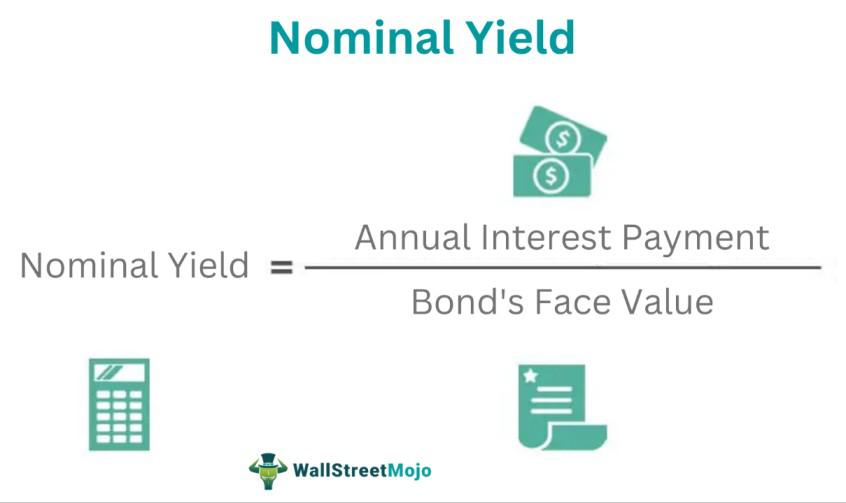

The financial landscape is a complex environment where bond yields, nominal yields, and algorithmic trading converge to define and refine investment strategies. These components are not isolated; rather, they interact in intricate ways that have significant implications for investors aiming to optimize their portfolios.

Bond yields are fundamental components in evaluating expected returns from fixed-income securities. They provide insights into the potential income an investor might receive from holding a bond until maturity. This return is a crucial factor when investors assess the attractiveness and potential profitability of bond investments. Bond yields, including current yield and yield to maturity, help investors understand not only the regular income component of bonds but also potential changes in bond value over time.



Nominal yield, contrastingly, refers specifically to the coupon rate of a bond, expressed as a percentage of its face value. It remains fixed for the bond's duration and serves as a straightforward indicator of the annual interest income relative to the bond's original investment. Understanding how nominal yield fits into the broader context of bond evaluation allows investors to make informed judgments about the suitability of a bond within a wider investment strategy.

Algorithmic trading is a technology-driven approach that enhances trading efficiency, facilitating rapid and precise execution of trades. By employing sophisticated computer algorithms, traders and institutional investors can automate trading strategies, thus minimizing human error and capitalizing on fleeting market opportunities. Algorithmic trading systems analyze vast amounts of data, including bond yield information, to make informed trading decisions in real time.

This article aims to provide a comprehensive understanding of these core financial concepts—bond yields, nominal yields, and algorithmic trading—and how they interact to shape and improve investment strategies. Through careful examination of how these elements work together, investors can better navigate the complexities of modern financial markets, aligning their investment decisions with their financial goals.

## Table of Contents

## Understanding Bond Yields

Bond yields are an essential metric in evaluating the expected returns from bond investments. They provide critical insights into the potential income an investor might earn, which is particularly relevant in fixed-income investments. There are different types of bond yields, each offering unique perspectives on bond valuation.

**Coupon Yield** is the simplest form of bond yield. It represents the bond's annual coupon payments as a percentage of its face value. For instance, if a bond has a face value of $1,000 and an annual coupon payment of $50, the coupon yield is calculated as follows:

$$
\text{Coupon Yield} = \left( \frac{\text{Annual Coupon Payment}}{\text{Face Value}} \right) \times 100
$$

Using the given example, the coupon yield is:

$$
\text{Coupon Yield} = \left( \frac{50}{1000} \right) \times 100 = 5\%
$$

Although coupon yield provides insight into the fixed income an investor can expect from a bond, it does not account for changes in the bond's market price.

**Current Yield** offers a more immediate perspective by considering the bond's current market price, rather than its face value. The current yield is calculated by dividing the annual coupon payment by the bond's current market price:

$$
\text{Current Yield} = \left( \frac{\text{Annual Coupon Payment}}{\text{Current Market Price}} \right) \times 100
$$

This measure helps investors understand the return on investment relative to the bond's market value at a given time, which can fluctuate due to market conditions.

**Yield to Maturity (YTM)** is the most comprehensive measure of a bond's yield. It accounts for all future coupon payments, the price paid for the bond, and any gains or losses incurred if the bond is held until maturity. YTM is calculated using the following formula, which is more complex and often requires iterative numerical methods or financial calculators:

$$
\text{YTM} = \text{Rate that equates the present value of future cash flows to the bond's current price}
$$

This calculation considers the time value of money and provides a detailed understanding of the bond's potential returns, assuming it is held until maturity and that all payments are made as scheduled. YTM is particularly useful for comparing bonds with different maturities and coupon rates.

In sum, understanding the distinct types of bond yields—coupon yield, current yield, and yield to maturity—enables investors to assess bonds from various angles, facilitating a more informed investment decision-making process.

## Nominal Yield: Definition and Calculation

Nominal yield, commonly referred to as the coupon rate, is a fundamental metric in bond analysis. It reflects the annual interest payment that a bondholder receives, expressed as a percentage of the bond's face value. This rate is determined when the bond is issued and remains constant over the bond's entire term, irrespective of market fluctuations. 

The nominal yield is calculated using the straightforward formula:

$$
\text{Nominal Yield} = \left( \frac{\text{Annual Coupon Payment}}{\text{Face Value of the Bond}} \right) \times 100
$$

For instance, consider a bond with a face value of $1,000 and an annual coupon payment of $50. Applying the formula gives:

$$
\text{Nominal Yield} = \left( \frac{50}{1000} \right) \times 100 = 5\%
$$

This means that the bondholder will receive an annual [interest rate](/wiki/interest-rate-trading-strategies) of 5% of the initial investment value throughout the life of the bond. The nominal yield provides a clear indication of expected income from the bond but does not account for other factors like changes in market interest rates or bond price [volatility](/wiki/volatility-trading-strategies) after issuance.

## Nominal Yield in Fixed-Income Strategies

Nominal yield is integral to various fixed-income investment strategies, such as laddering and barbell strategies. These strategies leverage the nominal yield to manage interest rate risk and optimize income generation from bonds.

Investors often seek bonds with favorable nominal yields to generate stable income streams. The nominal yield, representing the bond's coupon rate, serves as a fixed indicator of annual income relative to the bond's face value and allows investors to compare potential earnings across different bonds.

In laddering strategies, investors construct a portfolio of bonds with varying maturities. This approach helps manage reinvestment risk and interest rate volatility by staggering maturities over time. The nominal yield of each bond in the ladder is a crucial [factor](/wiki/factor-investing), enabling investors to ensure that each bond contributes to a consistent income flow. As bonds in the ladder mature, proceeds can be reinvested in new bonds with potentially higher nominal yields if interest rates have risen, thus maintaining the income stream.

For the barbell strategy, investors focus on balancing investments in both short-term and long-term bonds. Short-term bonds provide [liquidity](/wiki/liquidity-risk-premium) and flexibility, while long-term bonds offer higher nominal yields. The nominal yield comparison between the short-term and long-term bonds informs the investor's choice, enabling them to optimize portfolio yield while maintaining exposure to different interest rate environments. The strategy's balance allows an investor to capitalize on the different benefits provided by the varied maturity periods, with nominal yields indicating the expected income from each maturity segment.

Thus, understanding and utilizing nominal yield in these strategies support investors in constructing portfolios that are resilient to interest rate changes while ensuring a stable income stream from fixed-income securities.

## Algorithmic Trading and Bond Yields

Algorithmic trading leverages sophisticated computer algorithms to execute trades at high speeds, thereby enhancing market efficiency and precision. These algorithms process vast amounts of financial data, seeking patterns and opportunities for profitable trades. Within this framework, bond yields, such as nominal yields, current yields, and yield to maturity, serve as critical parameters that inform [algorithmic trading](/wiki/algorithmic-trading) models. The ability to swiftly evaluate these yields allows traders to make rapid and informed decisions, capitalizing on real-time market movements.

Yield curves, which graphically represent the relationship between interest rates and bonds of varying maturities, are a key focus in algorithmic trading. By analyzing yield curves, trading systems can discern the expected interest rate movements and adjust investment strategies accordingly. Spread analysis is another essential element, as algorithmic systems examine the difference between yields on different bonds to identify potential market inefficiencies.

Moreover, risk management is integrated into algorithmic trading strategies through sophisticated models that quantify and manage risk exposure. This enables traders to execute strategies that align with their risk tolerance levels while maximizing returns. For instance, algorithms can dynamically adjust trading positions based on real-time changes in bond yields, ensuring that the portfolio remains optimized against interest rate risks.

Algotrading systems can utilize Python or other programming languages to implement these analyses. A Python snippet for examining yield spreads might look like this:

```python
import numpy as np

def calculate_yield_spread(yield1, yield2):
    return np.abs(yield1 - yield2)

# Example yields
bond_yield_a = 0.035  # 3.5%
bond_yield_b = 0.032  # 3.2%

spread = calculate_yield_spread(bond_yield_a, bond_yield_b)
print(f"Yield Spread: {spread:.3%}")
```

The integration of bond yield analysis with algorithmic trading equips market participants to execute trades that are aligned with their strategic objectives and market forecasts, leading to more effective investment management and optimized returns.

## Integrating Bond Yields and Algorithmic Trading for Optimal Investment Performance

Integrating bond yield calculations with algorithmic trading offers a transformative approach to optimizing investment performance. By leveraging technology, investors can automate complex yield analyses, facilitating dynamic portfolio management that aligns with specific investment goals. This integration not only enhances computational efficiency but also enables more nuanced interpretations of financial data, allowing investors to respond swiftly to market fluctuations.

Algorithmic trading systems can process vast datasets covering bond yields—such as nominal yield, current yield, and yield to maturity—and use these inputs to develop sophisticated trading strategies. The capacity to automate the computation of these metrics allows for real-time analysis across a diversified bond portfolio, reducing the manual workload and minimizing the potential for human error.

For example, consider the integration of yield curve analysis within an algorithmic trading framework. By continuously evaluating the yield curve's shape and shifts, an algorithm can identify [arbitrage](/wiki/arbitrage) opportunities or signal potential buy/sell decisions. Python, a prevalent language in algorithmic trading, offers libraries like NumPy and pandas to efficiently handle large datasets and perform the necessary computations. A simple Python snippet to calculate the nominal yield might look as follows:

```python
def calculate_nominal_yield(coupon_payment, face_value):
    return (coupon_payment / face_value) * 100

# Example usage
nominal_yield = calculate_nominal_yield(coupon_payment=50, face_value=1000)
print(f"The nominal yield is {nominal_yield}%")
```

Beyond yield calculations, algorithmic trading can incorporate risk management models that evaluate market conditions and adjust trading positions accordingly. These models help in maintaining an optimal balance between potential returns and associated risks, contributing to more robust investment strategies.

Moreover, real-time integration of economic indicators and bond yield trends can further refine trading algorithms, enhancing their predictive power and adaptability to market dynamics. This capacity allows investors to capitalize on transient market opportunities and hedge against unfavorable movements effectively.

In summary, the symbiotic relationship between bond yield analysis and algorithmic trading empowers investors to enhance decision-making capabilities, enabling them to react promptly to market changes. This integration is pivotal in formulating investment strategies that are not only profitable but also aligned with the evolving demands of financial markets.

## Conclusion

Understanding bond yields alongside algorithmic trading techniques provides investors with a significant edge in today's financial markets. Comprehending the fundamental concepts of nominal yield, current yield, and yield to maturity (YTM) enables investors to precisely gauge the potential returns on bond investments. The nominal yield, acting as a fixed measure of the annual interest based on the bond’s face value, offers a straightforward insight into potential earnings. In contrast, the current yield and YTM provide more dynamic perspectives, considering factors such as current market prices and the complete stream of cash flows over a bond's lifetime.

Algorithmic trading enhances this analytical framework by using sophisticated algorithms to parse vast quantities of market data, allowing for rapid and informed trading decisions. These technological advancements enable traders to automate complex yield analyses, optimizing their portfolios through more frequent and precise executions. Python libraries such as NumPy and Pandas simplify data manipulation and financial computation, making it feasible to model bond yields and simulate trading strategies efficiently.

Ultimately, the fusion of bond yield metrics with algorithmic trading strategies leads to crafting more resilient and versatile investment approaches. By leveraging technology alongside a deep understanding of bond valuations, investors can swiftly adapt their strategies to align with financial objectives in a market that is constantly evolving. This integration not only enhances decision-making capabilities but also ensures the alignment of investment strategies with overarching financial goals, thus securing a competitive advantage in modern finance.

## References & Further Reading

For those seeking to deepen their understanding of the intricate dynamics between bond yields and algorithmic trading, several influential texts provide valuable insights:

1. **Fabozzi, F. J. et al. "Bond Markets, Analysis, and Strategies." Pearson Education.** This comprehensive guide explores the fundamentals and intricacies of bond markets, offering readers a structured approach to understanding bond valuation and yield analysis. It is an essential resource for grasping the mechanisms governing fixed-income securities.

2. **Brandt, M. W. "Portfolio Choice Problems." In Handbook of Financial Econometrics.** This text provides a thorough analysis of portfolio management challenges, incorporating advanced econometric models to optimize investment decisions. It offers a solid foundation for integrating bond yields into sophisticated portfolio strategies.

3. **Kissell, R. "The Science of Algorithmic Trading and Portfolio Management." Academic Press.** This book examines the technological components of trading and portfolio management, with particular focus on algorithmic strategies. It is instrumental for understanding how yields are factored into algorithm-driven trading systems to enhance market execution.

4. **Farlex Financial Dictionary. "Current Yield."** This entry provides a succinct explanation of current yield, a critical measure in bond valuation that assesses income generation relative to the bond's market price.

5. **Investopedia articles on bond yields and algorithmic trading.** Investopedia offers accessible explanations and practical examples related to bond yields, nominal yields, and algorithmic trading techniques. It serves as a reliable resource for both novice and experienced investors.

These references provide a robust framework for exploring bond yields and algorithmic trading, offering strategic and analytical perspectives necessary for optimizing investment performance.

