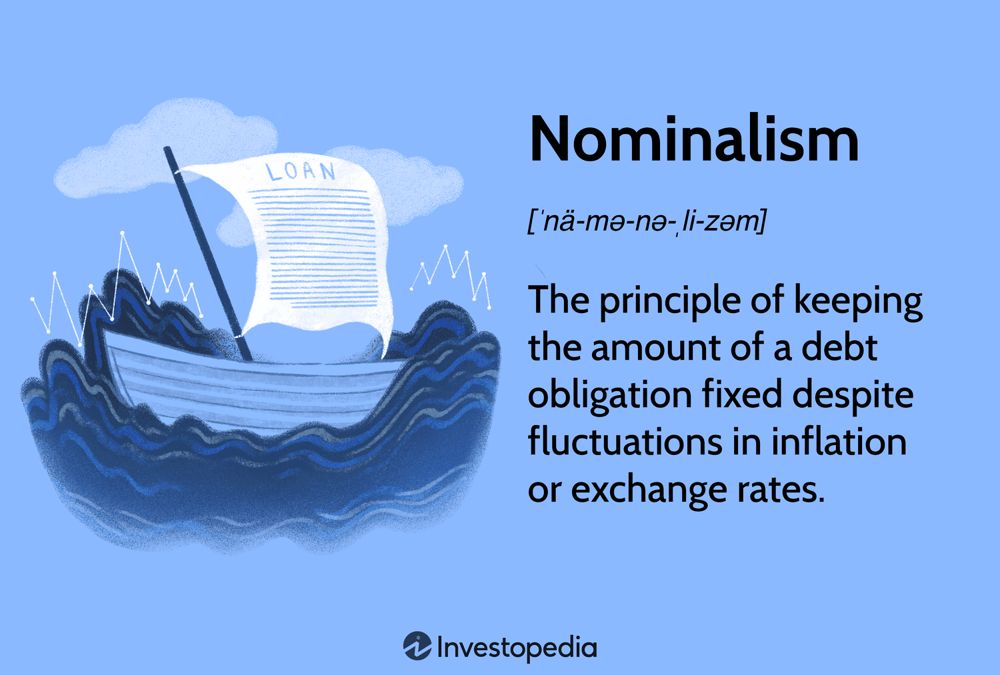

## Table of Contents

## What is nominalism in the context of finance?

Nominalism in finance refers to the idea that the value of money is based on what people believe it's worth, not on any physical substance like gold or silver. This means that money, like dollars or euros, has value because people trust that they can use it to buy things. Governments and central banks can control the supply of this money, which can affect its value. For example, if a government prints too much money, each unit of money might become worth less, leading to inflation.

In practical terms, nominalism affects how we think about and use money every day. When you see a price tag, you're looking at a nominal value, which is the face value of the money needed to buy that item. This nominal value can change over time due to inflation or deflation. For instance, if inflation is high, the nominal value of money goes down, meaning you need more money to buy the same things. Understanding nominalism helps people and businesses make better financial decisions, like saving, investing, or planning for the future.

## How does nominalism differ from realism in financial theory?

Nominalism and realism are two different ways of thinking about money in financial theory. Nominalism says that money's value comes from what people believe it's worth. It's not tied to anything physical like gold. Instead, money's value depends on trust and the decisions made by governments and central banks. For example, if everyone believes that a dollar can buy a certain amount of goods, then that's what it's worth, even if the government decides to print more dollars.

On the other hand, realism in financial theory believes that money should have a real, tangible value, often linked to something like gold or silver. Realists think that money should be backed by something physical so that its value stays stable. If money is tied to gold, for instance, then the amount of money in circulation would be limited by the amount of gold available. This approach aims to prevent problems like inflation, where the value of money goes down because there's too much of it.

In simple terms, nominalism sees money as a social agreement, while realism sees it as something that needs a physical foundation. Both ideas have been debated for a long time, and they affect how people and governments manage money and make financial decisions.

## Can you explain the historical origins of nominalism in finance?

Nominalism in finance started a long time ago, during the Middle Ages. Back then, people used coins made of gold and silver. But as trade grew, it became hard to [carry](/wiki/carry-trading) all that heavy metal around. So, people began using paper money, which represented the value of gold or silver. This was the beginning of nominalism because the value of the paper money depended on what people believed it was worth, not just the metal it represented.

Over time, countries started to use more and more paper money, and less and less gold and silver. This change happened a lot during the 20th century. Governments realized they could control the amount of money in circulation, which helped them manage the economy. But it also meant that the value of money was based on trust and government policies, not on physical stuff like gold. This is how nominalism became a big part of modern finance.

## What are some practical examples of nominalism in financial markets?

One practical example of nominalism in financial markets is the use of fiat currency. Countries like the United States use dollars, which are not backed by gold or silver. Instead, the value of a dollar comes from what people believe it's worth and the trust they have in the U.S. government. If the government decides to print more dollars, the value of each dollar might go down because there are more of them around. This can lead to inflation, where prices go up because money is worth less.

Another example is how stock prices work. The price of a company's stock is based on what investors think it's worth, not on any physical asset. If lots of people believe a company will do well, they might buy its stock, which makes the price go up. But if people lose trust in the company, they might sell the stock, and the price can go down. This shows how the value of stocks, like money, depends on what people believe, which is a key idea in nominalism.

## How does nominalism affect the valuation of assets?

Nominalism affects the valuation of assets by making their value depend on what people believe they're worth, not just on what they're made of. For example, if you own a house, its value isn't just about the bricks and wood. It's also about what people are willing to pay for it. If lots of people want to live in your area, they might be willing to pay more, which makes your house more valuable. But if people think the area is not so good anymore, they might not want to pay as much, and your house's value could go down.

This idea applies to all kinds of assets, like stocks and bonds. The price of a company's stock goes up or down based on what investors think about the company's future. If they believe the company will do well, they'll buy more of its stock, which makes the price go up. But if they think the company will struggle, they might sell the stock, and the price could drop. So, nominalism shows us that the value of assets is often more about what people believe than about any physical thing.

## What role does nominalism play in inflation and monetary policy?

Nominalism plays a big role in inflation because it says that money's value comes from what people believe it's worth. If a government prints more money, there's more money around, but the same amount of stuff to buy. This can make each dollar worth less, which means prices go up. That's inflation. People see the prices going up and might start to believe that money is worth even less, which can make inflation worse. So, nominalism shows us that what people think about money can affect how much things cost.

Monetary policy is how governments and central banks control the amount of money in the economy. Because of nominalism, they have to be careful. If they print too much money, it can lead to inflation, like we talked about. But if they don't print enough, it can make it hard for people to buy things and slow down the economy. Central banks use tools like interest rates to try to keep the value of money stable. They want people to trust that money will keep its value, which is important in a world where money's worth depends on what people believe.

## How do nominalist views influence financial decision-making?

Nominalist views affect how people make money decisions because they show that money's value depends on what people think it's worth. When people understand this, they might think more about what others believe when they decide to buy, sell, or invest. For example, if you're thinking about buying a house, you'll look at what other people are willing to pay for houses in that area. If lots of people want to live there, you might decide to buy because you think the house will be worth more later. But if people are moving away, you might decide not to buy because you think the house might be worth less.

This idea also affects bigger decisions, like how businesses and governments handle money. Businesses might change their prices based on what people think their products are worth. If people think a product is really good, the business might raise the price. Governments have to think about what people believe when they make money policies. If they print too much money and people start to think it's worth less, the government might need to change its policies to keep people's trust. So, understanding nominalism helps everyone make better choices about money.

## What are the criticisms of nominalism in finance from other economic theories?

Some people who believe in other economic theories don't like nominalism because they think it can cause problems. For example, realists say that money should be tied to something real, like gold, so its value stays steady. They worry that if money's value depends on what people believe, it can change too much. If people start thinking money is worth less, it can lead to inflation, where prices go up a lot. Realists think this can make it hard for people to plan for the future because they don't know what money will be worth.

Another group, called monetarists, also have issues with nominalism. They believe that the amount of money in the economy should be controlled carefully to keep prices stable. They think that if governments print too much money, it can cause inflation, just like realists do. But monetarists focus more on how the amount of money affects the economy. They worry that nominalism gives too much power to governments and central banks, which might make bad decisions that hurt the economy. Both realists and monetarists think that nominalism can lead to big problems if people's beliefs about money change too much.

## How has nominalism evolved with the advent of digital currencies and fintech?

Nominalism has changed a lot with digital currencies like Bitcoin and fintech. These new kinds of money and financial tools show that money's value comes from what people believe even more than before. Digital currencies aren't backed by anything physical like gold. Instead, their value depends on what people think they're worth. For example, if lots of people start using Bitcoin and believe it's valuable, its price can go up a lot. But if people lose trust in it, the price can drop fast. This shows how important beliefs are in deciding what money is worth, which is a big part of nominalism.

Fintech, or financial technology, has also made nominalism more important. With apps and online banking, people can move money around quickly and easily. This means that what people think about a company or a currency can spread fast and affect its value right away. For example, if a new fintech app becomes popular, more people might use it, and its value could go up because of that. But if people start to think the app isn't good anymore, they might stop using it, and its value could go down. So, fintech has made it even clearer that money's value depends on what people believe, which is what nominalism is all about.

## What are the implications of nominalism for financial regulation and oversight?

Nominalism means that money's value comes from what people believe it's worth. This idea has big effects on how governments and central banks watch over and control money. They need to make sure people keep trusting money, so they have to be careful about how much money they print and how they manage the economy. If people start thinking money is worth less, it can cause problems like inflation, where prices go up a lot. So, regulators have to keep an eye on what people believe and make rules to help keep money's value steady.

This also matters for new kinds of money like digital currencies. Because their value depends so much on what people think, regulators need to watch them closely. They have to make rules to stop people from losing trust in these new currencies. This can be tricky because digital money can change value really fast based on what people are saying online. So, regulators need to stay on top of what people are thinking and feeling about money to keep the financial system stable.

## Can you discuss any case studies where nominalism significantly impacted financial outcomes?

One big example of nominalism affecting financial outcomes is what happened with the German mark in the 1920s. After World War I, Germany printed a lot of money to pay for the war and help the economy. But printing too much money made people think the German mark was worth less. This led to hyperinflation, where prices went up super fast. People had to use wheelbarrows full of money to buy simple things like bread. This shows how nominalism can lead to big problems when people lose trust in money.

Another example is the rise of Bitcoin. Bitcoin is a digital currency that isn't backed by anything physical like gold. Its value depends on what people believe it's worth. In 2017, lots of people started buying Bitcoin because they thought it would keep going up in value. This belief made the price of Bitcoin skyrocket. But when people started thinking it might not be so valuable, the price crashed. This shows how nominalism can make prices change a lot based on what people think.

## What future trends might influence the application of nominalism in finance?

In the future, more and more people might start using digital money like Bitcoin and other cryptocurrencies. These kinds of money depend a lot on what people believe they're worth, which is a big part of nominalism. If lots of people start using digital money and trust it, its value could go up. But if something happens to make people lose trust, the value could drop fast. So, as digital money becomes more popular, nominalism will play an even bigger role in how we think about money's value.

Another trend that could affect nominalism is the use of new technology in finance, like [artificial intelligence](/wiki/ai-artificial-intelligence) and big data. These tools can help people understand what others think about money faster and better. For example, AI can look at what people are saying online and predict how that might change the value of money. This means that what people believe about money can spread and change even quicker, making nominalism more important. Governments and central banks will need to keep up with these changes to make sure people keep trusting money.

## References & Further Reading

Explore the foundational texts of monetary theory and [algorithmic trading](/wiki/algorithmic-trading) to gain a comprehensive understanding of these complex subjects. The "General Theory of Employment, Interest, and Money" by John Maynard Keynes remains a cornerstone of monetary theory. Its insights into demand-side economics and government intervention in markets continue to influence modern policy-making. Similarly, "A Monetary History of the United States" by Milton Friedman and Anna Schwartz provides an in-depth historical account of U.S. monetary policy, advocating for the Quantity Theory of Money, which posits that money supply directly affects price levels.

For those interested in algorithmic trading, "Algorithmic Trading: Winning Strategies and Their Rationale" by Ernie Chan presents practical techniques accompanied by clear explanations of the underlying strategies. It includes Python code snippets applicable for real-world trading scenarios. Another valuable resource is "High-Frequency Trading: A Practical Guide to Algorithmic Strategies and Trading Systems" by Irene Aldridge, which details sophisticated strategies and offers insights into the mechanics and regulatory aspects of high-frequency trading.

Modern Monetary Theory (MMT) has gained traction recently and can be explored in works like "The Deficit Myth" by Stephanie Kelton, which challenges traditional views on government spending and emphasizes the fiscal capabilities of sovereign currency issuers.

To further understand the integration of economic theories in financial markets, "Predicting the Future with High Accuracy Models and Applications" by Sabermetrics provides methodologies for leveraging data-driven models in predicting market movements, illustrating the synergy between economic theory and algorithmic applications.

Reading the latest research papers in journals such as the "Journal of Monetary Economics" and the "Journal of Financial Markets" can also expand understanding of ongoing advancements and debates in these fields. These resources collectively offer a robust framework to comprehend the intricacies and dynamic nature of modern finance.

