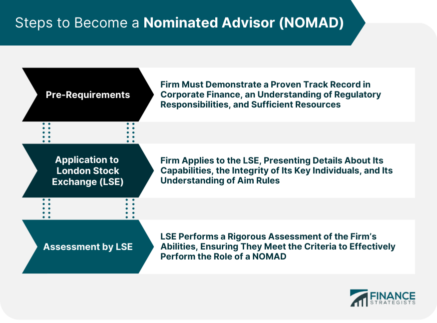

## Table of Contents

## What is a Nominated Advisor (Nomad)?

A Nominated Advisor, often called a Nomad, is a special type of advisor for companies listed on the Alternative Investment Market (AIM) in the UK. The AIM is a sub-market of the London Stock Exchange designed for smaller, growing companies. A Nomad helps these companies follow the rules of the AIM and make sure they do everything correctly. They act like a guide, helping the company from the time it wants to join the AIM until it is listed and even after that.

Nomads have important jobs. They check if a company is good enough to be on the AIM and help it get ready for the listing process. After the company is listed, the Nomad keeps watching to make sure the company follows all the rules. If the company does something wrong, the Nomad helps fix it. This way, investors can trust that the companies on the AIM are being looked after properly.

## What are the primary roles of a Nomad?

A Nomad's main job is to help a company get ready to join the AIM market. They check if the company meets all the rules and requirements to be listed. This includes looking at the company's finances, business plans, and making sure everything is in order. The Nomad also helps the company with the paperwork and other steps needed to get listed on the AIM.

Once the company is on the AIM, the Nomad keeps watching over it. They make sure the company keeps following the rules and stays in good shape. If the company does something wrong or faces problems, the Nomad steps in to help fix it. This ongoing support helps keep investors confident that the company is being well-managed and is a good place to invest their money.

## How does a Nomad assist a company in going public?

When a company wants to go public on the AIM market, a Nomad helps them every step of the way. The Nomad checks if the company is ready to be listed by looking at its finances and business plans. They make sure the company meets all the rules set by the AIM. The Nomad also helps with all the paperwork and other things the company needs to do to get listed. This can be a lot of work, but the Nomad makes it easier for the company.

After the company is listed on the AIM, the Nomad's job doesn't stop. They keep watching the company to make sure it follows all the rules. If the company does something wrong or has problems, the Nomad helps fix it. This ongoing help makes investors feel safe because they know someone is looking after the company. The Nomad's role is important in making sure the company stays in good shape and keeps the trust of its investors.

## What industries typically require the services of a Nomad?

Companies from many different industries can use a Nomad's help when they want to go public on the AIM market. This includes small and growing businesses in technology, healthcare, and energy. These companies often need a Nomad because they are new or growing fast and need help following the rules to get listed.

Even after they are listed, these companies keep working with a Nomad. The Nomad makes sure they keep following the rules and helps if they have problems. This is important for companies in industries that change a lot, like technology and healthcare, because they need to stay in good shape to keep investors happy.

## What are the basic qualifications needed to become a Nomad?

To become a Nomad, a person or firm needs to be approved by the London Stock Exchange. They must have a lot of experience in helping companies go public and know the rules of the AIM market very well. They also need to show that they can do a good job of watching over companies after they are listed. This means they need to be good at checking finances, business plans, and making sure everything follows the rules.

Nomads also need to have a strong team of people who know about different parts of business, like law, finance, and how markets work. They need to be able to help companies fix problems quickly and keep them on the right track. Being a Nomad is a big responsibility, so the London Stock Exchange makes sure that only people and firms with the right skills and experience can do it.

## How does one apply to become a Nominated Advisor?

To apply to become a Nominated Advisor, you need to start by contacting the London Stock Exchange. They will give you an application form and tell you what documents you need to send with it. You will need to show that you have a lot of experience helping companies go public and that you know the AIM market rules very well. You also need to prove that you can watch over companies after they are listed and make sure they follow the rules.

Once you have everything ready, you send your application to the London Stock Exchange. They will check it carefully to make sure you meet all the requirements. If everything is okay, they will approve you as a Nomad. This process can take some time because the London Stock Exchange wants to make sure that only people and firms with the right skills and experience become Nomads.

## What ongoing responsibilities does a Nomad have towards a listed company?

Once a company is listed on the AIM market, a Nomad has to keep an eye on it to make sure it follows all the rules. The Nomad checks the company's reports and announcements to see if everything is correct and on time. If the company does something wrong or has a problem, the Nomad helps fix it. This means the Nomad has to be ready to give advice and help whenever the company needs it.

The Nomad also has to make sure the company keeps investors happy and informed. This includes helping the company talk to investors and making sure the company tells them about any big changes or news. By doing this, the Nomad helps keep the company in good shape and keeps the trust of investors. This ongoing work is important because it helps the company stay on the AIM market and grow.

## Can you explain the regulatory framework that governs Nomads?

The regulatory framework that governs Nomads is set by the London Stock Exchange. The main rules are in the AIM Rules for Nominated Advisers. These rules say what Nomads need to do to help companies get listed on the AIM and keep watching over them after they are listed. The London Stock Exchange checks Nomads to make sure they follow these rules and do a good job.

Nomads have to follow strict rules about how they work with companies. They need to check the company's finances and business plans carefully before the company can be listed. After the company is listed, Nomads must keep an eye on it to make sure it follows all the rules. If a Nomad does not follow these rules, the London Stock Exchange can take away their right to be a Nomad. This helps make sure that Nomads do their job well and that companies on the AIM market are looked after properly.

## What are the potential challenges faced by Nomads in their role?

Being a Nomad can be hard because they have to make sure companies follow a lot of rules. They need to check everything carefully before a company can be listed on the AIM market. This means looking at the company's money and plans to see if they are good enough. If something is wrong, the Nomad has to help fix it. This can be a lot of work and can take a long time.

After a company is listed, the Nomad's job keeps going. They have to keep watching the company to make sure it still follows the rules. If the company does something wrong, the Nomad has to step in and help fix it. This can be stressful because the Nomad has to be ready to help at any time. They also have to make sure the company keeps investors happy, which can be hard if the company is having problems.

## How do Nomads ensure compliance with market regulations?

Nomads make sure companies follow the rules by checking everything carefully before they can be listed on the AIM market. They look at the company's money and plans to see if they are good enough. If something is not right, the Nomad helps fix it. This means they have to know the rules very well and make sure the company does everything correctly. It's a big job, but it helps keep the AIM market fair and safe for everyone.

After a company is listed, the Nomad keeps watching to make sure it still follows the rules. They check the company's reports and announcements to see if everything is correct and on time. If the company does something wrong, the Nomad steps in to help fix it. This ongoing work is important because it helps keep investors happy and trusting the company. By doing this, Nomads help make sure the AIM market stays a good place for companies to grow and for people to invest their money.

## What advanced skills or certifications can enhance a Nomad's effectiveness?

Having advanced skills like knowing a lot about finance can make a Nomad better at their job. If a Nomad understands how money works and can read financial reports well, they can help companies get ready to be listed on the AIM market. They can also spot problems faster and help fix them. Learning more about how markets work and how to talk to investors can also help. This way, the Nomad can make sure the company keeps investors happy and informed.

Getting certifications like being a Chartered Financial Analyst (CFA) can also help a Nomad. This certification shows that the Nomad knows a lot about finance and investing. It can make investors and the London Stock Exchange trust the Nomad more. Knowing about the law and how to handle legal issues can also be useful. This helps the Nomad make sure the company follows all the rules and stays out of trouble. By having these skills and certifications, a Nomad can do a better job of helping companies grow and succeed on the AIM market.

## How do Nomads adapt their strategies in response to changes in financial markets?

Nomads have to keep an eye on the financial markets all the time because things can change quickly. If the market goes up or down, Nomads need to change their plans to help the companies they work with. For example, if the market is doing well, Nomads might help companies talk more to investors to get more money. But if the market is not doing well, Nomads might tell companies to be careful and save money instead.

Nomads also need to know about new rules that come out. If the rules change, Nomads have to make sure the companies they work with follow the new rules. This can mean changing how they check the company's money or how they help the company talk to investors. By staying on top of these changes, Nomads can keep the companies they work with safe and help them grow, no matter what is happening in the financial markets.

## References & Further Reading

[1]: Frino, A., Mollica, V., & Webb, R. I. (2015). ["The Impact of Algorithmic Trading on Retail Investors."](https://papers.ssrn.com/sol3/papers.cfm?abstract_id=2725419) International Review of Finance, 15(1), 41-63.

[2]: Green, S. (2007). ["Legal Aspects of the Alternative Investment Market."](https://www.sciencedirect.com/science/article/pii/S1876610216316113) Cambridge University Press.

[3]: De Meijer, C. R. W., & Maes, J. P. (2014). ["The Regulation of Algorithmic Trading in the European Market."](https://www.researchgate.net/publication/323143811_Mapping_and_Assessment_of_Ecosystems_and_their_Services_An_analytical_framework_for_ecosystem_condition) Journal of Securities Operations & Custody, 6, 5-21.

[4]: ["The NOMAD's Role in Listing Companies on the AIM."](https://www.aimlisting.co.uk/nomads/) Official Guidelines by the London Stock Exchange.

[5]: Johnson, B. (2010). ["Algorithmic Trading & DMA: An Introduction to Direct Access Trading Strategies."](https://archive.org/details/algorithmictradi0000john) 4Myeloma Press.