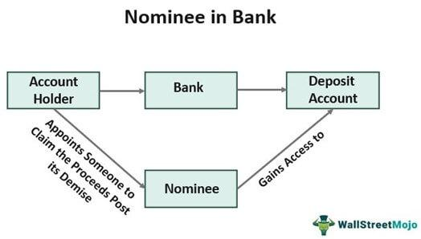

## Table of Contents

## What is a nominee?

A nominee is a person who is chosen or proposed for a position, award, or honor. For example, when a company needs a new manager, they might choose a nominee from their employees. This person is then considered for the job. People can also be nominees for awards like the Oscars, where actors or directors are nominated for their work in movies.

In some cases, a nominee can also be someone who is appointed to act on behalf of someone else. For example, in a bank account, a nominee might be someone who can manage the account if the main account holder cannot. This is common in situations where the main account holder is unable to manage their finances due to illness or other reasons. The nominee helps make sure everything is taken care of properly.

## What is a nominee account?

A nominee account is a type of account where someone else, called a nominee, manages the account on behalf of the main account holder. This is often used when the main account holder cannot manage their own finances, maybe because they are sick or too busy. The nominee helps make sure the money is taken care of properly.

For example, if someone is in the hospital and can't handle their bank account, they might appoint a family member as a nominee. This family member can then pay bills or make other necessary transactions. It's a way to make sure everything keeps running smoothly even when the main account holder can't do it themselves.

## How does a nominee account work?

A nominee account is a special type of account where someone else, called a nominee, helps manage the money for the main account holder. This is helpful when the main account holder can't look after their own money. Maybe they are sick, or maybe they are just too busy. The nominee steps in to help. They can do things like pay bills, move money around, or take care of other important tasks.

The main account holder picks the nominee. It could be a family member, a friend, or even a professional like a lawyer. The nominee has to follow the rules set by the main account holder. They can't just do whatever they want with the money. The main goal is to make sure the money is safe and used the right way. This helps keep everything running smoothly, even when the main account holder can't do it themselves.

## What are the benefits of using a nominee account?

Using a nominee account can be really helpful. It lets someone else take care of your money when you can't do it yourself. This can be because you're sick, busy, or away. The nominee can pay your bills, move money around, and make sure everything is okay. It's like having a helper who makes sure your money is safe and used the right way.

Another good thing about a nominee account is that it gives you peace of mind. Knowing that someone you trust is looking after your money can make you feel less worried. It's also good because the nominee has to follow your rules. They can't just do whatever they want with your money. This way, you know your money is in good hands and being taken care of properly.

## Are there any risks associated with nominee accounts?

There can be some risks when using a nominee account. One big risk is that the nominee might not do what you want with your money. They might spend it on things you don't agree with or even take it for themselves. This can be a big problem if you don't trust the person you picked as your nominee.

Another risk is that mistakes can happen. The nominee might make a mistake when paying bills or moving money around. This can cause problems with your money and make things harder for you. It's important to pick someone you really trust and to keep an eye on what they are doing with your money to avoid these risks.

## In which industries are nominee accounts commonly used?

Nominee accounts are often used in the finance and banking industry. People might set up a nominee account when they can't manage their own money because they are sick or too busy. The nominee helps pay bills and take care of other money tasks. Banks and financial companies use these accounts to help their customers when they need it.

Nominee accounts are also common in the real estate industry. When someone buys a property, they might use a nominee to hold the title until everything is finalized. This can help keep things private and make the buying process smoother. Real estate [agents](/wiki/agents) and lawyers often work with nominee accounts to make sure everything goes well with property deals.

## How do you set up a nominee account?

To set up a nominee account, you need to pick someone you trust to be your nominee. This can be a family member, a friend, or even a professional like a lawyer. You will need to go to your bank or financial institution and tell them you want to set up a nominee account. They will give you forms to fill out. On these forms, you will write down who your nominee is and what they are allowed to do with your money. Make sure to be clear about the rules so the nominee knows what they can and can't do.

Once you have filled out the forms, the bank will set up the account. They will give you and your nominee the information you need to start using the account. It's a good idea to keep an eye on what your nominee is doing with your money, even though you trust them. This helps make sure everything is going the way you want it to. If you ever need to change your nominee or stop using the account, you can go back to the bank and ask them to make the changes.

## What are the legal implications of using a nominee account?

Using a nominee account comes with some legal things to think about. The main thing is that the nominee has to follow the rules you set. They can't just do whatever they want with your money. If they do something wrong, like spend your money on things you didn't agree to, they could get in trouble. It's important to pick someone you trust and to be clear about what they can and can't do.

Another thing to know is that the law might be different in different places. Some places have special rules about nominee accounts. You need to check the laws where you live to make sure you are doing everything right. If you don't follow the rules, you or your nominee could face legal problems. Talking to a lawyer can help you understand the laws and make sure you are doing everything the right way.

## How do nominee accounts affect ownership and control?

When you use a nominee account, the nominee helps manage your money, but they don't own it. You are still the owner of the money in the account. The nominee just does things like pay bills or move money around for you. They have to follow the rules you set, so they can't do whatever they want with your money. This means you keep control over your money even though someone else is helping you with it.

In some cases, like in real estate, a nominee might hold the title to a property for you. This doesn't mean they own the property; they are just holding it for you until everything is finalized. You still have control over what happens with the property. Using a nominee can help keep things private and make the process smoother, but you are still the one in charge.

## What are the tax implications of using a nominee account?

When you use a nominee account, the tax situation can be a bit tricky. The money in the account still belongs to you, so you are the one who has to pay taxes on it. The nominee is just helping you manage it, so they don't have to pay taxes on the money. But, you need to make sure you report all the money in the account correctly on your tax return. If you don't, you could get in trouble with the tax people.

In some cases, like with real estate, using a nominee can affect how taxes are handled. If a nominee holds the title to a property for you, you still have to pay property taxes on it. The nominee doesn't have to pay those taxes because they don't own the property. It's important to keep good records and talk to a tax professional to make sure you are doing everything right with your taxes when using a nominee account.

## How do regulations vary by country regarding nominee accounts?

Regulations about nominee accounts can be different in each country. In some places, there are strict rules about who can be a nominee and what they can do with the money. For example, some countries might need you to get special permission from a government office before you can set up a nominee account. Other countries might have rules about how much money a nominee can move around or what kind of reports they need to fill out.

In other countries, the rules might be more relaxed. They might let you set up a nominee account without a lot of paperwork, but you still need to follow some basic rules. It's important to know the laws in your country because if you don't follow them, you or your nominee could get in trouble. Talking to a lawyer or someone who knows about the rules in your country can help you understand what you need to do.

## What are some advanced strategies for using nominee accounts in financial planning?

Using nominee accounts in financial planning can be a smart move for managing your money better. One advanced strategy is to use a nominee account to help with estate planning. If you are worried about what will happen to your money after you pass away, you can set up a nominee account with someone you trust. This person can make sure your money goes to the right people or is used the way you want it to be. It's like having a helper who makes sure your wishes are followed even after you're gone.

Another strategy is to use nominee accounts for privacy and asset protection. If you own a lot of property or have a lot of money, you might want to keep that private. By using a nominee to hold the title to your property or manage your money, you can keep your name off public records. This can help protect your assets from people who might want to take them away from you. It's a way to keep your money safe and your business private.

## References & Further Reading

[1]: Bergstra, J., Bardenet, R., Bengio, Y., & Kégl, B. (2011). ["Algorithms for Hyper-Parameter Optimization."](https://dl.acm.org/doi/10.5555/2986459.2986743) Advances in Neural Information Processing Systems 24.

[2]: ["Advances in Financial Machine Learning"](https://www.amazon.com/Advances-Financial-Machine-Learning-Marcos/dp/1119482089) by Marcos Lopez de Prado

[3]: ["Evidence-Based Technical Analysis: Applying the Scientific Method and Statistical Inference to Trading Signals"](https://www.amazon.com/Evidence-Based-Technical-Analysis-Scientific-Statistical/dp/0470008741) by David Aronson

[4]: ["Machine Learning for Algorithmic Trading"](https://github.com/stefan-jansen/machine-learning-for-trading) by Stefan Jansen

[5]: ["Quantitative Trading: How to Build Your Own Algorithmic Trading Business"](https://www.amazon.com/Quantitative-Trading-Build-Algorithmic-Business/dp/1119800064) by Ernest P. Chan