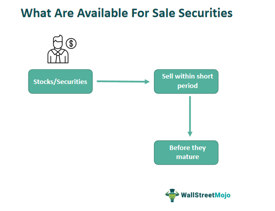

Nomura Group, a prominent entity in financial services, holds the distinction of being the largest securities firm in Japan and is recognized globally as a leading investment banking institution. The firm's strategic embrace of technology has positioned it at the forefront of algorithmic trading, significantly impacting the landscape of Japanese financial services. With a profound history marked by innovation and adaptability, Nomura has advanced its algorithmic trading prowess, offering enhanced efficiencies and opportunities for its diverse clientele.

The influence of Nomura's sophisticated trading strategies is particularly evident in the Asia-Pacific region, where the firm has integrated advanced algorithms to optimize trading execution and enhance market liquidity. These strategies not only streamline operations but also contribute to minimizing transaction costs and reducing market impact, thereby opening new avenues for growth and competitiveness. Algorithmic trading has redefined the paradigms of investment banking, propelling forward a trend towards automation and precision in financial markets.

As the landscape of investment banking continues to evolve globally, algorithmic trading remains a catalyst for transformation, offering unparalleled advantages in terms of speed, accuracy, and adaptability. Nomura's commitment to leveraging these technologies underscores its pivotal role in shaping the future of financial services both in Japan and on the international stage. This article examines these developments, highlighting Nomura's contributions to algorithmic trading and the broader implications for financial markets worldwide.

## Table of Contents

## History and Evolution of Nomura Group

Founded in 1925, Nomura Group has steadily grown from its humble origins in Osaka to become a formidable entity within the global financial landscape. The company's transformation from a domestic securities firm to a worldwide financial services provider reflects its strategic foresight and adaptability.

One of the most pivotal moments in Nomura's history was its strategic acquisition of Lehman Brothers' businesses in the Asia-Pacific and European regions in 2008. This move significantly bolstered Nomura's capabilities, particularly in the equities and investment banking sectors. By acquiring Lehman Brothers’ operations in these regions, Nomura not only augmented its technical expertise with experienced bankers but also enhanced its global market reach and broadened its client base. This acquisition underscored Nomura's ambition to expand beyond its traditional markets and solidify its position as a global financial powerhouse.

Throughout the decades, Nomura has consistently evolved in line with the dynamic nature of financial markets. The firm has embraced technological innovations and adeptly navigated regulatory shifts, ensuring its competitive edge remains sharp. Such adaptability is crucial in a sector characterized by rapid technological advancements and stringent regulatory environments.

Today, Nomura operates through four main divisions: Retail, Wholesale, Asset Management, and Global Research. Each of these divisions contributes uniquely to the robustness of Nomura’s global operations. The Retail division serves individual investors, providing them with access to a wide array of investment products. The Wholesale division offers services such as global markets and investment banking, while the Asset Management division manages assets for a diverse range of clients, including institutional investors. Finally, the Global Research division provides in-depth analysis and insights into global financial markets, supporting the firm's business units and clients with data-driven decisions.

Nomura's trajectory from a local entity to a global leader exemplifies its strategic acumen and resilience. By continuously adapting to market changes and innovating its service offerings, Nomura Group has solidified its standing as a pivotal player in the global financial services sector.

## Investment Banking Services

Nomura's investment banking services offer comprehensive solutions to a varied clientele, including corporations, financial institutions, sovereign entities, and investment funds. The firm's wholesale division plays a pivotal role in structuring, sales, and trading of global securities, thus fortifying its standing in the investment banking industry. Within its broad suite of services, Nomura facilitates [capital raising](/wiki/hedge-fund-capital-raising) activities and provides expert advisory on mergers and acquisitions (M&A), alongside designing financial solutions for complex transactions across diverse markets.

The integration of [algorithmic trading](/wiki/algorithmic-trading) into its investment banking services has substantially added value to Nomura's offerings. By embedding advanced algorithms, Nomura has optimized trading processes, improved operational efficiencies, and facilitated superior trade execution. This integration assists clients in navigating market complexities with enhanced precision and speed, underlining Nomura's relentless dedication to technology and innovation.

Nomura's advanced trading platforms exemplify this commitment, enabling clients to conduct intricate trades with high precision. These platforms are engineered to manage large volumes of transactions with minimal latency, fostering a reliable and efficient trading environment. By continuously investing in innovative trading solutions, Nomura not only meets but anticipates the evolving needs of its clients, thereby enhancing its service delivery and maintaining its competitive edge in the financial services industry.

## Algorithmic Trading: Advancements and Offerings

Nomura Group has significantly advanced algorithmic trading services, particularly within the Asia-Pacific financial markets, by developing its proprietary platform, ModelExTM. This platform provides an extensive suite of automated trading strategies designed to adapt to various market dynamics, including high-frequency trading ([HFT](/wiki/high-frequency-trading-strategies)) and dark pool trading environments. High-frequency trading, characterized by executing a large number of orders at extremely high speeds, is effective for capitalizing on small price discrepancies in the market. Dark pool trading, on the other hand, enables the execution of large orders without revealing intentions to the broader market, thereby minimizing market impact.

A hallmark of Nomura's technological prowess is its TactEx strategy, offering ultra-low latency access to the Tokyo Stock Exchange. This approach significantly reduces the time delay between order initiation and execution, ensuring faster trades which are crucial for exploiting short-lived market opportunities. Latency in trading is often measured in milliseconds or microseconds, with lower values providing a competitive edge in the rapid-paced environments of financial markets.

Nomura's dedication to innovative algorithmic solutions is further exemplified by its tactical strategies such as Hide and Pounce and SmartDark. These strategies are meticulously crafted to optimize execution and performance under different trading conditions. Hide and Pounce involves concealing an order until opportune moments arise to execute large trades, minimizing the market's reaction. Conversely, SmartDark leverages dark pool [liquidity](/wiki/liquidity-risk-premium) to execute trades with enhanced confidentiality and minimal friction.

Beyond deploying algorithmic strategies, Nomura integrates these algorithms with sophisticated analytics. This is critical for enhancing transparency and enabling comprehensive performance monitoring. By combining data analytics, clients are afforded in-depth execution insights, crucial for strategic decision-making. This integration ensures that Nomura's clients not only benefit from the advanced algorithms but also gain a clear understanding of execution patterns and trade outcomes, contributing to enhanced trading performance overall. 

Such advancements underscore Nomura's commitment to leveraging state-of-the-art technology in its algorithmic trading offerings, ensuring its clients are equipped with the tools necessary to navigate and succeed in fast-evolving financial environments.

## Impact of Algorithmic Trading on Financial Markets

Algorithmic trading, a pivotal innovation in modern finance, has significantly reshaped global financial markets by enhancing efficiency and liquidity. Nomura Group's strategic incorporation of algorithmic trading technologies exemplifies this transformation, driving [volume](/wiki/volume-trading-strategy) growth and improving execution quality for its clientele.

Increased liquidity is one of the foremost impacts of algorithmic trading. By executing a large number of high-frequency trades, algorithms ensure a constant presence of buy and sell orders in the market, thus enhancing liquidity. This increased market participation helps narrow bid-ask spreads, facilitating more efficient price discovery. For institutional investors, like those served by Nomura, this translates to reduced transaction costs and improved market access, as algorithms execute trades at optimal prices with minimal slippage.

Algorithmic strategies have also proved instrumental in minimizing the market impact of large trades. Traditionally, executing large orders could significantly alter stock prices, adversely affecting execution costs. However, algorithms can break down large orders into smaller ones and execute them over various times and venues, thus masking the trade's overall volume and reducing its market impact. This discretion allows Nomura's clients to achieve better execution prices, preserving their investment value.

As competition in electronic trading platforms intensifies, the development and implementation of sophisticated algorithms provide a competitive edge, offering diverse strategies that cater to unique client needs. These strategies range from trend-following algorithms to market-making and statistical [arbitrage](/wiki/arbitrage), each designed to exploit specific market conditions. For instance, Nomura's deployment of its proprietary algorithms enables tailored execution strategies, aligning closely with client objectives, risk appetite, and market conditions.

Advanced algorithmic trading systems also bolster risk management by dynamically adjusting strategies in response to real-time market data. Algorithms leverage vast datasets and utilize [machine learning](/wiki/machine-learning) models to predict market trends and adjust trading parameters accordingly. This capability enhances risk mitigation by enabling quick responses to market [volatility](/wiki/volatility-trading-strategies), ensuring that trading positions remain aligned with the desired risk profile. For Nomura, this dynamic risk management not only protects client investments but also optimizes their returns by capitalizing on fleeting market opportunities.

Nomura's pioneering role in algorithmic trading epitomizes the broader trend towards automation and data-driven decision-making in investment banking. By integrating cutting-edge technological solutions with traditional financial services, Nomura stands at the forefront of industry innovation, constantly evolving to meet the demands of the modern financial landscape. This commitment to leveraging technology for superior market performance underscores the transformative impact of algorithmic trading on financial markets, leading to enhanced operational efficiencies, improved client satisfaction, and sustained competitive advantage.

## The Future of Algorithmic Trading at Nomura

Nomura continues to invest in technology and innovative solutions to maintain its leadership in the financial services industry. The firm recognizes the transformative potential of [artificial intelligence](/wiki/ai-artificial-intelligence) (AI) and machine learning (ML) in advancing algorithmic trading capabilities. Through these technologies, Nomura aims to develop more adaptive and predictive models which will enhance the precision and efficiency of trading strategies.

The application of algorithms is anticipated to expand beyond equities into foreign exchange ([FX](/wiki/fx-anomaly)) and other asset classes. This diversification will not only broaden Nomura's service offerings but also facilitate the integration of sophisticated trading strategies across various markets. By leveraging these advancements, Nomura intends to provide more comprehensive and tailored solutions to meet the dynamic needs of its clients.

Regulatory developments play a crucial role in shaping the future of algorithmic trading. Nomura is committed to adapting its strategies to ensure compliance with evolving regulatory standards while continuing to maximize client value. The firm's proactive approach ensures that its algorithmic trading solutions remain robust and aligned with global best practices.

As financial markets evolve, Nomura’s strategic focus on cutting-edge technology positions it well to navigate and thrive in an ever-changing landscape. Continuous investment in infrastructure and talent will further enhance its algorithmic trading ecosystem, allowing Nomura to capitalize on emerging opportunities and maintain its competitive edge in the financial services industry.

## Conclusion

Nomura Group is recognized as a leader in financial services innovation, significantly influencing the global investment banking arena through its sophisticated algorithmic trading capabilities. This leadership is underpinned by strategic acquisitions, demonstrated technological excellence, and an unwavering dedication to innovation. These elements allow Nomura to provide unmatched services to its clients across various financial sectors.

As the firm continues to spearhead the adoption of algorithmic trading, it plays a crucial role in improving market efficiency and enhancing client satisfaction. Nomura's presence and impact in the financial markets are set to expand, as it persistently advances its capabilities to meet the evolving needs of these markets.

Nomura's extensive knowledge of global markets, coupled with its technological adeptness, ensures that its clients benefit from optimal value and superior trading results. This combination of market intelligence and cutting-edge technology facilitates strategic client outcomes and solidifies Nomura's position as a trusted leader.

Looking to the future, Nomura's ongoing focus on innovation and excellence is expected to shape the trajectory of financial services. As it continues to push the boundaries of technological advancement, Nomura is well-equipped to foster progress and drive growth, ensuring sustained leadership and influence within the industry.

## References & Further Reading

[1]: Bergstra, J., Bardenet, R., Bengio, Y., & Kégl, B. (2011). ["Algorithms for Hyper-Parameter Optimization."](https://dl.acm.org/doi/10.5555/2986459.2986743) Advances in Neural Information Processing Systems 24.

[2]: ["Advances in Financial Machine Learning"](https://www.amazon.com/Advances-Financial-Machine-Learning-Marcos/dp/1119482089) by Marcos Lopez de Prado

[3]: ["Evidence-Based Technical Analysis: Applying the Scientific Method and Statistical Inference to Trading Signals"](https://www.amazon.com/Evidence-Based-Technical-Analysis-Scientific-Statistical/dp/0470008741) by David Aronson

[4]: ["Machine Learning for Algorithmic Trading"](https://github.com/stefan-jansen/machine-learning-for-trading) by Stefan Jansen

[5]: ["Quantitative Trading: How to Build Your Own Algorithmic Trading Business"](https://www.amazon.com/Quantitative-Trading-Build-Algorithmic-Business/dp/1119800064) by Ernest P. Chan