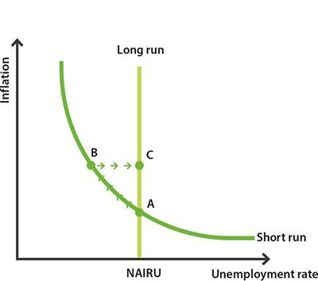

## Table of Contents

## What is the Non-Accelerating Inflation Rate of Unemployment (NAIRU)?

The Non-Accelerating Inflation Rate of Unemployment, or NAIRU, is a concept in economics that refers to the specific level of unemployment at which inflation is stable. When unemployment is at this level, it means that the economy is not causing inflation to go up or down. Think of it as a balance point where the job market is not too tight, which would push wages and prices up, nor too loose, which could lead to lower prices.

NAIRU is important for policymakers because it helps them understand how much unemployment the economy can handle without causing inflation to rise. If unemployment falls below the NAIRU, it might lead to higher inflation because there are more jobs than people looking for work, which can drive up wages and prices. On the other hand, if unemployment is above the NAIRU, inflation might stay low or even decrease. Estimating the exact NAIRU is tricky because it can change over time due to various factors like technology, global trade, and labor market policies.

## How is NAIRU different from the natural rate of unemployment?

NAIRU and the natural rate of unemployment are similar ideas, but they focus on different things. NAIRU is all about keeping inflation steady. It's the level of unemployment where inflation doesn't go up or down. If unemployment is lower than NAIRU, inflation might start to rise because there are too many jobs and not enough people, which can push up wages and prices.

The natural rate of unemployment, on the other hand, looks at the normal, expected level of unemployment in an economy over time. This includes people who are between jobs or looking for the right job. It's the unemployment rate that would exist even if the economy was working well, without any big ups or downs. While NAIRU focuses on inflation, the natural rate is more about what's normal for unemployment in the long run.

Both concepts are important for understanding how the economy works, but they serve different purposes. NAIRU helps policymakers manage inflation, while the natural rate helps them understand what to expect from the job market over time. Even though they can be close in value, they aren't always the same because they measure different aspects of the economy.

## Why is NAIRU important for economic policy?

NAIRU is important for economic policy because it helps leaders figure out how to keep inflation steady. If they know the level of unemployment that keeps inflation from going up or down, they can make better choices about jobs and money. For example, if unemployment is too low, it might make inflation go up because there are too many jobs and not enough people to fill them, which can push up wages and prices. By aiming for the NAIRU, policymakers can try to keep the economy balanced so inflation stays under control.

Also, understanding NAIRU helps policymakers avoid making the economy too hot or too cold. If unemployment drops below the NAIRU, they might need to cool things down a bit to prevent inflation from getting out of hand. On the other hand, if unemployment is above the NAIRU, they might try to boost the economy to create more jobs without worrying too much about inflation. This way, they can keep the economy running smoothly and help people have stable jobs and prices.

## How is NAIRU estimated?

Estimating NAIRU is tricky because it's not something you can see directly. Economists use a bunch of numbers and data to figure it out. They look at things like how many people are working, how much prices are going up, and how wages are changing. They also use math models to guess where NAIRU might be. These models try to find the point where unemployment and inflation are balanced, but because the economy is always changing, it's hard to get it exactly right.

Even though it's tough, economists keep trying to get better at estimating NAIRU. They look at past data to see how unemployment and inflation have moved together over time. They also think about things like new technology, changes in laws, and what's happening in the world economy. All these things can change where NAIRU is, so economists have to keep updating their guesses. It's a bit like trying to hit a moving target, but it's important for making good economic decisions.

## What factors can cause NAIRU to change over time?

NAIRU can change over time because of many things happening in the world. One big reason is changes in technology. When new machines or computers come out, they can make it easier for companies to do their work with fewer people. This can push up the NAIRU because there are fewer jobs for people. Also, when the world economy changes, like if other countries start making more stuff, it can affect jobs at home and change the NAIRU.

Another reason NAIRU changes is because of new laws and rules about work. If the government makes it easier for people to get jobs or changes how much people get paid, it can move the NAIRU. For example, if there are more rules to help people find work, the NAIRU might go down. But if rules make it harder for companies to hire, the NAIRU might go up. All these things together mean that NAIRU is always shifting a little bit, and economists have to keep watching to see where it's going.

## Can you explain the relationship between NAIRU and inflation?

NAIRU and inflation are closely linked. NAIRU is the level of unemployment where inflation stays steady. If unemployment goes below the NAIRU, there are more jobs than people looking for work. This can make companies offer higher wages to get workers, and when people have more money, they might spend more, pushing up prices. So, if unemployment is lower than the NAIRU, inflation might start to rise.

On the other hand, if unemployment is above the NAIRU, there are more people looking for jobs than there are jobs available. This means companies don't have to offer high wages, and people might not spend as much because they're worried about finding work. This can keep prices from going up, or even make them go down a bit. So, when unemployment is higher than the NAIRU, inflation tends to stay low or decrease.

## What are the criticisms of the NAIRU concept?

Some people don't like the idea of NAIRU because it's hard to figure out exactly what the number is. It's like trying to guess where a moving target will be. Economists use a lot of numbers and math to estimate it, but because the economy is always changing, their guesses can be off. This makes it tough for leaders to use NAIRU to make good choices about jobs and money. If they think NAIRU is one number but it's really another, they might make the economy too hot or too cold, which can cause problems.

Another criticism is that NAIRU might not be the best way to think about unemployment and inflation. Some say that the link between unemployment and inflation isn't as strong as NAIRU suggests. For example, even if unemployment goes down a lot, inflation might not go up if other things in the economy are keeping prices steady. Critics also worry that focusing too much on NAIRU might make leaders ignore other important things, like making sure everyone who wants a job can find one. So, while NAIRU can be a helpful tool, it's not perfect and should be used carefully.

## How do policymakers use NAIRU to guide monetary policy?

Policymakers use NAIRU to help them make decisions about money in the economy. They try to keep unemployment close to the NAIRU level because it helps keep prices from going up too fast. If unemployment is lower than the NAIRU, it might make inflation go up because there are too many jobs and not enough people. So, policymakers might raise interest rates to cool things down and slow down the economy a bit. This makes borrowing money more expensive, which can help keep inflation under control.

On the other hand, if unemployment is higher than the NAIRU, inflation might stay low or even go down. In this case, policymakers might lower interest rates to make borrowing cheaper. This can help the economy grow faster and create more jobs without worrying too much about inflation. By using NAIRU as a guide, policymakers try to find the right balance to keep the economy running smoothly, with stable prices and enough jobs for people.

## What are the implications of setting interest rates based on NAIRU?

When policymakers set interest rates based on NAIRU, they are trying to keep the economy balanced. If they think unemployment is too low and might cause inflation to go up, they raise interest rates. This makes borrowing money more expensive, which can slow down the economy a bit and help keep prices from rising too fast. But if they get it wrong and raise rates too much, it could make the economy slow down too much, causing people to lose jobs and businesses to struggle.

On the other hand, if unemployment is too high and inflation is low, policymakers might lower interest rates. This makes borrowing cheaper, which can help the economy grow and create more jobs. But if they lower rates too much, it could make the economy grow too fast, pushing up inflation. So, using NAIRU to set interest rates is a way to try to keep things stable, but it's tricky because NAIRU is hard to guess exactly, and getting it wrong can lead to big problems.

## How does NAIRU relate to the Phillips Curve?

NAIRU and the Phillips Curve are connected because they both talk about how unemployment and inflation work together. The Phillips Curve says that when unemployment goes down, inflation usually goes up. This happens because when more people have jobs, they have more money to spend, which can push prices up. NAIRU is like a special point on the Phillips Curve where inflation doesn't go up or down. It's the level of unemployment that keeps inflation steady.

Even though they're connected, NAIRU and the Phillips Curve aren't the same thing. The Phillips Curve shows a general relationship between unemployment and inflation, but it doesn't say what the exact level of unemployment should be to keep inflation steady. That's where NAIRU comes in. NAIRU gives policymakers a target to aim for, so they can try to keep the economy balanced and stop inflation from getting out of control.

## What are some historical examples where NAIRU estimates influenced economic policy?

In the 1990s, the United States used NAIRU to help guide its economic policy. At that time, many people thought NAIRU was around 6%. When unemployment got close to this number, the Federal Reserve, which controls interest rates, started to worry that inflation might go up. So, they raised interest rates to slow down the economy a bit. But, it turned out that NAIRU might have been lower than they thought because inflation didn't go up as much as expected. This showed that using NAIRU to set policy can be tricky because it's hard to guess the right number.

In the early 2000s, the European Central Bank (ECB) also used NAIRU to help make decisions about interest rates. They were trying to keep inflation under control in the Eurozone. When unemployment got close to what they thought was the NAIRU, the ECB sometimes raised interest rates to stop inflation from going up. But, like in the U.S., it was hard to get the NAIRU number right. Sometimes, they raised rates too much, which made it harder for people to find jobs. This showed that while NAIRU can be a helpful tool, it's important to keep checking and updating the estimates to make good policy choices.

## How do different economic schools of thought interpret NAIRU?

Different economic schools of thought have their own ways of thinking about NAIRU. The mainstream or neoclassical economists believe that NAIRU is a useful tool for keeping inflation under control. They think that if unemployment gets too low, it can make prices go up because there are too many jobs and not enough people. So, they use NAIRU to help decide when to raise or lower interest rates to keep the economy balanced. But they also know that figuring out the exact NAIRU number is hard, so they have to keep updating their guesses.

Keynesian economists, on the other hand, are more worried about making sure everyone who wants a job can find one. They think that focusing too much on NAIRU can make leaders ignore other important things, like helping people who are out of work. They believe that the link between unemployment and inflation isn't as strong as NAIRU suggests. So, they might not use NAIRU as much when making policy choices. Instead, they might focus on other ways to help the economy grow and create jobs.

Some other schools of thought, like the Austrian economists, are even more skeptical about NAIRU. They think that trying to control the economy with things like interest rates can cause more problems than it solves. They believe that the market should be left alone to find its own balance. So, they don't see NAIRU as a helpful tool at all. Instead, they focus on other ideas about how the economy works and how it should be managed.

## References & Further Reading

[1]: Friedman, M. (1968). ["The Role of Monetary Policy."](https://www.aeaweb.org/aer/top20/58.1.1-17.pdf) The American Economic Review, 58(1), 1-17.

[2]: Gordon, R. J. (1997). ["The Time-Varying NAIRU and its Implications for Economic Policy."](https://pubs.aeaweb.org/doi/pdf/10.1257/jep.11.1.11) Journal of Economic Perspectives, 11(1), 11-32.

[3]: Solow, R. M. (1998). ["What is a 'Good' Job Anyway?"](https://en.wikipedia.org/wiki/Robert_Solow) American Journal of Economics and Sociology, 57(4), 516-526.

[4]: Stiglitz, J. E. (1997). ["Reflections on the Natural Rate Hypothesis."](https://www.jstor.org/stable/2138248) Journal of Economic Perspectives, 11(1), 3-10.

[5]: Staiger, D., Stock, J. H., & Watson, M. W. (1997). ["The NAIRU, Unemployment and Monetary Policy."](https://www.princeton.edu/~mwatson/papers/Staiger_Stock_Watson_JEP_1997.pdf) Journal of Economic Perspectives, 11(1), 33-49.

[6]: Phelps, E. S. (1967). ["Phillips Curves, Expectations of Inflation and Optimal Unemployment over Time."](https://www.jstor.org/stable/2552025) Economica, 34(135), 254-281.

[7]: Lopez de Prado, M. (2018). ["Advances in Financial Machine Learning."](https://www.amazon.com/Advances-Financial-Machine-Learning-Marcos/dp/1119482089) Wiley.

[8]: Friedman, M., & Schwartz, A. J. (1963). ["A Monetary History of the United States, 1867-1960."](https://www.jstor.org/stable/j.ctt7s1vp) Princeton University Press.

[9]: Aruoba, S. B., & Diebold, F. X. (2010). ["Real-Time Macroeconomic Monitoring: Real Activity, Inflation and Interaction."](https://www.sas.upenn.edu/~fdiebold/papers/paper100/AD2009.pdf) The American Economic Review, 100(2), 20-24.