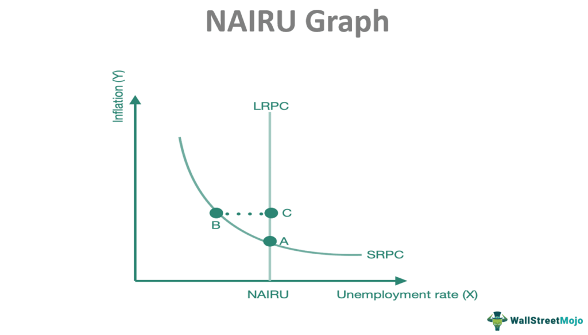

The Non-Accelerating Inflation Rate of Unemployment (NAIRU) is a pivotal concept in understanding the interplay between inflation and unemployment, which are fundamental aspects of economic stability and growth. NAIRU represents a theoretical level of unemployment at which inflation does not accelerate, effectively serving as a baseline for policymakers. It influences key decisions in economic and monetary policy, as governments and central banks use it to guide measures aimed at maintaining price stability and optimizing employment levels. 

Inflation and unemployment are intricately connected, with shifts in one often triggering responses in the other. The equilibrium described by NAIRU suggests that any deviation in unemployment could lead to accelerating inflation or deflation, depending on the direction of the change. Thus, maintaining an unemployment rate close to NAIRU helps in preventing runaway inflation, an essential consideration for central banks when setting interest rates and implementing monetary policies.



Understanding this relationship is not only crucial for traditional policymakers but also for participants in modern financial markets. In algorithmic trading, where automated systems execute trades based on pre-programmed instructions, understanding and integrating NAIRU-related data can significantly affect decision-making.

Algorithmic trading models might utilize NAIRU to evaluate the potential risk and reward of various financial instruments, adjusting strategies according to changing economic indicators. For instance, if unemployment rates diverge substantially from the estimated NAIRU, algorithms might anticipate corresponding shifts in inflation and adjust portfolios accordingly to optimize returns or minimize risk.

This article will comprehensively examine how NAIRU, along with inflation and unemployment, interacts to maintain economic balance. It will provide insights into how these interactions influence policy-making and financial markets within the context of the broader economic environment—aiming to enhance understanding of how to achieve a sustainable balance between economic stability and growth.

## Table of Contents

## Understanding NAIRU

The Non-Accelerating Inflation Rate of Unemployment, commonly referred to as NAIRU, is a critical economic concept that describes a specific level of unemployment below which inflation is expected to rise. Essentially, NAIRU represents an equilibrium point where inflation does not accelerate as long as unemployment remains at or above this threshold. This notion is pivotal for policymakers as it helps gauge the level of unemployment that can coexist with stable inflation, influencing decisions on monetary policy.

NAIRU is derived from the Phillips Curve, an economic theory developed in the late 1950s by economist A.W. Phillips. The Phillips Curve initially illustrated an inverse relationship between the rate of unemployment and the rate of wage inflation in an economy. According to this theory, lower unemployment leads to higher wage inflation as employers compete for a limited pool of labor, eventually translating into general price inflation. Conversely, higher unemployment should correlate with lower inflation rates.

The development of NAIRU as a concept can be traced back to the limitations of the original Phillips Curve observed during the 1970s when many economies experienced stagflation—a combination of high unemployment and high inflation. This phenomenon challenged the initial interpretation of the Phillips Curve. Economists began to revise the model, leading to the understanding that the relationship between inflation and unemployment was not stable over time.

NAIRU integrates this revised understanding by proposing that there is a level of unemployment consistent with a stable rate of inflation. If unemployment falls below the NAIRU, inflation is likely to increase. Conversely, if unemployment is above the NAIRU, inflationary pressures diminish. This consideration underscores the importance of NAIRU in economic modeling, as it bridges the gap between theoretical frameworks and empirical observations.

Although NAIRU is not directly observable, it can be estimated using various economic models and statistical techniques. These estimates are crucial as they inform central banks when setting interest rates and establishing monetary policy to maintain economic stability. Keeping unemployment close to the NAIRU threshold ensures that inflation remains stable, fostering conditions conducive to sustainable economic growth.

In conclusion, NAIRU is integral to understanding the interplay between inflation and unemployment. Born from the evolution of the Phillips Curve and historical economic challenges, NAIRU aids in aligning economic theory with real-world dynamics, guiding policymakers toward achieving equilibrium between economic stability and growth.

## The Dynamics of Inflation and Unemployment

The relationship between inflation and unemployment is a fundamental aspect of macroeconomic analysis, primarily explored through the Phillips Curve concept. This empirical relationship, originally formulated by A.W. Phillips, suggests an inverse correlation between the rate of unemployment and the rate of inflation: as unemployment decreases, inflation tends to increase, and vice versa. The Phillips Curve, over time, has been a cornerstone in understanding the trade-offs that policymakers may face when targeting low inflation and low unemployment.

Different economic theories offer varied interpretations of this relationship. Keynesian economics, for instance, posits that there exists a short-run trade-off between inflation and unemployment. In the Keynesian view, demand-side policies can effectively reduce unemployment, albeit at the cost of potentially higher inflation. The Phillips Curve, in this context, supports the idea that there are actionable strategies to control unemployment without excessively compromising inflation targets.

Conversely, Monetarist theories, led by economists such as Milton Friedman, argue that the Phillips Curve holds only in the short term. Monetarists introduced the concept of the natural rate of unemployment, suggesting that any attempt to reduce unemployment below this natural rate through monetary policy would lead to accelerating inflation, refuting the existence of a stable long-run trade-off. They argue that in the long run, inflation is determined by changes in the money supply rather than by changes in unemployment. The long-run vertical Phillips Curve reflects this perspective, underscoring that inflation expectations adjust, ultimately negating any trade-off between inflation and unemployment.

Historically, the dynamics of inflation and unemployment can be observed in several economic scenarios. During the 1970s, many economies experienced stagflation, a combination of high inflation and high unemployment, challenging the traditional Phillips Curve. This period illustrated the complexities and limitations of the curve, as both Keynesian and Monetarist perspectives struggled to fully account for the phenomenon.

In more recent contexts, the experiences of developed economies post-2008 financial crisis have further highlighted these dynamics. For instance, the Eurozone faced significant unemployment without a proportionate rise in inflation, suggesting shifts in the underlying structural dynamics of the labor market and questioning the robustness of the traditional Phillips Curve model.

Overall, while the Phillips Curve provides a foundational framework for analyzing the interplay of inflation and unemployment, evolving economic conditions and expectations necessitate a continuous reassessment of its application and significance in policymaking.

## Estimating NAIRU in Practice

Estimating the Non-Accelerating Inflation Rate of Unemployment (NAIRU) is a complex process, deeply rooted in economic theory and empirical analysis. Economists employ various methodologies to estimate NAIRU, as it represents a critical benchmark for evaluating the trade-off between inflation and unemployment. The primary methods include historical data analysis and economic modeling, both of which come with specific challenges and are influenced by evolving economic factors.

### Methodologies for Estimating NAIRU

1. **Historical Data Analysis**: This method involves examining past relationships between inflation and unemployment rates to estimate NAIRU. Economists use statistical tools like time-series analysis and regression models to identify the unemployment rate that historically corresponds with stable inflation. This approach assumes that past patterns provide insights into future dynamics, though this can be contentious due to changing economic conditions.

2. **Economic Modeling**: Models such as the Phillips Curve are central to estimating NAIRU. The basic Phillips Curve posits an inverse relationship between inflation and unemployment. By fitting this curve to historical data, economists attempt to identify the unemployment rate at which inflation remains constant. Advanced models may incorporate additional variables, such as expectations of future inflation and changes in productivity, to improve accuracy.

### Challenges in NAIRU Estimation

Estimating NAIRU is fraught with challenges due to several factors:

- **Labor Market Changes**: The labor market is continually evolving, influenced by demographics, globalization, and shifting industrial landscapes. Such changes can alter the natural level of unemployment, making NAIRU a moving target.

- **Technological Advancements**: Automation and digital technologies are reshaping industries and employment patterns, potentially reducing demand for certain types of labor and increasing structural unemployment. These shifts complicate the estimation of a stable unemployment rate consistent with non-accelerating inflation.

- **Measurement Errors**: Economic data used for estimation often contain errors or revisions, leading to uncertainties in NAIRU calculations. Misestimation can result in misguided policy decisions.

### Policy Implications of NAIRU Estimation

When NAIRU estimates diverge from actual economic conditions, the consequences can be significant:

- **Monetary Policy Misalignment**: Central banks might set inappropriate interest rates if NAIRU is inaccurately estimated. An overestimated NAIRU could lead to unnecessarily tight monetary policies, suppressing economic growth. Conversely, underestimation could result in loose policies, fueling inflation.

- **Employment and Inflation Targets**: Policymakers may adjust employment and inflation targets based on NAIRU estimates. Discrepancies between estimated and actual NAIRU can lead to targets that are either unattainable or counterproductive.

For example, during the late 1970s and early 1980s, many economies faced stagflation—a combination of high inflation and unemployment. This period challenged traditional NAIRU estimations, prompting debates about how best to adapt economic policies when inflation and unemployment do not behave as anticipated.

In conclusion, estimating NAIRU is an essential yet challenging task that carries significant implications for economic policy. As labor markets and technologies evolve, so too must the approaches to estimating NAIRU, ensuring that economic policies remain well-informed and effective.

## NAIRU's Impact on Monetary Policy

Central banks use the Non-Accelerating Inflation Rate of Unemployment (NAIRU) as a pivotal benchmark in determining monetary policies to control inflation without stunting economic growth. NAIRU represents an unemployment rate below which inflation is expected to rise. By estimating NAIRU, policymakers aim to strike a balance between stimulating employment and preventing inflationary pressures.

**Role of Fiscal Policy:**

Fiscal policy interacts with NAIRU by influencing aggregate demand, which subsequently impacts employment and inflation. Fiscal measures such as government spending and taxation can affect labor market conditions, thereby altering the NAIRU. For instance, expansionary fiscal policy may reduce unemployment temporarily below NAIRU, sparking inflationary pressures unless adequately offset by monetary policy.

**Case Studies of Central Bank Responses:**

Historically, deviations from NAIRU estimates have led central banks to adjust interest rates to either stimulate or cool down the economy. A pertinent example is the Federal Reserve's response in the late 1990s in the United States. At that time, due to rapid technological advancements and increased productivity, unemployment rates fell significantly below what was considered the NAIRU. The Federal Reserve adopted a cautious approach, gradually increasing interest rates to contain inflation without derailing economic growth. 

Similarly, the European Central Bank has faced challenges with variations from NAIRU during economic downturns, such as the aftermath of the 2008 financial crisis. Persistently high unemployment rates suggested a NAIRU above previous estimations. The ECB's policies focused on maintaining low interest rates and deploying unconventional monetary tools like quantitative easing to address high unemployment while stabilizing inflation.

These cases underscore the complexity of utilizing NAIRU in monetary policy deliberations. The dynamic nature of economic factors such as technology shifts, labor market fluidity, and external economic shocks make precise NAIRU estimation challenging, necessitating flexible and adaptive monetary strategies. 

Conclusively, while NAIRU provides a theoretical framework for inflation control, its practical application in monetary policy requires careful consideration of various economic indicators and external conditions. Central banks continuously refine their estimates to more accurately reflect real-world economic conditions, allowing for informed policy decisions in pursuit of macroeconomic stability.

## The Debate and Criticisms of NAIRU

The Non-Accelerating Inflation Rate of Unemployment (NAIRU) has long been a cornerstone in macroeconomic theory, serving as a fulcrum for understanding the interplay between inflation and unemployment. However, it has not been without debate and criticisms regarding its validity and predictive power in economic forecasting.

Critically, one of the primary challenges to NAIRU is its inherent assumption of a stable, long-term unemployment rate that does not accelerate inflation. Critics argue that NAIRU is an oversimplification, as it assumes a linear and predictable relationship between unemployment and inflation that may not hold in real-world economies. The model's predictive capability is questioned when economic conditions deviate from these simplified assumptions, especially in cases of supply shocks or structural changes in the economy.

Several economic schools have presented differing views on NAIRU. Keynesian economists often criticize its lack of consideration for demand-side factors that can lead to cyclical unemployment. They argue that focusing solely on NAIRU can lead to policy measures that ignore the potential for fiscal interventions to stimulate demand and reduce cyclical unemployment. Conversely, Monetarists defend NAIRU's significance but emphasize that it should be viewed as a guide rather than an exact figure, advocating for policies that control inflation without causing excessive economic disruptions.

Historical economic scenarios have further fueled debates on the applicability of NAIRU. For instance, during the stagflation period of the 1970s, characterized by high inflation and unemployment, traditional NAIRU-based models failed to accurately predict or address the economic malaise. This period highlighted the limitations of NAIRU when confronted with external supply shocks and simultaneous inflationary and unemployment pressures.

Another significant criticism centers on the estimation of NAIRU. The methodologies employed are often complex, involving intricate econometric models, yet they can yield varying estimates depending on the assumptions and data employed. This variability leads to concerns about the robustness of NAIRU estimates and their reliability in crafting monetary policy. Economists like Robert Solow and Joseph Stiglitz have pointed out that NAIRU's dependence on historical data can make it prone to overfitting past patterns without accommodating emerging economic trends or shifts.

Moreover, structural changes in the labor market and technological advancements pose challenges to the NAIRU framework. As the economy evolves, with factors such as globalization, automation, and changing demographics altering the labor market dynamics, NAIRU’s applicability is questioned. These shifts might warrant a re-evaluation of how unemployment interacts with inflation beyond the traditional NAIRU scope.

In conclusion, while NAIRU remains a pivotal economic concept, its critiques emphasize the need for a nuanced approach that considers its limitations. The debate continues to encourage the refinement of economic models and policies that are more adaptable to the ever-changing global economic landscape.

## NAIRU vs. Natural Rate of Unemployment

The Non-Accelerating Inflation Rate of Unemployment (NAIRU) and the Natural Rate of Unemployment are two critical concepts in macroeconomics that are often used interchangeably, yet they embody distinct meanings and implications. Understanding these differences is essential for developing accurate economic models and effective policy-making.

NAIRU represents the level of unemployment at which inflation does not accelerate. It is essentially the rate of unemployment consistent with a stable rate of inflation. When unemployment falls below this threshold, inflation tends to rise, reflecting increased pressure on wages and prices. Conversely, if unemployment is above NAIRU, inflation may fall. This concept is dynamic and can change with shifts in labor market conditions, policy environments, and economic structures.

On the other hand, the Natural Rate of Unemployment refers to the long-term rate of unemployment determined by the structural characteristics of the labor market. It includes frictional unemployment, occurring when workers transition between jobs, and structural unemployment, which results from mismatches between the skills of the labor force and the needs of the economy. Unlike NAIRU, the Natural Rate is thought to be unaffected by short-term cyclical fluctuations in the economy or monetary policy.

In economic models and policy applications, these concepts serve different purposes. NAIRU is mainly used in the context of inflation-targeting frameworks, guiding central banks in setting interest rates to maintain price stability. Central banks estimate NAIRU to identify the inflationary pressure in the economy and adjust their monetary policy tools accordingly. This assessment helps in maintaining inflation targets without causing unwarranted economic contractions or expansions.

The Natural Rate of Unemployment, meanwhile, is often utilized in models focused on medium- to long-term analysis, such as assessing potential output and economic growth. Policymakers might use the Natural Rate to frame labor market reforms or educational policies aimed at reducing structural unemployment.

Confusing NAIRU with the Natural Rate can lead to significant missteps in economic planning and forecasting. If policymakers mistake the Natural Rate for NAIRU, there may be an overemphasis on controlling inflation without addressing underlying structural issues in the labor market, potentially leading to a policy mix that exacerbates unemployment without achieving long-term price stability. Conversely, if NAIRU estimates are used inaccurately in planning, there could be an undue influence on monetary policy decisions, resulting in either inflationary pressure or unnecessary economic slowdown.

In summary, distinguishing between NAIRU and the Natural Rate of Unemployment is crucial for effective economic modeling and policy implementation. Properly applied, these concepts aid in balancing economic stability with growth, yet misinterpretation can significantly undermine these objectives. Understanding their differences and applications is pivotal in crafting sound economic strategies that adapt to both short-term conditions and long-term trends.

## NAIRU in Algorithmic Trading

The Non-Accelerating Inflation Rate of Unemployment (NAIRU) plays a critical role in financial markets, particularly in influencing [algorithmic trading](/wiki/algorithmic-trading) decisions and market analysis. Its impact is primarily seen through its effect on economic indicators, which are crucial data inputs for traders when developing algorithms.

Algorithmic trading systems often rely on a broad set of economic indicators, including the unemployment rate and inflation rate, to make informed decisions. NAIRU represents a threshold unemployment level below which inflation is likely to accelerate. Therefore, understanding how current unemployment rates compare to NAIRU can offer insights into future inflationary pressures, providing traders with predictive power.

When unemployment trends below NAIRU, expectations of rising inflation may prompt traders to adjust their portfolios in anticipation of potential [interest rate](/wiki/interest-rate-trading-strategies) hikes by central banks. The influence of NAIRU on trading algorithms is often embedded in predictive models that react to real-time economic data releases. For instance, an algorithm might be programmed to increase asset allocations in inflation-protected securities if unemployment falls significantly below NAIRU, indicating potential inflationary trends.

Moreover, [machine learning](/wiki/machine-learning) models in algorithmic trading often incorporate historical data to forecast future economic conditions. These models might analyze historical deviations of unemployment from the estimated NAIRU to predict changes in market [volatility](/wiki/volatility-trading-strategies) or to optimize asset allocation strategies. Python, a popular programming language for algorithmic trading, offers libraries such as NumPy and pandas that can be used to handle complex datasets and perform such historical analyses efficiently.

Here is a basic example code snippet in Python that outlines how a trader might use historical data to analyze the relationship between NAIRU, unemployment, and inflation trends:

```python
import pandas as pd
import numpy as np
import matplotlib.pyplot as plt
from sklearn.linear_model import LinearRegression

# Hypothetical data loading
data = pd.read_csv('economic_data.csv')  # File containing historical unemployment, inflation, and NAIRU estimates

# Calculating difference from NAIRU
data['unemployment_diff'] = data['unemployment_rate'] - data['NAIRU']

# Setting up regression model to predict inflation
X = data[['unemployment_diff']]
y = data['inflation_rate']

model = LinearRegression()
model.fit(X, y)

# Predict inflation trends
predicted_inflation = model.predict(X)

# Plotting results
plt.plot(data['date'], data['inflation_rate'], label='Actual Inflation Rate')
plt.plot(data['date'], predicted_inflation, label='Predicted Inflation Rate', linestyle='--')
plt.xlabel('Date')
plt.ylabel('Inflation Rate')
plt.title('Inflation Rate Prediction Based on NAIRU')
plt.legend()
plt.show()
```

This example demonstrates a simple regression model that predicts inflation based on deviations from NAIRU using Python. Such models can be expanded and integrated into algorithmic trading systems to automatically adjust trading strategies based on predicted economic conditions.

Additionally, traders may utilize sentiment analysis and other advanced techniques to enhance their models' responsiveness to economic shifts related to NAIRU estimations. The dynamic nature of algorithmic trading requires continuous adaptation to changing economic conditions, including variances in NAIRU, to optimize market performance and manage risk effectively.

## Conclusion and Future Outlook

In considering the Non-Accelerating Inflation Rate of Unemployment (NAIRU), several key points emerge regarding its significance in economic policy and trading. NAIRU serves as a crucial metric for central banks and policymakers by indicating a level of unemployment that does not exert upward or downward pressure on inflation. Understanding this relationship is central to maintaining economic stability and crafting monetary policies that balance growth and inflation control.

NAIRU's influence is also evident in financial markets, particularly in algorithmic trading, where it guides trading strategies based on anticipated economic conditions. Incorporating NAIRU into trading algorithms allows for a nuanced assessment of economic health, thus helping to predict market fluctuations more accurately, especially during periods of economic transition.

Looking forward, research into NAIRU is expected to expand, considering the effects of globalization, technological advancement, and structural labor market changes on the equilibrium unemployment rate. Emerging trends suggest a need for more dynamic frameworks to estimate NAIRU accurately, incorporating real-time data analytics and machine learning to navigate the increasingly complex economic landscape.

The diverse interpretations and criticisms of NAIRU highlight the importance of ongoing discourse among economists and policymakers. Challenges such as accurately estimating NAIRU amid evolving economic conditions underscore the necessity for continual reassessment of traditional models. Expanding this debate will enable a clearer understanding of NAIRU’s validity and versatility, fostering more effective economic decision-making.

As global economies become more interconnected and susceptible to rapid changes, NAIRU's role remains a pertinent topic for discussion. Future explorations could examine its relevance across various economic contexts, offering insights into adapting monetary policies to cater to both local and global economic pressures. Encouraging such dialogue will aid in refining economic models, ensuring they are robust and responsive enough to accommodate shifting global dynamics.

## References & Further Reading

[1]: Friedman, M. (1968). ["The Role of Monetary Policy."](https://www.aeaweb.org/aer/top20/58.1.1-17.pdf) The American Economic Review, 58(1), 1-17.

[2]: Gordon, R. J. (1997). ["The Time-Varying NAIRU and its Implications for Economic Policy."](https://pubs.aeaweb.org/doi/pdf/10.1257/jep.11.1.11) Journal of Economic Perspectives, 11(1), 11-32.

[3]: Solow, R. M. (1998). ["What is a 'Good' Job Anyway?"](https://en.wikipedia.org/wiki/Robert_Solow) American Journal of Economics and Sociology, 57(4), 516-526.

[4]: Stiglitz, J. E. (1997). ["Reflections on the Natural Rate Hypothesis."](https://www.jstor.org/stable/2138248) Journal of Economic Perspectives, 11(1), 3-10.

[5]: Staiger, D., Stock, J. H., & Watson, M. W. (1997). ["The NAIRU, Unemployment and Monetary Policy."](https://www.princeton.edu/~mwatson/papers/Staiger_Stock_Watson_JEP_1997.pdf) Journal of Economic Perspectives, 11(1), 33-49.

[6]: Phelps, E. S. (1967). ["Phillips Curves, Expectations of Inflation and Optimal Unemployment over Time."](https://www.jstor.org/stable/2552025) Economica, 34(135), 254-281.

[7]: Lopez de Prado, M. (2018). ["Advances in Financial Machine Learning."](https://www.amazon.com/Advances-Financial-Machine-Learning-Marcos/dp/1119482089) Wiley.

[8]: Friedman, M., & Schwartz, A. J. (1963). ["A Monetary History of the United States, 1867-1960."](https://www.jstor.org/stable/j.ctt7s1vp) Princeton University Press.

[9]: Aruoba, S. B., & Diebold, F. X. (2010). ["Real-Time Macroeconomic Monitoring: Real Activity, Inflation and Interaction."](https://www.sas.upenn.edu/~fdiebold/papers/paper100/AD2009.pdf) The American Economic Review, 100(2), 20-24.