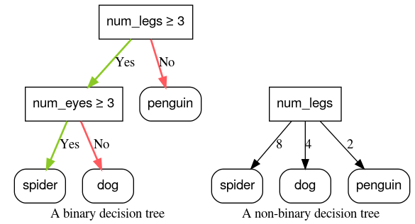

## Table of Contents

## What is a non-binary condition in machine learning?

In machine learning, a non-binary condition refers to a situation where the outcome or the variable we are trying to predict can have more than two possible values. This is different from binary conditions, where the outcome is limited to just two possibilities, like yes or no, true or false, or 0 and 1. Non-binary conditions are common in real-world problems, such as predicting the weather (which could be sunny, cloudy, rainy, etc.), classifying types of fruits (apple, banana, orange, etc.), or rating customer satisfaction on a scale from 1 to 5.

Dealing with non-binary conditions often requires different approaches and algorithms compared to binary conditions. For example, when classifying data into multiple categories, machine learning models like decision trees, random forests, or neural networks with softmax output layers are commonly used. These models can handle the complexity of multiple outcomes by adjusting their internal parameters to better fit the data. The goal is to minimize the error in predicting the correct category out of many possible categories, which can be more challenging but also more reflective of real-world scenarios.

## How does a non-binary condition differ from binary classification?

A non-binary condition in machine learning is when the thing we want to predict can have more than two possible answers. For example, if we're trying to guess what kind of animal is in a picture, the animal could be a cat, a dog, a bird, or something else. This is different from binary classification, where we only have two choices, like deciding if an email is spam or not spam. In binary classification, the computer learns to put things into one of two groups, but with non-binary conditions, it has to learn how to sort things into many different groups.

To handle non-binary conditions, we use different kinds of machine learning models. These models, like decision trees or neural networks, are good at figuring out which of many possible answers is the right one. They do this by looking at lots of examples and finding patterns that help them make better guesses. For example, a neural network might use a softmax function at the end to turn its guesses into probabilities for each possible answer, helping it decide which one is most likely to be correct.

## Can you provide examples of datasets where non-binary conditions are applicable?

One example of a dataset with non-binary conditions is the Iris dataset. This dataset contains measurements of different parts of iris flowers, like the length and width of their petals and sepals. The goal is to use these measurements to figure out which type of iris a flower is. There are three types of irises in the dataset: setosa, versicolor, and virginica. Since there are more than two types, this is a non-binary condition.

Another example is the MNIST dataset, which is used for recognizing handwritten digits. The dataset has images of handwritten numbers from 0 to 9. The job is to look at an image and guess which number it shows. Because there are ten different numbers, this is a non-binary condition too. Each image needs to be sorted into one of ten different categories, making it more complicated than just deciding between two choices.

## What are the common algorithms used for handling non-binary conditions?

Common algorithms for handling non-binary conditions include decision trees, random forests, and neural networks. Decision trees work by splitting the data into different branches based on certain rules. Each branch leads to a decision about which category the data belongs to. Random forests are like a bunch of decision trees working together. They make lots of little decisions and then combine them to make a final guess, which often works better than using just one decision tree. Neural networks, on the other hand, are like a complex web of connections that learn from examples. They can use a softmax function at the end to turn their guesses into probabilities for each category, helping them decide which one is most likely correct.

For example, in a neural network, the softmax function helps to turn the raw output into probabilities that add up to 1. If we have three categories, the softmax function might give us probabilities like 0.7 for category A, 0.2 for category B, and 0.1 for category C. This means the network thinks category A is the most likely choice. The formula for the softmax function for a category $$i$$ is $$ \text{softmax}(z_i) = \frac{e^{z_i}}{\sum_{j=1}^K e^{z_j}} $$, where $$z_i$$ is the raw output for category $$i$$ and $$K$$ is the total number of categories. This formula makes sure that all the probabilities add up to 1, which helps the network make a clear decision.

Here is a simple example of how you might use a softmax function in Python to convert raw outputs into probabilities:

```python
import numpy as np

# Raw outputs from the neural network
raw_outputs = np.array([2.0, 1.0, 0.1])

# Applying softmax function
exp_outputs = np.exp(raw_outputs)
probabilities = exp_outputs / np.sum(exp_outputs)

print(probabilities)
```

This code takes the raw outputs from a neural network and turns them into probabilities using the softmax function. The result will be something like `[0.7, 0.2, 0.1]`, showing the probability for each category.

## How do you preprocess data for models with non-binary conditions?

To get data ready for models with non-binary conditions, you often need to change it so the computer can understand it better. This might mean turning words into numbers, like changing "cat," "dog," and "bird" into 0, 1, and 2. It could also mean making sure all the numbers are on the same scale, so one type of data doesn't seem more important than another. For example, if you're looking at house prices and the number of bedrooms, you might want to change the prices so they're on a similar scale to the number of bedrooms. This helps the model learn from the data more easily.

Another important step is to split the data into training, validation, and test sets. The training set is used to teach the model, the validation set helps you check how well the model is learning and make adjustments, and the test set is used at the end to see how well the model works on new data it hasn't seen before. You might also need to handle missing data by filling in the gaps or removing those entries, and you might want to create new features from the existing data to help the model understand it better. For example, if you have the date a house was sold, you might create a new feature for the month or year to see if there are patterns in the data over time.

## What metrics are used to evaluate models with non-binary outputs?

To check how good a model is at guessing non-binary outcomes, we use different ways to measure its performance. One common way is accuracy, which tells us how often the model picks the right answer out of all the possible answers. Another way is the confusion matrix, which shows us how the model's guesses match up with the real answers. From the confusion matrix, we can figure out other useful numbers like precision, which tells us how many of the model's positive guesses were right, and recall, which tells us how many of the actual positive cases the model found. There's also the F1 score, which mixes precision and recall into one number, helping us see how well the model balances both.

For more detailed looks at how well a model is doing, we can use other measures like the log loss or cross-entropy loss. These numbers show how close the model's guesses are to the real answers. If the model's guesses are way off, the log loss will be high, but if they're close, it will be low. Another useful measure is the area under the receiver operating characteristic (ROC) curve, or AUC-ROC. This tells us how well the model can tell the different categories apart from each other. A higher AUC-ROC means the model is better at sorting things into the right groups. These measures help us understand how well our model is working and where it might need to improve.

## How can one handle class imbalance in non-binary classification problems?

In non-binary classification problems, class imbalance happens when some categories have a lot more examples than others. This can make it hard for the model to learn about the less common categories, because it sees them less often. To fix this, you can use a method called oversampling, where you make more copies of the examples from the less common categories. Another way is undersampling, where you take away some examples from the more common categories. You can also use a technique called SMOTE (Synthetic Minority Over-sampling Technique), which makes new, similar examples of the less common categories to balance things out.

Another approach to handling class imbalance is to change how the model learns by using different weights for different categories. This means you can tell the model to pay more attention to the less common categories by giving them higher weights. You can do this by setting the class weights in the model. For example, in Python, you might use the `class_weight` parameter in a model like this:

```python
from sklearn.utils.class_weight import compute_class_weight
from sklearn.ensemble import RandomForestClassifier

# Assuming 'y' is your target variable with multiple classes
class_weights = compute_class_weight('balanced', classes=np.unique(y), y=y)
class_weight_dict = dict(zip(np.unique(y), class_weights))

# Using class weights in a Random Forest model
model = RandomForestClassifier(class_weight=class_weight_dict)
```

This code helps the model focus more on the less common categories, making it better at guessing them correctly. By using these methods, you can make your model work better with non-binary data that has class imbalance.

## What are the challenges faced when implementing non-binary condition models?

One big challenge with non-binary condition models is that they have to sort things into more than two groups. This makes everything more complicated because the model has to learn how to tell apart lots of different categories. For example, if you're trying to guess what type of fruit is in a picture, you might have to choose between an apple, a banana, an orange, and more. The model needs a lot more data to learn all these differences, and it can be hard to make sure it's good at guessing all the different types. Another problem is that some categories might have a lot more examples than others, which is called class imbalance. This can make the model better at guessing the common categories but worse at the less common ones. To fix this, you might need to use special methods like oversampling or changing the weights of different categories in the model.

Another challenge is figuring out how to turn the model's guesses into useful information. In non-binary models, the model might give you probabilities for each category, like 0.7 for apple, 0.2 for banana, and 0.1 for orange. You need to use a function like softmax to turn the raw guesses into these probabilities. The formula for softmax for a category $$i$$ is $$ \text{softmax}(z_i) = \frac{e^{z_i}}{\sum_{j=1}^K e^{z_j}} $$, where $$z_i$$ is the raw output for category $$i$$ and $$K$$ is the total number of categories. This helps make sure all the probabilities add up to 1, which is important for making clear decisions. Also, you need to pick the right way to measure how well the model is doing, like accuracy, F1 score, or AUC-ROC. Each of these measures can tell you something different about how well the model is working, so you have to choose carefully based on what's most important for your problem.

## How does one interpret the results of a model with non-binary conditions?

When you use a model with non-binary conditions, it's trying to guess which of many different categories something belongs to. The model gives you a list of probabilities for each category, like 0.7 for category A, 0.2 for category B, and 0.1 for category C. These numbers show how likely the model thinks each category is the right one. The category with the highest probability is usually the model's final guess. For example, if the model is trying to guess what type of fruit is in a picture, and it gives you probabilities of 0.7 for apple, 0.2 for banana, and 0.1 for orange, it's saying it's most likely an apple. To turn the model's raw guesses into these probabilities, we use a function called softmax. The formula for softmax for a category $$i$$ is $$ \text{softmax}(z_i) = \frac{e^{z_i}}{\sum_{j=1}^K e^{z_j}} $$, where $$z_i$$ is the raw output for category $$i$$ and $$K$$ is the total number of categories. This helps make sure all the probabilities add up to 1, which is important for making clear decisions.

To understand how well the model is doing, you look at different measures like accuracy, which tells you how often the model picks the right category. Another useful measure is the confusion matrix, which shows you how the model's guesses match up with the real answers. From the confusion matrix, you can figure out other numbers like precision, which tells you how many of the model's positive guesses were right, and recall, which tells you how many of the actual positive cases the model found. There's also the F1 score, which mixes precision and recall into one number, helping you see how well the model balances both. If you want to see how close the model's guesses are to the real answers, you can use log loss or cross-entropy loss. A lower log loss means the model's guesses are closer to the real answers. Another measure is the area under the receiver operating characteristic (ROC) curve, or AUC-ROC, which tells you how well the model can tell the different categories apart from each other. A higher AUC-ROC means the model is better at sorting things into the right groups.

## What advanced techniques can enhance the performance of non-binary condition models?

To make non-binary condition models work better, you can use a technique called ensemble learning. This means using several models together to make a final guess. For example, you could use many decision trees in a random forest, or combine different types of models like decision trees, neural networks, and support vector machines. Each model might make different guesses, but when you put them all together, they can make better decisions than any single model could. This helps the model understand the data better and guess the right category more often. Another way to improve the model is by using techniques like SMOTE (Synthetic Minority Over-sampling Technique) to deal with class imbalance. This method creates new examples of the less common categories, making the data more balanced and helping the model learn about all categories equally well.

Another advanced technique is to use deep learning with neural networks. Neural networks can have many layers that learn to recognize different parts of the data, like edges in a picture or patterns in numbers. Using a softmax function at the end of the network helps turn the raw outputs into probabilities for each category. The formula for the softmax function for a category $$i$$ is $$ \text{softmax}(z_i) = \frac{e^{z_i}}{\sum_{j=1}^K e^{z_j}} $$, where $$z_i$$ is the raw output for category $$i$$ and $$K$$ is the total number of categories. This makes sure all the probabilities add up to 1, helping the model make clear decisions. You can also use techniques like dropout, which randomly turns off some connections in the network during training. This helps prevent the model from relying too much on any one part of the data and makes it more flexible. By using these advanced techniques, you can make your non-binary condition models more accurate and reliable.

## How do multi-class and multi-label classifications relate to non-binary conditions?

Multi-class and multi-label classifications are both types of non-binary conditions. In multi-class classification, the goal is to put something into one of many different categories. For example, if you're trying to guess what type of fruit is in a picture, you might have to choose between an apple, a banana, or an orange. The model gives you a list of probabilities for each category, like 0.7 for apple, 0.2 for banana, and 0.1 for orange. The category with the highest probability is the model's final guess. To turn the model's raw guesses into these probabilities, we use a function called softmax. The formula for softmax for a category $$i$$ is $$ \text{softmax}(z_i) = \frac{e^{z_i}}{\sum_{j=1}^K e^{z_j}} $$, where $$z_i$$ is the raw output for category $$i$$ and $$K$$ is the total number of categories. This helps make sure all the probabilities add up to 1, which is important for making clear decisions.

Multi-label classification is different because you can pick more than one category at the same time. For example, if you're tagging a picture, it might have both a dog and a cat in it. The model gives you a list of probabilities for each category, but instead of picking just one, it can say the picture has a 0.9 chance of having a dog and a 0.8 chance of having a cat. This is useful when things can belong to more than one group at once. Both multi-class and multi-label classifications need special methods and algorithms to work well. For example, you might use a neural network with a sigmoid function for multi-label classification, because it can give you separate probabilities for each category. These types of non-binary conditions make machine learning more complicated but also more useful for real-world problems.

## What are the current research trends in non-binary condition machine learning?

Current research in non-binary condition machine learning is focusing a lot on making models better at handling many different categories. One big trend is using deep learning, especially neural networks with lots of layers. These networks can learn to recognize very detailed patterns in data, which is really helpful when you're trying to sort things into many different groups. Researchers are also looking at ways to make these models work faster and use less computer power. They're trying out new techniques like pruning, which means cutting out parts of the network that aren't very useful, and quantization, which means using smaller numbers to make the model run faster. Another important area is dealing with class imbalance, where some categories have a lot more examples than others. Researchers are coming up with new ways to balance the data, like using SMOTE to create more examples of the less common categories or adjusting the weights of different categories in the model.

Another trend is looking at how to make models more explainable, especially for non-binary conditions. When a model has to choose between many different categories, it can be hard to understand why it made a certain guess. Researchers are working on ways to make the model's decisions clearer, like using techniques called attention mechanisms, which show which parts of the data the model is focusing on. They're also exploring new ways to measure how well the model is doing, like using metrics that look at how well the model can tell different categories apart from each other. For example, the area under the receiver operating characteristic (ROC) curve, or AUC-ROC, is a popular measure for this. A higher AUC-ROC means the model is better at sorting things into the right groups. These trends are helping to make non-binary condition models more accurate, faster, and easier to understand.