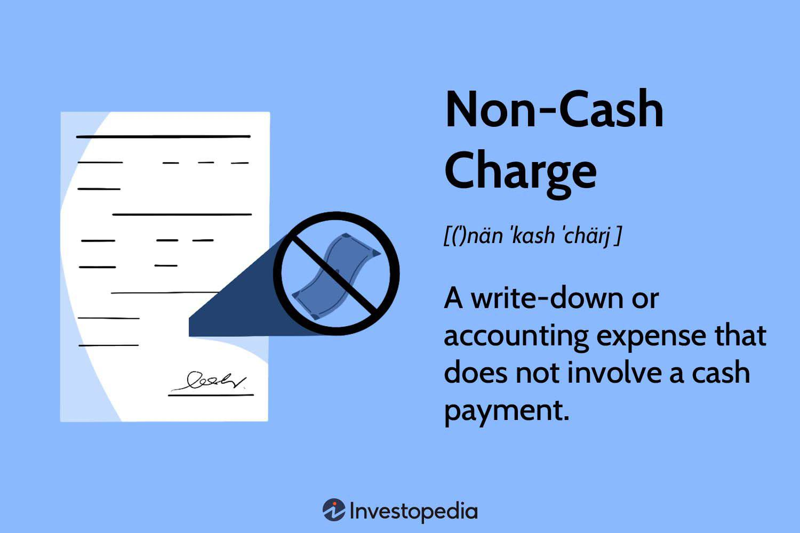

In the intricate world of finance and accounting, the interplay of various concepts and methodologies directly impacts corporate strategies and investment decisions. Among these, non-cash charges, financial reporting, and algorithmic trading stand out as critical components. Non-cash charges, which include expenses like depreciation and stock-based compensation, do not involve actual cash outflow at the time they are recorded but significantly affect a company’s financial statements. These charges are vital in aligning expenses with related income over time, thereby providing an accurate representation of a company's economic activities.

Financial reporting, driven by accurate recording and disclosure of financial transactions, ensures transparency and accountability. It allows investors and stakeholders to assess a company's performance and make informed decisions. Non-cash charges are integral to this process, as they influence reported earnings and provide insights into asset management and operational efficiency.



Algorithmic trading represents a paradigm shift in the financial markets, leveraging advanced algorithms and computational power to execute trades at speeds and frequencies impossible for human traders. This modern approach often relies on various financial metrics, including those derived from non-cash charges, to inform trading strategies. As such, understanding how these charges affect a company’s financial health becomes crucial for developing accurate and effective trading algorithms.

In this article, we will explore the significance of non-cash charges in financial reporting and their influence on corporate strategies. Additionally, we will examine how advancements in algorithmic trading are reshaping the financial landscape, acknowledging the interplay between these elements in shaping contemporary finance ecosystems.

## Table of Contents

## What are Non-Cash Charges?

Non-cash charges are financial statement entries representing expenses that do not require immediate cash outlays. They help align expenses with the corresponding income, offering a more accurate depiction of a company's financial performance and position over time. These charges typically appear on the income statement, impacting reported earnings while not directly affecting cash flows.

Depreciation, amortization, and stock-based compensation are common examples of non-cash charges. Depreciation and amortization systematically allocate the cost of tangible and intangible assets, respectively, over their useful lives. For instance, consider a piece of equipment purchased for $10,000 with an expected lifespan of 10 years. The depreciation expense can be computed using the straight-line method as follows:

$$
\text{Depreciation Expense} = \frac{\text{Cost of Asset}}{\text{Useful Life}} = \frac{10,000}{10} = 1,000
$$

This annual charge reflects the wear and tear of the asset, helping match the cost with the benefits derived over time.

Stock-based compensation, another non-cash charge, involves granting company shares or options to employees. While it does not entail immediate cash expenditure, it dilutes existing shareholders' equity, influencing earnings per share (EPS).

Understanding non-cash charges is crucial for both financial reporting and strategic decision-making. These charges provide insights into economic strategies without affecting [liquidity](/wiki/liquidity-risk-premium) directly. Stakeholders and financial analysts rely on them to assess asset utilization, operational efficiency, and even potential tax implications. By comprehending non-cash charges, businesses can make informed decisions that align with long-term strategic objectives, thereby enhancing transparency and aligning reported earnings with economic realities.

## Types of Non-Cash Charges

Non-cash charges constitute a fundamental aspect of financial accounting, impacting an organization's financial reporting and strategic decisions. These charges, while not requiring immediate cash disbursements, significantly affect a company's financial statements. Key types of non-cash charges include depreciation, amortization, stock-based compensation, and impairment charges.

**Depreciation** refers to the systematic allocation of the cost of a tangible asset over its useful life. This charge reflects the wear and tear or obsolescence of assets such as machinery, buildings, or vehicles. Depreciation is crucial for matching expenses with the revenue generated from the asset, aligning with the accrual accounting principle. Common methods for calculating depreciation include the straight-line method, where the same amount is expensed each year, and the declining balance method, which applies a fixed percentage to the diminishing book value of the asset.

**Amortization** is akin to depreciation but applies to intangible assets like patents, trademarks, or goodwill. Intangible assets, lacking physical substance, also undergo valuation declines over time. Amortization facilitates spreading out these costs over the useful life of the asset, ensuring that the financial statements more accurately reflect the economic value consumed during the reporting period.

**Stock-Based Compensation** arises from offering stock options or shares to employees as part of their remuneration package. This form of compensation provides an incentive for employees to align their interests with those of shareholders. Although no actual cash outflow occurs when options are granted, this charge results in the dilution of existing shares. As these compensations are gradually recognized in financial statements, they affect reported earnings, making it imperative for companies to disclose their impact transparently.

**Impairment Charges** are recognized when an asset's market value drops below its book value, necessitating a write-down in its carrying amount. These charges often arise from unforeseen events that diminish the asset's anticipated future benefits, such as economic downturns or technological obsolescence. Impairment charges ensure that the book values of assets do not exceed their recoverable amounts, contributing to the accuracy and reliability of financial statements.

Understanding and managing these types of non-cash charges are essential for financial reporting, providing insights into the long-term economic impacts on an organization's profitability and asset utilization. Leveraging appropriate accounting methodologies and transparent disclosures ensures stakeholders can assess a business’s actual financial health.

## Impact of Non-Cash Charges on Financial Reporting

Non-cash charges are integral to accrual accounting as they provide a more accurate depiction of a company's economic activities without the immediate impact of cash transactions. These charges, such as depreciation, amortization, and impairments, are recorded in the financial statements to reflect the consumption of assets over time or reductions in value, ensuring that reported earnings align more closely with actual business events and conditions.

### Role in Financial Statements

In financial reporting, non-cash charges can significantly affect reported earnings. For instance, depreciation allocates the cost of a tangible asset, like machinery, over its useful life. This allocation method helps match the expense of using the asset with the revenue it generates, adhering to the matching principle of accounting. Similarly, amortization applies this concept to intangible assets, such as patents. While these charges decrease reported profit, they do not affect cash flow directly as no cash is exchanged during these transactions. This aspect allows companies to manage earnings while preserving liquidity. 

### Insights into Asset Value and Operational Health

Non-cash charges offer valuable insights into a company's asset value and operational health. By tracking depreciation and amortization, stakeholders can evaluate how efficiently a company uses its assets and gauge the potential need for capital reinvestment. Impairment charges, on the other hand, highlight any reductions in the recoverable amounts of assets, signaling potential issues like declining demand or technological obsolescence. 

### Importance for Investors and Analysts

For investors and analysts, understanding non-cash charges is critical. These charges can distort profitability metrics, such as Earnings Before Interest, Taxes, Depreciation, and Amortization (EBITDA). While EBITDA can be used to assess a company's operational performance by excluding the effects of non-operational factors, it is subject to potential manipulation through discretionary non-cash accounting practices. Therefore, investors should assess detailed notes and management discussions in financial reports to interpret the impact of non-cash charges accurately.

Further analyzing non-cash charges can provide insights into future cash flows. For example, excessive impairment charges could indicate that future expected cash flows from an asset are not expected to materialize at previous levels, potentially impacting strategic planning and investment decisions.

In conclusion, while non-cash charges do not involve immediate cash outflows, their strategic and reporting influence is substantial, reflecting on the true operational and economic state of a company. Understanding these impacts allows various stakeholders to make informed decisions based on a realistic assessment of a company's financial health and future prospects.

## Algorithmic Trading and Financial Reporting

Algorithmic trading, a method of executing orders using automated and pre-programmed trading instructions, leverages complex algorithms to assess and act on financial metrics. At the core, these algorithms incorporate a plethora of market data, ranging from price, [volume](/wiki/volume-trading-strategy), and timing, to less direct indicators such as non-cash charges. Non-cash charges, although not involving direct monetary transactions, affect a company's financial statements and thereby influence [algorithmic trading](/wiki/algorithmic-trading) strategies.

Non-cash charges, like depreciation or stock-based compensation, can adjust a firm’s earnings without altering cash flow, thus impacting key performance indicators (KPIs). KPIs are crucial metrics for algorithms as they assess a company’s financial health and future prospects. For instance, a high depreciation charge might reduce net income but does not affect the cash flow, making the company potentially undervalued by simple valuation algorithms. This requires sophisticated models that can distinguish between cash and non-cash influences on financial health.

In high-frequency trading ([HFT](/wiki/high-frequency-trading-strategies)), where the speed of data processing is crucial, algorithms must adapt to include real-time assessments of financial conditions influenced by non-cash charges. For example, an algorithm might adjust its buy/sell decisions based on new depreciation data released, anticipating market overreactions that provide [arbitrage](/wiki/arbitrage) opportunities.

The connection between non-cash changes and algorithmic trading also demands robust risk management frameworks. These frameworks need to account for the impacts of non-cash charges, ensuring that automated systems do not over-leverage or under-respond to changes in a company's reported financial health. Algorithms implement these frameworks by establishing boundaries and conditions under which trades are authorized.

Real-time analytics empower these algorithms, facilitating rapid data ingestion and assimilation—not only of market data but also of financial reports' insights, including non-cash charges. This involves using advanced data processing techniques, sometimes powered by [machine learning](/wiki/machine-learning), to constantly refine algorithmic strategies based on newly available financial data.

For example, a simple Python algorithm might use libraries such as `Pandas` for data handling and `TA-Lib` for technical analysis, while incorporating conditional checks for adjustments in KPIs based on periodic financial reports:

```python
import pandas as pd
import talib

# Example financial data loading
financial_data = pd.DataFrame({
    'Dates': pd.date_range(start='2023-01-01', periods=100),
    'Net Income': [random_value_generator() for _ in range(100)],
    'Depreciation': [random_value_generator() for _ in range(100)]
})

# Calculation of adjusted net income considering non-cash charges
financial_data['Adjusted Income'] = financial_data['Net Income'] + financial_data['Depreciation']

# Example decision based on financial health metrics
def make_trade_decision(data):
    if talib.SMA(data['Adjusted Income'], timeperiod=10).iloc[-1] > threshold_value:
        return "Buy"
    else:
        return "Sell"

# Simulating trading decisions
financial_data['Decision'] = financial_data.apply(make_trade_decision, axis=1)
```

Such algorithms are a testament to the necessity for precision and adaptability in financial assessments, where non-cash charges provide vital context for automated trading decisions. Thus, a contemporary approach to algorithmic trading must synergize detailed financial data analysis with dynamic, real-time data processing capabilities to maintain a competitive edge in financial markets.

## Case Studies: Corporations and Non-Cash Charges

Amazon, Tesla, and Apple are notable examples of corporations that have strategically managed non-cash charges in their financial operations, underscoring the importance of these charges in both employee motivation and operational efficiency.

Amazon, a leader in e-commerce and cloud computing, uses stock-based compensation as a primary non-cash charge. This strategy allows Amazon to align employee interests with corporate goals without immediate cash outlays. By issuing stock options, Amazon can preserve cash flows while incentivizing performance, effectively managing its workforce's motivation and retention. This approach not only maintains liquidity but also facilitates significant investment in growth ventures, as evidenced by their continuous expansion into diverse technologies and markets.

Tesla, known for its electric vehicles and sustainable energy solutions, has extensively reported depreciation charges. These charges align with Tesla's significant investments in manufacturing facilities and technology infrastructure. By spreading the cost of tangible assets over their useful lives, Tesla provides transparency in the capital-intensive nature of its operations. Detailed reporting of depreciation offers stakeholders insights into the economic lifespan and utilization of assets, aiding in evaluating Tesla's investment efficiency and operational scale. This transparency is crucial for investors assessing the sustainability of Tesla's rapid expansion and innovation-driven strategy.

Apple, recognized for its innovative technology products, strategically capitalizes on non-cash charges to optimize its long-term growth strategies. Apple’s use of amortization and impairment charges reflects its focus on intellectual property and intangible assets like patents and brand value. These non-cash charges allow Apple to allocate costs effectively, capturing the long-term utility and innovation expenditures in its financial reports. By implementing comprehensive accounting practices, Apple ensures a clear portrayal of asset value changes, which aids stakeholders in understanding the financial implications of its continuous research and development efforts.

In summary, these corporations exemplify how non-cash charges can be effectively leveraged to enhance financial health reporting, align strategic objectives with operational practices, and provide stakeholder transparency.

## Strategic Management of Non-Cash Charges

Corporations seeking to strategically manage non-cash charges must focus on adopting comprehensive accounting practices that ensure accurate reporting and management of these financial elements. Effective handling of non-cash charges aligns closely with a company's financial goals, regulatory requirements, and the need for transparency with investors. By doing so, businesses can enhance their financial reporting quality and maintain credibility in the eyes of stakeholders.

Firstly, aligning non-cash charge strategies with financial goals involves understanding how these charges influence key financial metrics such as earnings before interest, taxes, depreciation, and amortization (EBITDA) and net income. Companies need to strategically time the recognition of non-cash charges, such as depreciation and amortization, to align with revenue streams, thereby offering a more accurate portrayal of financial performance over time. For instance, carefully timed depreciation schedules can smooth earnings and provide stability in financial statements, which is crucial for maintaining investor confidence and meeting or exceeding market expectations.

Regulatory compliance is another critical area where strategic management of non-cash charges is essential. Accounting standards such as the International Financial Reporting Standards (IFRS) and Generally Accepted Accounting Principles (GAAP) provide guidelines for how these charges should be recognized and reported. Staying compliant involves not only adhering to these standards but also preparing for changes in regulations that could impact how non-cash charges are managed. Proactive management in this area can prevent restatements of financials, which might otherwise negatively impact a company's stock price and investor relations.

Transparency with investors is paramount in managing non-cash charges. Corporations can enhance transparency by clearly explaining the nature and impact of non-cash charges in their financial statements and investor communications. This involves providing detailed breakdowns of how charges such as stock-based compensation or impairment losses are calculated and their effects on financial results. Transparent disclosures empower investors to make informed decisions and reduce the speculation that could lead to stock [volatility](/wiki/volatility-trading-strategies).

Leveraging technology and digital tools represents a transformative approach to managing non-cash charges. Accounting software and advanced analytics tools can facilitate real-time tracking, reporting, and analysis of these charges. For example, enterprise resource planning (ERP) systems can automate the calculation of depreciation and amortization, streamlining the accounting process and reducing the risk of human error. Furthermore, predictive analytics can forecast future non-cash charges based on historical data, aiding in more accurate financial planning and decision-making.

Additionally, digital tools can support the creation of dynamic financial models that simulate various scenarios involving non-cash charges. Such models can analyze the potential impact of strategic decisions on a company's financial health, allowing management to make more informed choices about investments, capital allocations, and other critical business activities. By adopting these technologies, corporations can enhance their ability to anticipate and manage the effects of non-cash charges, ultimately leading to more robust financial strategies and improved stakeholder confidence.

In conclusion, the strategic management of non-cash charges requires a well-rounded approach that integrates sound accounting practices, regulatory compliance, investor communication, and cutting-edge technology. This approach not only improves the accuracy and reliability of financial reporting but also aligns with broader corporate objectives, fostering long-term financial stability and growth.

## Future Outlook: Non-Cash Charges in a Digital Era

As technology continues to evolve, the significance of non-cash charges in financial systems is becoming increasingly pronounced. Digital transformation and [artificial intelligence](/wiki/ai-artificial-intelligence) (AI) are pivotal in reshaping accounting and trading practices, leading to more refined interpretations and applications of non-cash charges.

In future financial landscapes, sophisticated analytical tools will be integrated to better understand the implications of non-cash charges on corporate strategies. Tools employing machine learning algorithms can enhance predictive analytics related to non-cash charges. For instance, AI can be used to assess patterns in depreciation schedules or impairment charges, optimizing asset management and valuation forecasts. The integration of such technologies allows for real-time data processing and more accurate reflection of underlying financial realities.

Moreover, stakeholders, including investors, financial analysts, and corporate managers, should prepare for a shift toward data-driven decision-making. This involves adopting a proactive approach to technological innovations that enable precise capturing and reporting of non-cash charges. For example, blockchain technology could ensure transparency and immutability in financial transactions, reducing discrepancies and enhancing trust in financial reporting.

Python, widely used in financial analysis for its robust libraries, offers tools such as pandas and numpy for handling large datasets. These tools facilitate complex calculations and data visualizations, enhancing the understanding of non-cash charges. Consider the following example assessing yearly depreciation of assets:

```python
import pandas as pd

# Sample data: asset cost and useful life
data = {'Asset': ['Machinery', 'Building', 'Vehicle'],
        'Cost': [50000, 200000, 35000],
        'Useful_Life_Years': [10, 25, 7]}

df = pd.DataFrame(data)

# Calculate yearly depreciation using straight-line method
df['Yearly_Depreciation'] = df['Cost'] / df['Useful_Life_Years']

print(df)
```

In this code snippet, pandas is used to efficiently calculate and display the yearly depreciation for different assets, aiding in financial decision-making.

The digital era requires stakeholders to embrace these innovations to remain competitive and compliant in a rapidly changing financial environment. As technologies evolve, continuous education and adaptation are crucial for effectively managing non-cash charges, ensuring that financial reporting remains accurate and meaningful.

## Conclusion

Non-cash charges remain a fundamental aspect of financial reporting, offering a more profound understanding of a company's financial health without the immediate impact on cash reserves. These charges, such as depreciation, amortization, and stock-based compensation, ensure that financial statements reflect the true economic activities of a corporation by aligning expenses with the relevant periods of income generation. This accounting practice allows for a more accurate representation of a company's profitability and operational efficiency over time.

As algorithmic trading continues to evolve, understanding the influence of non-cash charges on trading algorithms becomes increasingly crucial for investors and managers. These algorithms often rely on financial metrics, including those affected by non-cash charges, to evaluate a company's performance and predict future cash flows. Variations in non-cash charges can impact key performance indicators and, consequently, the trading decisions made by algorithms. Therefore, a deep comprehension of these charges enables stakeholders to better anticipate market movements and adjust their strategies accordingly.

Businesses that embrace both the analytical depth of non-cash charges and the strategic potential of algorithmic trading position themselves to effectively navigate the multifaceted financial environment. Leveraging technology and advanced analytical tools, companies can dissect the implications of non-cash charges on corporate strategies, enhancing their decision-making processes. A forward-thinking approach that integrates the nuances of non-cash charges with the dynamic nature of algorithmic trading will empower organizations to optimize their financial strategies and maintain a competitive edge.

## References & Further Reading

[1]: ["Advances in Financial Machine Learning"](https://www.amazon.com/Advances-Financial-Machine-Learning-Marcos/dp/1119482089) by Marcos Lopez de Prado

[2]: ["Algorithms for Hyper-Parameter Optimization"](https://dl.acm.org/doi/10.5555/2986459.2986743) by Bergstra, J., Bardenet, R., Bengio, Y., & Kégl, B., Advances in Neural Information Processing Systems 24.

[3]: ["Evidence-Based Technical Analysis: Applying the Scientific Method and Statistical Inference to Trading Signals"](https://www.amazon.com/Evidence-Based-Technical-Analysis-Scientific-Statistical/dp/0470008741) by David Aronson

[4]: ["Machine Learning for Algorithmic Trading"](https://github.com/stefan-jansen/machine-learning-for-trading) by Stefan Jansen

[5]: ["Quantitative Trading: How to Build Your Own Algorithmic Trading Business"](https://www.amazon.com/Quantitative-Trading-Build-Algorithmic-Business/dp/1119800064) by Ernest P. Chan