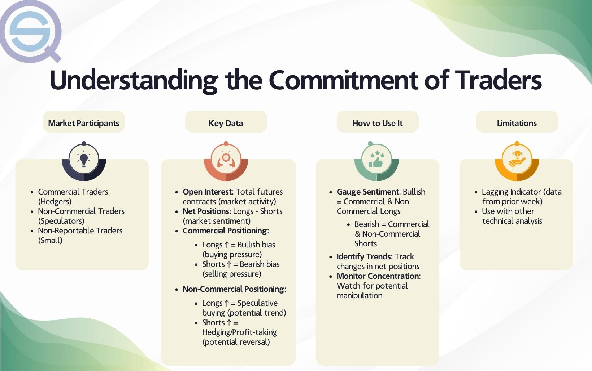

In the world of modern finance, trading operations have significantly transformed with the rise of various market participants, notably non-commercial traders. Non-commercial traders, often comprising individual investors and hedge funds, engage in the markets primarily for speculative purposes rather than for hedging or managing risk as commercial traders do. These market players focus on predicting price movements to profit from potential trends, thereby contributing significantly to market liquidity and signaling shifts in pricing dynamics.

The increasing intersection of technology with trading activities has led to the emergence of algorithmic trading as a dominant feature in financial markets. Algorithmic trading employs complex mathematical models and high-speed computing to perform trades based on predefined criteria, allowing traders to exploit short-term market inefficiencies and capture trends faster than human capabilities would allow. This technological advancement democratizes access to sophisticated trading tools, enabling not just large institutions but also individual traders to implement high-frequency trading strategies effectively.



Understanding the roles and strategies of non-commercial traders is crucial in gaining insights into the functionality and behavior of today’s trading markets. Their speculative activities are essential in providing depth and liquidity, and their market perceptions are closely monitored to anticipate potential movements. By analyzing data such as the Commodity Futures Trading Commission's (CFTC) Commitment of Traders (COT) report, traders can gain insights into market sentiment and positioning, offering valuable information on future market directions.

This article explores the importance of non-commercial traders and their strategies, while highlighting the impact of algorithmic trading on market behaviors. By leveraging tools like the COT report and integrating algorithmic insights, traders can better navigate market complexities and optimize their trading strategies.

## Table of Contents

## Non-Commercial Trader Market Participants

Non-commercial traders, as classified by the Commodity Futures Trading Commission (CFTC), are market participants whose trading activities are not directly linked to the underlying commodity's business purposes. Unlike commercial traders who hedge risks associated with their core operations—such as agricultural producers or manufacturers—non-commercial traders primarily engage in the markets to speculate on price movements for profit. This category includes various entities such as individual investors, hedge funds, and other financial institutions seeking to capitalize on anticipated market trends.

The presence of non-commercial traders significantly enhances market [liquidity](/wiki/liquidity-risk-premium). By actively buying and selling contracts, they help ensure that there is always a counterparty available, which is vital for the efficient operation of futures markets. Their speculative activities contribute critically to price discovery, reflecting the collective market sentiment regarding future price directions. This is achieved by interpreting market signals, geopolitical developments, economic indicators, and other factors that could influence supply and demand dynamics.

Non-commercial traders are often viewed as indicators of potential future price movements. Their positions and trading volumes are scrutinized to gauge market sentiment. For instance, a collective increase in long positions might signal an anticipated price rise, while an increase in short positions might suggest expected price declines.

The Commodity Futures Trading Commission's Commitment of Traders (COT) report plays an essential role in tracking the actions of these traders. Released weekly, the COT report offers a detailed breakdown of market participants’ open positions, segregating data into categories, including commercial and non-commercial traders. This transparency allows investors and analysts to understand the prevailing market sentiment and adjust their strategies accordingly.

By providing insights into the market's speculative interests, the COT report is indispensable for traders. It enables them to assess market trends and potential reversals, often serving as a cornerstone for developing sophisticated trading algorithms that incorporate both historical and current data for decision-making processes. As such, understanding the behavior of non-commercial traders and interpreting their signals through the COT report is integral for those engaged in speculation and strategy formulation in futures markets.

## Algorithmic Trading in Modern Markets

Algorithmic trading employs advanced algorithms to execute trades with high speed and precision, harnessing computational capabilities that surpass human limitations. By automating the decision-making process, [algorithmic trading](/wiki/algorithmic-trading) allows market participants to capitalize on short-term market inefficiencies and trends, thereby solidifying its position as a dominant force in global financial markets.

One significant advantage of algorithmic trading is its ability to process vast amounts of data in real-time, identifying profitable trading opportunities much faster than traditional manual methods. For instance, algorithms can scan multiple markets and execute trades within milliseconds, taking advantage of transient price discrepancies before they disappear. This rapid execution is instrumental in high-frequency trading ([HFT](/wiki/high-frequency-trading-strategies)), where the speed of trade execution can mean the difference between profit and loss.

The integration of the Commodity Futures Trading Commission's (CFTC) Commitment of Traders (COT) report into algorithmic trading strategies offers additional layers of market insight. The COT report provides a comprehensive breakdown of open positions by different types of traders, offering a glimpse into market sentiment and potential price movements. By incorporating COT data, algorithmic traders can refine their models to better predict market trends.

For example, algorithms can be programmed to analyze the shifts in the positions of non-commercial traders as reported in the COT data. By detecting patterns, such as an increase in long positions that may signal bullish trends, algorithms can execute trades aligned with these insights. Moreover, algorithmic systems can backtest these strategies using historical COT data to assess their effectiveness and optimize their performance.

In recent years, algorithmic trading has become accessible not only to large financial institutions but also to individual traders, thanks to advancements in trading software and platforms. The democratization of algorithmic trading tools allows individual traders to employ sophisticated strategies that were once exclusive to major market players. Platforms offering algorithmic trading tools often include features such as strategy builders, [backtesting](/wiki/backtesting) modules, and real-time data feeds, enabling users to create and implement complex trading strategies with relative ease.

Overall, the rise of algorithmic trading represents a transformative shift in how financial markets operate. By leveraging the power of technology to execute trades efficiently and capitalize on market insights, algorithmic trading continues to reshape trading dynamics, offering new opportunities for both institutional and individual market participants.

## The Role of the Commitment of Traders (COT) Report

The Commitment of Traders (COT) report, published weekly by the Commodity Futures Trading Commission (CFTC), plays a crucial role in financial markets by categorizing traders into commercial and non-commercial groups. It offers a comprehensive view of market participants' open positions, providing insight into prevailing market sentiment. This information aids traders in anticipating potential future market dynamics.

Algorithmic traders, who rely on sophisticated algorithms to make trading decisions, extensively utilize COT report data. By analyzing this data, they can refine trading strategies, backtest models, and ensure their trading decisions align with broader market trends. The inclusion of COT data allows algorithmic systems to adjust strategies based on observed changes in market sentiment, enhancing the accuracy and timing of trades.

For speculators, the COT report is particularly invaluable as it reveals insights into how market sentiments might drive commodity prices. Speculators use this information to anticipate shifts in market demand and supply, adjust their positions accordingly, and capitalize on potential price movements. The detailed breakdown of open positions by trader type enables speculators to identify and gauge shifts in market bias, such as increased bullish or bearish sentiment.

The COT report's role is amplified when combined with other analytical tools. While the report itself doesn't specify the reasons behind traders' positions, its data, together with technical analysis, provides a fuller picture of market movements. This combination helps traders refine their strategies, optimize their portfolios, and improve risk management practices.

Overall, the COT report is a key resource for traders seeking to align their strategies with existing market sentiments, providing a strategic edge in navigating the complexities of commodity and futures markets.

## Trading Strategies Using COT Data

One common strategy using Commitment of Traders (COT) data involves analyzing the positioning of non-commercial traders to identify market trends. Non-commercial traders often include speculators, such as individual investors and hedge funds, who aim to profit from anticipated price movements rather than hedging business risks. Their aggregated positions in the futures markets serve as a gauge for predicting potential market shifts.

The COT report, issued weekly by the Commodity Futures Trading Commission (CFTC), details the net long and short positions held by these traders. An increase in net long positions might indicate a bullish sentiment, suggesting potential price rises, while increased net short positions might signal a bearish outlook. Traders leverage this information to infer price movements, thus facilitating informed trading decisions.

Algorithmic trading systems are particularly adept at integrating these insights. Algorithms rely on statistical models and predefined criteria to automate trades swiftly, reacting to market signals more efficiently than human traders. The incorporation of COT data into these systems can enhance their predictive accuracy. For example, a simple algorithm may trigger a buy order when the non-commercial long positions surpass a certain threshold, indicating bullish sentiment:

```python
# Sample pseudo-code for a trading strategy using COT data

def trading_algorithm(cot_data):
    threshold = 10000  # Define threshold for long positions
    for week in cot_data:
        if week['non_commercial_long'] > threshold:
            execute_trade('buy')
        elif week['non_commercial_short'] > threshold:
            execute_trade('sell')

def execute_trade(order_type):
    # Implement trade execution logic here
    print(f"Executing {order_type} order")
```

Backtesting these strategies using historical COT data is crucial for determining their reliability and robustness. Backtesting involves applying the strategy to past market data to assess its hypothetical performance. This step helps traders identify potential risks and tweak the algorithm to improve its effectiveness. For instance, a strategy that consistently aligns with historical market trends can be considered more reliable. However, it is important to recognize that past performance does not guarantee future success, emphasizing the need for continuous assessment and adjustment of trading algorithms.

By systematically examining non-commercial traders' positions and utilizing algorithmic trading, market participants can potentially enhance their ability to profit from market trends while managing risks effectively.

## Challenges and Limitations

While the Commitment of Traders (COT) report is a valuable asset for traders, it presents several challenges and limitations, particularly when applied to real-time trading strategies. Primarily, the report's inherent lag, as it is published weekly, may hinder its applicability in fast-paced trading environments where market conditions can change rapidly. This delay means traders must exercise caution when incorporating the data into time-sensitive decisions, as the report's information may not reflect the most current market dynamics.

Another significant limitation of the COT report is its inability to capture the underlying motivations that drive trader positions. The report categorizes positions into commercial and non-commercial, but it does not provide insights into why these traders hold their positions. This lack of contextual information can lead to potential misinterpretations, making it challenging for traders to fully gauge market sentiment based solely on the reported data.

Algorithmic trading models, which rely heavily on quantitative inputs and data analysis, must be continuously refined to address these limitations. Market [volatility](/wiki/volatility-trading-strategies) and extraneous economic factors further complicate the landscape, as algorithms must be adept at navigating unpredictable shifts. Developers of these models must ensure their algorithms are dynamic and flexible, capable of adjusting to new patterns and integrated with additional data sources to paint a more comprehensive market picture.

Despite these challenges, there is a potential to enhance trading strategies by combining COT insights with technical analysis. Technical analysis involves evaluating past trading activity and price changes to predict future movements. By integrating COT data with technical indicators, traders can gain a more nuanced view of market trends and sentiment, potentially increasing the robustness and accuracy of their strategies. This combined approach allows traders to analyze historical patterns and validate their strategies before deploying them in live markets, reducing the risk of relying solely on lagging or incomplete data.

## Conclusion and Future Outlook

The landscape of trading operations is continuously shaped by the dynamic roles played by non-commercial traders, alongside the increasing adoption of algorithmic trading strategies. Non-commercial traders, often speculators such as hedge funds and individual investors, strategically position themselves in markets to anticipate and benefit from price movements. Their decisions, reflected in the Commodity Futures Trading Commission's (CFTC) Commitment of Traders (COT) report, provide a window into market sentiment, offering valuable insights that can be harnessed for trading strategy optimization.

The COT report remains an essential tool for traders seeking to decode market psychology and align their strategies with potential market trajectories. Its categorization of trader positions into commercial and non-commercial groups unveils the underlying sentiment driving market behaviors. This insight is crucial for anticipating shifts in market dynamics and refining trading approaches. Although the report's weekly publication introduces a latency that poses challenges for real-time market adjustments, its depth of information makes it indispensable for strategic positioning.

Technological advancements promise to enhance the value of COT data by enabling more sophisticated integration with real-time analytics. Artificial intelligence and [machine learning](/wiki/machine-learning) algorithms can now ingest and process large datasets, identifying patterns and trends that might be invisible to human traders. These systems have the capability to dynamically adjust trading strategies based on live market conditions while incorporating historical insights derived from COT data. As these technologies evolve, traders can expect more seamless integration of COT insights into their decision-making processes, enhancing both the speed and accuracy of trading responses.

Algorithmic trading is poised to further transform financial markets, offering new opportunities and challenges for market participants. The speed and precision provided by algorithmic systems can capture fleeting market inefficiencies, offering the potential for enhanced returns. However, this increased reliance on automated systems also introduces complexities, such as the need to continuously refine algorithms to adapt to changing market conditions and unexpected economic factors.

In conclusion, as trading technologies advance, non-commercial traders and algorithmic systems will play increasingly critical roles in shaping market dynamics. The effective use of COT data, combined with real-time analytical capabilities, will be key to thriving in this evolving landscape. The future of trading will be defined by the ability to harness these innovations, leveraging them for strategic advantage in a fast-paced and ever-changing financial environment.

## References & Further Reading

[1]: ["The Commitment of Traders Guide"](https://www.cftc.gov/MarketReports/CommitmentsofTraders/index.htm) by Stephen Briese

[2]: Harris, L. (2003). ["Trading and Exchanges: Market Microstructure for Practitioners."](https://www.amazon.com/Trading-Exchanges-Market-Microstructure-Practitioners/dp/0195144708) Oxford University Press.

[3]: Aldridge, I. (2013). ["High-Frequency Trading: A Practical Guide to Algorithmic Strategies and Trading Systems."](https://onlinelibrary.wiley.com/doi/pdf/10.1002/9781119203803.fmatter) Wiley Finance.

[4]: Domowitz, I. (1993). ["Automated Trade Execution Systems: Some International Evidence and Implications."](https://www.academia.edu/126280241/Automating_the_price_discovery_process_Some_international_comparisons_and_regulatory_implications) NBER Working Paper No. 4064.

[5]: Hasbrouck, J. (2007). ["Empirical Market Microstructure: The Institutions, Economics, and Econometrics of Securities Trading."](https://academic.oup.com/book/52241) Oxford University Press.