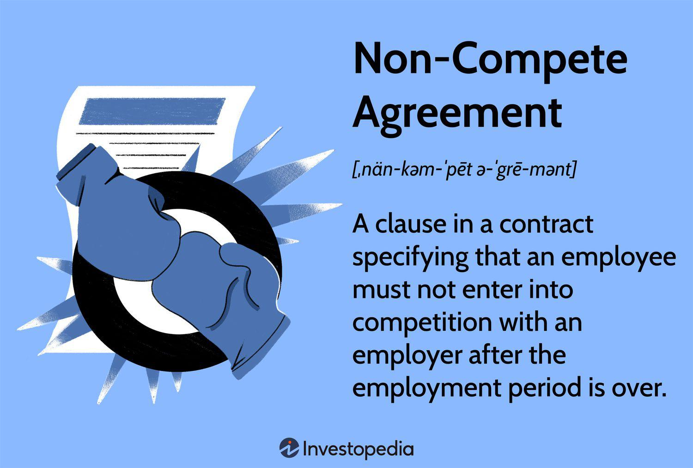

In an increasingly competitive market landscape, businesses need to safeguard their trade secrets and proprietary information. One method companies employ to shield themselves from unfair competition following an employee's departure involves the use of non-compete contracts. These agreements are particularly prevalent in high-stakes industries like algorithmic trading, where competitive advantage is rooted deeply in proprietary technologies and sophisticated trading algorithms.

Non-compete agreements serve as a significant line of defense for businesses by restricting former employees from directly competing against their ex-employers for a specified period and within a defined geographic area after their departure. This limitation ensures that sensitive knowledge, innovative algorithms, and strategic client relationships do not fall into the hands of competitors, potentially eroding a company’s competitive edge.

Algorithmic trading—a field characterized by the use of complex algorithms to execute trades rapidly and automatically—demonstrates the criticality of non-compete agreements. The competitiveness of firms in this sector is heavily reliant on unique trading strategies and technologies that are closely guarded. Consequently, non-compete agreements offer a legal framework for firms to protect these non-tangible assets against infiltration and misuse by competitors.

This article examines how non-compete agreements are embedded within employment contracts and their specific relevance in algorithmic trading. Through this exploration, we aim to understand both the protective benefits these contracts offer companies and the broader implications for employee mobility and innovation within the industry.

## Table of Contents

## Understanding Non-Compete Agreements

Non-compete agreements are clauses embedded within employment contracts that are crafted to prevent an employee from engaging in direct competition with their former employer upon leaving the company. These provisions are put in place to restrict individuals from entering into similar professions or establishing enterprises that pose a direct competitive threat to the previous employer. Typically, non-compete agreements specify conditions such as a fixed duration and defined geographical boundaries within which the former employee is prohibited from participating in competing activities.

The primary purpose of non-compete agreements is to safeguard a company's market position and its intellectual property. By restricting post-employment competition, these agreements serve as a defense mechanism to ensure that proprietary methodologies, trade secrets, or established client relationships are not leveraged against the company by rival firms. This protection is particularly vital for businesses operating within industries where competitive advantage can be largely attributed to unique processes or confidential client data. By enforcing non-compete agreements, companies aim to mitigate the risk of losing critical business intelligence to competitors through former employees who possess intricate knowledge of the internal operations and strategic initiatives. 

However, the constraints stipulated in non-compete agreements must be reasonable to ensure legal enforceability. Overly restrictive terms, such as an indefinite time frame or excessively broad geographical restrictions, may render an agreement invalid in the eyes of the law. Consequently, these agreements must strike a balance, effectively protecting the employer's interests while also offering fair terms to the employee.

## Key Components of a Non-Compete Agreement

Typically, a non-compete agreement comprises several key components that define its scope and enforceability. These components are crucial to ensure the agreement is both protective of the employer's interests and fair to the employee.

One essential element is the **duration** of the restriction. The duration specifies the period during which the former employee is prohibited from engaging in competitive activities. While this period can vary, it commonly ranges from six months to two years. The rationale behind these durations is to offer sufficient time for the company to secure its interests without unnecessarily hindering the former employee's career prospects.

Another critical component is the **geographical scope**. This defines the area where the employee is restricted from working in a competing capacity. The geographical scope should be carefully outlined to ensure it is not too broad. For instance, imposing a global restriction might be deemed unreasonable unless the company operates on an international scale and the employee had global responsibilities. Therefore, a balance must be struck between protecting the employer’s market share and allowing the employee reasonable opportunities for employment.

Additionally, specifying the **activities prohibited** under the agreement is imperative. The scope of these activities must be clearly defined to prevent vagueness, which can render the agreement unenforceable. Often, this includes specific roles, tasks, or types of businesses that can directly compete with the employer's operations. The aim is to tailor the restrictions to the employee's role and the knowledge they acquired, ensuring that the non-compete does not overreach.

Moreover, the agreement might include **compensation offered in return for the agreement**, often referred to as consideration. This compensation could take the form of continued salary payments, lump-sum payments, or benefits during the restricted period. Offering consideration strengthens the agreement’s enforceability, as it demonstrates a fair exchange for the employee's acceptance of the restrictive terms.

In summary, the key components of a non-compete agreement—duration, geographical scope, specific activities prohibited, and compensation—are designed to strike a balance between protecting the employer's legitimate business interests and respecting the former employee's right to work. Ensuring these elements are reasonable and clear is crucial for the agreement's legal enforceability.

## Legal Considerations and Enforceability

The enforceability of non-compete agreements is highly dependent on jurisdictional interpretations and statutory limitations. In the United States, a patchwork of regulations governs these agreements, with significant variations among states. Some states, such as California, have imposed strict bans on non-compete agreements to promote employee mobility and innovation. On the other hand, states like Florida and Texas are more inclined to enforce them, provided they adhere to certain legal standards.

Courts typically apply a "reasonableness" test to determine the enforceability of a non-compete agreement. This test assesses several factors, including the duration of the restriction, the geographical scope, and the specific duties of the employee subject to the agreement. The underlying principle is to balance the protection of legitimate business interests of the employer with the right of the employee to seek gainful employment. 

The reasonableness test often evaluates:

- **Time Period**: Non-compete agreements are generally considered reasonable if they are limited to a specific period necessary to protect the employer's interests, usually ranging from six months to two years.

- **Geographical Scope**: The geographical limitation must be reasonable and directly related to the area in which the employer operates or where the employee had an impact.

- **Employee's Role**: The court may consider the level of access the employee had to the company's trade secrets or client relationships, influencing the necessity and scope of the non-compete clause.

A notable development in this domain is the recent move by the Federal Trade Commission (FTC) to propose a rule banning non-compete clauses for most workers. This move is aligned with a broader shift toward enhancing worker mobility and fostering innovation across industries. The FTC's initiative marks a significant departure from traditional enforcement frameworks and represents a potential overhaul of the landscape governing non-compete agreements in the U.S. This evolving legal environment underscores the importance for companies to stay informed about current legislation and to revisit their contractual practices to ensure compliance and fairness. 

In summary, the enforceability of non-compete agreements requires careful consideration of legal standards and statutory guidelines. While they offer a mechanism to protect business interests, their application must be balanced with equitable employment practices.

## Industry Applications: Algorithmic Trading

Algorithmic trading operates on the foundation of advanced mathematical models and computational algorithms to execute trades at speeds and frequencies that surpass human capacity. These proprietary algorithms are central to the competitive edge held by financial institutions engaged in [algorithmic trading](/wiki/algorithmic-trading). The secrecy surrounding such intellectual property is crucial, as the loss or dissemination of these trading strategies to competitors can have significant financial repercussions. Consequently, non-compete agreements play a vital role in the algorithmic trading industry.

These agreements serve as a safeguard against the migration of crucial data and trading methodologies to rival entities, which could potentially erode market advantages. Firms, particularly hedge funds and other financial entities, often incorporate non-compete clauses into their employment contracts to secure their investment in developing unique trading algorithms and data-driven strategies. The importance of protecting sensitive information is underscored by the high competitive stakes and financial investments involved in building and maintaining these systems.

Besides preventing intellectual property leakage, non-compete agreements also contribute to the broader spectrum of information security. In technology-driven environments where rapid data processing and decision-making are paramount, the unauthorized transfer of data can lead to substantial breaches of security protocols. This potential risk mandates a robust framework for the retention of proprietary information, ensuring that algorithms and client-related data are not inadvertently exposed.

In practice, the conditions of non-compete agreements in algorithmic trading are carefully crafted to withstand legal scrutiny while providing fair terms for the employees. For instance, the duration and geographical scope are often delineated to prevent unreasonable restrictions on the mobility and career progression of employees. Nonetheless, these agreements are essential tools that help maintain the integrity and competitive edge of algorithmic trading firms.

## Non-Compete vs. Non-Disclosure Agreements

Non-compete agreements and non-disclosure agreements (NDAs) are essential legal tools employed by businesses to safeguard their intellectual property and maintain a competitive advantage. While they share a common goal of protecting a company’s valuable assets, they serve this purpose in distinct ways.

A non-compete agreement is designed to limit an employee's ability to engage in activities that compete with a former employer. This type of agreement typically imposes restrictions on an employee's subsequent employment opportunities within a specific industry or geographic area for a defined period. By doing so, it aims to protect the company's market position and prevent former employees from exploiting the company's business strategies, client relationships, or trade secrets through competitive activities.

In contrast, a non-disclosure agreement (NDA) focuses on maintaining the confidentiality of certain information. NDAs legally bind an individual or entity to keep specific facts, data, or information private, preventing them from disclosing it to unauthorized parties. This ensures that proprietary information—ranging from business plans and client lists to technical data and algorithms—remains secure. NDAs are particularly crucial for protecting intellectual property during negotiations, partnerships, or when employees have access to sensitive business information.

Together, non-compete and non-disclosure agreements provide a comprehensive strategy for safeguarding a company's intellectual and competitive assets. By restricting unfair competition through non-compete clauses and ensuring the confidentiality of critical information via NDAs, businesses can better secure their proprietary technologies and maintain strategic advantages in their respective markets.

## Pros and Cons of Non-Compete Agreements

Non-compete agreements are frequently used by companies to protect their business interests. They offer several advantages for employers, primarily in safeguarding trade secrets and proprietary information. By preventing former employees from joining direct competitors, companies can maintain a competitive advantage in the market. This protection is crucial in industries heavily reliant on intellectual property, such as technology and finance, where innovation and exclusive methodologies are key differentiators.

One potential benefit of non-compete agreements is their potential to promote innovation. By ensuring that employees remain committed to their current employer without the immediate prospect of joining rivals, companies might foster an environment where innovative thinking aligns with business goals. This alignment can lead to the development of unique products and services that enhance the market position of the business.

However, the implementation of non-compete agreements also carries several disadvantages. Primarily, they can reduce the bargaining power of employees. With restricted job opportunities within their field, employees may find themselves in a weaker negotiating position regarding salaries and benefits. Furthermore, non-compete clauses can lead to extended periods of unemployment for professionals who cannot find work outside the restricted domain, impacting their career progression and financial stability.

Another downside is the potential stifling of worker innovation. While employers might intend to use non-compete agreements to protect innovations, these contracts might inadvertently discourage employees from pursuing new ideas. With the threat of legal action looming over future employment prospects, employees might refrain from fully exploring creative concepts, thereby limiting overall industry innovation.

In summary, while non-compete agreements offer significant protection for businesses, they must be carefully balanced with the rights and needs of employees. Employers should strive to create fair agreements that protect their interests without unduly restricting employee freedom. This balance is essential to fostering a workplace conducive to innovation while ensuring that employees remain motivated and engaged.

## Conclusion

Non-compete agreements serve as a strategic mechanism for companies endeavoring to maintain their competitive edge and safeguard proprietary information. These agreements, especially significant in fields like algorithmic trading, are designed to prevent the transfer or leakage of sensitive data and unique trading strategies to competing firms. Given the reliance of financial institutions and trading firms on proprietary algorithms and data confidentiality to sustain their market advantage, such contracts play a crucial role in ensuring that these intellectual assets are not inadvertently compromised after an employee's departure.

As regulatory landscapes transform, it is imperative for companies to ensure that their non-compete agreements align with evolving legal standards. Compliance with contemporary laws and regulations not only protects businesses from potential legal disputes but also upholds fairness and reasonableness in their employment practices. By balancing the need to protect proprietary information with the rights of employees to pursue employment opportunities, firms can foster a work environment that supports innovation while safeguarding their competitive interests.

## FAQs

### FAQs

**How long do non-compete agreements typically last?**

Non-compete agreements commonly range in duration from six months to two years after the termination of employment. The specific duration can vary depending on factors such as the industry, the nature of the position held, and jurisdictional regulations. In certain sectors where technological advancements occur rapidly, shorter durations may be favored to prevent excessive hindrance to employment opportunities.

**What are the legalities of enforcing a non-compete agreement?**

The enforceability of non-compete agreements is subject to varying legal standards depending on the jurisdiction. Generally, courts assess the reasonableness of these agreements, considering factors like duration, geographical scope, and the interest they are designed to protect. Some jurisdictions, such as California, have stringent limitations or outright bans on enforcing non-compete clauses. The recent regulatory trends, including pronouncements from the Federal Trade Commission, signify a potential movement towards limiting the enforceability of non-competes to enhance worker mobility.

**Can a non-compete agreement be challenged in court?**

Yes, a non-compete agreement can be challenged in court, particularly if one party believes the terms are unreasonable or unjust. Courts tend to scrutinize these agreements to ensure they are not excessively restrictive. Key considerations include whether the terms adequately balance the employer’s interests in protecting its business against the employee's right to seek employment. Unreasonable restrictions related to duration, geographical area, or prohibited activities might be grounds for a successful challenge.

**What is the impact of non-competes on innovation?**

The impact of non-compete agreements on innovation is a subject of debate. Proponents argue that they protect sensitive information and trade secrets, thus encouraging firms to invest in research and development with a lower risk of compromise. However, critics contend that non-competes can stifle innovation by restricting employee mobility and the free flow of ideas. Restricted movement can deter the sharing of knowledge between companies and inhibit the formation of new startups, which are crucial for technological progress and competitive markets. Balancing these opposing perspectives requires careful structuring of non-compete clauses to protect innovation while fostering a dynamic labor market.

## References & Further Reading

[1]: Gilson, R. J. (2009). ["The Legal Infrastructure of High Technology Industrial Districts: Silicon Valley, Route 128, and Covenants Not to Compete."](https://nyulawreview.org/issues/volume-74-number-3/the-legal-infrastructure-of-high-technology-industrial-districts-silicon-valley-route-128-and-covenants-not-to-compete/) New York University Law Review, 74(3).

[2]: Haskel, J., & Westlake, S. (2018). ["Capitalism Without Capital: The Rise of the Intangible Economy"](https://www.jstor.org/stable/j.ctvc77hhj) Princeton University Press.

[3]: Lobel, O. (2013). ["Talent Wants to Be Free: Why We Should Learn to Love Leaks, Raids, and Free Riding."](https://www.jstor.org/stable/j.ctt5vkwjj) Yale University Press.

[4]: Png, I. P. L. (2017). ["Law and Innovation: Evidence from State Trade Secrets Laws."](https://direct.mit.edu/rest/article/99/1/167/58362/Law-and-Innovation-Evidence-from-State-Trade) American Law and Economics Review, 19(1).

[5]: Epstein, R. A., & Stannard, A. R. (2019). ["Noncompetes in the U.S. Labor Force."](https://journals.sagepub.com/doi/abs/10.1177/0019793919826060) Economic Policy Institute.