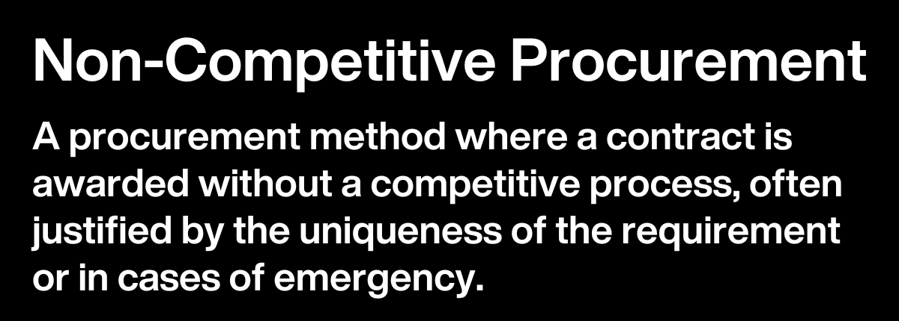

## Table of Contents

## What is non-competitive tendering?

Non-competitive tendering is when a company or organization chooses a supplier without having a bidding process. This means they do not ask different suppliers to offer their best prices and services. Instead, they directly select one supplier to work with. This can happen for many reasons, like if the supplier is the only one who can provide a specific product or service, or if the company has a long-standing relationship with the supplier.

Sometimes, non-competitive tendering can be faster and easier because there's no need to go through the steps of a bidding process. However, it can also lead to higher costs since there's no competition to drive prices down. It's important for companies to be careful and make sure they are getting a fair deal even when they choose this method.

## How does non-competitive tendering differ from competitive tendering?

Non-competitive tendering and competitive tendering are two different ways that companies choose their suppliers. In competitive tendering, a company asks many suppliers to submit their offers. They all compete to offer the best price and service. The company then picks the best offer. This method can help the company get lower prices because suppliers try to outdo each other.

On the other hand, non-competitive tendering means a company picks a supplier without asking for different offers. They might choose a supplier because they are the only ones who can provide what the company needs, or because the company already knows and trusts them. This method can be quicker and simpler, but it might lead to higher costs since there's no competition to push prices down.

Both methods have their pros and cons. Competitive tendering can be good for saving money, but it takes more time and effort. Non-competitive tendering can be faster and easier, but it might not always give the company the best deal. It's important for companies to think carefully about which method to use based on their needs and situation.

## What are the main reasons for choosing non-competitive tendering?

One main reason for choosing non-competitive tendering is when there is only one supplier who can provide the product or service needed. This can happen if the product is very specialized or if there are not many companies that can do the job. In these cases, it makes sense to go straight to the supplier without asking for other offers because there are no other options.

Another reason is when a company already has a good relationship with a supplier. If they have worked together before and trust each other, it can be easier and faster to choose that supplier again. This can save time and effort because the company doesn't need to go through the whole bidding process. It can also help keep a good working relationship going.

Sometimes, non-competitive tendering is chosen because it can be quicker. When a company needs something fast, they might not have time to wait for different suppliers to make their offers. By choosing a supplier directly, they can get what they need more quickly. This can be important in situations where time is a big [factor](/wiki/factor-investing).

## What are the typical scenarios where non-competitive tendering is used?

Non-competitive tendering is often used when there's only one supplier that can provide what a company needs. This happens a lot with specialized products or services that are hard to find. For example, if a company needs a very specific kind of machine that only one company makes, they will go straight to that company without asking for other offers. It's the same if there's a special service that only one company can do well.

Another common scenario is when a company has a good relationship with a supplier. If they have worked together before and trust each other, it makes sense to choose that supplier again. This can save time and effort because the company doesn't need to go through the whole bidding process. It also helps keep a good working relationship going, which can be important for future projects.

Sometimes, non-competitive tendering is used when a company needs something quickly. If there's no time to wait for different suppliers to make their offers, the company might just choose a supplier they know can deliver fast. This can be important in situations where time is a big factor, like when there's an urgent need for a product or service.

## What are the advantages of non-competitive tendering?

Non-competitive tendering can save a lot of time and effort. When a company chooses this method, they don't have to go through the long process of asking different suppliers to make offers. This means they can get what they need faster, which is really helpful when time is important. It's also simpler because the company doesn't have to compare lots of different offers. This can make the whole buying process easier and less stressful.

Another big advantage is that it can help keep good relationships with suppliers. If a company has worked well with a supplier before, choosing them again without a bidding process can make both sides happy. It shows trust and can lead to better teamwork in the future. Also, when there's only one supplier who can provide what the company needs, non-competitive tendering is the only way to go. This makes sure the company can get the special products or services they need without any trouble.

## What are the potential disadvantages or risks associated with non-competitive tendering?

One big risk of non-competitive tendering is that it can lead to higher costs. When a company doesn't ask different suppliers to compete for their business, they might end up paying more than they need to. Without competition, the chosen supplier doesn't have to offer the best price, so the company might not get the best deal. This can be a problem if the company is trying to save money or if they need to stick to a tight budget.

Another disadvantage is that it can limit the company's options. By choosing a supplier without looking at other offers, the company might miss out on better products or services that other suppliers could provide. This can be especially risky if the chosen supplier doesn't meet expectations or if there are problems with the product or service. It's important for the company to make sure they are making a good choice, but without competition, it can be harder to know if they are getting the best possible option.

## What is the process of non-competitive tendering?

Non-competitive tendering happens when a company picks a supplier without asking for different offers. They might choose this way if there's only one supplier who can give them what they need, or if they already know and trust a supplier. Instead of starting a bidding process, the company talks directly to the supplier they want to work with. They discuss what they need and agree on the price and other details. This can be quicker and simpler because the company doesn't have to wait for and compare lots of offers.

But choosing non-competitive tendering also has some risks. Without asking different suppliers to compete, the company might end up paying more than they need to. The chosen supplier doesn't have to offer the best price because there's no competition. Also, the company might miss out on better products or services from other suppliers. It's important for the company to make sure they are getting a good deal and that the supplier can meet their needs, even if they are choosing this method.

## Who are the key stakeholders involved in non-competitive tendering?

The key stakeholders in non-competitive tendering are the company that is looking for a product or service and the supplier that they choose to work with. The company is the one who decides to use non-competitive tendering, usually because they need something specific that only one supplier can provide, or because they have a good relationship with a supplier they trust. The supplier is the one who gets chosen without having to compete with others. They need to make sure they can meet the company's needs and agree on the price and other details.

Another important stakeholder can be the company's procurement team. This team is in charge of finding and choosing suppliers, and they will be the ones who talk directly to the supplier to work out the details of the deal. If the company is part of a larger organization or government, there might also be oversight bodies or auditors who keep an eye on the tendering process to make sure it is fair and follows the rules. These stakeholders all play a part in making sure that non-competitive tendering goes smoothly and that the company gets what it needs.

## What documentation is required for non-competitive tendering?

When a company uses non-competitive tendering, they need to keep some important papers to show why they chose this way and to make sure everything is done right. They need a document that explains why they didn't ask for bids from different suppliers. This could be because only one supplier can give them what they need, or because they have a good relationship with a supplier they trust. This document helps show that the company thought about their choice and made sure it was the best way to go.

The company also needs to keep records of their talks with the supplier. This includes the agreement they make about what the company needs, how much it will cost, and when it will be ready. These papers are important because they show that the company and the supplier understand each other and agree on everything. If the company is part of a bigger group or a government, they might need more papers to follow the rules and show that everything was done fairly.

## How can transparency and fairness be ensured in non-competitive tendering?

To make sure non-competitive tendering is fair and open, a company needs to keep good records and explain why they chose this way. They should write down why they didn't ask for bids from different suppliers. This could be because only one supplier can give them what they need, or because they have a good relationship with a supplier they trust. By keeping these records, the company can show that they thought about their choice and made sure it was the best way to go. This helps everyone understand the decision and makes sure the process is fair.

Another way to keep things transparent is by making sure all talks with the supplier are clear and written down. The company should keep records of what they agreed on with the supplier, like what the company needs, how much it will cost, and when it will be ready. These papers show that both the company and the supplier understand each other and agree on everything. If the company is part of a bigger group or a government, they might need to follow extra rules to make sure everything is done fairly and openly.

## What are the legal and regulatory considerations for non-competitive tendering?

When a company uses non-competitive tendering, they need to think about the laws and rules that might affect them. Different countries and organizations have their own rules about how companies can choose suppliers without a bidding process. These rules are there to make sure that the process is fair and that companies don't just choose a supplier because they want to. For example, some places might require the company to explain why they are using non-competitive tendering and to keep good records of their decision. This helps show that the company made a careful choice and followed the rules.

If a company is part of a government or a big organization, there might be even more rules to follow. These rules can be very strict to make sure that public money is spent wisely and fairly. The company might need to get approval from special people or groups before they can use non-competitive tendering. They also need to keep detailed records of their talks with the supplier and make sure everything is written down clearly. This helps everyone see that the company did things the right way and followed all the rules.

## How does non-competitive tendering impact market competition and innovation?

Non-competitive tendering can make the market less competitive. When companies choose suppliers without asking for different offers, other suppliers don't get a chance to compete. This can make it hard for new companies to start up or for smaller companies to grow. If the same supplier keeps getting chosen without competition, they might not feel the need to offer the best price or the best service. This can make the market less lively and less fair for everyone.

Non-competitive tendering can also affect innovation. When companies don't have to compete for business, they might not feel the need to come up with new ideas or improve their products and services. Competition often pushes companies to be creative and find better ways to do things. Without this push, the market might not see as many new ideas or improvements. This can slow down progress and make it harder for the whole industry to move forward.

## References & Further Reading

[1]: Bergstra, J., Bardenet, R., Bengio, Y., & Kégl, B. (2011). ["Algorithms for Hyper-Parameter Optimization."](https://dl.acm.org/doi/10.5555/2986459.2986743) Advances in Neural Information Processing Systems 24.

[2]: ["Advances in Financial Machine Learning"](https://www.amazon.com/Advances-Financial-Machine-Learning-Marcos/dp/1119482089) by Marcos Lopez de Prado

[3]: ["Evidence-Based Technical Analysis: Applying the Scientific Method and Statistical Inference to Trading Signals"](https://www.amazon.com/Evidence-Based-Technical-Analysis-Scientific-Statistical/dp/0470008741) by David Aronson

[4]: ["Machine Learning for Algorithmic Trading"](https://github.com/stefan-jansen/machine-learning-for-trading) by Stefan Jansen

[5]: ["Quantitative Trading: How to Build Your Own Algorithmic Trading Business"](https://www.amazon.com/Quantitative-Trading-Build-Algorithmic-Business/dp/1119800064) by Ernest P. Chan