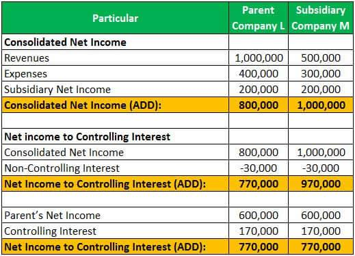

## Table of Contents

## What is a non-controlling interest?

A non-controlling interest, also known as a minority interest, is a part of a company that is owned by someone other than the main owner. Imagine a big company that owns 80% of a smaller company. The other 20% that they don't own is the non-controlling interest. This happens when a company buys most, but not all, of another company.

In financial statements, the non-controlling interest is shown separately. This helps everyone see clearly how much of the smaller company's profits and losses belong to the main owner and how much belongs to the other owners. It's important for understanding the true financial health of the bigger company because it shows that not all the profits from the smaller company are theirs to keep.

## How is non-controlling interest different from controlling interest?

Non-controlling interest and controlling interest are terms used to describe how much of a company someone owns. A controlling interest means that someone owns more than half of a company, usually more than 50%. This gives them the power to make decisions about how the company is run. They can choose the direction of the business, hire and fire managers, and make other big choices.

On the other hand, a non-controlling interest is when someone owns less than half of a company. This means they don't have the power to control the company's decisions. They might get a share of the profits, but they can't tell the company what to do. For example, if a big company owns 80% of a smaller company, the other 20% is the non-controlling interest. The owners of that 20% have to go along with what the big company decides.

In financial reports, these interests are shown differently. The controlling interest's portion of the company's profits and losses is shown as part of the main owner's earnings. The non-controlling interest's portion is shown separately, so everyone can see how much of the profits or losses belong to the other owners. This helps give a clear picture of who gets what from the company's performance.

## Why is non-controlling interest important in financial reporting?

Non-controlling interest is important in financial reporting because it shows how much of a company's profits and losses belong to other owners, not just the main owner. When a big company owns most but not all of a smaller company, the part they don't own is the non-controlling interest. This helps everyone see clearly how the profits and losses are shared. If this wasn't shown separately, people might think the big company gets to keep all the profits from the smaller company, which isn't true.

Showing non-controlling interest also helps people understand the true financial health of the big company. If the smaller company does well, the big company can't claim all those profits. By seeing the non-controlling interest, investors and other people looking at the financial reports can see a more accurate picture of how much money the big company really makes. This makes the financial reports more honest and useful for making decisions about the company.

## How is non-controlling interest calculated?

Non-controlling interest is calculated by figuring out what part of a smaller company's profits and losses belong to other owners, not the main owner. If a big company owns 80% of a smaller company, the other 20% is the non-controlling interest. To find out how much money this 20% is worth, you take 20% of the smaller company's net income or net assets. For example, if the smaller company made $100,000 in profit, the non-controlling interest would be 20% of $100,000, which is $20,000.

This calculation is important because it shows how much of the smaller company's money the other owners get to keep. It helps everyone see the true financial picture of the big company. If the big company reported all of the smaller company's profits as their own, it would look like they made more money than they really did. By showing the non-controlling interest separately, the financial reports are more honest and clear.

## Where is non-controlling interest reported on the financial statements?

Non-controlling interest is reported on the consolidated balance sheet and the consolidated income statement of the main company. On the balance sheet, it is shown as a separate line item under the equity section. This shows how much of the smaller company's net assets belong to the other owners. For example, if a big company owns 80% of a smaller company, the other 20% of the smaller company's net assets is reported as non-controlling interest on the big company's balance sheet.

On the income statement, non-controlling interest is also shown separately. It represents the other owners' share of the smaller company's net income or loss. If the smaller company made a profit, the non-controlling interest's share of that profit is subtracted from the big company's total net income. This way, the financial statements clearly show how much profit the big company can claim and how much belongs to the other owners. This helps everyone understand the true financial performance of the big company.

## What are the accounting standards related to non-controlling interest?

The main accounting standards that deal with non-controlling interest are the International Financial Reporting Standards (IFRS) and the Generally Accepted Accounting Principles (GAAP) used in the United States. Under IFRS, specifically IFRS 10, non-controlling interest is defined as the equity in a subsidiary not attributable to the parent company. This standard requires that non-controlling interest be presented separately within equity in the consolidated balance sheet and also separately in the consolidated income statement to show the share of profit or loss that belongs to the non-controlling owners.

Similarly, under U.S. GAAP, specifically ASC 810, non-controlling interest is reported as a separate component of equity in the consolidated balance sheet. It is also shown separately in the income statement to reflect the portion of net income or loss that is not attributable to the parent company. Both standards aim to provide a clear and accurate picture of the financial position and performance of the parent company by distinguishing between the profits and losses that belong to the parent and those that belong to other owners.

## How does non-controlling interest affect the valuation of a company?

Non-controlling interest can affect how much a company is worth. When a big company owns most but not all of a smaller company, the part they don't own is the non-controlling interest. When people try to figure out how much the big company is worth, they need to think about this non-controlling interest. If they don't, they might think the big company is worth more than it really is. By taking away the value of the non-controlling interest, they get a more accurate picture of the big company's true worth.

This is important because it helps investors and others make better decisions. If someone is thinking about buying the big company, they need to know how much of the smaller company's profits they won't get to keep. By looking at the non-controlling interest, they can see how much of the smaller company's money really belongs to them. This makes the valuation more honest and helps everyone understand the real financial health of the big company.

## What are the implications of non-controlling interest on consolidated financial statements?

Non-controlling interest has important effects on a company's consolidated financial statements. When a big company owns most but not all of a smaller company, the part they don't own is the non-controlling interest. This means that when the big company combines its financial numbers with the smaller company's numbers, they have to show the non-controlling interest separately. On the balance sheet, this is shown as a separate part of the equity section, which shows how much of the smaller company's net assets belong to the other owners. For example, if the big company owns 80% of the smaller company, the other 20% of the smaller company's net assets is shown as non-controlling interest.

On the income statement, non-controlling interest also needs to be shown separately. This shows how much of the smaller company's profit or loss belongs to the other owners. If the smaller company made a profit, the non-controlling interest's share of that profit is subtracted from the big company's total net income. This helps everyone see clearly how much profit the big company can claim and how much belongs to the other owners. By showing non-controlling interest this way, the consolidated financial statements give a more honest and clear picture of the big company's financial health.

## How do changes in ownership affect non-controlling interest?

Changes in ownership can change how much of a company is non-controlling interest. If a big company buys more of a smaller company, the non-controlling interest goes down. For example, if the big company used to own 80% and buys another 10%, now they own 90% and the non-controlling interest is only 10%. On the other hand, if the big company sells some of its ownership, the non-controlling interest goes up. If they sell 10% and go back to owning 80%, the non-controlling interest goes back to 20%. These changes need to be shown in the financial statements so everyone knows how much of the smaller company's profits and losses belong to the other owners.

When ownership changes, the financial statements have to be updated to show the new non-controlling interest. If the big company buys more of the smaller company, the value of the non-controlling interest goes down on the balance sheet. The income statement also changes because the big company gets to keep more of the smaller company's profits. If the big company sells some of its ownership, the value of the non-controlling interest goes up on the balance sheet, and the income statement shows that the big company keeps less of the smaller company's profits. Keeping the financial statements accurate helps everyone see the true financial health of the big company as ownership changes.

## What are the tax implications of non-controlling interest?

Non-controlling interest can affect how much tax a company has to pay. When a big company owns most but not all of a smaller company, the part they don't own is the non-controlling interest. The profits from the smaller company are shared between the big company and the other owners. The big company only pays taxes on the part of the profits they get to keep. The other owners pay taxes on their share of the profits, which is the non-controlling interest. This means the big company's tax bill is lower because they don't have to pay taxes on all of the smaller company's profits.

Changes in ownership can also change the tax situation. If the big company buys more of the smaller company, they get to keep more of the profits and their tax bill goes up. If they sell some of their ownership, they keep less of the profits and their tax bill goes down. The other owners' tax situation changes too, because their share of the profits, which is the non-controlling interest, goes up or down. Keeping track of these changes is important for making sure everyone pays the right amount of taxes.

## How do companies manage non-controlling interest in their corporate strategies?

Companies often think about non-controlling interest when they make plans for the future. If a big company owns most but not all of a smaller company, they might want to buy more of the smaller company to get more control. By doing this, the non-controlling interest goes down, and the big company can make more decisions about the smaller company. They might also decide to keep the non-controlling interest the same if they like having other owners who can help with money or ideas. It's all about finding the right balance that helps the big company grow and do well.

Sometimes, a big company might sell some of its ownership in the smaller company. This makes the non-controlling interest go up, but it can also bring in money that the big company can use for other things. They might do this if they need cash or if they think the smaller company will do better with less control from the big company. Either way, the big company has to think carefully about how changes in non-controlling interest will affect their plans and their financial reports. It's important to keep everything clear and honest so everyone knows what's going on.

## What are the advanced considerations and challenges in reporting non-controlling interest in complex corporate structures?

Reporting non-controlling interest in complex corporate structures can be tricky. When a big company owns parts of many smaller companies, and those smaller companies might own parts of other companies too, it gets hard to figure out who owns what. Each level of ownership can have its own non-controlling interest, and keeping track of all these different pieces is a big challenge. Companies need to make sure they show the right amount of non-controlling interest on their financial statements, so everyone can see clearly how much of the profits and losses belong to the other owners. If they don't do this right, it can make the financial reports confusing and hard to trust.

Another challenge is when the ownership changes a lot. If a big company is buying and selling parts of smaller companies all the time, the non-controlling interest keeps changing too. This means the company has to update their financial statements a lot to show the new amounts of non-controlling interest. It can be hard to keep up with all these changes and make sure the numbers are right. Plus, different countries might have different rules about how to report non-controlling interest, which can make things even more complicated if the company works in many places. Keeping everything clear and correct is important for showing the true financial health of the big company.

## References & Further Reading

[1]: ["International Financial Reporting Standards (IFRS) - Homepage"](https://www.ifrs.org/) - Official website of the IFRS Foundation, providing resources and guidelines on financial reporting.

[2]: ["Financial Reporting and Analysis"](https://www.investopedia.com/terms/f/financial-analysis.asp) by Charles H. Gibson - A comprehensive text covering the essentials of financial reporting and analysis.

[3]: ["Algorithmic Trading and DMA: An introduction to direct access trading strategies"](https://www.amazon.com/Algorithmic-Trading-DMA-introduction-strategies/dp/0956399207) by Barry Johnson - A guide to understanding the workings of algorithmic trading and direct market access.

[4]: ["The Little Book of Valuation: How to Value a Company, Pick a Stock and Profit"](https://www.amazon.com/Little-Book-Valuation-Company-Profits/dp/1394244401) by Aswath Damodaran - A book focused on company valuation techniques which are crucial for assessing investment strategies involving non-controlling interests.

[5]: ["Handbook of Corporate Finance: Empirical Corporate Finance"](https://www.sciencedirect.com/book/9780444532657/handbook-of-empirical-corporate-finance) edited by B. Espen Eckbo - Provides detailed insights into corporate finance practices, including the implications of ownership structures.