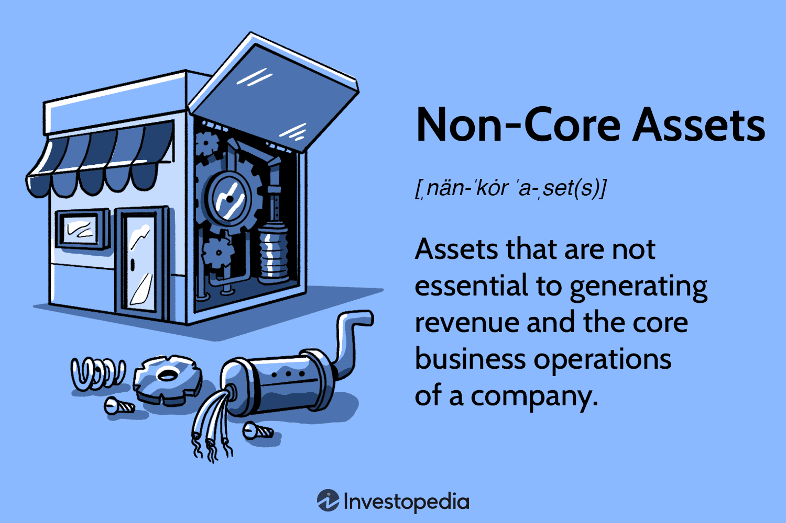

The financial landscape is undergoing a swift transformation, driven by the integration of innovative strategies and cutting-edge technologies. These advancements are reshaping investment approaches and asset management practices. Among the pivotal components influencing these modern financial strategies are non-core assets, asset management, and algorithmic trading. As businesses and investors strive to maintain a competitive edge, understanding and effectively utilizing these elements have become crucial.

Non-core assets, often overlooked, play a significant role in enhancing a company's financial strategy. These assets, not essential to a company's primary operations, can include investments like real estate, idle equipment, and securities. By strategically managing and, if necessary, divesting from non-core assets, companies can improve liquidity and focus resources on their core business objectives. This resource reallocation is instrumental in fostering financial agility and health.

Asset management, encompassing both core and non-core assets, seeks to optimize the use of these resources to achieve financial objectives. By evaluating and managing a diverse array of assets, businesses can foster growth, stability, and sustainability over time.

Algorithmic trading represents a technological leap in financial strategies, employing complex algorithms to automate trading decisions. By leveraging rapid data analysis and execution capabilities, algorithmic trading reduces human error, enhances accuracy, and provides a competitive advantage. This automation facilitates the efficient management of various asset classes, including non-core assets, and aids in risk management and financial planning.

The convergence of non-core asset management with algorithmic trading creates a comprehensive financial strategy that supports improved liquidity, risk management, and profitability. As the financial environment continues to evolve, businesses must adapt to these technological advancements and refine their strategies to harness the full potential of these innovative tools.

## Table of Contents

## Understanding Non-Core Assets

Non-core assets are defined as resources that, while valuable, are not critical to a company's primary business operations. These assets can comprise a variety of categories such as real estate properties, idle machinery, subsidiary companies, investment securities, and intellectual property. Unlike core assets that are vital to daily operations and income generation, non-core assets serve strategic purposes, particularly in financial planning and resource optimization. 

In contemporary business practices, non-core assets are often leveraged to elevate financial [liquidity](/wiki/liquidity-risk-premium). For instance, the sale or lease of surplus real estate can inject immediate funds into a company, enabling it to meet short-term cash flow needs or invest in priority projects that enhance core business functions. Similarly, disposing of idle equipment or machinery not only realizes capital but also reduces maintenance and storage costs.

Moreover, non-core assets can be instrumental in debt settlement strategies. Companies facing financial burdens may opt to liquidate these assets, using the capital release to pay down liabilities. This can improve credit ratings and allow organizations to renegotiate more favorable terms with creditors. It is a tactical maneuver that underscores the importance of efficient asset disposition in financial restructuring.

From a strategic perspective, businesses may divest non-core assets to streamline operations, henceforth concentrating resources and managerial efforts on core competencies. This decision often coincides with major restructuring or refocusing activities, such as mergers, acquisitions, or shifts in business strategy. Selling non-core assets can also present opportunities for reinvestment into areas promising higher returns on investment, innovation, or market expansion.

The rationale behind non-core asset management lies in optimizing asset portfolios to align with broader corporation goals, thereby enhancing overall financial health. In practice, enterprises frequently conduct rigorous assessments to ascertain which assets qualify as non-core, taking into account factors like market demand, asset performance, and the strategic importance of retaining certain holdings.

In summary, non-core assets, though ancillary to primary business operations, provide substantial value in financial strategies. Efficient management of these assets assists companies in achieving objectives related to liquidity enhancement, debt management, and strategic focus, ultimately supporting a stable and scalable business model.

## Role of Non-Core Assets in Asset Management

Non-core assets play a strategic role in enhancing a company's financial flexibility and liquidity. These assets, which are not integral to a company's core business operations, can substantially impact a company's financial health when managed effectively. By strategically managing these assets, businesses can bolster their balance sheets and improve overall financial health.

Asset managers evaluate non-core assets by examining their potential to generate cash flow or improve liquidity. This process involves a detailed analysis of each asset's current market value, potential for appreciation, and costs associated with maintaining the asset. A key aspect is the potential for these assets to be liquidated to fund new investments or pay off existing debts, thereby enhancing the company's financial flexibility.

To maintain and optimize non-core assets, asset managers often employ a variety of financial techniques. This may include restructuring the asset portfolio to either capitalize on market trends or shift focus to areas with higher returns. Optimization might also involve cost management strategies to reduce any overheads associated with the maintenance of these assets, thus improving their contribution to the company's financial goals.

Real-world examples of successful non-core asset management provide insight into these strategies. For instance, a company might hold a piece of real estate that is underutilized. By deciding to lease or sell this property, the company could inject a significant amount of liquidity into its operations, enabling further investment in core operational areas. Such strategic decisions illustrate how businesses can leverage non-core assets to reinforce their financial standing.

Successful management of non-core assets is demonstrated by evaluating and optimizing these resources effectively. Companies have been able to reallocate resources from non-core areas to their primary operations, thereby enhancing profitability. By maintaining a balanced approach to asset management, businesses ensure they can respond swiftly to market changes, supporting their broader strategic objectives.

Furthermore, asset managers prioritize keeping abreast of market conditions and regulatory changes, which ensures that non-core assets are managed in compliance with legal requirements, minimizing risks associated with regulatory breaches. This proactive approach also prepares businesses to capitalize on favorable market conditions, optimizing the value derived from their non-core asset portfolios.

In conclusion, non-core asset management is essential for maximizing a company's financial agility and resilience. By effectively evaluating, maintaining, and optimizing these assets, businesses can improve their liquidity, enhance their balance sheets, and support sustainable growth.

## Incorporating Algorithmic Trading in Financial Strategies

Algorithmic trading, a technique that employs advanced algorithms to automate the execution of trades, has become an essential component of modern financial strategies. By leveraging complex mathematical models and computational power, [algorithmic trading](/wiki/algorithmic-trading) enhances the efficiency of trading operations, providing significant competitive advantages to traders and asset managers worldwide.

One of the primary benefits of algorithmic trading is its ability to process and analyze vast amounts of financial data in real-time. This capability allows traders to identify and capitalize on profitable opportunities with remarkable speed and accuracy. By automating the trading process, algorithmic trading reduces the likelihood of human error and biases, ensuring a more consistent and disciplined trading approach.

Algorithmic trading can be particularly advantageous in managing various asset classes, including non-core assets. Non-core assets, which are not critical to a company's primary operations, can still play a significant role in investment strategies. Through algorithmic trading, these assets can be efficiently incorporated into a diversified portfolio, optimizing returns while minimizing risks. For instance, algorithms can be programmed to take into account the liquidity and [volatility](/wiki/volatility-trading-strategies) of non-core assets, dynamically adjusting trading strategies based on market conditions.

Financial strategies incorporating algorithmic trading benefit from enhanced risk management. Algorithms can be designed to monitor risk exposure continuously, executing trades automatically to rebalance portfolios in response to shifts in market dynamics. Additionally, algorithmic systems can implement stop-loss and take-profit orders, which help protect investments from adverse market movements by triggering automated buying or selling actions when specified price levels are reached.

Algorithmic trading also plays a pivotal role in financial planning by improving portfolio allocation and execution efficiency. For example, algorithms can be employed to optimize portfolio weights based on expected returns and risk preferences, ensuring a more efficient allocation of capital. Furthermore, transaction cost analysis (TCA) algorithms can help minimize the impact of trading costs on investment performance, providing valuable insights into execution quality and market impact.

The integration of [machine learning](/wiki/machine-learning) and [artificial intelligence](/wiki/ai-artificial-intelligence) into algorithmic trading systems has further enhanced these capabilities. Machine learning algorithms can refine trading strategies by learning from historical data, recognizing patterns, and adapting to changing market conditions. For example, [reinforcement learning](/wiki/reinforcement-learning) models can develop strategies that evolve over time, optimizing decision-making processes based on feedback from trading outcomes.

Incorporating algorithmic trading into financial strategies entails several considerations, such as the proper selection of algorithms, technology infrastructure, and ongoing monitoring to ensure optimal performance. As the financial markets continuously evolve, the adaptability offered by algorithmic trading will be critical for maintaining a competitive edge.

## Case Studies and Real-World Examples

Several companies have effectively integrated non-core asset management with algorithmic trading strategies to enhance their financial performance. These real-world examples provide valuable insights into how distinct financial elements can converge to yield substantial benefits.

One notable case is that of Company X, a multinational conglomerate that strategically divested a portion of its non-core assets to streamline its operations and boost its liquidity. Instead of managing diverse non-essential operations, the company chose to sell its underutilized real estate holdings and idle equipment. The resulting capital was reinvested into their primary business sectors, thereby increasing operational efficiency. Furthermore, the divestment improved the company's balance sheet, reduced operational costs, and freed up resources for higher-value activities.

Additionally, Company Y, a global financial institution, implemented algorithmic trading strategies to optimize its asset portfolio, including non-core assets. By utilizing sophisticated algorithms, the company was able to conduct rapid data analysis and execute trades with heightened accuracy, thereby minimizing human error. The approach enabled Company Y to promptly react to market fluctuations, enhancing its risk management framework. The company reported a significant improvement in its trading performance, demonstrating the potential of algorithmic trading in managing diverse asset classes.

An example of strategic non-core asset management can be found in a technology firm's decision to divest its non-essential patents. This strategic move allowed the company to focus on innovation within its core technology stack while simultaneously leveraging algorithmic trading to manage the funds generated from the divestment. By implementing algorithmic strategies, the firm effectively reallocated financial resources, optimizing its investment portfolio for better returns.

Another illustrative case is the adoption of algorithmic trading by Company Z, a large-scale retailer. Facing intense competition, the retailer identified non-core assets, such as distribution centers and logistics units, which were divested to specialists in those areas. The capital raised was utilized to strengthen customer-centric initiatives. Concurrently, the retail giant used algorithmic trading to manage the proceeds and optimize its financial planning. The retailer benefited from improved capital allocation, enhancing their competitive edge.

These instances underscore the manifold advantages that arise from the integration of non-core asset management and algorithmic trading. They also highlight challenges, such as ensuring seamless integration and managing the technological infrastructure needed for algorithmic trading. Nevertheless, these case studies demonstrate that, when effectively implemented, the synergy between strategic asset management and advanced trading methodologies can significantly bolster a company’s financial strategy.

## Challenges and Considerations

Managing non-core assets and implementing algorithmic trading come with distinct challenges that require careful consideration. These challenges often involve risks such as market volatility and algorithmic failures, which can have significant impacts on financial strategies if not appropriately addressed.

**Market Volatility and Algorithmic Failures:**

Market volatility is an inherent risk that influences the valuation and sale of non-core assets. Fluctuations in market prices may lead to unfavorable conditions, impacting liquidity and the timing of asset disposals. In algorithmic trading, volatility can exacerbate the risk of slippage—where the executed price differs from the intended price—leading to unexpected losses. Furthermore, algorithms might fail due to coding errors, inadequate testing, or unforeseen market events. 

To mitigate these risks, several strategies can be employed:

1. **Diversification:** Spreading investments across various non-core assets and trading algorithms can reduce exposure to adverse conditions specific to any single market segment.

2. **Robust Algorithm Design:** Ensuring algorithms are robust through rigorous backtesting against historical data and diverse market conditions helps improve their reliability and effectiveness.

3. **Continuous Monitoring and Adjustment:** Implementing real-time monitoring systems to track algorithm performance and market conditions allows for immediate adjustments, minimizing potential losses.

**Regulatory Considerations and Compliance:**

The regulatory landscape for asset management and algorithmic trading is complex and continually evolving. Compliance requirements may vary significantly across jurisdictions and involve strict rules on reporting, trading practices, and data protection.

Adhering to these regulations is crucial for minimizing legal risks and maintaining operational integrity. Asset managers and trading firms need to:

1. **Stay Informed:** Regularly update knowledge of applicable regulations and upcoming changes in the regulatory framework.

2. **Implement Compliance Programs:** Establish comprehensive compliance programs that cover all aspects of regulatory requirements, including robust record-keeping and reporting systems.

3. **Engage with Legal Experts:** Work closely with legal experts specializing in financial regulations to ensure that all practices align with current laws.

**Strategic Planning and Risk Mitigation:**

Addressing these challenges requires strategic planning and a proactive stance on risk management. The following approaches can be adopted:

1. **Scenario Analysis and Stress Testing:** Conduct extensive scenario analyses and stress testing for both non-core assets and algorithmic strategies to understand potential risks and their impacts.

2. **Risk Management Frameworks:** Develop a structured risk management framework that identifies, assesses, and mitigates risks associated with non-core assets and algorithms.

3. **Technology Investment:** Investing in advanced technologies for risk assessment and management, such as machine learning algorithms, can provide deeper insights and predictive capabilities.

4. **Continuous Learning and Adaptation:** Encourage a culture of continuous learning and adaptability within teams to stay ahead in a rapidly changing financial environment. This involves regular training and updating of skills related to both asset management and algorithmic trading.

By addressing these challenges with strategic approaches and a focus on compliance and adaptation, businesses can optimize their use of non-core assets and algorithmic trading to enhance overall financial performance.

## Conclusion

The integration of non-core asset management and algorithmic trading provides a significant uplift in financial strategy by optimizing asset utilization and enhancing operational efficiency. Non-core asset management plays a pivotal role in streamlining balance sheets and ensuring that resources are effectively allocated, thereby improving liquidity. By evaluating and managing assets that are not central to core operations, businesses can free up capital, reduce debts, and reinvest in growth areas, resulting in increased profitability.

Algorithmic trading further enriches this strategic framework by introducing automation and precision into trading operations. Algorithms can quickly analyze vast datasets and execute trades at optimal times, which reduces human error and biases. These automated processes enhance risk management by minimizing exposure to market volatility and swiftly adapting to market changes. The synergy between asset management and algorithmic trading can therefore mitigate risk while boosting returns, creating robust financial outcomes.

The future of asset management requires continual adaptation to technological advances and evolving market conditions. Embracing innovation is essential for developing dynamic financial strategies. Businesses must stay updated with technological developments to utilize the full potential of algorithmic solutions. This constant evolution demands ongoing learning and strategic refinement to maintain competitive advantage and capitalize on new financial opportunities.

In conclusion, the combined strategy of managing non-core assets alongside leveraging algorithmic trading holds the promise of not only enhancing liquidity and risk management but also driving greater profitability. Organizations that effectively harness these tools are more likely to thrive in an increasingly complex financial environment.

## References & Further Reading

[1]: Bergstra, J., Bardenet, R., Bengio, Y., & Kégl, B. (2011). ["Algorithms for Hyper-Parameter Optimization."](https://dl.acm.org/doi/10.5555/2986459.2986743) Advances in Neural Information Processing Systems 24.

[2]: ["Advances in Financial Machine Learning"](https://www.amazon.com/Advances-Financial-Machine-Learning-Marcos/dp/1119482089) by Marcos Lopez de Prado

[3]: ["Evidence-Based Technical Analysis: Applying the Scientific Method and Statistical Inference to Trading Signals"](https://www.amazon.com/Evidence-Based-Technical-Analysis-Scientific-Statistical/dp/0470008741) by David Aronson

[4]: ["Machine Learning for Algorithmic Trading"](https://github.com/stefan-jansen/machine-learning-for-trading) by Stefan Jansen

[5]: ["Quantitative Trading: How to Build Your Own Algorithmic Trading Business"](https://www.amazon.com/Quantitative-Trading-Build-Algorithmic-Business/dp/1119800064) by Ernest P. Chan