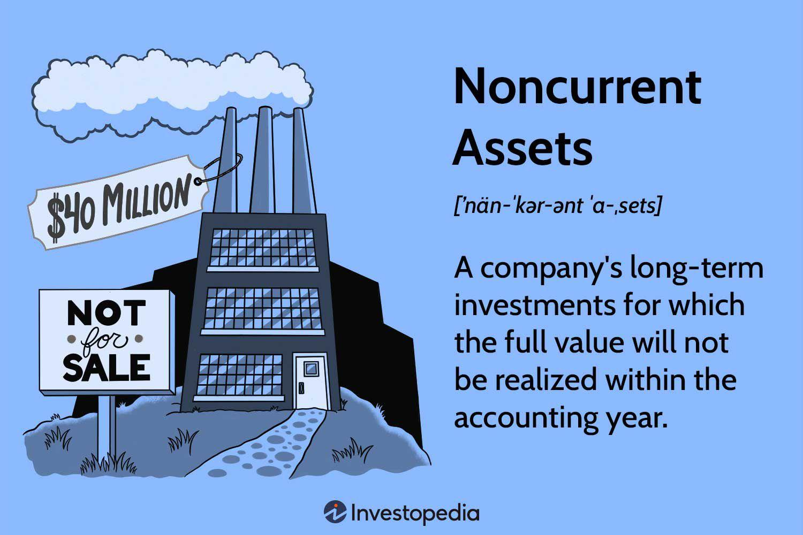

## Table of Contents

## What are non-current assets?

Non-current assets are things a company owns that are not expected to be turned into cash or used up within a year. These are important for a company's long-term operations. Examples include buildings, machinery, and land. They are also called long-term assets because they help the company make money over a long period of time.

These assets are shown on a company's balance sheet, which is like a snapshot of what the company owns and owes. Non-current assets are different from current assets, like cash or inventory, which are expected to be used up or sold quickly. Because non-current assets last a long time, their value might go down over time, so companies often take this into account when they report their value on the balance sheet.

## How are non-current assets different from current assets?

Non-current assets and current assets are both things a company owns, but they are different in how quickly they can be turned into cash or used up. Current assets are things like cash, money that people owe the company soon, and inventory that can be sold quickly. These are expected to be used up or turned into cash within a year. They help a company with its day-to-day operations and short-term needs.

On the other hand, non-current assets are things that a company will keep and use for a long time, usually more than a year. These include things like buildings, machinery, and land. They are important for the company's long-term success because they help the company make money over many years. Because they last a long time, their value might go down slowly, and companies need to account for this when they show their value on the balance sheet.

In simple terms, current assets help a company with its short-term needs, while non-current assets are crucial for its long-term goals. Current assets are more liquid, meaning they can be turned into cash quickly, whereas non-current assets are less liquid but more essential for ongoing operations and growth.

## Can you list some examples of non-current assets?

Non-current assets are things a company owns that they will use for a long time. Some examples are buildings and land. A company might buy a building to use as an office or a factory. They might also buy land to build on or to use for their business. These things help the company make money over many years.

Another type of non-current asset is machinery and equipment. A company might buy big machines to make their products or special tools to help them work better. These machines and tools are important for the company's long-term success because they help them do their job every day.

Lastly, there are intangible non-current assets. These are things you can't touch but are still valuable, like patents and trademarks. A company might have a patent for a special invention or a trademark for their brand name. These help the company keep their ideas safe and make money over a long time.

## Why are non-current assets important for a business?

Non-current assets are really important for a business because they help it grow and make money over a long time. Things like buildings, land, and big machines are used every day to do the work of the company. Without these, the business wouldn't be able to make its products or offer its services. They are like the backbone of the company, helping it stay strong and keep going for many years.

Also, non-current assets can help a business save money in the long run. For example, if a company buys a big machine, it might cost a lot at first, but it can be used for many years without needing to be replaced often. This means the company doesn't have to keep spending money on new machines all the time. Plus, things like patents and trademarks can protect the company's ideas and brand, making sure they can keep making money from them for a long time.

## How are non-current assets recorded on a balance sheet?

Non-current assets are shown on a company's balance sheet, which is like a big list of what the company owns and owes. On the balance sheet, non-current assets are listed under a section called "Non-Current Assets" or "Long-Term Assets." This section comes after the section for current assets, which are things like cash and inventory that can be turned into cash quickly. The value of non-current assets is usually the cost of buying them, minus how much they've gone down in value over time. This decrease in value is called depreciation for things like buildings and machinery, and amortization for intangible things like patents.

Companies need to keep track of how much their non-current assets are worth because these things help the company make money over many years. For example, if a company buys a building, they will list it on the balance sheet at its cost minus any depreciation. The same goes for big machines or land. For intangible assets like patents, the company will list them at their cost minus any amortization. This way, the balance sheet shows a fair picture of what the company owns and how much those things are worth over time.

## What is the process of depreciation for non-current assets?

Depreciation is how companies figure out that their non-current assets, like buildings and machines, lose value over time. When a company buys something big, they don't use all of its value right away. Instead, they spread out the cost over the years they expect to use it. This is called depreciation. It helps the company show a more accurate picture of how much the asset is worth on their balance sheet and how much it costs to use it each year on their income statement.

There are different ways to figure out depreciation, but the most common one is called the straight-line method. With this method, the company takes the total cost of the asset and subtracts how much they think it will be worth at the end, which is called the salvage value. Then, they divide what's left by the number of years they expect to use the asset. For example, if a machine costs $10,000 and they think it will be worth $1,000 at the end of 9 years, they would subtract $1,000 from $10,000 to get $9,000, and then divide $9,000 by 9 years. This means they would depreciate the machine by $1,000 each year. This way, the value of the machine goes down a little bit each year until it reaches its salvage value.

## How does the valuation of non-current assets impact financial statements?

The way a company figures out the value of its non-current assets, like buildings and machines, can change what their financial statements look like. On the balance sheet, which shows what the company owns and owes, non-current assets are listed at their cost minus how much they've gone down in value over time. This decrease in value is called depreciation. If the company uses a different way to figure out depreciation, it can make the value of the non-current assets on the balance sheet look different. This means the total value of what the company owns can go up or down, which can affect how investors see the company.

On the income statement, which shows how much money the company made or lost, depreciation is listed as an expense. This is because using non-current assets costs money over time. If the company changes how it figures out depreciation, the expense on the income statement will change too. A bigger depreciation expense makes the company's profit look smaller, and a smaller depreciation expense makes the profit look bigger. This can change how people think the company is doing financially. So, the way non-current assets are valued is really important for showing a true picture of the company's financial health.

## What are the methods used to calculate depreciation of non-current assets?

There are several ways to calculate depreciation for non-current assets, and each method spreads out the cost of the asset differently over its useful life. The most common method is the straight-line method, where the cost of the asset minus its salvage value is divided evenly over the number of years it's expected to be used. For example, if a machine costs $10,000, has a salvage value of $1,000, and is expected to last 9 years, the annual depreciation would be ($10,000 - $1,000) / 9 = $1,000 per year. This method is simple and easy to understand, making it popular for many businesses.

Another method is the declining balance method, which is used to account for assets that lose more value early in their life. This method applies a fixed rate to the asset's book value each year, which results in higher depreciation expenses at the beginning and lower ones as time goes on. For example, using a double-declining balance method on the same $10,000 machine with a 9-year life, the first year's depreciation would be 2/9 of $10,000, or about $2,222. The next year, the depreciation would be 2/9 of the remaining $7,778, and so on. This method reflects the reality that some assets wear out faster when they're new.

Lastly, there's the units of production method, which ties depreciation to how much the asset is actually used. Instead of time, this method uses the total units the asset is expected to produce over its life to figure out depreciation. If the $10,000 machine is expected to produce 100,000 units and has produced 10,000 units in a year, the depreciation for that year would be ($10,000 - $1,000) / 100,000 * 10,000 = $900. This method is great for assets whose wear and tear depend more on usage than time.

## How do non-current assets affect a company's liquidity and solvency?

Non-current assets like buildings and machinery can affect a company's liquidity, which is how easily it can turn things into cash to pay bills. Since non-current assets are not meant to be sold quickly, they don't help the company's liquidity much. If a company needs cash fast, it might have to sell these assets at a lower price than they're worth, which isn't good. So, having a lot of non-current assets can make it harder for a company to be liquid because these assets take a long time to turn into cash.

On the other hand, non-current assets can help a company's solvency, which is its ability to pay off long-term debts. These assets are important for the company's long-term success because they help make money over many years. For example, a factory or a big machine can help the company produce goods to sell and make a profit. This profit can then be used to pay off debts over time. So, having strong non-current assets can make a company more solvent by helping it generate the money needed to meet its long-term financial obligations.

## What are the tax implications of non-current assets?

When a company buys non-current assets like buildings or machines, it can affect their taxes. The cost of these assets can be spread out over time through something called depreciation. This means the company can take a little bit of the cost as an expense each year instead of all at once. By doing this, the company can lower its taxable income each year, which means it pays less in taxes. So, non-current assets can help a company save on taxes by allowing them to spread out the cost over the years they use the asset.

If a company sells a non-current asset, there can be tax implications too. If they sell it for more than what they paid for it minus depreciation, they might have to pay a tax on the profit, which is called capital gains tax. But if they sell it for less than that, they might be able to take a loss on their taxes, which can help lower their taxable income. So, the way a company manages its non-current assets can affect its taxes both when it buys and when it sells these assets.

## How do companies manage and optimize their non-current assets?

Companies manage and optimize their non-current assets by keeping track of them carefully. They need to know how much these assets are worth and how much they've gone down in value over time, which is called depreciation. By doing this, they can figure out when it's time to replace or upgrade these assets to keep their business running smoothly. For example, if a machine is getting old and breaking down a lot, the company might decide to buy a new one to keep production going without interruptions. They also look at how well these assets are being used to see if they can make them work better or if they need more of them to grow the business.

Another way companies optimize non-current assets is by making sure they're using them in the best way possible. This means they might move machines around to different parts of the factory where they're needed more, or they might rent out extra space in a building they own to bring in extra money. They also think about selling assets they don't need anymore, which can free up cash to use for other things. By keeping a close eye on their non-current assets and using them smartly, companies can make sure these assets help them make money and grow over the long term.

## What are the advanced accounting treatments for non-current assets, such as revaluation and impairment?

Revaluation is a way for companies to update the value of their non-current assets on their balance sheet. Sometimes, the value of things like buildings or land can go up over time, not just down. If a company thinks an asset is worth more now than when they bought it, they can do a revaluation. This means they change the value of the asset on their balance sheet to what they think it's worth now. This can make the company's total assets look bigger, which might make it look healthier to investors. But, revaluation can also make things more complicated because it's not always easy to figure out what an asset is really worth.

Impairment is another important accounting treatment for non-current assets. It happens when an asset's value goes down a lot, more than what depreciation accounts for. If a company thinks an asset is now worth less than what's on their balance sheet, they need to do an impairment test. If they find out the asset is worth less, they have to lower its value on the balance sheet to what it's really worth now. This is called writing down the asset. It can make the company's total assets look smaller, which might worry investors. But, it's important to show a true picture of what the company owns and how much those things are worth.

## What is the understanding of Non-Current Assets?

Non-current assets are integral components of a company's financial structure, representing long-term investments whose benefits extend beyond the immediate accounting period, typically exceeding one year. These assets are crucial for supporting the ongoing operations and strategic goals of a business.

Tangible non-current assets include property, plant, and equipment (PP&E), such as buildings and machinery. These physical assets are vital for production and operational efficiency. On the other hand, intangible non-current assets, encompassing patents, trademarks, and goodwill, represent non-physical properties that provide competitive advantages and are instrumental for a company's brand and market position.

In financial accounting, non-current assets are capitalized, meaning their costs are not immediately expensed but instead allocated over the asset's useful life through depreciation for tangible assets and amortization for intangible assets. This systematic allocation is crucial for accurately reflecting the asset's consumption and maintaining financial statement integrity. Depreciation, often calculated using methods such as straight-line or declining balance, can be expressed as:

$$
\text{Depreciation Expense} = \frac{\text{Cost of Asset} - \text{Salvage Value}}{\text{Useful Life}}
$$

The distinction between non-current and current assets is primarily based on [liquidity](/wiki/liquidity-risk-premium) and the anticipated duration of benefit realization. Current assets are expected to be converted into cash or consumed within a single accounting year, thereby supporting short-term financial obligations. In contrast, non-current assets are not intended for immediate liquidity but instead contribute to long-term stability and growth.

Understanding and managing non-current assets effectively is essential for accurate financial reporting and strategic planning, ensuring that organizations can leverage these investments to sustain operations and drive future growth.

## What are the valuation methods for non-current assets?

Valuation methods for non-current assets are essential tools in financial accounting, each offering unique perspectives on asset worth and playing a significant role in financial decision-making. 

The historical cost method values assets based on their original purchase price, adjusted for depreciation over time. This approach provides consistency and reliability, as it is grounded in verifiable, past transactions. However, it may not accurately reflect current market conditions, especially during periods of inflation or volatile economic environments.

The fair value method assesses assets at their current market price, which reflects the most recent and informed estimate of what the asset would sell for in an orderly transaction between market participants. This method is particularly useful when assets are frequently traded or when the market prices are easily accessible. It aligns more closely with the economic value of an asset at a specific point in time.

Income-based approaches, such as the discounted cash flow (DCF) method, estimate asset value based on the present value of expected future cash flows generated by the asset. The formula typically used is:

$$
V = \sum_{t=1}^{n} \frac{CF_t}{(1 + r)^t}
$$

where $V$ is the value of the asset, $CF_t$ represents the cash flow expected in period $t$, $n$ is the number of periods, and $r$ is the discount rate. This method is useful for assets that generate consistent revenue over time, such as rental properties or patented technologies.

Market-based approaches determine asset value by comparing it to similar assets in the marketplace. This approach includes methods like the sales comparison approach, often used in real estate, where the value is assessed by looking at the sale prices of similar properties in a comparable market.

Each valuation method has its advantages and limitations. The historical cost method may constrain financial analysis under changing market conditions, while fair value provides a current snapshot that might fluctuate frequently. Income-based models are highly analytical and suitable for cash-generating assets but rely heavily on accurate cash flow projections and appropriate discount rates.

Selecting the appropriate valuation method is crucial for accurate financial reporting and strategic decision-making. The choice depends on various factors, including the nature of the asset, data availability, and the specific financial reporting requirements at play. Accurate valuation not only ensures compliance with accounting standards but also enhances stakeholder confidence in financial statements, thereby supporting robust investment and management decisions.

## What is the role of non-current assets in financial statements?

Non-current assets are integral components of a company's balance sheet, providing a foundation for assessing organizational net worth and financial stability. These assets, which include property, machinery, and intellectual property, are expected to provide economic benefits over an extended period. Their correct representation in financial statements is crucial for investors, management, and other stakeholders to understand the company's financial position accurately.

The treatment of non-current assets in financial accounting primarily involves two significant practices: depreciation and amortization. These methods allocate the cost of tangible and intangible non-current assets over their useful lives. Depreciation pertains to tangible assets, such as equipment and vehicles, and typically follows systematic methods like straight-line or diminishing balance methods. For example, using the straight-line method, the annual depreciation expense (D) is calculated as:

$$
D = \frac{{\text{Cost of Asset} - \text{Residual Value}}}{\text{Useful Life in years}}
$$

This calculation ensures that the expense recognition is spread evenly across the asset's life span, aligning costs with revenues generated by the asset.

Amortization serves a similar purpose for intangible assets, such as patents and trademarks. It allocates the asset's cost across its useful life, enabling consistent expense recognition in financial statements.

In addition to these practices, impairment assessments are crucial for maintaining accurate financial reporting. Impairment occurs when the carrying amount of an asset exceeds its recoverable amount, necessitating a write-down to reflect its true value. Conducting regular impairment assessments helps companies prevent asset overvaluation, ensuring that financial statements provide a realistic view of the asset's worth.

For businesses, non-current assets contribute significantly to long-term financial health. Their valuation impacts key financial metrics, influencing investment decisions and financing strategies. Proper management of these assets, including periodic reassessment and valuation adjustments, supports the organization's ability to meet financial obligations, enhancing both liquidity and solvency.

In summary, non-current assets play a pivotal role in financial reporting by defining a company's economic future through strategic management and accountability approaches. Accurate accounting for these assets through systematic depreciation, amortization, and impairment checks forms the basis for reliable and transparent financial statements, which are essential for informed decision-making and strategic planning.

## References & Further Reading

[1]: ["Advances in Financial Machine Learning"](https://www.amazon.com/Advances-Financial-Machine-Learning-Marcos/dp/1119482089) by Marcos Lopez de Prado

[2]: ["Evidence-Based Technical Analysis: Applying the Scientific Method and Statistical Inference to Trading Signals"](https://www.amazon.com/Evidence-Based-Technical-Analysis-Scientific-Statistical/dp/0470008741) by David Aronson

[3]: ["Machine Learning for Algorithmic Trading"](https://github.com/PacktPublishing/Machine-Learning-for-Algorithmic-Trading-Second-Edition) by Stefan Jansen

[4]: ["Quantitative Trading: How to Build Your Own Algorithmic Trading Business"](https://books.google.com/books/about/Quantitative_Trading.html?id=j70yEAAAQBAJ) by Ernest P. Chan

[5]: Damodaran, A. (2012). ["Investment Valuation: Tools and Techniques for Determining the Value of Any Asset.](https://books.google.com/books/about/Investment_Valuation.html?id=5SRHAAAAQBAJ)" Wiley.