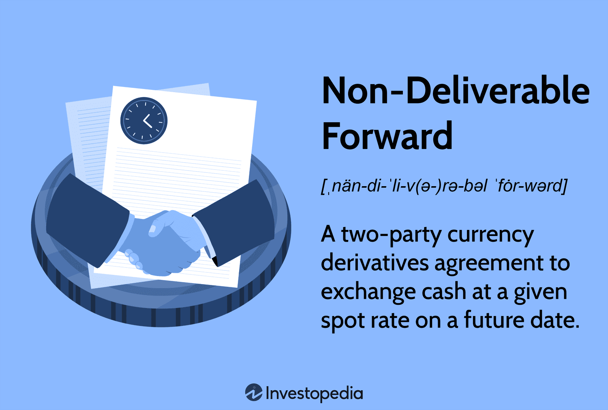

Non-Deliverable Forwards (NDFs) are pivotal instruments in currency markets, offering unique solutions for trading in environments where certain currencies are restricted or illiquid. These financial derivatives have carved out a niche, enabling traders and investors to manage currency exposure without the need for physical delivery. By focusing on cash-settled contracts, NDFs facilitate participation in currency markets otherwise constrained by capital controls or limited convertibility.

The operation of NDFs hinges on the agreement between two parties to exchange the difference between a pre-determined NDF rate and the prevailing market spot rate upon contract maturity. This structure enables hedging and speculation in currencies that may not be accessible through traditional convertible means, such as currencies from certain emerging markets. The absence of physical delivery, with settlements typically conducted in stable currencies like the USD, underscores the efficiency and appeal of NDFs in these contexts.



As algorithmic trading technologies continue to advance, the integration of NDFs into algorithmic strategies has gained momentum. This trend is driving a shift towards enhanced execution speeds, precision, and reduced human error, all of which are vital in the fast-paced environment of currency trading. Algorithmic trading tools can parse vast data sets, recognize patterns, and predict market shifts more efficiently than manual methods, rendering them invaluable in optimizing NDF trading strategies.

Understanding the mechanics and strategic applications of NDFs is therefore essential for market participants aiming to maintain a competitive edge. The flexibility and adaptability of NDFs in dealing with restricted or difficult-to-access markets provide a distinct advantage. By exploring the functions and benefits of NDFs, this article equips both novice and seasoned traders with the knowledge necessary to capitalize on these derivatives within the evolving landscape of global forex markets.

## Table of Contents

## Understanding Non-Deliverable Forwards (NDFs)

Non-Deliverable Forwards (NDFs) are financial instruments used in the currency markets, primarily serving as a form of derivative contract. These contracts are cash-settled between two parties, allowing participants to manage and hedge currency risks for currencies that are not freely traded on international markets. 

The central mechanism of an NDF involves counterparties agreeing to exchange cash flows based on the difference between two exchange rates: the contracted NDF rate set at the inception of the contract and the prevailing spot rate at the contract's maturity. The cash settlement is typically executed in a widely traded currency, such as the US dollar, hence the term "non-deliverable."

NDFs find their niche primarily in markets where certain currencies face restrictions on trade or capital controls. This makes them invaluable tools for investors and traders aiming to hedge against exposure to such currencies without necessitating physical delivery. The non-deliverable nature ensures participants can engage in currency trades without directly dealing with the restricted currency, thereby mitigating potential regulatory or capital movement barriers.

Moreover, these contracts are structured to avoid the need for exchanging the notional amount of currency, differing significantly from traditional forward contracts which often involve the actual exchange of currencies at maturity. This aspect of NDFs makes them an indispensable risk management instrument in financial portfolios exposed to emerging markets or currencies under stringent regulatory frameworks. 

In summary, NDFs offer a robust mechanism for managing currency risks, providing a strategic financial tool for entities operating in markets where currency convertibility or transaction freedom is limited.

## Structure and Key Characteristics of NDFs

Non-Deliverable Forwards (NDFs) are a distinct type of forward contract that cater to markets with currencies under capital or convertibility restrictions. Unlike traditional forward contracts, the essence of NDFs lies in their cash-settlement nature, requiring no physical exchange of the notional principal. The key components and characteristics of NDFs include:

1. **Contract Specifications**: An NDF contract specifies several critical elements, such as the currency pair being traded, the notional amount, fixing date, settlement date, and the contracted NDF rate. The currency pair typically involves a non-convertible currency and a freely traded currency like the USD. 

2. **Settlement Mechanism**: Settlement of an NDF is based on the differential cash flow between the pre-agreed NDF rate and the prevailing spot rate on the fixing date. The fixing date is a predetermined day when the spot rate is observed and compared to the NDF rate to calculate the cash flow difference. This method contrasts with deliverable forwards, where the actual exchange of the currency occurs.

3. **Notional Amount**: The notional amount, which determines the scale of the contract, is never exchanged physically. Its purpose is to define the value upon which the contract is based, providing a framework for calculating the cash-settlement amount. The settlement amount $(S)$ can be calculated using the formula:
$$
   S = \text{Notional Amount} \times \left(\frac{\text{Spot Rate at Fixing Date} - \text{NDF Rate}}{\text{NDF Rate}}\right)

$$

   This allows participants to focus on the profit or loss from the currency exchange rate fluctuations without needing to transfer large sums.

4. **Hedging and Speculation**: NDFs serve as an effective tool for hedging currency risks in markets with significant restrictions. They enable corporations and investors to protect against unfavorable currency movements without violating exchange control regulations. Additionally, speculators can exploit expected changes in currency values, taking advantage of the leverage NDFs offer through their notional amounts.

5. **Focus on Cash Flow Differences**: By emphasizing cash flows over the actual exchange of currencies, NDF contracts prioritize simplicity and practicality. They offer a streamlined approach to currency management, particularly beneficial in volatile or less liquid markets.

In summary, NDFs offer a flexible and strategic solution for hedging purposes and enable speculative opportunities while maintaining regulatory compliance in restricted currency markets. Their unique structure ensures streamlined settlement processes by focusing solely on the cash flow differences derived from market fluctuations.

## The Role of NDFs in Algorithmic Trading

Algorithmic trading, often referred to as algo trading, is an integral part of modern financial markets, employing advanced mathematical models and data analysis to execute trades with precision and speed. In the context of Non-Deliverable Forwards (NDFs), algo trading offers significant advantages by enhancing the efficiency and accuracy of transactions in these derivatives markets. 

### Automation and Efficiency
Algorithms in NDF trading automate the decision-making process by executing trades when certain predefined conditions are met. This automation minimizes human intervention, reducing the potential for manual errors and delays. Automation is particularly useful in fast-paced NDF markets where timely decisions can significantly impact profitability.

### Data Processing and Pattern Recognition
Algorithms excel at processing large volumes of data, which is essential in analyzing currency movements and market dynamics. By leveraging historical and real-time data, algo trading systems can recognize patterns and trends that might not be evident to human traders. This capability allows for the prediction of future price movements, enabling traders to make informed decisions about entering or exiting NDF contracts.

### Speed and Accuracy
The speed at which algorithms operate is a crucial [factor](/wiki/factor-investing) in NDF markets. As currency values can fluctuate rapidly, the ability to execute trades quickly is paramount. Algos can respond to market changes in milliseconds, ensuring that trading strategies are implemented at optimal times. The precision offered by algorithms also ensures that execution is consistent with the predefined trading strategy.

### Market Adaptability
One of the key benefits of [algorithmic trading](/wiki/algorithmic-trading) in the NDF market is its adaptability to changing market conditions. Algorithms can be programmed to adjust trading strategies in response to [volatility](/wiki/volatility-trading-strategies), [liquidity](/wiki/liquidity-risk-premium) changes, and other market factors. This adaptability enhances risk management, which is critical in the sometimes volatile NDF environments.

### Python Example for NDF Algo Trading
Consider a simplified example where a trader uses a moving average crossover strategy for NDF trading. This strategy involves buying NDFs when a short-term moving average crosses above a long-term moving average and selling when the short-term average crosses below the long-term one.

```python
import pandas as pd
import numpy as np

# Generate example data
np.random.seed(0)
price_data = np.cumsum(np.random.randn(100)) + 50

# Create a DataFrame
df = pd.DataFrame(price_data, columns=['Prices'])

# Calculate short-term and long-term moving averages
df['Short_MA'] = df['Prices'].rolling(window=5).mean()
df['Long_MA'] = df['Prices'].rolling(window=20).mean()

# Generate trading signals
df['Signal'] = 0
df.loc[df['Short_MA'] > df['Long_MA'], 'Signal'] = 1
df.loc[df['Short_MA'] < df['Long_MA'], 'Signal'] = -1

# Display the DataFrame with signals
print(df.dropna())
```

### Application in NDF Markets
Incorporating algorithmic trading into NDF markets allows traders to capitalize on these benefits by deploying strategies that are responsive and adaptable to market nuances. By employing algorithms, traders not only increase the speed and accuracy of their operations but also gain control over risk management practices, thus enhancing their ability to handle the complexities of trading NDFs.

In summary, the use of algorithmic trading in NDF markets offers crucial enhancements in efficiency, speed, and adaptability, enabling traders to navigate these unique derivatives with greater efficacy and precision.

## Benefits and Challenges in NDF Algo Trading

Algo trading has significantly revolutionized the execution of Non-Deliverable Forwards (NDFs) by providing enhanced liquidity and efficiency. The deployment of algorithms in NDF trading enables high-frequency trading and improved execution through the automation of buy and sell orders based on predefined conditions. These algorithms are adept at processing large volumes of data swiftly, identifying trading patterns, and making decisions with minimal human intervention. This automation minimizes latency and human error, ensuring trades are executed at optimal prices.

One of the primary benefits of algorithmic trading in the NDF markets is the mitigation of inherent risks such as settlement risk, which arises due to the non-deliverable nature of these contracts. Algorithms can be programmed to account for various market volatility scenarios and adjust strategies accordingly, thereby managing market risk more effectively. By automatically rebalancing portfolios and hedging positions, these algo systems bolster risk management practices.

However, integrating NDF trading into algorithmic platforms poses significant challenges. The primary challenge lies in the intricate nature of NDF contracts, often trading over-the-counter (OTC), necessitating robust systems to handle counterparty risks effectively. Trading algorithms need to incorporate advanced risk management modules to evaluate the creditworthiness of counterparties continuously. Additionally, the OTC nature of NDFs means that liquidity can vary, requiring algorithms to be adaptive and resilient to sudden changes in market depth and pricing.

The technological advancement in computational power has made it possible to address many of these challenges, primarily through sophisticated software platforms that offer scalable and flexible modules for risk management and trade execution. Machine learning and [artificial intelligence](/wiki/ai-artificial-intelligence) are progressively being integrated into these systems, providing predictive analytics to forecast market movements and refine trading strategies over time.

Regulatory implications also play a critical role in shaping the algo trading landscape for NDFs. Market participants must comply with various regulatory requirements, which can differ significantly across jurisdictions. Algorithms need to be designed to adhere to these regulations, ensuring transparency and accountability in trading activities. This often involves the implementation of comprehensive logging and reporting mechanisms, which can be audited to ensure compliance with financial regulations.

In conclusion, while the introduction of algorithmic trading in NDF markets presents various benefits, such as improved efficiency and risk management, it also comes with challenges that require careful attention. An effective approach involves deploying advanced technology solutions that not only navigate these challenges but also align with evolving regulatory landscapes. By doing so, traders and institutions can leverage the full potential of algorithmic trading to enhance their NDF strategies.

## Application of NDFs in Emerging Markets

Emerging market currencies, characterized by restrictions and capital controls, necessitate innovative trading instruments for effective risk management and speculative strategies. Non-Deliverable Forwards (NDFs) have become a widely used tool in these environments due to their ability to facilitate currency exposure without the necessity for physical currency delivery. By engaging in NDF contracts, institutional investors and corporations can hedge against potential currency volatility while adhering to local regulatory frameworks.

In emerging markets, the appeal of NDFs lies in their adaptability to circumvent foreign exchange restrictions. For example, in markets like China and India, direct trading of local currencies might be heavily regulated or outright prohibited for foreign investors. NDFs offer a viable alternative by allowing foreign and domestic market participants to settle the contract in a major currency such as the US dollar. This form of settlement mitigates the issues of restricted currency convertibility and cross-border fund flows.

The complexities of emerging markets demand a nuanced approach to trading, where factors such as geopolitical developments, economic indicators, and policy changes can heavily influence currency movements. Algorithmic trading serves as an effective method to navigate these intricacies, offering traders the ability to process vast quantities of market data and rapidly execute trades based on predefined strategies. Algorithms enhance the prediction and management of potential risks associated with NDF trades, including market liquidity and counterparty default risks.

Algorithmic trading can use advanced statistical models and [machine learning](/wiki/machine-learning) to identify patterns and correlations within historical price movements. Python is a favored tool for algorithmic traders who utilize libraries such as NumPy, pandas, and scikit-learn to construct and backtest their trading strategies. For instance, a simple algorithm might employ a regression model to forecast future NDF rates based on historical data and macroeconomic variables. This could be implemented as follows:

```python
import numpy as np
import pandas as pd
from sklearn.linear_model import LinearRegression

# Example data: historical NDF rates and macroeconomic indicators
data = pd.DataFrame({
    'NDF_Rate': [...],
    'GDP_Growth': [...],
    'Inflation_Rate': [...],
    'Interest_Rate': [...]
})

# Prepare the dataset
X = data[['GDP_Growth', 'Inflation_Rate', 'Interest_Rate']]
y = data['NDF_Rate']

# Train the regression model
model = LinearRegression()
model.fit(X, y)

# Predict future NDF rates
future_economic_data = np.array([[...], [...], [...]])  # New economic indicators
predicted_ndf_rate = model.predict(future_economic_data)
```

Through real-world applications, NDFs have proved pivotal in markets such as Brazil, Russia, and South Africa, enabling effective currency management and speculation. These examples underline the capability of NDFs to provide even more structured risk exposure to investors in environments fraught with currency control measures and economic uncertainties. However, success in leveraging NDFs in these markets also hinges on strategic planning, deep local market knowledge, and comprehensive risk assessment frameworks. Algorithmic trading aids in refining these strategies, ensuring consistency, precision, and competitiveness in the fast-paced world of [forex](/wiki/forex-system) trading.

## Concluding Thoughts

Non-Deliverable Forwards (NDFs) present notable opportunities for managing risk and speculating in currency markets where direct access may be limited. These financial instruments are critical for maneuvering through markets with restricted currency exchanges, providing an avenue to mitigate potential financial risks associated with currency fluctuations.

When integrated with algorithmic trading strategies, NDFs can significantly boost trade execution, efficiency, and profitability. Algorithmic trading expands the potential of NDFs by enabling rapid decision-making processes, leveraging large datasets, and performing complex analysis without human intervention. This technological approach ensures that trades are not only executed at optimal times but also in a manner that maximizes the potential returns while managing risks effectively.

Both traders and institutions stand to gain immensely from the strategic deployment of NDFs. These instruments offer flexibility and utility that can be tailored to both hedging and speculative activities, capitalizing on their unique structure that allows for cash-settled transactions without the need for physical currency exchange.

Staying informed about regulatory developments and the latest technological advancements is crucial for participants in the NDF market. Regulatory environments are subject to change, and staying abreast of these developments allows traders and institutions to remain compliant and capitalize on new opportunities that arise due to regulatory shifts. Likewise, technological innovations continually reshape trading strategies, offering improved capabilities for risk management and trade execution.

In conclusion, understanding and leveraging NDFs in trading strategies can significantly enhance one's ability to navigate the evolving foreign exchange markets. Whether used for hedging exposure in restricted currency environments or speculating on currency movements, NDFs serve as a powerful tool for financial market participants. Through strategic implementation and continuous adaptation to regulatory and technological changes, traders can effectively harness the full potential of NDFs in their investment activities.

## References & Further Reading

[1]: McCauley, R. N. (2008). ["Managing Emerging Market Risk: The Role of Non-Deliverable Forwards."](https://www.bis.org/publ/qtrpdf/r_qt1612h.pdf) Bank for International Settlements Papers, No. 44.

[2]: Ferguson, R. W., Jr., & Coughlin, C. (2004). ["Non-Deliverable Forward Contracts: A Primer."](https://www.bis.org/review/r041108c.pdf) Federal Reserve Bank of St. Louis Economic Synopses.

[3]: Choudhry, M. (2006). ["The Bond and Money Markets: Strategy, Trading, Analysis."](https://www.sciencedirect.com/book/9780750646772/the-bond-and-money-markets) Butterworth-Heinemann Finance.

[4]: Zhang, C., & He, W. (2019). ["Exchange Rate Strategies and Non-Deliverable Forwards."](https://www.sciencedirect.com/science/article/pii/S2468519424004713) Springer.

[5]: Dodd, R., & Griffith-Jones, S. (2007). ["The Impact of Changes in Financial Regulation and Markets on the Functioning of Economy."](https://stephanygj.net/papers.html) Initiative for Policy Dialogue, Columbia University.