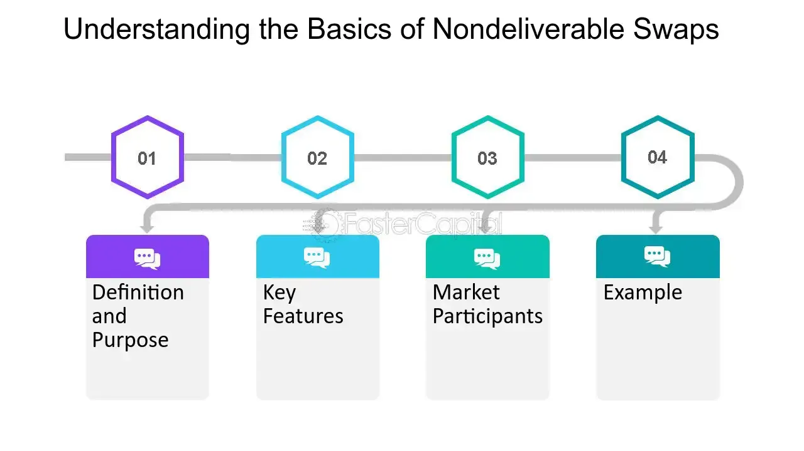

## Table of Contents

## What is a Non-Deliverable Swap (NDS)?

A Non-Deliverable Swap (NDS) is a type of financial agreement used to exchange cash flows between two parties. It's similar to a regular swap, but with a key difference: instead of physically exchanging the underlying assets, the parties only exchange the difference in value between the two cash flows. This makes NDS particularly useful for managing risks in markets where it's hard to trade the actual assets.

NDS is often used in countries with currency restrictions or where the local currency isn't easily traded on international markets. For example, if a company wants to protect itself from changes in a foreign currency's value, it can use an NDS to hedge that risk without needing to actually buy or sell the currency. This way, the company can focus on its business without worrying about unpredictable currency movements.

## How does a Non-Deliverable Swap differ from a traditional swap?

A Non-Deliverable Swap (NDS) and a traditional swap both involve exchanging cash flows between two parties, but they work differently. In a traditional swap, the parties actually exchange the underlying assets or currencies. For example, in a currency swap, one party might give dollars and receive euros in return. This physical exchange is a key part of traditional swaps.

In contrast, a Non-Deliverable Swap doesn't involve any physical exchange of assets. Instead, the parties only exchange the difference in value between the two cash flows. This is particularly useful in countries with strict currency controls or where the local currency isn't easily traded internationally. For instance, if a company wants to protect itself from changes in a currency that's hard to trade, it can use an NDS to hedge that risk without ever needing to handle the currency itself.

## What are the main components of a Non-Deliverable Swap?

A Non-Deliverable Swap (NDS) has a few main parts that make it work. The first part is the notional amount, which is like a pretend amount of money that the swap is based on. It helps figure out how much money will be swapped between the two people involved. The second part is the reference rate, which is the rate used to calculate the cash flows. This could be a foreign exchange rate, an [interest rate](/wiki/interest-rate-trading-strategies), or some other rate that both parties agree on.

The third part is the settlement date, which is when the two parties will actually exchange the money. Since an NDS doesn't involve swapping the actual assets, on the settlement date, they only pay the difference between the two cash flows. The last part is the terms of the swap, which include things like how long the swap will last, how often the payments will be made, and any other rules that both parties have to follow. These parts all work together to make the NDS a useful tool for managing financial risks.

## In which currencies are Non-Deliverable Swaps typically used?

Non-Deliverable Swaps are often used with currencies from countries that have tight rules about moving money in and out. These are places where it's hard to buy or sell their money on the world market. Some examples are the Chinese Yuan (CNY), the Indian Rupee (INR), and the Brazilian Real (BRL). Companies and investors use NDS to protect themselves from changes in these currencies without actually having to trade them.

These swaps help people manage risks in markets where the local money isn't easy to trade. For example, if a business wants to make sure they're safe from changes in the value of the Indonesian Rupiah (IDR), they can use an NDS. This way, they don't have to worry about unpredictable movements in the currency, and they can focus on running their business.

## What are the common reasons for entering into a Non-Deliverable Swap?

People often use Non-Deliverable Swaps to protect themselves from changes in currency values. This is really helpful in countries where it's hard to trade the local money. For example, a company might want to make sure they're safe from changes in the value of the Chinese Yuan. By using an NDS, they can manage this risk without actually having to buy or sell the Yuan. This way, they can focus on their business without worrying about unpredictable currency movements.

Another reason for using Non-Deliverable Swaps is to take advantage of interest rate differences between countries. If a company thinks they can make money from the difference in interest rates, they can use an NDS to do this. This helps them earn more money without the need to move actual money across borders, which can be tricky in some places. So, NDS is a useful tool for both managing risks and finding new ways to make money.

## How is the settlement of a Non-Deliverable Swap calculated?

When it's time to settle a Non-Deliverable Swap, the two parties look at the difference between the notional amount and the current value of the reference rate. Let's say they agreed on a notional amount in Chinese Yuan, and the reference rate is the exchange rate between the Yuan and the US Dollar. On the settlement date, they check the actual exchange rate. If the Yuan got stronger than they expected, one party will owe money to the other. If it got weaker, the other party will owe money. They only pay the difference, not the full notional amount.

For example, imagine a company in the US entered an NDS with a notional amount of 1 million Chinese Yuan. They agreed to use the exchange rate at the end of the swap. If the exchange rate at settlement is 7 Yuan to 1 US Dollar, but it was supposed to be 6.5 Yuan to 1 US Dollar, the company would owe money. The difference is 0.5 Yuan per Dollar, so for 1 million Yuan, that's about $71,429 (1,000,000 Yuan / 7 Yuan per Dollar - 1,000,000 Yuan / 6.5 Yuan per Dollar). They would pay this amount to the other party, and that's how the NDS is settled.

## What are the risks associated with Non-Deliverable Swaps?

Non-Deliverable Swaps come with some risks that people need to think about. One big risk is the chance that the other person in the swap won't pay what they owe. This is called counterparty risk. If the other person can't or won't pay, the person who should get the money could lose a lot. Another risk is that the reference rate might change a lot more than expected. This can make the swap worth a lot more or a lot less than planned, and that can be a big problem for the people involved.

There are also risks from changes in rules and laws. Some countries have strict rules about moving money in and out, and these rules can change. If the rules change, it can mess up the swap and make it hard to settle. Also, using an NDS can be tricky because it's based on a pretend amount of money. If the real value of that money changes a lot, it can make the swap less useful for managing risks. So, people need to be careful and think about all these things before they decide to use a Non-Deliverable Swap.

## Can you explain the process of valuing a Non-Deliverable Swap?

Valuing a Non-Deliverable Swap involves figuring out what it's worth at any given time before it's settled. To do this, you need to look at the difference between the notional amount and the current value of the reference rate, like an exchange rate or an interest rate. If the reference rate has moved in a way that would make one party owe money to the other if the swap were settled right now, then the swap has a value to the party that would receive the payment. This value is calculated by figuring out the present value of the expected future cash flows, taking into account the time until the settlement date and the likelihood of the reference rate changing.

For example, if you have an NDS with a notional amount in Brazilian Real and the reference rate is the exchange rate between the Real and the US Dollar, you'd check the current exchange rate. If the Real is weaker than expected, the swap might have a positive value for the party that would receive dollars at settlement. To find out how much, you'd calculate the difference between the notional amount at the current exchange rate and what it would be at the expected rate, then discount that amount back to today's value using an appropriate interest rate. This way, you can see if the swap is worth more or less than when you started, helping you decide if you should keep it or try to get out of it.

## What regulatory considerations should be taken into account with Non-Deliverable Swaps?

When dealing with Non-Deliverable Swaps, it's important to think about the rules and laws in the countries where the swap is happening. Some countries have strict rules about moving money in and out, and these rules can change. If the rules change, it can mess up the swap and make it hard to settle. Also, different countries might have different rules about who can use NDS and how they should be reported. This can make things tricky, especially if the two parties are in different countries with different rules.

Another thing to consider is the oversight from financial regulators. In some places, NDS might need to be reported to a central body that watches over financial markets. This helps make sure that everyone is playing fair and that the market stays stable. If the rules aren't followed, there can be fines or other problems. So, before entering into a Non-Deliverable Swap, it's a good idea to check all the rules and make sure everything is done the right way.

## How do Non-Deliverable Swaps impact financial markets in emerging economies?

Non-Deliverable Swaps can have a big impact on financial markets in emerging economies. They help businesses and investors manage risks related to changes in currency values without actually trading the local money. This is really useful in countries where it's hard to buy or sell the local currency on the world market. By using NDS, companies can focus on their business without worrying about unpredictable currency movements. This can make the financial markets in these countries more stable because people can better handle the risks they face.

But there are also some downsides. If a lot of people use NDS, it can affect how much the local currency is worth. When many people bet on the currency going down, it might actually go down because of all the bets. This can make the currency weaker than it might have been otherwise. Also, if something goes wrong with the swaps, like if one party can't pay what they owe, it can cause problems in the financial markets. So, while NDS can help manage risks, they can also add new risks to the market if they're not used carefully.

## What are some real-world examples of Non-Deliverable Swaps?

A company in the United States wants to do business in China but is worried about changes in the value of the Chinese Yuan. They enter into a Non-Deliverable Swap with a notional amount in Yuan and use the exchange rate between the Yuan and the US Dollar as the reference rate. If the Yuan gets weaker than expected, the US company will get money from the other party in the swap. This way, they can protect themselves from losing money because of the Yuan's value changing without actually having to trade the Yuan.

Another example is a Brazilian company that wants to borrow money in US Dollars but is worried about the Brazilian Real getting weaker. They use a Non-Deliverable Swap to hedge against this risk. The notional amount is in Brazilian Real, and the reference rate is the exchange rate between the Real and the Dollar. If the Real does get weaker, the company will get money from the other party in the swap, helping them manage the risk of their loan without moving actual money across borders.

## How might future market trends affect the use of Non-Deliverable Swaps?

Future market trends could make Non-Deliverable Swaps more popular, especially if more countries put tight rules on moving money in and out. As more businesses start working in different countries, they might use NDS more often to protect themselves from changes in currency values. If technology gets better, it might be easier to use NDS too. This could mean more people using them to manage risks without actually trading the local money.

On the other hand, if rules and laws change a lot, it might make using NDS harder. If countries start making it easier to trade their money on the world market, people might not need NDS as much. Also, if there are big problems in the financial markets because of NDS, like if lots of people can't pay what they owe, it might make people more careful about using them. So, future trends could either make NDS more useful or less, depending on what happens in the world of money and business.

## What is a Non-Deliverable Swap (NDS)?

A non-deliverable swap (NDS) is a financial derivative instrument primarily used to hedge currency risk in markets with currencies that are non-convertible or subject to exchange controls. Unlike traditional currency swaps, NDSs do not involve the physical exchange of the two currencies at the end of the contract term. Instead, they are settled in cash, utilizing a freely convertible currency, often the U.S. dollar. This characteristic makes NDSs particularly appealing to corporations and financial institutions operating in markets where currency conversion restrictions are prevalent.

The core mechanism of an NDS involves a notional principal amount, which serves as the reference for calculating payments but is not exchanged between counterparties. Parties agree on a fixed exchange rate at the outset of the contract, referred to as the contract rate. Upon maturity, the difference between this contracted rate and the prevailing spot rate determines the cash settlement amount. If the spot rate is less favorable than the agreed contract rate for the counterparty that has agreed to receive the non-convertible currency, that counterparty will receive a payment in the convertible currency, effectively compensating for the depreciation of the non-convertible currency.

The formula for calculating the settlement amount at maturity can be expressed as:

$$
\text{Settlement Payment} = (\text{Notional Amount}) \times \left(\frac{1}{\text{Contract Rate}} - \frac{1}{\text{Spot Rate at Maturity}}\right)
$$

This cash settlement minimizes the risks associated with currency controls and provides a mechanism to manage exposure in inaccessible or illiquid currency markets, without the need for physical currency transactions.

NDSs are vital tools for multinational corporations and financial institutions that deal with markets where foreign exchange restrictions impede seamless currency conversion. They offer a strategic method to hedge against foreign exchange risks, protect cash flow stability, and ensure that financial obligations can be met regardless of currency fluctuations in regions with stringent currency controls.

## What is an example of an NDS?

Consider a financial institution in Argentina that opts to hedge against the depreciation of the Argentine peso after acquiring a substantial loan denominated in U.S. dollars. This scenario exemplifies the practical use of a non-deliverable swap (NDS).

By entering into a currency swap with a predetermined exchange rate, the institution effectively mitigates the risk associated with potential currency fluctuations. This strategy ensures that repayment costs remain stable despite volatile exchange rate movements. The financial institution agrees to a notional amount exchanged at a fixed rate, which does not involve the physical exchange of currencies. Instead, the transaction is settled in U.S. dollars based on the difference between the contracted exchange rate and the prevailing spot rate at maturity.

The settlement process can be outlined mathematically as follows:

- Let $N$ represent the notional amount in Argentine pesos.
- $K$ is the contracted exchange rate (peso per dollar).
- $S$ is the spot rate at the time of settlement.

The cash settlement amount in USD can be calculated using the formula:

$$
\text{Cash Settlement} = \left( \frac{N}{K} - \frac{N}{S} \right) \times K
$$

This mechanism allows the institution to stabilize financial obligations by protecting against adverse movements in the peso without the need to exchange the actual currencies involved. Consequently, the financial institution safeguards itself from unnecessary exposure to exchange rate risk, achieving a more predictable and controllable financial outcome.

## References & Further Reading

[1]: ["Mastering Non-Deliverable Derivatives"](https://www.cftc.gov/sites/default/files/filings/ptc/15/02/ptc022615tradsef003.pdf) by Andreas Wilke

[2]: ["Algorithmic Trading and DMA: An introduction to direct access trading strategies"](https://www.semanticscholar.org/paper/Algorithmic-trading-%26-DMA-%3A-an-introduction-to-Johnson/aa5de1ab883d5e23b6651faa7c1807586d688e4b) by Barry Johnson

[3]: Morgan, P.J., & Pontines, V. (2014). ["An Analytical Framework on Macroprudential Policies and Financial Stability."](https://papers.ssrn.com/sol3/papers.cfm?abstract_id=2464018) ADB Working Paper Series on Regional Economic Integration

[4]: ["Foreign Exchange Risk: Models, Instruments, and Strategies"](https://www.amazon.com/Foreign-Exchange-Risk-Instruments-Strategies/dp/1899332375) by David F. DeRosa

[5]: Harris, L. (2003). ["Trading and Exchanges: Market Microstructure for Practitioners."](https://www.amazon.com/Trading-Exchanges-Market-Microstructure-Practitioners/dp/0195144708) Oxford University Press